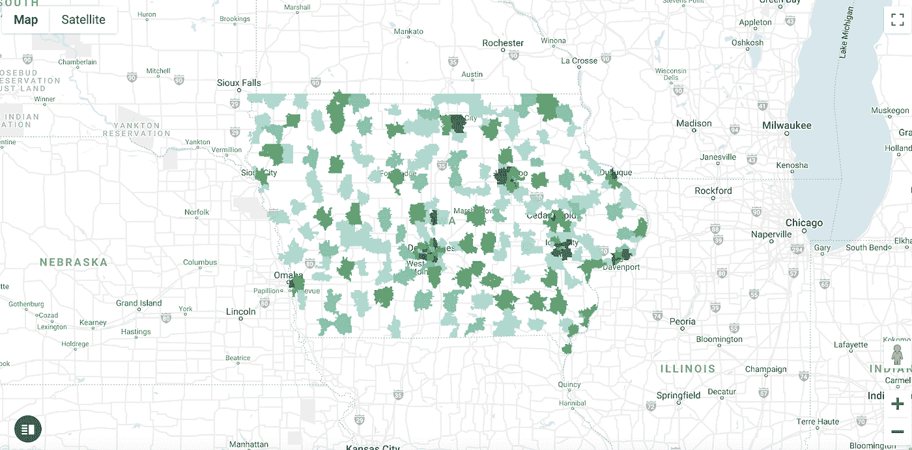
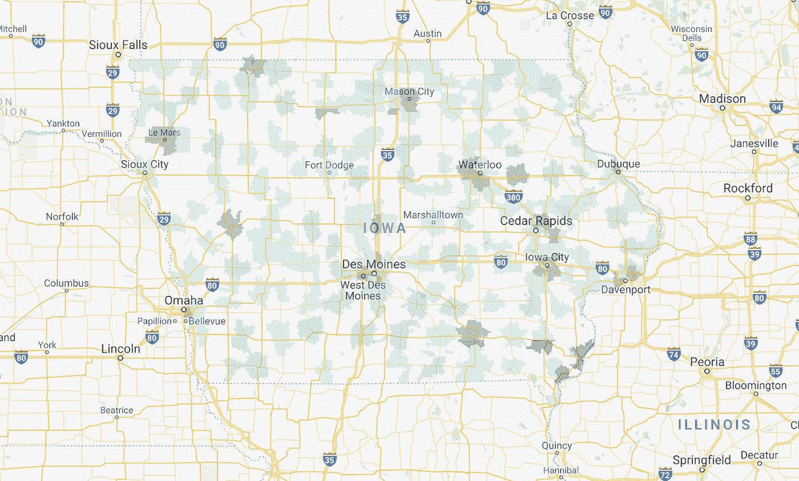
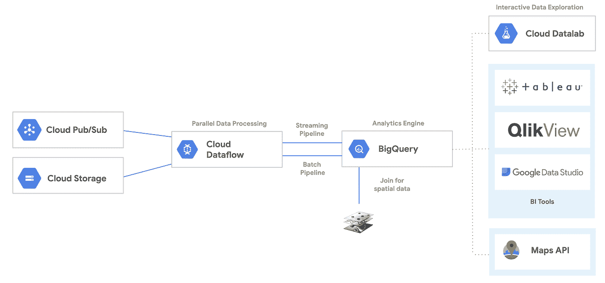

# 使用 BigQuery 支持地理空间分析和地图可视化的业务数据

> 原文：<https://medium.com/google-cloud/enable-business-data-with-bigquery-for-geospatial-analysis-and-map-visualization-dcddccd18e17?source=collection_archive---------2----------------------->

当涉及到商业决策时，有几个维度的信息。空间数据为决策提供了一个强大的额外信息维度。为了在地图上可视化空间数据，我们使用包含空间数据的数据集，通常是标准地理空间格式的地理列(点、线/折线或多边形信息)，如 GeoJSON、WKT 等。许多业务属性数据没有地理列。但是，很容易将业务属性与其他数据集关联起来，以关联地理空间信息，从而获得通过空间分析向下钻取数据的能力。例如，州、县、邮政编码、道路网络、兴趣点等。

Google BigQuery 提供了一组包含地理空间信息的数据。在本文中，我们使用美国人口普查数据中的邮政编码边界作为空间数据，并以 Iowa state liquor sales 数据作为业务属性数据的示例，来展示如何将属性数据与空间信息关联起来，并在地图上将其可视化。

使用的 BigQuery 数据集:

1.  公共数据集-人口普查局美国边界

该数据集包括地理和统计区域的多边形边界、一些线性要素(包括道路和水文)以及点要素。您可以在此找到关于该数据集[的更多信息。](https://pantheon.corp.google.com/marketplace/product/united-states-census-bureau/us-geographic-boundaries?filter=solution-type:dataset&filter=category:maps&q=public%20data&id=20d75072-82af-4fd3-a235-7080e71bcc1b&project=dong-sce&folder=&organizationId=)

在这个数据集中，地理空间列被称为 *zip_code_geom。*这是定义多边形边界的逗号分隔的纬度和经度对的列表。

*样本值如下:*

```
POLYGON((-93.648086 41.619944, -93.64766 41.6186, -93.647425 41.61818, -93.647408 41.618149, ….)
```

2.公共数据集-爱荷华州酒类零售

该数据集提供了整个爱荷华州零售酒类销售的完整视图。数据集包含杂货店、酒类商店、便利店等的酒类订单。，包括商店和位置的详细信息、确切的酒品牌和大小以及订购的瓶数。

该查询的目标是识别 2019 年每个邮政编码超过 10 万美元的销售额

使用的查询:

```
SELECT 
  boundary.zip_code AS zip_code, 
  total_sales, 
  zip_code_geom 
FROM
(SELECT zip_code, county, zip_code_geom
FROM `bigquery-public-data.geo_us_boundaries.zip_codes`
WHERE STATE_CODE = 'IA' ) AS boundary
LEFT JOIN
(SELECT zip_code, sum(sale_dollars) AS total_sales
FROM `bigquery-public-data.iowa_liquor_sales.sales`
WHERE EXTRACT(YEAR FROM date) = 2019 
GROUP BY zip_code ) AS sales
ON sales.zip_code = boundary.zip_code
WHERE total_sales > 100000
```

您可以直接运行上述查询，也可以将查询保存到视图中，然后查询该视图。在 BigQuery Geo Viz 中很容易将结果可视化。下图显示了基于美元金额范围的总销售额。颜色越深，销量越大。



Geo Viz 适用于快速显示地理空间数据，但要将 Geo Viz 中的地图与您现有的应用程序集成并不容易。Google Maps API 在呈现空间数据时更加灵活。您可以在 javascript 代码中向 BigQuery 提交查询，并动态地将结果添加到地图中。由于 Google Maps API 还提供了地理编码(将地址转换为经纬度)、反向地理编码(将经纬度转换为地址)、路线计算等功能，因此您可以在具有地理空间功能的应用程序中快速显示您的数据。

要向 BigQuery 提交查询，我们可以使用 BigQuery Javascript 库。要获得包括两步 OAuth 授权的逐步设置指南，请查看本教程。

用于设置身份验证和授权的代码段。

```
// Check if the user is authorized.
function authorize(event) {
  gapi.auth.authorize({client_id: clientId, scope: scopes, immediate: false}, handleAuthResult);
  return false;
}// If authorized, load BigQuery API
function handleAuthResult(authResult) {
  if (authResult && !authResult.error) {
    loadApi();
    return;
  }
  console.error('Not authorized.')
}
```

为了在地图上绘制地理列，我们在查询中使用 *ST_ASGEOJSON()* 函数将地理列中的数据转换为 GeoJSON。

```
SELECT 
  boundary.zip_code AS zip_code, 
  total_sales, 
  zip_code_geom 
FROM (
  SELECT zip_code, county, 
    ST_ASGEOJSON(zip_code_geom) AS zip_code_geom
  FROM `bigquery-public-data.geo_us_boundaries.zip_codes`
  WHERE STATE_CODE = 'IA' ) AS boundary
  LEFT JOIN
  (SELECT zip_code, sum(sale_dollars) AS total_sales
  FROM `bigquery-public-data.iowa_liquor_sales.sales`
  WHERE EXTRACT(YEAR FROM date) = 2019
  GROUP BY zip_code ) AS sales
  ON sales.zip_code = boundary.zip_code
WHERE total_sales > 100000
```

然后，我们使用 Datalayer 将结果添加到 Google map，data layer 用于在 Google Map 上显示 GeoJSON 数据。

```
function doMap(rows){
  geojson = {
      "type": "FeatureCollection",
      "crs": {
        "type": "name",
        "properties": {
          "name": "urn:ogc:def:crs:OGC:1.3:CRS84"
        }
      },
      "features":[]
  };for (let i = 0; i < rows.length; i++) {
      geojson.features.push(
        { "type": "Feature",
          "properties": {"total_sales": rows[i].f[1].v,
                      "zip_code": rows[i].f[0].v},
          "geometry": JSON.parse(rows[i].f[2].v)
         })};map.data.addGeoJson(geojson);map.data.setStyle(function(feature) {
      var total_sales =   
          parseFloat(feature.getProperty("total_sales"));
      var zip_code = feature.getProperty("zip_code");
      var color;
      if (total_sales > 15000000)
        color = '#033b23'
      else if (total_sales > 5000000 && total_sales <= 15000000)
        color = '#006d2c'
      else if (total_sales > 1000000 && total_sales <= 5000000)
        color = '#zca25f'
      else if (total_sales > 500000 && total_sales <= 1000000)
        color = '#66c2a4'
      else if (total_sales >= 100000 && total_sales <= 500000)
        color = '#99d8c9'
      else
        color = 'white'
      return {
        fillColor: color,
        strokeWeight: 0
      };
  }) ;
}
```

生成的地图如下所示。您可以向地图功能添加更多控件，如单击获取邮政编码信息或人口普查数据等。



**下一步**

以上示例使用了边界多边形(邮政编码)。同样的理论也适用于点地理空间数据，例如兴趣点。

现在，您可以使用另一个智能维度—地理位置维度来启用您的业务属性数据。数据管道可能如下所示。



如果您有流数据，或者您的应用程序有低延迟要求，您可以考虑将空间数据处理转移到数据流。