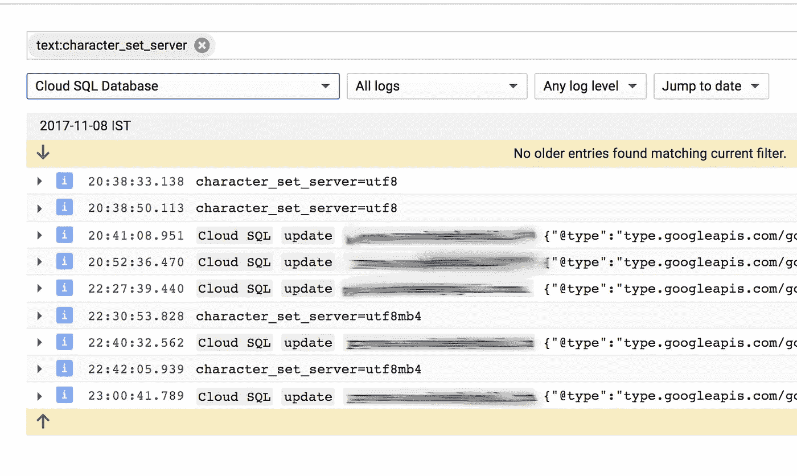

# 在 Google Cloud 上的 MySQL 中启用表情符号

> 原文：<https://medium.com/google-cloud/enable-full-unicode-in-mysql-on-google-cloud-aaa2635486d6?source=collection_archive---------1----------------------->

你在 Google Cloud 上使用 MySQL 作为你的数据库服务吗？例如，您是否希望在您的数据库中启用“完全”UTF-8 支持来启用表情符号？然后继续读下去。

有些人可能不知道，MySQL 中默认的 utf8 字符集并不完全符合 UTF-8 标准。MySQL 后来引入了 utf8mb4 编码来解决这个问题。

Mathias 的这个[博客在概述修复 MySQL 方面问题的具体步骤方面做得非常出色。然而，让它在 Google Cloud 上工作是有一定区别的。](https://mathiasbynens.be/notes/mysql-utf8mb4)

# 支持

在我们开始之前，我们需要尽一切办法备份数据！这在 Google Cloud SQL 上很容易。可用的选项很少。所有这些都是从在 Google Cloud SQL 控制台中打开数据库实例开始的。

*   **手动备份**:进入管理备份，点击创建备份。搞定了。
*   **导出您的数据库**:在 Google Cloud SQL 控制台中打开您的数据库。您应该会看到一个导出选项。这实际上是一个 mysql 转储。你可以让 GCP 在云存储中生成一个. sql 文件，一旦导出完成，你就可以轻松下载。
*   克隆你的实例:这是我的最爱。Google 允许你克隆一个包含数据的 SQL 实例！这太棒了。这样做可以让您在投入生产之前有一个即时的测试平台来测试您的更改。只需点击克隆，并按照步骤，你应该设置在几分钟内。

现在，我们已经备份了数据，让我们开始吧。

# 步骤 1:创建一个数据库转换脚本

为了转换 DB 编码，您需要在数据库、表和列级别上编写 ALTER 命令。我发现这里有用的一点是创建一个包含所有迁移命令的. sql 脚本。

```
# Convert the DB first
ALTER DATABASE <database_name> 
CHARACTER SET = utf8mb4 
COLLATE = utf8mb4_unicode_ci;# Convert each table
ALTER TABLE <table_name> CONVERT TO 
CHARACTER SET utf8mb4 
COLLATE utf8mb4_unicode_ci;# Convert each column
# All varchar columns should be converted to stay consistent
ALTER TABLE <table_name>
  CHANGE <varchar_col1> <varchar_col1> VARCHAR(1024) CHARACTER SET utf8mb4 COLLATE utf8mb4_unicode_ci,
  CHANGE <varchar_col2> <varchar_col2> VARCHAR(255) CHARACTER SET utf8mb4 COLLATE utf8mb4_unicode_ci;# Repair each table
REPAIR TABLE <table_name># Optimize each table
OPTIMIZE TABLE <table_name>
```

是的，我知道为每个数据库、每个表、每个列编写这个脚本很乏味，但显然这就是它的工作方式。请**不要忽略**修复/优化步骤，否则您可能会面临数据损坏问题。

再次声明:请在尝试之前备份您的数据！一个建议是在您的数据库克隆中尝试使用这个脚本来验证您的数据。谷歌云中的克隆选项也让这变得非常简单。这是一个向后兼容的步骤，因此，您的所有服务应该没有任何中断。

# 步骤 2:更新 Google 实例上的 MySQL 配置

**注意**:此步骤可能会中断您的生产服务。这需要重新启动数据库并改变连接行为！

您需要在 Google Cloud SQL 实例上设置以下标志

```
# MySQL actual config variable
# Google Cloud SQL actually calls this character_set_servercharacter-set-server: utf8mb4
```

这在[如何更新数据库标志](https://cloud.google.com/sql/docs/mysql/flags)中有很好的记录。

**注意**:你会看到在其他博客中，包括我之前提到的那篇，有 6-7 个配置变量需要在服务器端和客户端更新。MySQL 5.7 对此进行了大幅简化。**以上参数是您需要在实例**上更改的唯一配置。

# 步骤 3:重启实例并验证！

这是令人失望的！当您在 Google 控制台上编辑实例时，您可能会在 UI 上的实例中看到您的新标志集，但是它**可能还没有生效**！不知道这是功能还是 bug。

验证这一点的最简单方法是转到控制台上的“查看错误日志”并搜索`character_set_server`。注意，这不同于 MySQL 的`character-set-server`参数。



Google Cloud 上的 Stackdriver 日志

如果配置有效，您应该在日志中看到`character_set_server=utf8mb4`。最安全的做法是重启数据库。

# 就是这样！

就是这样！一旦数据库重新启动，您应该能够连接到您的数据库，而无需在您的客户机上做任何更改。最新的 MySQL 驱动程序会自动与服务器协商编码，您应该已经准备好了！

如果您看到失败，可能是由于以下原因。

*   您的应用服务器无法重新连接到重新启动的数据库实例。例如，如果您将 Java 与 Hibernate 一起使用，您需要有特定的配置来重新连接到 DB。在这种情况下，重新启动应用服务器应该可以解决问题。
*   您的驱动程序可能无法正确协商编码。如果您使用的是旧版本的驱动程序，可能会发生这种情况。或者在连接时在连接属性中有特定的字符集配置，从而覆盖了协商。或者您正在与之对话的数据库尚未正确转换。删除客户端上的任何配置/修复数据库应该可以解决您的问题。

如果你需要快速回复，请发推文到 [@suvodeeppyne](https://twitter.com/suvodeeppyne) ，否则欢迎在下面留下评论。

干杯！