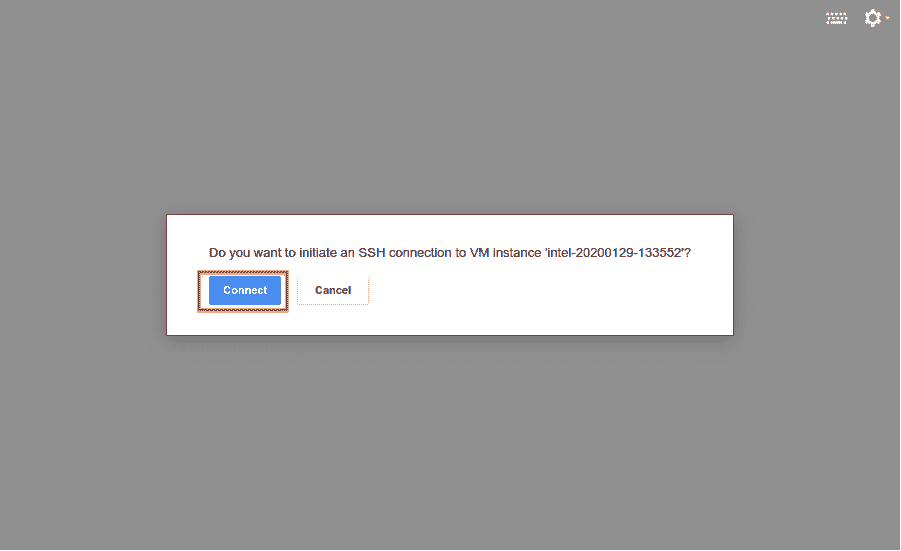
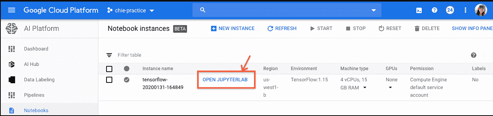

# 在 AI 平台笔记本中启用自动完成

> 原文：<https://medium.com/google-cloud/enabling-auto-completion-in-ai-platform-notebook-ece690389df1?source=collection_archive---------0----------------------->

AI Platform Notebook 是一个托管的 ML 服务，它提供了一个 JupyterLab 环境。机器学习工程师可以快速创建实例并开始 ML 实验。它还允许他们将他们的实验环境与其他数据管理平台集成，比如 BigQuery、dataproc、data flow、GCS 等等。

但是 JupyterLab 不支持 auto complete，而 auto complete 最初是由 Jupyter Notebook 支持的。

在这篇博客中，我们将介绍两个在 AI 平台上实现自动完成的选项。

# 启用自动完成的选项

例如，当开发人员在编辑器中键入内容而无需按 Tab 键时，自动完成功能可以为他们提供单词建议。有了 Jupyter Notebook，我们可以通过 nbextensions 使用[一个名为“腹地](https://jupyter-contrib-nbextensions.readthedocs.io/en/latest/nbextensions/hinterland/README.html)的非官方扩展来实现自动完成。AI 平台笔记本自带 JupyterLab，是 Jupyter 笔记本的继任者，但是没有腹地作为其扩展模块。虽然[有一个长期存在的 GitHub 问题在讨论这个](https://github.com/jupyterlab/jupyterlab/issues/2163)，但目前似乎有三种选择。

# 通过 JupyterLab 使用语言服务器

您可以将 [JupyterLab LSP 扩展](https://github.com/krassowski/jupyterlab-lsp)安装到您的笔记本实例中，以便在笔记本中实现自动完成。注意，JupyterLab LSP 扩展是开源的，不是 Google 的产品。

下面是安装扩展的说明。

# 1.在 AI 平台中创建新的笔记本实例

## a.从左侧选项卡中，选择人工智能平台>笔记本>新实例> Python

## b.单击创建

# 2.到笔记本实例的 SSH

## a.单击实例名称

## b.单击 SSH

## c.然后单击连接

# 3.安装 jupyter-lsp 扩展和 python-language-server

## a.在 SSH 终端中键入以下命令

$ sudo pip 安装—jupyter-LSP 之前

$ sudo jupyter labextension install @ krassowski/jupyterlab-LSP

$ sudo pip 安装 python-language-server[all]

## b.单击重置以重置笔记本实例

# 4.确认自动完成是否有效

## a.从左侧选项卡中，选择人工智能平台>笔记本电脑

## b.单击打开 JUPYTERLAB

## c.现在你可以使用自动完成。尽情享受吧！

# 使用 Jupyter 笔记本

如果你没有任何使用 JupyterLab 的具体理由，你可以按照下面的步骤使用 Jupyter Notebook。

# 1.在人工智能平台的笔记本标签上点击“打开 JUPYTERLAB”

# 2.推出经典笔记本

# 3.使用 Jupyter 笔记本

现在你可以使用 Jupyter 笔记本，它有自动完成功能。尽情享受吧！

# 结论

在这篇博文中，我们介绍了如何在 AI 平台笔记本上使用自动完成功能。在笔记本实例中使用自动完成有两个选项。第一个是安装 JupyterLab LSP 扩展，第二个是使用 Jupyter Notebook。

用 [AI 平台笔记本](https://cloud.google.com/ai-platform)享受美好 JupyterLab 生活！