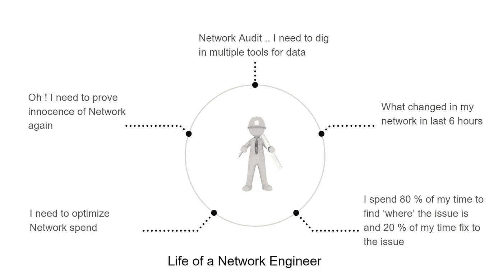
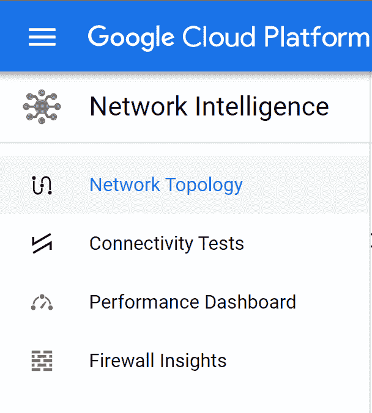
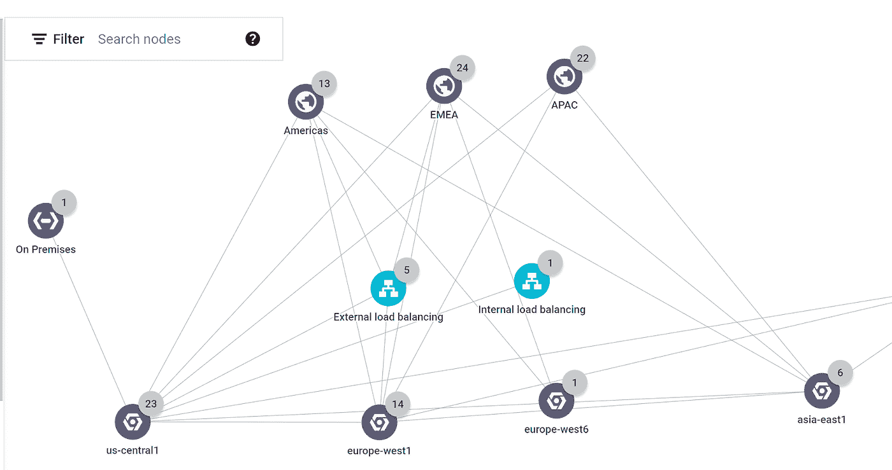
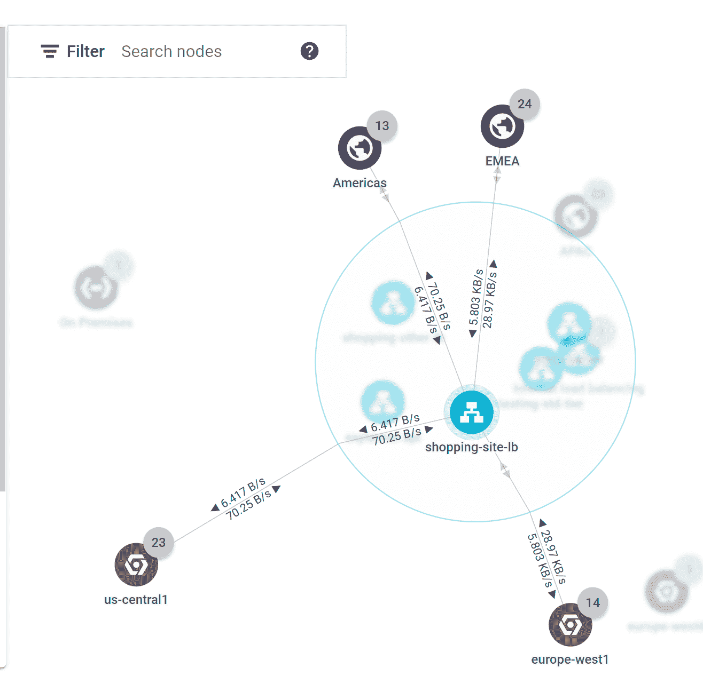
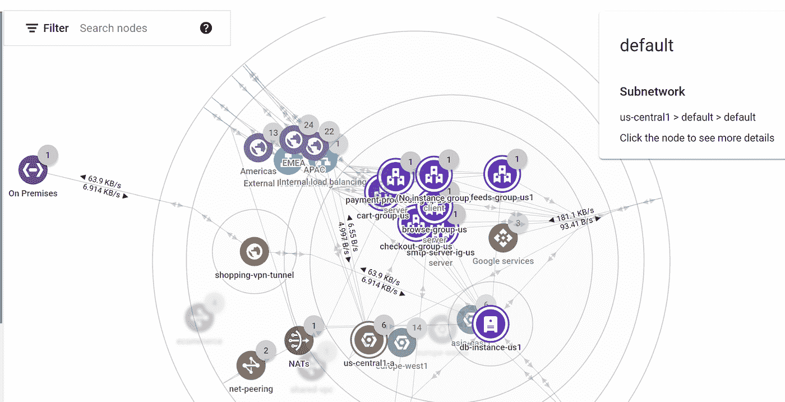
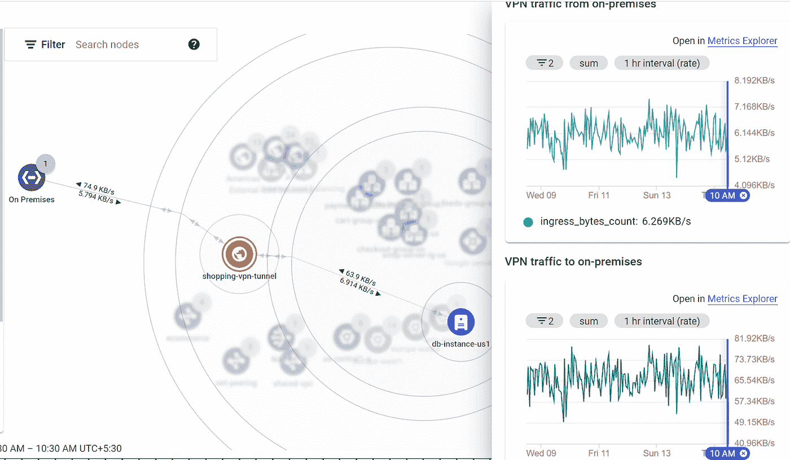
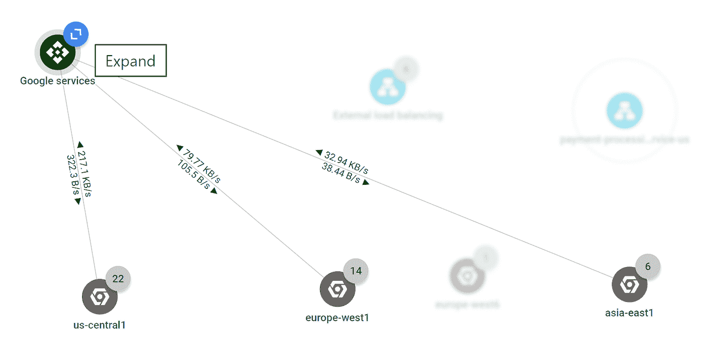
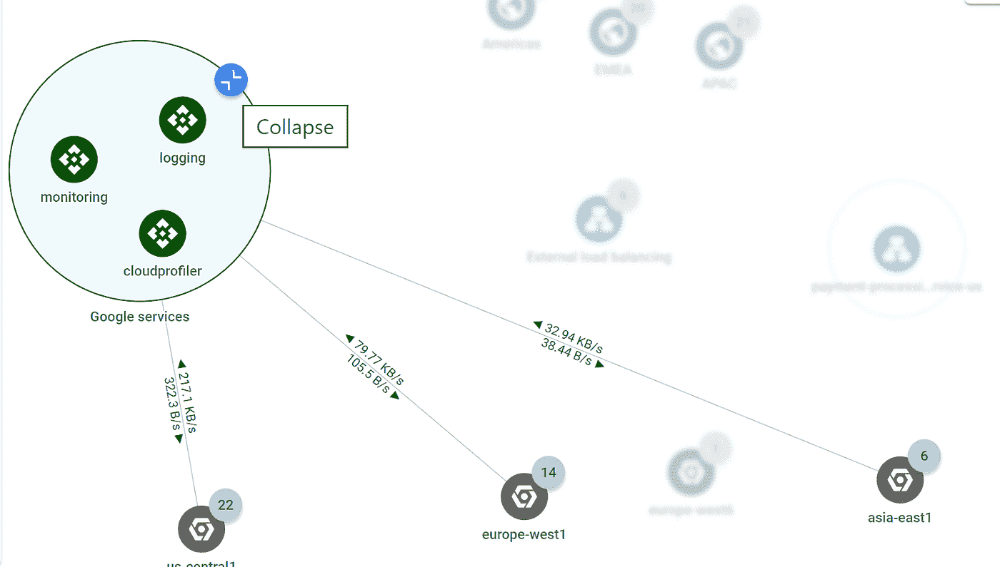

# 使用 GCP 网络拓扑启用网络操作

> 原文：<https://medium.com/google-cloud/enabling-netops-with-gcp-network-topology-39bd49a66a98?source=collection_archive---------0----------------------->

如果你是一名网络工程师，想知道如何适应谷歌云平台中新的网络管理方式，或者如果你正在领导网络运营，想知道如何证明“网络”是无辜的，或者如果你正在探索可以帮助 GCP 网络故障排除的工具，或者如果你是一名 Devops 工程师，不喜欢为小问题去找网络管理员；这个博客肯定会帮助你。

时间是一种宝贵的商品，在这个变革的时代，我们应该将网络工程师的宝贵时间用于解决更大的业务问题。因此，我们不应该让他们疲于使用多种第三方工具，并最终依赖他们过去的经验来解决网络问题，而是应该为他们提供适当的工具，让他们能够正确了解网络中正在发生的事情，这不仅可以减少解决问题的平均时间，还可以帮助他们采取主动措施，避免问题首先发生。

图 1:网络工程师面临的常见问题

在很高的层面上，如果我们观察网络操作中使用的整个工具集，我们可以将它们分为 4 大类:

1.  网络可见性工具
2.  网络诊断工具
3.  网络洞察工具
4.  网络根本原因分析工具

本博客关注“网络可见性”主题，以及可见性工具如何在履行与事件解决等相关的 SLA 方面变得便利。“网络可见性”指的是了解网络中的一切并在网络中移动。因此，网络可见性工具应该能够提供关键任务，即持续监视进出您网络的网络流量。可以说，可见性工具本身并不能直接解决类似于监控/警报工具的网络问题，相反，这些组件可以在我们进行监控和故障排除时为我们提供帮助。这些可见性工具也是开发人员/应用所有者手中的强大工具，可以直观地获得大量关于网络流量如何流向应用的信息，从而减少对网络管理员的依赖。

在谷歌云平台中，网络可见性、监控和故障排除属于一个名为“网络智能中心”的通用解决方案。网络情报中心(a.k.a. N.I.C .)就像一把瑞士军刀，有多个模块来处理常见的可见性、故障排除和网络监控任务。在撰写本文时，N.I.C .下的 4 个模块通常可供所有 Google cloud 客户使用。这些显示在下面的 GCP 控制台截图中-

图 2 : GCP“网络情报中心”

出于本博客的目的，我们将只关注 N.I.C .下的“网络拓扑”模块。网络拓扑是一种可视化工具，它显示虚拟专用云(VPC)网络的拓扑、与您的内部网络的混合连接、与 Google 托管服务的连接以及相关指标。因此，网络拓扑模块的用户应了解以下内容

*   不同网络节点之间的实际流量和相关指标
*   网络拓扑随时间的演变
*   6 周时间内的指标图表

让我们看看网络拓扑模块为最终客户解决的主要使用案例

**用例# 1:网络可见性**

人们常说，一幅画胜过千言万语。在网络中，拓扑图值得通过发出数百条命令来收集数据。想一想作为网络工程师/应用程序所有者的情况；你想知道-

*   我的流量如何通过谷歌云负载均衡器(GCLB)流出？
*   我的所有 EMEA 用户都通过 EMEA 地区的 GCE 实例获得服务吗？还是流量落地的区域不对？
*   我能理解拓扑和实际流量吗？
*   我的本地流量如何进入 Google cloud？

网络拓扑可以让用户从较高的层次了解整个网络的状况以及流量的来源和目的地。

图 3:GCP 网络拓扑的高级视图

上面显示的高级网络拓扑告诉我们

1.  来自世界各地的用户正在访问工作负载
2.  用户来到负载平衡器，它向 GCP 地区的后端实例发送流量
3.  客户使用 VPN 从内部连接到 GCP
4.  内部负载平衡用于将流量从一个区域中的一个 GCP 实例发送到另一个区域中的另一个 GCP 实例。

这是一个很好的可视化方式，可以开始研究拓扑是如何构成的。让我们更深入一步。我希望看到流量负载平衡发挥作用，并确认最终用户流量到达正确的区域。下面的快照确认了来自美洲的流量正确地负载平衡到美国中心 1 的工作负载，来自 EMEA 的流量正确地发送到欧洲-西方 1

图 4:GCP 工作负载如何服务全球流量的洞察

同样，如果我正在对 VPN 问题进行故障排除，并且需要确定 VPN 的所有用户是否都受到影响，或者是否有用户成功使用 VPN 并向 GCP 工作负载发送流量，我可以利用相同的网络拓扑对 VPN 元素进行故障排除，如下所示

图 5:洞察本地流量如何通过 VPN 登陆 GCP 项目

上述拓扑结构足以得出结论，上述来自内部的上游/下游数据量正在 GCP 的一个美国地区的 db-instance 上成功着陆。因此，可以将精力适当地放在为什么少数用户受到影响的故障诊断上，而不是花费精力在诸如 VPN 隧道协商、检查隧道健康等故障诊断任务上。

**用例# 2:网络故障排除**

网络拓扑是一个很好的工具，可以用来处理“某样东西一天前还好好的，但是现在不工作了”这样的陈述。为了解决这些问题，我们可以检查网络拓扑在过去几小时/几天/几周内是否发生了变化。由于网络拓扑可以显示最近 6 周的数据，因此它可以非常快速地帮助发现用户流量/用户流量在最近几天是否有显著变化，从而有助于更快地解决问题

此外，在此类故障排除案例中，网络拓扑显示的度量可以作为附加信息派上用场。例如，在故障排除期间，如果用户需要查看来自本地/离开 GCP 的 VPN 流量的趋势，以推断通过 VPN 隧道的流量是否突然下降，同样可以显示在相同的网络拓扑视图上

图 6:流量统计视图

**用例 3:架构和成本优化**

很多时候，我们需要满足业务需求，以优化在云上的支出。网络拓扑在这里可以很方便地回答像这样的问题-

1.  是否有一些基础设施元素没有被用户点击？
2.  是否存在产生大量跨区域流量的基础设施要素？
3.  如果大部分流量仅来自一个地理位置，我们能否考虑本地化一些元素。

对这些问题的回答不仅解决了业务需求的成本优化问题，还提供了一个根据几周以来观察到的用户流量模式来优化整体应用程序架构的机会。

**用例 4:合规性**

很多时候，NOC / SOC 需要提交给定时间段的拓扑视图，以满足审计要求。网络拓扑可用于在过去 6 周内的任何时间导出“网络状态”,以满足如此严格的任务，而无需依赖第三方服务。例如，从每个区域到“记录”和“监控”Google 服务的数据量视图可以显示如下

图 7:“网络拓扑”中的谷歌服务视图

如果审计员需要查看 GCP 工作负载在过去几周内访问了哪些服务的详细视图，可以在更详细的视图中显示，如下所示

图 8:区域工作负载访问的 Google 服务的分解

**结束语:**

网络是最重要的支柱之一，它使 element 能够在 GCP 内部进行对话，也使外界能够与 GCP 进行交流。因此，这是一个我们不能被蒙住眼睛的领域，它将符合客户和运营商的利益，以最大限度地了解他们的谷歌云网络中正在发生的事情。谁能比 GCP 本身的一个模块更好地给你这种可见性。您猜怎么着，使用网络拓扑不需要额外的配置或代理。因此，在单个控制面板上使用网络相关信息，并在查看多个日志或使用第三方工具时节省大量时间是很有意义的。在网络中，时间是至关重要的，因为每一秒的停机时间都会对业务产生影响，而网络拓扑使我们能够以所需的可见性来保持我们的秩序！

敬请关注下一篇博客，GCP 网络运营商手中又多了一个强大的工具

**免责声明**:这是为了告知读者，文中表达的观点、想法、意见仅属于作者，不一定属于作者的雇主、组织、委员会或其他团体或个人。