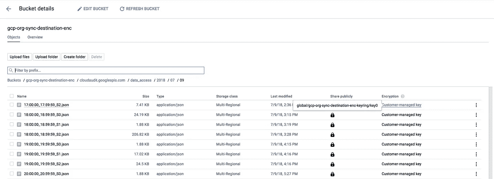

# 使用客户管理的 GCS 加密密钥加密堆栈驱动程序日志接收器

> 原文：<https://medium.com/google-cloud/encrypting-stackdriver-logging-sinks-using-customer-managed-encryption-keys-for-gcs-ccd0b59f0a3?source=collection_archive---------0----------------------->

您可能出于多种原因想要导出日志，例如保留日志以长期存储(数月或数年)来满足合规性要求，或者根据从日志中提取的指标运行数据分析。 [Stackdriver Logging](https://cloud.google.com/logging/) 允许您使用[日志接收器](https://cloud.google.com/logging/docs/export/)的概念将日志导出到各种来源，包括谷歌云存储(GCS)。

当您使用 GCS 日志接收器时，GCS 会在将数据写入磁盘之前在服务器端对其进行加密。除了这种默认行为，还有其他[方法](https://cloud.google.com/storage/docs/encryption/)来加密您的数据，包括客户管理加密密钥(CMEK)。使用 CMEK 意味着您在 GCS 中的内容的加密密钥由 Google 的云密钥管理服务(云 KMS)管理。借助云 KMS，您可以管理加密密钥，包括轮换、禁用、删除和设置 IAM 权限。

我最近需要使用 CMEK 设置一个 Stackdriver 日志导出到 GCS。目前，GCS 的日志接收器只支持默认的服务器端加密。然而，使用一个简单的 Google Cloud 函数，很容易监听从 GCS 生成的对象创建事件，然后将日志文件移动到一个 GCS bucket 中，用 CMEK 对它们进行加密。最终结果是一个单独的存储桶，其中包含用 CMEK 加密的所有导出的日志文件。



下面是我用来在 GCS 中创建 CMEK 加密的日志文件的步骤。

# 第一步。创建 Stackdriver 日志接收器。

我为 GCS 创建了一个 Stackdriver 日志接收器。请参见此处的说明[和](https://cloud.google.com/logging/docs/export/configure_export_v2)[导出 Stackdriver 日志记录的设计模式](https://cloud.google.com/solutions/design-patterns-for-exporting-stackdriver-logging)以深入讨论日志记录接收器。

我创建了一个 sink，它导出到名为 GS://GCP-org-sync-destination bucket 的 GCS bucket。

# 第二步。创建目标 GCS 存储桶。

我创建了一个目标桶，在我所有的日志接收器被移动后，它将保存它们。

```
gsutil mb gs://gcp-org-sync-destination-encCreating gs://gcp-org-sync-destination-enc/…
```

# 第三步。创建新的钥匙圈和钥匙。

我使用 [gcloud kms keyrings](https://cloud.google.com/sdk/gcloud/reference/kms/keyrings/create) 命令创建了一个密匙环。

```
gcloud kms keyrings create gcp-org-sync-destination-enc-keyring \    
    --location globalgcloud kms keyrings describe gcp-org-sync-destination-enc-keyring \
    --location globalcreateTime: ‘2018–07–10T13:25:00.877758174Z’
name: projects/my-project/locations/global/keyRings/gcp-org-sync-destination-enc-keyring
```

然后，我创建了云 KMS 密钥，我需要使用全局的位置和 30 天的自动加密密钥轮换期。

```
gcloud kms keys create key0 --location global \
    --keyring gcp-org-sync-destination-enc-keyring \
    --purpose encryption --rotation-period 30d \
    --next-rotation-time 2018-07-12T12:34:56.1234Zgcloud kms keys describe key0 --location global \
    --keyring  gcp-org-sync-destination-enc-keyring createTime: '2018-07-10T13:35:00.330940431Z'
name: projects/my-project/locations/global/keyRings/gcp-org-sync-destination-enc-keyring/cryptoKeys/key0
nextRotationTime: '2018-07-12T12:34:56.123Z'
primary:
  createTime: '2018-07-10T13:35:00.330940431Z'
  name: projects/my-project/locations/global/keyRings/gcp-org-sync-destination-enc-keyring/cryptoKeys/key0/cryptoKeyVersions/1
  state: ENABLED
purpose: ENCRYPT_DECRYPT
rotationPeriod: 2592000s
```

# 第四步。授权服务帐户使用密钥环。

为了使用 CMEK，您必须授予您的 GCS 服务帐户使用您的云 KMS 密钥的权限。我使用了 [gsutil kms authorize](https://cloud.google.com/storage/docs/encryption/using-customer-managed-keys#service-account-access) 命令来授予许可。

```
gsutil kms authorize -p my-project -k projects/my-project/locations/global/keyRings/gcp-org-sync-destination-enc-keyring/cryptoKeys/key0Authorized project my-project to encrypt and decrypt with key:projects/my-project/locations/global/keyRings/gcp-org-sync-destination-enc-keyring/cryptoKeys/key0
```

# 第五步。为存储桶设置默认的 KMS 加密密钥。

除非请求时提供了备用 KMS 加密密钥，否则存储桶中的所有内容都使用云 KMS 加密密钥进行加密。我使用了 [gsutil kms encryption -k](https://cloud.google.com/storage/docs/encryption/using-customer-managed-keys#using_default_encryption_keys) 命令来设置加密密钥。

```
gsutil kms encryption -k projects/my-project/locations/global/keyRings/gcp-org-sync-destination-enc-keyring/cryptoKeys/key0 gs://gcp-org-sync-destination-encSetting default KMS key for bucket gs://gcp-org-sync-destination-enc…
```

我使用 [gsutil kms encryption](https://cloud.google.com/storage/docs/encryption/using-customer-managed-keys#view-default-key) 命令检查了默认的加密密钥，以确保它设置正确。

```
gsutil kms encryption gs://gcp-org-sync-destination-encDefault encryption key for gs://gcp-org-sync-destination-enc:projects/my-project/locations/global/keyRings/gcp-org-sync-destination-enc-keyring/cryptoKeys/key0
```

我还在 gsutil 中使用了-L 选项来查看与 GCS 中任何对象相关联的键。

```
$ gsutil ls -L gs://gcp-org-sync-destination-enc
gs://gcp-org-sync-destination-enc/simulator.js:
Creation time: Mon, 09 Jul 2018 18:34:07 GMT
Update time: Mon, 09 Jul 2018 18:34:07 GMT
Storage class: STANDARD
KMS key: projects/my-project/locations/global/keyRings/gcp-org-sync-destination-enc-keyring/cryptoKeys/key0/cryptoKeyVersions/1
Content-Length: 4725
Content-Type: application/javascript
Hash (crc32c): KjCB8A==
Hash (md5): xYjT+iOTkU52/MBlTLin4Q==
ETag: CKCZmpLUktwCEAE=
Generation: 1531161247911072
Metageneration: 1
ACL: [{ removed for readability }TOTAL: 1 objects, 4725 bytes (4.61 KiB)
```

# 第六步。编写并部署一个简单的 Google Cloud 函数来移动导出到 GCS 的每个日志文件。

[GCS 存储触发器](https://cloud.google.com/functions/docs/calling/storage)提供了一种监听由 GCS 生成的事件的方法。具体来说，当创建新对象(或覆盖现有对象)时，会发送 google.storage.object.finalize 事件。通过监听这些事件，我设置了一个 GCS 触发器，为导出到 GCS 的每个日志文件调用一个云函数。该函数将日志导出接收器桶中的每个文件移动到加密桶中。

这里有一个简单的实现，简单地将任何文件移动到常量 new bucket 中定义的新桶中。

```
# index.js
'use strict';const Buffer = require('safe-buffer').Buffer;
// Imports the Google Cloud client library
const Storage = require('[@google](http://twitter.com/google)-cloud/storage');// Creates a client
const storage = new Storage();exports.moveFileToEncryptedStorage = (event, callback) => {
  const file = event.data; console.log(  Event ${event.eventId});
  console.log(  Event Type: ${event.eventType});
  console.log(  Bucket: ${file.bucket});
  console.log(  File: ${file.name});
  console.log(  Metageneration: ${file.metageneration});
  console.log(  Created: ${file.timeCreated});
  console.log(  Updated: ${file.updated});const newBucket = "gcp-org-sync-destination-enc";const newBucketAndFileName = "gs://"+newBucket+"/"+file.name;console.log("Moving to..."+newBucketAndFileName);return storage
      .bucket(file.bucket)
      .file(file.name)
      .move(newBucketAndFileName)
      .then(() => {

        console.log("content has been moved to "+newBucketAndFileName);})
      .catch((err) => { 
        console.error("ERROR:"+err);
      });}
```

我使用下面的[g cloud beta functions deploy](https://cloud.google.com/sdk/gcloud/reference/beta/functions/deploy)命令部署了该功能。这些参数将用于 Stackdriver 日志记录接收器的 GCS 桶与特定的 GCS 事件连接起来。

```
gcloud beta functions deploy moveFileToEncryptedStorage \
    --trigger-resource gs://gcp-org-sync-destination \
    --trigger-event google.storage.object.finalizeDeploying function (may take a while — up to 2 minutes)…done.
availableMemoryMb: 256
entryPoint: moveFileToEncryptedStorage
eventTrigger:
eventType: google.storage.object.finalize
failurePolicy: {}
resource: projects/_/buckets/gcp-org-sync-destination
service: storage.googleapis.com
labels:
deployment-tool: cli-gcloud
name: projects/my-project/locations/us-central1/functions/moveFileToEncryptedStorage
runtime: nodejs6
serviceAccountEmail: [my-project@appspot.gserviceaccount.com](mailto:my-project@appspot.gserviceaccount.com)
sourceUploadUrl: [https://storage.googleapis.com/gcf-upload-us-central1-c34b52af-640c-42a1-b7df-1c792738fcaa/932a4417-edb3-451b-b1d4-0577821fe892.zip?GoogleAccessId=service-767262922642@gcf-admin-robot.iam.gserviceaccount.com&Expires=1531162694&Signature=soreanlcc7r59mkeEEAPwY9M09q3RycEZxM1rTvpSyQustI2ZXLoyFwUXl9gr8qnZuQFd9%2F4uWkLYBbnFOH3%2FL%2B%2BQl9tu2zO5lg%2FsllNCEcAA4v%2Fv%2FfF9jesNG2h0kFB9RXDZzIWKT2lJJQ9eA5XrzVUNYT552rzD7LuISv%2BO8vYQM3Sq1CIws0LIMp%2F1aAwB4k55yKmDXokxHTiDwEqr56cQ1cfE4tJH6Ji2uVdpDFoVQFyBaDXvZHP5oaYdOal2ysc8shrhHBCibCJNpeuiFaTj8iqaHPUC1SctLndpVgsvwY8ahMlpUq%2FVFF%2B9w8pWjr2qZpl85dbf9N2jrcWBw%3D%3D](https://storage.googleapis.com/gcf-upload-us-central1-c34b52af-640c-42a1-b7df-1c792738fcaa/932a4417-edb3-451b-b1d4-0577821fe892.zip?GoogleAccessId=service-767262922642@gcf-admin-robot.iam.gserviceaccount.com&Expires=1531162694&Signature=soreanlcc7r59mkeEEAPwY9M09q3RycEZxM1rTvpSyQustI2ZXLoyFwUXl9gr8qnZuQFd9%2F4uWkLYBbnFOH3%2FL%2B%2BQl9tu2zO5lg%2FsllNCEcAA4v%2Fv%2FfF9jesNG2h0kFB9RXDZzIWKT2lJJQ9eA5XrzVUNYT552rzD7LuISv%2BO8vYQM3Sq1CIws0LIMp%2F1aAwB4k55yKmDXokxHTiDwEqr56cQ1cfE4tJH6Ji2uVdpDFoVQFyBaDXvZHP5oaYdOal2ysc8shrhHBCibCJNpeuiFaTj8iqaHPUC1SctLndpVgsvwY8ahMlpUq%2FVFF%2B9w8pWjr2qZpl85dbf9N2jrcWBw%3D%3D)
status: ACTIVE
timeout: 60s
updateTime: ‘2018–07–09T18:28:44Z’
versionId: ‘6’
```

一旦部署了这个函数，我就一直等到看到一个文件被填充到加密日志桶中，然后查看与该文件相关联的密钥。我希望该密钥与我关联到加密日志存储桶的密钥相同。我再次使用 gsutil 的-L 选项进行验证。

```
$ gsutil ls -L gs://gcp-org-sync-destination-enc/cloudaudit.googleapis.com/data_access/2018/07/09/17:00:00_17:59:59_S2.jsongs://gcp-org-sync-destination-enc/cloudaudit.googleapis.com/data_access/2018/07/09/17:00:00_17:59:59_S2.json:
Creation time: Mon, 09 Jul 2018 18:36:27 GMT
Update time: Mon, 09 Jul 2018 18:36:27 GMT
Storage class: STANDARD
KMS key: projects/my-project/locations/global/keyRings/gcp-org-sync-destination-enc-keyring/cryptoKeys/key0/cryptoKeyVersions/1
Content-Length: 7584
Content-Type: application/json
Hash (crc32c): pm32kA==
Hash (md5): F4KDCk8/VwAlj68g7lOdHw==
ETag: CM65z9TUktwCEAE=
Generation: 1531161387195598
Metageneration: 1{ removed for readability }TOTAL: 1 objects, 7584 bytes (7.41 KiB)
```

正如所料，日志文件中的键与我为目标 GCS bucket 指定的默认云 KMS 键相匹配。

就是这样！客户管理的 GCS 加密密钥提供了一种方便的方式来管理您自己的 GCS 内容加密密钥，包括使用 Stackdriver 日志记录接收器导出的日志。

参考资料:

*   [导出堆栈驱动日志的设计模式](https://cloud.google.com/solutions/design-patterns-for-exporting-stackdriver-logging)
*   [GCS 的加密选项](https://cloud.google.com/storage/docs/encryption/)
*   [GCS 上的加密密钥](https://cloud.google.com/storage/docs/gsutil/addlhelp/UsingEncryptionKeys)
*   [带 GCS 的谷歌云功能](https://cloud.google.com/functions/docs/calling/)
*   [GCS 存储触发器](https://cloud.google.com/functions/docs/calling/storage)
*   [gsutil kms 命令](https://cloud.google.com/storage/docs/gsutil/commands/kms)