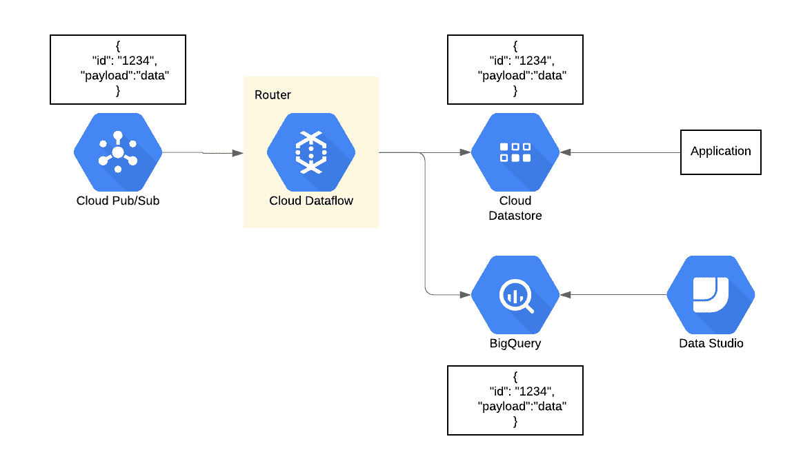
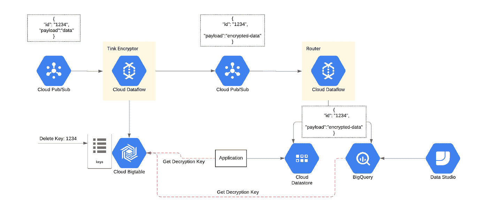
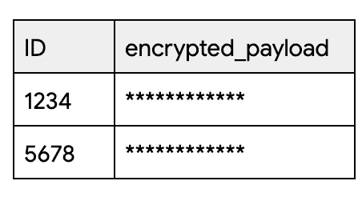
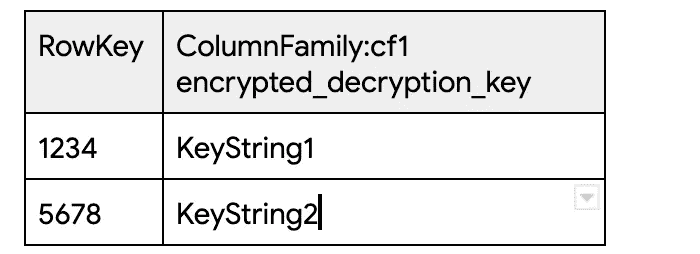

# 端到端加密粉碎(第二部分):使用加密粉碎的数据删除/保留

> 原文：<https://medium.com/google-cloud/end-to-end-crypto-shredding-part-ii-data-deletion-retention-with-crypto-shredding-a67f5300a8c8?source=collection_archive---------0----------------------->

在我之前的博客中，我展示了如何利用 BigQuery 的 AEAD 加密功能来实现数据删除，也称为加密删除。但是，我将这个演示局限于 BigQuery 中的数据。但是数据很少只存在于一个系统中。如果我们必须删除管道中所有现有系统的数据，该怎么办？除了 BigQuery 之外，我们如何应用相同的数据加密删除策略？

为了做好准备，让我们对用例、需求和结果做一些假设。假设我们从外部数据源获取数据，并最终将这些数据存储在多个地方以供使用，例如:

-用于分析目的的 BigQuery

-快速查找数据库，如[云数据存储](https://cloud.google.com/datastore/)，供应用程序使用。

就业务需求而言，假设我们被要求提供方法和保证，以便对于给定的记录(user-id 或任何唯一的 id)，我们的管道确保从存储记录的任何地方删除数据。

为了更具体地说明这一点，让我们想象一下我们最初的管道:



在上面的管道中，发布/订阅以一些 ID 和有效负载的形式接收数据。为简单起见，有效载荷是一个字符串，但实际上，有效载荷可以是多个字段，即位置、浏览器类型等。此外，Dataflow 充当一个简单的路由器，将数据存储在云数据存储和 BigQuery 中。我意识到真实世界的架构和数据模型可能比这个例子更复杂，但是保持它的简单来表达逻辑

根据上述体系结构，满足从所有系统中删除数据的要求的一种方法是简单地利用自动工作流，从每个存储中单独删除数据。虽然这种方法可行，但它面临一些挑战:

*   将数据存储和复制到少数几个系统是很常见的。从多个异构系统中删除数据可能很难实现(多个逻辑、代码库等)。
*   面对我们无法控制的系统造成的错误，数据删除可能会不一致。换句话说，系统可能无法删除我们的记录，或者更糟的是，它可能在后台无法删除时异步指示成功。
*   就性能和成本而言，它可能效率低下，具体取决于数据存储模型。例如，可能需要扫描整个数据集才能找到需要删除的记录。这是低效的，并且有时是昂贵的。

理想的删除流程应该是我们完全控制的流程，并且易于实施、高效(成本和性能)且一致。这篇文章的其余部分将展示如何实现一个满足这些需求的过程。

在我的[前一篇博客](/google-cloud/bigquery-encryption-functions-part-i-data-deletion-retention-with-crypto-shredding-7085ecf6e53f)中，为了删除数据，我们用以下伪逻辑利用加密功能:

1.  用唯一的加密密钥加密给定的记录。
2.  存储记录及其加密密钥的映射。
3.  要删除您的记录，只需从映射表中删除加密密钥。这使得解密不可能，并且记录无用(被删除)。

我使用 [AEAD 函数](https://cloud.google.com/bigquery/docs/reference/standard-sql/aead_encryption_functions)在 BigQuery 中演示了上述步骤。BigQuery 的 AEAD 加密功能的伟大之处在于，它的实现基于谷歌的开源库，名为 [Tink](https://github.com/google/tink) 。这为我们提供了在 BigQuery 内部和/或外部加密/解密数据的能力，这对于实现跨异构系统的端到端加密分解至关重要。鉴于此，下面是端到端逻辑的修改后的伪逻辑:

1.  在数据接收点，用唯一的加密密钥加密给定的记录。
2.  将记录的映射及其加密密钥存储在数据的所有使用者都可以访问的外部加密密钥映射存储中。
3.  为了消费给定的记录，消费者从外部加密密钥映射存储中读取解密密钥。
4.  为了删除给定的记录，从外部加密密钥映射存储中删除加密密钥。通过从共享存储器中删除加密密钥，我们保证没有消费者能够解密记录。

让我们将上面的伪逻辑应用于我们的初始架构:



新的架构有许多新的组件和集成点

**Tink Encryptor** 是一个云数据流逻辑，它从 Pub/Sub 中读取数据，然后为之前未见过的任何新记录生成新密钥，或者如果这是重复记录，则检索现有的加密密钥。为了存储新键或检索现有键，云 Bigtable 充当共享存储。嵌入在云数据流逻辑中的 Tink 库支持密钥生成、加密和解密过程。这里有一个简单的例子:

```
AeadConfig.*register*(); **private static byte**[] encrypt(String payload, String key, String password) **throws** GeneralSecurityException,IOException { KeysetHandle keysetHandle = CleartextKeysetHandle.read(JsonKeysetReader.withString(key)); Aead aead = AeadFactory.getPrimitive(keysetHandle); **return** aead.encrypt(payload.getBytes(),password.getBytes());}**private** String generateKey() **throws** GeneralSecurityException, IOException { ByteArrayOutputStream stream = **new** ByteArrayOutputStream(); KeysetHandle keysetHandle =   KeysetHandle.*generateNew*(AeadKeyTemplates.***AES128_GCM***); CleartextKeysetHandle.*write*(keysetHandle,  JsonKeysetWriter.*withOutputStream*(stream)); **return** **new** String(stream.toByteArray());}
```

**数据流路由器**从我们的初始图来看，保持不变，但是现在路由加密数据而不是原始记录。

为了解密记录进行处理，记录的消费者，即我们的应用程序和 BigQuery，必须从 Bigtable 中检索加密密钥。通过调用[Bigtable API](https://cloud.google.com/bigtable/docs/reference/libraries)就可以从我们的应用程序中调用 Bigtable。

为了让 BigQuery 检索解密密钥，我们利用了 BigQuery 对 Bigtable 的联邦访问[的支持。BigQuery 中的解密过程包括将加密的记录与 Bigtable 中的映射表连接起来。我们很快就会看到一个例子。](https://cloud.google.com/bigquery/external-data-bigtable)

最后，为了**从我们所有的系统(在这个例子中是 BigQuery 和 Cloud Datastore)中删除**给定的记录，我们简单地从 Bigtable 中删除映射键，使得记录的解密变得不可能。

**big query 中的解密**

让我们通过一个例子来使 BigQuery 解密过程更加具体。

在 BigQuery 中，我们有两个表:

其中一个加密了最初通过我们的数据流路由器路由到 BigQuery 的数据:



另一个外部表指向 Bigtable 中的键映射表:



为了解密 BigQuery 中的数据，我们将在这两个表之间进行连接。连接查询允许我们向 BigQuery 的 AEAD 提供解密密钥和 encrypted_payload。解密字符串函数:

```
SELECTdata.id AS ID,**SAFE.AEAD.DECRYPT_STRING**( KEYS.KEYSET_FROM_JSON( **mapping.cf1.key.cell.value**), FROM_BASE64(**data.encrypted_payload**), "some_password") AS payloadFROM dataset.encrypted_table dataJOIN dataset.bigtable_table mappingON mapping.rowKey = data.id
```

**重要注意事项**

在高层次上演示了如何实现端到端加密粉碎功能后，我想指出几个重要的考虑事项:

**仅将这种模式用于加密粉碎**:虽然实现的逻辑利用加密功能来实现**加密粉碎**，但是由于我将进一步讨论的一些限制，它不能满足需要**加密**以保护隐私和安全的用例。更具体地说，BigQuery 的 AEAD 函数只能接受字符串或二进制形式的加密/解密密钥。这带来了一个挑战，即存储在外部映射存储中的键最终必须转换为字符串或二进制。这意味着我们不能在 Bigtable 中加密我们的加密密钥。换句话说，在我们的例子中，Bigtable 以纯文本 JSON 格式存储 AEAD 加密/解密密钥。虽然可以使用 GCP IAM 策略保护 Bigtable 访问，但是为了满足加密和隐私用例，密钥应该加密存储。既能满足加密粉碎又能满足隐私/安全加密的理想解决方案是将加密密钥存储在 KMS 系统中，如云 KMS。除此之外，BigQuery 应该允许从云 KMS 检索密钥，而不是二进制或字符串格式。我希望在 BigQuery 中实现类似的东西:

```
SELECTdata.id AS ID,SAFE.AEAD.DECRYPT_STRING( KEYS.KEYSET_FROM_KMS(mapping.kms_key_id, kms_instance_name), FROM_BASE64(data.encrypted_payload), “some_password”) AS payloadFROM dataset.encrypted_table dataJOIN dataset.bigtable_table mappingON mapping.rowKey = data.id
```

> 注意:这只是一个例子，并不是一个真正的 BigQuery 函数

**微调您的架构:**本博客中提供的架构和示例逻辑仅用于演示目的。考虑到他们自己的技术需求和要求，人们应该非常仔细地考虑如何构建。这方面的一个例子是数据模型和用于加密到密钥映射的外部存储的选择。或者，如何在数据流或消费应用程序中实现 Tink 加密/解密/密钥生成逻辑。

使用加密粉碎作为一种永久且一致地删除数据而不牺牲性能的方式是一种非常有效的模式，不需要更复杂的方法，如 BigQuery 中的 DML 语句或对数据管道其他部分的高频 delete API 调用。只需删除加密密钥，所有属于该密钥的记录都被认为不可能在我们的管道中的任何地方解密。除此之外，通过使用 Tink 库，人们不仅可以将类似的逻辑应用于 GCP 本地工具(BigQuery、Datastore 等)，还可以应用于许多其他工具和框架，如 Apache Kafka、Apache Spark 等。

如果在阅读本文后，您对这种模式的适用性有什么看法，我很乐意听到您的意见。这种模式有意义吗？请随时联系我: [@pdeyhim](https://twitter.com/pdeyhim)