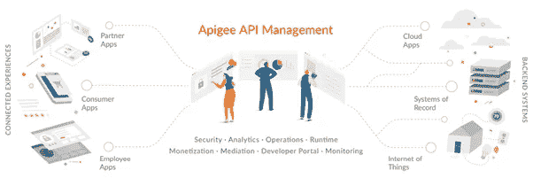

# 增强开发人员体验

> 原文：<https://medium.com/google-cloud/enhance-developer-experience-b6c984420762?source=collection_archive---------2----------------------->

作为解决任何问题的一部分，结构化的方法与概念化、设计、原型化、开发和寻找最佳质量的解决方案的由外向内的观点相结合，对于任何开发过程都是至关重要的。从打卡机时代到今天的低代码、无代码平台，软件开发人员喜欢解决棘手而有趣的问题，这些问题推动了进步。在这里，我们将讨论 API 如何成为解决问题的一个不可或缺的组成部分，使用 APIGEE 等产品将 API 作为一个平台进行管理的经验，以及驱动开发者生态系统的周边产品平台的附加值，这是一种迫切需要的行业趋势，有助于问题的维持、创新和数字化。

为什么要谷歌 Apigee？

Google Apigee 通过将 API 管理和云集成放在一个统一的平台下，彻底改变了 API 领域。通过利用 Apigee 的云原生架构原则，企业 IT 团队可以扩展他们的运营，加快开发速度并加快上市速度。Apigee 允许创建、配置大量的 API 包、支付网关、报告、收入模型和开发者门户集成，以帮助企业将其 API 货币化。

Apigee 为业务组织提供了本地、云或混合环境中的 API。使用这种方法，技术企业可以鸟瞰运行时管理，这允许他们将网关定位在更靠近 API 流量的位置。因此，他们可以充分利用现有的合规性、治理和安全基础设施，并利用开发人员门户、分析和监控等云功能。此外，提升和优化成本增加了组织的操作便利性。人工智能监控确保 API 处于服务模式。APIGEE 只需点击几下鼠标就可以诊断各种 API 问题，并实时预测它们的行为。

*你无法管理你无法衡量的东西。Apigee 为理解数字化的“神经系统”设立了标杆。*

**谷歌 Apigee 的主要特性/功能:**

*   **开发者门户** —使应用开发者能够发现、探索、购买、测试 API 并注册使用 API，同时为协作铺平道路。
*   **API 网关** —保护和协调客户端和后端之间以及公司 API 和使用 API 的开发人员、客户、合作伙伴和员工之间的流量
*   **API 生命周期管理** —管理 API 的设计、开发、发布、部署和版本控制的流程。
*   **分析** —为企业所有者、运营管理员和应用程序开发人员提供洞察力，以管理公司 API 和 API 程序的所有方面。它支持离线分析和实时故障排除。
*   **货币化**——使 API 提供商能够打包、定价和发布他们的 API，以便合作伙伴和开发者可以购买访问权或参与收入分成。

APIGEE API 管理平台

> 图片鸣谢— [SID 全球解决方案](https://sidgs.com/products/how-we-do-api-management-apigee/)

**开发者将从 Apigee 中获益:**

Apigee 对两种受众都有巨大的帮助——生产 API 的人和在应用程序中使用 API 的消费者开发者。虽然生产商更喜欢设计易于使用的 API，但他们的目标也是平台无关的兼容性、顶级的安全性、监控和性能分析更容易。另一方面，消费者希望获得他们需要的 API，包括完整的规范、文档和清晰的使用步骤。Apigee 提供的可定制开发人员门户可帮助消费者轻松地搜索、辨别、识别 API，并快速采用它们来构建自己的应用。其可配置的开发人员门户为应用程序开发人员提供了用于 API 发现、探索、学习和测试的自助式工具。Apigee 位于开发人员软件的前面，用于保护、扩展、调整、控制和监控针对它的 API 流量。API 运行时门户负责安全部分，监控和分析门户使分析变得轻而易举。你可以说，一切都在同一个屋檐下！

*   由于开放标准和对开发人员友好的功能，您可以灵活地进行构建，并更快地适应变化。无论正在构建的 API 是用于内部还是外部用例，开发人员门户都支持 API 开发人员无缝地发布他们的目录或 API 产品。

开发者可以提供产品的详细文档，并使用 [flutterflow](https://flutterflow.io/) 创建一个简单的应用开发者入门流程。

*   云甲、IAM、CMEK 为 API 安全增加了多重安全层。
*   人工智能驱动的自动化有助于从您的 API 数据中检索可操作的见解。这有助于预测 API 流量模式，实时检测异常，并保护 API 免受有害的 bot 攻击。
*   Google Apigee 的全球云网络有助于扩展 API 程序的全球范围，并处理意外的流量高峰。

开发人员门户的最新更新为开发人员增加了一些有趣的功能。SmartDocs 可以自动创建漂亮的 API 参考文档，现已更新为新版本。主题编辑器 was 也得到了增强，并添加了重新设计的默认门户主题 was。此外，最新版本提高了开发者创建和管理账户的能力。它还为管理员提供了新的最佳视图，以便更好地管理用户。

SID Global Solutions 最近推出了 [SAMi](https://www.mysami.io/) ，这是一个独特的智能 API 市场，具有多种功能，可进一步增强订阅者、开发者、发布者&最终用户的体验。SAMi 为列出的所有 API 产品提供统一的体验，并支持多种功能，包括 API 产品目录&管理、用户仪表盘、应用&团队管理功能、组织-用户-组管理、订阅管理、文档库、资产管理和分析。

SAMi 集成了 APIGEE 的所有功能——混合、Saas、OPDK & X，并提供了多 API 网关平台的无缝视图，该平台具有基于微服务构建的健壮平台架构，提供了技术进步、业务层和用户体验的出色集成。

SIDGS — SID Global Solutions 是一家数字化转型公司，拥有 20 多年的门户网站建设、企业系统集成和跨多个数字化平台的产品交付经验。SIDGS 总部位于费城的 Exton，横跨全球多个地区，提供最佳的技术解决方案、商业价值和用户体验。

欲了解更多信息，请访问— [SID Global Solutions](https://sidgs.com/) 和 [mysami 网站](https://www.mysami.io)