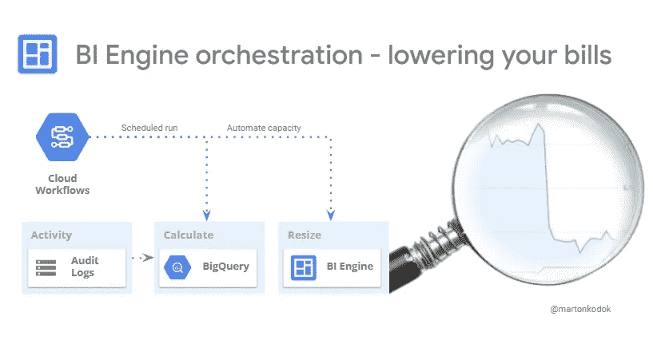

# 通过 BI 引擎容量编排减少您的大查询账单

> 原文：<https://medium.com/google-cloud/ensure-the-right-bigquery-bi-engine-capacity-with-cloud-workflows-orchestration-lowering-your-9e2634c84a82?source=collection_archive---------1----------------------->

***了解*** *我们在 REEA 是如何* ***编排 BI 引擎预留*** *通过动态方式* ***根据使用情况改变分配大小*******使用云工作流*** *在 5TB 数据集上，对于 BigQuery 来说规模较小，但对于成本节省较大的查询**

****

> **这篇文章源于我在 REEA 的经历，以及作为 GDE 在 [Stackoverflow](https://stackoverflow.com/users/243782/pentium10) 的经历，在那里我观察到了很多问题…**