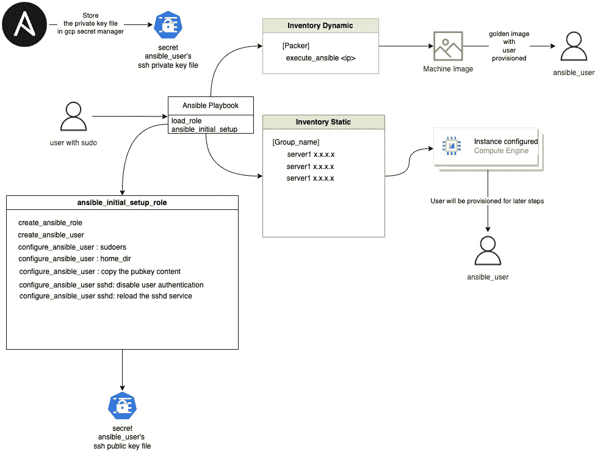
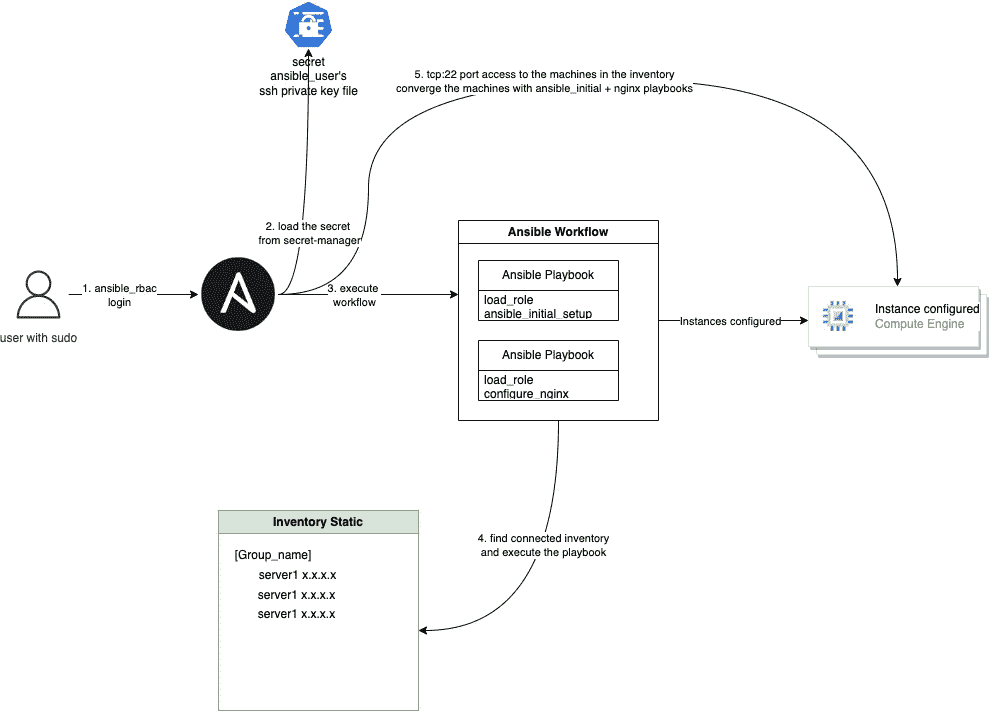

# 企业运营安力塔

> 原文：<https://medium.com/google-cloud/enterprise-running-ansible-tower-c727129bbc43?source=collection_archive---------7----------------------->

这是一个保护一个企业同时运行一个可行的塔的一般想法。设置 Ansible-Tower 并从一个地方提供对大多数基础设施的 ssh 访问对安全团队来说不是一个愉快的地方。他们希望对防火墙规则、用于 ssh 的 ansible_user 以及可以从 Tower UI 执行模板的用户实施尽可能严格的控制。

考虑到 ansible_user 并没有安装在每台机器上(初始设置)，我们将解释一种可能有效的架构。该过程应说明一种配置机器/映像的方法，该机器/映像可由一个塔式服务器管理。人们可以在一些面包店使用相同的过程，如设置吐出生产就绪的图像(GoldenImage 概念)。

上图解释了两种管理方法，第一种是由类似黄金映像的结构管理的系统(绿色区域)，其中环境中的所有内容都将使用黄金映像，而另一种解释了仅由 Ansible 作为配置管理工具管理的基础架构(棕色区域)。

创建如上设置后，机器只能由一个用户管理，即 ansible_user。现在，我们可以使用塔式 RBAC 来控制谁可以执行剧本、模板和库存的权限。

这允许对谁可以执行和什么可以执行进行精细控制。