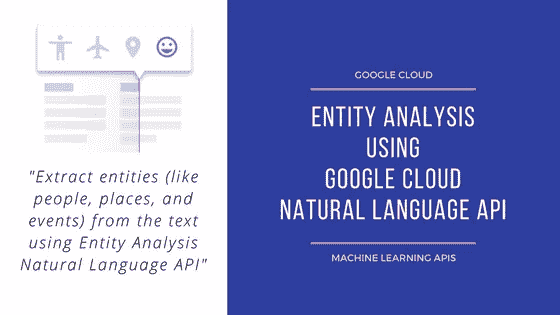
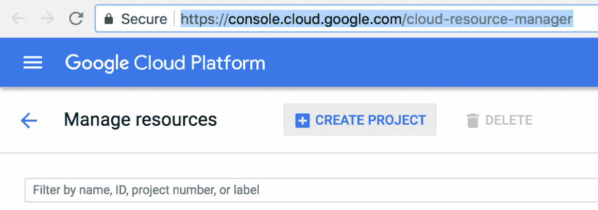
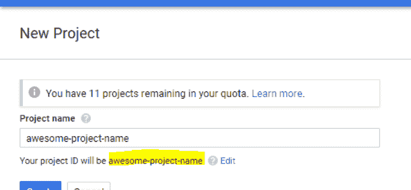
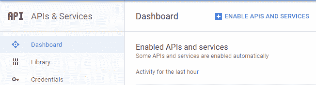
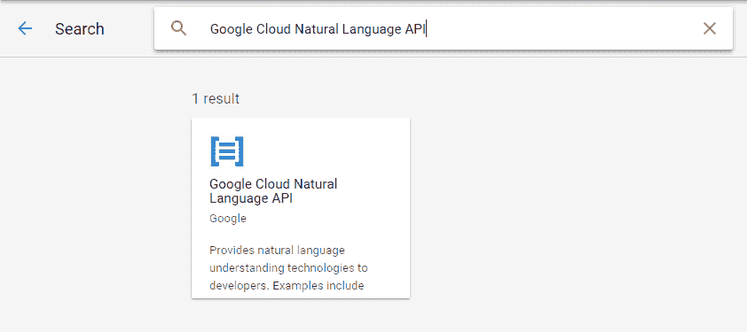
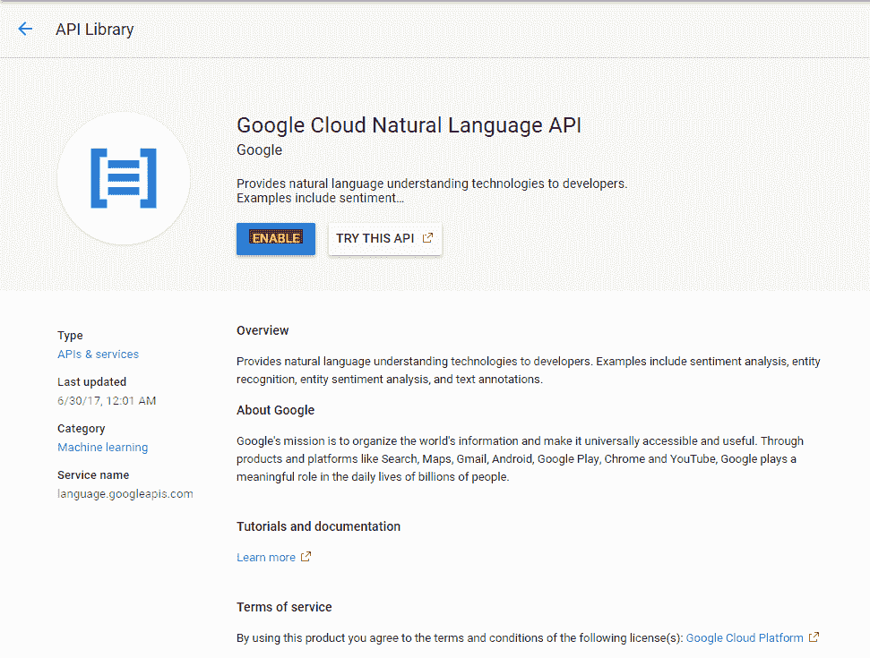
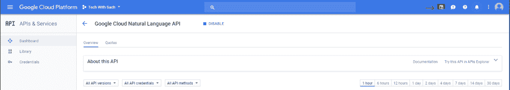
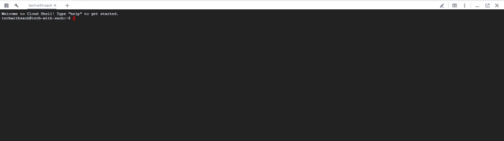
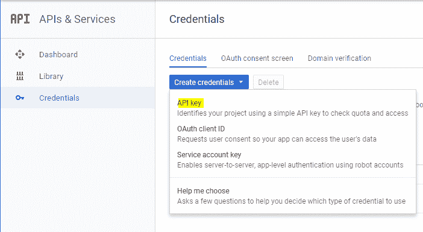
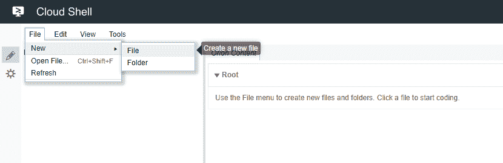

# 使用谷歌云自然语言 API 的实体分析

> 原文：<https://medium.com/google-cloud/entity-analysis-using-google-cloud-natural-language-api-1b7d8f3302bd?source=collection_archive---------0----------------------->



在本教程中，我们将学习如何使用 Google Cloud 自然语言 API 进行实体分析。本教程是我们之前教程的延续，在之前的教程中，我们学习了如何使用谷歌云自然语言 API 执行[情感分析。](https://techwithsach.com/sentiment-analysis-using-google-cloud-natural-language-api/)

# 使用谷歌云自然语言 API 的实体分析

云自然语言 API 允许您从文本中提取实体，执行情感和语法分析，并将文本分类。因此，我们将在这个快速教程中探索所有这些。

## 要求:

*   谷歌云平台项目
*   浏览器如 [Chrome](https://www.google.com/chrome/) 或 [Firefox](https://www.mozilla.org/en-US/firefox/)

## 设置:

*   首先，确保你已经有一个谷歌账户。登录[谷歌云平台控制台](http://console.cloud.google.com/)。
*   转到[管理资源页面](https://console.cloud.google.com/cloud-resource-manager)并点击**创建项目，创建一个新项目。**



*   请记住您的项目 ID，如下图所示。此外，请确保添加您唯一的项目名称。
*   ***奖励提示:如果这是你第一次上谷歌云平台，新用户有资格获得 300 美元的积分。***
*   此外，您必须为您的帐户启用[计费](https://console.developers.google.com/billing)。


## 配置:

*   既然帐户创建和项目设置已经完成，让我们继续配置我们的项目，以启用 Google Cloud 自然语言 API。
*   进入仪表板菜单，点击[API&服务](https://console.cloud.google.com/apis)。
*   此外，点击**启用 API 和服务。**



*   于是乎，搜索*谷歌云自然语言 API* ，点击。



*   另外，点击 **ENABLE** 启用云自然语言 API。几秒钟后，应该会启用 API。



## 激活云外壳:

*   Google Cloud Shell 是一个 Shell 环境，用于管理托管在 Google 云平台上的资源。它是一个[命令行环境，运行在云端](https://cloud.google.com/shell/#how_do_i_get_started)。
*   此外，我们将使用 Cloud Shell 来创建我们对自然语言 API 的请求。
*   首先，点击标题栏右上角的激活外壳图标上的右上角图标，如下图所示。



*   因此，云 Shell 会话会在控制台底部的新框架中打开，并显示命令行提示符。等到 user@project:~$提示符出现



## 创建 API 密钥:

*   我们需要生成一个 API 键，因为我们将使用 curl 向自然语言 API 发送请求。
*   要创建 API 密钥，请导航到云控制台中 API&服务的[凭证部分](https://console.cloud.google.com/apis/credentials):
*   点击**创建凭证**下拉菜单，选择 API 密钥。



*   因此，您将看到一个弹出窗口，其中显示了您生成的 API 密钥。复制 API 密钥并将其安全地保存在您的系统中。
*   让我们回到 Google Cloud Shell 命令行，输入以下命令。

```
export API_KEY=<YOUR_API_KEY>
```

*   用我们在上一步中复制的 API 键替换<your_api_key>。在终端中执行上面的行可以确保 API_KEY 已经添加到环境变量中，并且不需要为每个请求调用它。</your_api_key>

## 使用谷歌云自然语言 API 的实体分析:

我们将使用的自然语言 API 方法是`analyzeEntities`。通过这种方法，API 可以从文本中提取实体(比如人、地点和事件)。在本教程中，您将学习如何从我们传递给自然语言 API 的文本中提取实体(如人、地点和事件)。

*   最后，我们来到了所有机器学习和魔法发生的地方。
*   自然语言 API 允许您对文本块执行实体分析。
*   首先，让我们用想要执行实体分析的文本创建一个 JSON 请求。
*   在您的云 Shell 环境中，用下面的代码创建文件 **request.json** 。
*   您可以使用您喜欢的命令行编辑器(nano、vim、emacs)创建该文件，也可以使用 Cloud Shell 中内置的 Orion 编辑器，如下所示。

## 分析实体请求:

为了测试 API 的实体分析，我们将使用下面的句子:

*乔安·罗琳，笔名 J. K .罗琳和罗伯特·加尔布雷斯，是一名英国小说家和编剧，创作了《哈利·波特》奇幻系列。*


因此，这将在**云壳中启动编辑器。**点击文件- >新建- >文件，输入文件名 **request.json**



从下面复制内容并粘贴到 request.json 文件中。

```
{"document":{"type":"PLAIN_TEXT","content":"Joanne Rowling, who writes under the pen names J. K. Rowling and Robert Galbraith, is a British novelist and screenwriter who wrote the Harry Potter fantasy series."},"encodingType":"UTF8"}
```

*   在请求中，我们告诉自然语言 API 我们将要发送的文本。支持的类型值是`PLAIN_TEXT`或`HTML`。在内容方面，我们将文本发送给自然语言 API 进行分析。
*   自然语言 API 还支持发送存储在云存储中的文件进行文本处理。如果我们想从云存储中发送一个文件，我们可以用`gcsContentUri`替换`content`，并给它一个云存储中文本文件的 uri 值。
*   `encodingType`告诉 API 在处理我们的文本时使用哪种类型的文本编码。

## 调用自然语言 API 来执行实体分析:

*   现在，您可以通过 curl 命令将请求和我们之前保存的 API Key 环境变量一起传递给自然语言 API，如下所示。
*   我们将把请求发送到 API 的`**analyzeEntities**`端点。
*   从这里复制 curl 命令，并在您的云 shell 命令行中运行它。

```
curl "https://language.googleapis.com/v1/documents:analyzeEntities?key=${API_KEY}" -s -X POST -H "Content-Type: application/json" --data-binary [@request](http://twitter.com/request).json
```

你的回答应该是这样的:

```
{"entities": [{"name": "Robert Galbraith","type": "PERSON","metadata": {"mid": "/m/042xh","wikipedia_url": "https://en.wikipedia.org/wiki/J._K._Rowling"},"salience": 0.7980405,"mentions": [{"text": {"content": "Joanne Rowling","beginOffset": 0},"type": "PROPER"},{"text": {"content": "Rowling","beginOffset": 53},"type": "PROPER"},{"text": {"content": "novelist","beginOffset": 96},"type": "COMMON"},{"text": {"content": "Robert Galbraith","beginOffset": 65},"type": "PROPER"}]}]}
```

*   从回复中，你可以明确我们是如何使用 Google Cloud 自然语言 API 做实体分析的。
*   让我们深入研究一下响应，了解一下发生了什么。
*   对于响应中的每个实体，我们得到以下内容:
*   实体`type`
*   相关的维基百科网址(如果有的话)
*   突出
*   此实体在文本中出现的位置的索引
*   显著性是一个在[0，1]范围内的数字，它表示实体对整个文本的中心性。

使用 Google Cloud 自然语言 API 的实体分析也可以识别不同方式提到的同一个实体。看看响应中的`mentions`列表:API 能够判断出“乔安·罗琳”、“罗琳”、“小说家”和“罗伯特·盖尔布瑞斯”都指向同一个东西。

## 结论:

这是关于如何使用 Google Cloud 自然语言 API 执行实体分析的总结。

让我知道你对这个强大的 API 的想法。

**实体情感，多语言自然语言处理**将在接下来的教程中涉及。

所以，下期教程再见。持续关注我的[博客版块](https://techwithsach.com/blog/)获取更多有趣的教程。此外，查看最新的教程[开始使用 Flutter](https://techwithsach.com/flutter-tutorials-getting-started/)

# machine learning # techwithsach # entity analysis # Google cloud # natural language API #教程