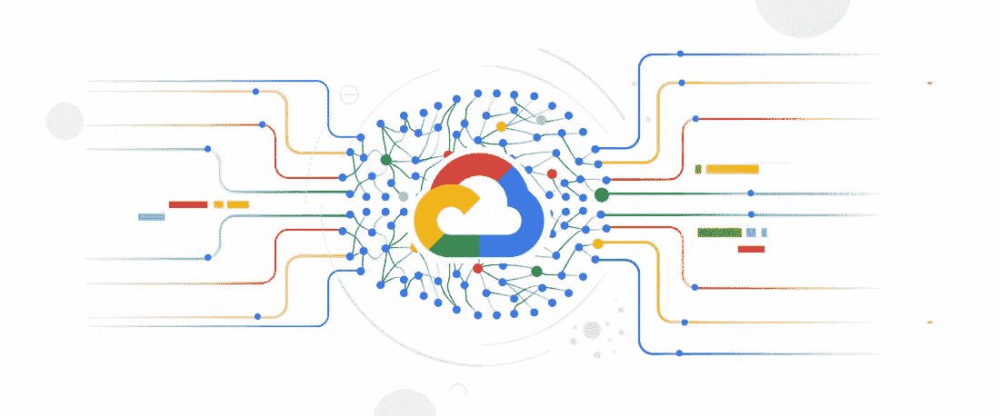
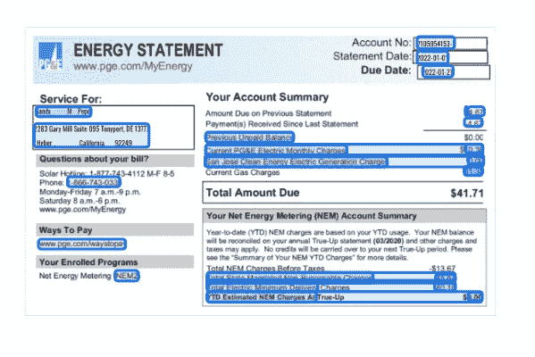

# 谷歌文档人工智能使实体提取变得容易！！！

> 原文：<https://medium.com/google-cloud/entity-extraction-made-easy-with-googles-document-ai-272848a81fea?source=collection_archive---------2----------------------->

图片来自[https://developers.google.com/learn/topics/document-ai](https://developers.google.com/learn/topics/document-ai)

实体提取是一个突出的用例，每个行业在金融和银行业中都有，在这两个行业中，客户地址和身份验证的自动化可能是有利的。实体提取通常用于涉及文档处理、文档分析、文档验证和确认的行业用例中。我记得我曾参与过从驾照、护照、表格等中提取实体的项目。，使用开源 OCR 引擎，如 easyocr、paddle ocr 和 tesseract。虽然这种 OCR 解决方案对于从文档中提取文本非常有效，但是需要对输入数据进行大量的图像预处理，并对提取的文本进行后处理，以从这些文档中提取所需的实体。我还使用 Bert 和 CRFsuite 的名称实体识别模型研究了实体提取的用例。尽管所有这些模型在过去都显示出了经过验证的结果，但使用这些模型需要开发人员具备深度学习、计算机视觉和开发后处理逻辑的知识，这需要经验丰富的机器学习工程师或数据科学家。

谷歌通过在其谷歌云平台(GCP)中引入文档人工智能，使这变得容易。Document AI 是谷歌的一个产品，它使用自然语言和计算机视觉(OCR)技术来创建预先训练好的模型，用于处理高价值和高容量的文档。文档 AI API 可用于构建定制的客户解决方案，以便更快地做出决策。跟随 https://cloud.google.com/document-ai 的[获取更多关于 AI 文档的信息。该 API 有一系列处理器可供使用。我们可以根据使用案例的需要选择处理器。](https://cloud.google.com/document-ai)

**文档 AI 解析器可用**

1.  文档 OCR:这是一个通用的处理器，可用于任何文档提取文本。该处理器允许我们从 200 多种语言的印刷文本和 50 种语言的手写文本中识别和提取文本。
2.  表单解析器:当我们需要提取表单元素(即表单文档中的信息)时，可以使用这个解析器。解析器返回文档中存在的所有键值信息。
3.  发票解析器:从发票中提取文本和值，如发票编号、供应商名称、发票金额、税额、发票日期和到期日。发票解析器提取标题和行项目字段，如发票号、供应商名称、发票金额、税额、发票日期、到期日和行项目金额。
4.  工资单解析器:这个解析器用于处理工资单文档信息。
5.  驾驶执照解析器:从驾驶执照中提取字段值。目前有两种驾驶执照解析器:美国驾驶执照解析器和法国驾驶执照解析器。
6.  Passport 解析器:passport 解析器从 passport 文档中提取实体。目前有两种护照解析器:美国护照解析器和法国护照解析器。
7.  国家 ID 解析器:这个解析器可以用来提取国家 ID 卡实体。目前，法国国家 ID 解析器在文档 AI 中可用。
8.  公用事业解析器:从公用事业账单中提取文本和值，比如供应商名称和以前支付的金额。

图 1:实用程序解析器的输出示例

Google 不断更新它的解析器，在未来，预计会有更多的解析器问世。所有可用解析器的列表可以在[https://cloud.google.com/document-ai/docs/processors-list](https://cloud.google.com/document-ai/docs/processors-list)找到。所有这些解析器都经过了贷款、保险、政府和其他行业数百亿页文档的训练。我已经使用了大部分的解析器，并且发现对于我的用例来说提取的准确性非常高。

**如何使用人工智能文档**

在谷歌云中使用文档 AI API 超级简单

1.  登录您的 GCP 帐户
2.  在搜索栏中，搜索文档 AI
3.  转到创建处理器。
4.  选择适合您使用案例的处理器
5.  文档 AI 创建了一个**预测端点**，您可以在这里发送您的文档。
6.  从 python 代码中调用这个预测端点来获得预测。
7.  预测的输出是 JSON 格式。
8.  一旦得到 JSON 响应，读取 JSON 并提取所需的实体。

您可以使用文档 AI GUI 或 Google 提供的 python 客户端库来创建处理器。遵循[https://cloud.google.com/document-ai/docs/create-processor](https://cloud.google.com/document-ai/docs/create-processor)使用客户端库创建一个处理器。

文档 AI 支持同步和异步 API 调用。要处理单个文档，请使用同步 API 调用，要处理多个文档，请使用异步 API 调用。跟随[https://cloud.google.com/document-ai/docs/send-request](https://cloud.google.com/document-ai/docs/send-request)发送预测请求。

**记录 AI 限额和配额**

在使用文档 AI API 时，我们必须记住的最重要的事情是它的限制和配额。我们通过 API 调用来使用任何 GCP 服务或组件，因此对任何 API 都有一个请求限制是非常典型的。谷歌已经为其所有 GCP 组件提供了限制和配额的文档，这在设计解决方案时非常有用，并且在使用任何服务之前必须牢记。因此开发人员在使用服务之前必须仔细阅读限制和配额的文档。有关 AI 限制和配额的文件可在[https://cloud.google.com/document-ai/quotas](https://cloud.google.com/document-ai/quotas)找到。

# 开始使用保持发展！！！