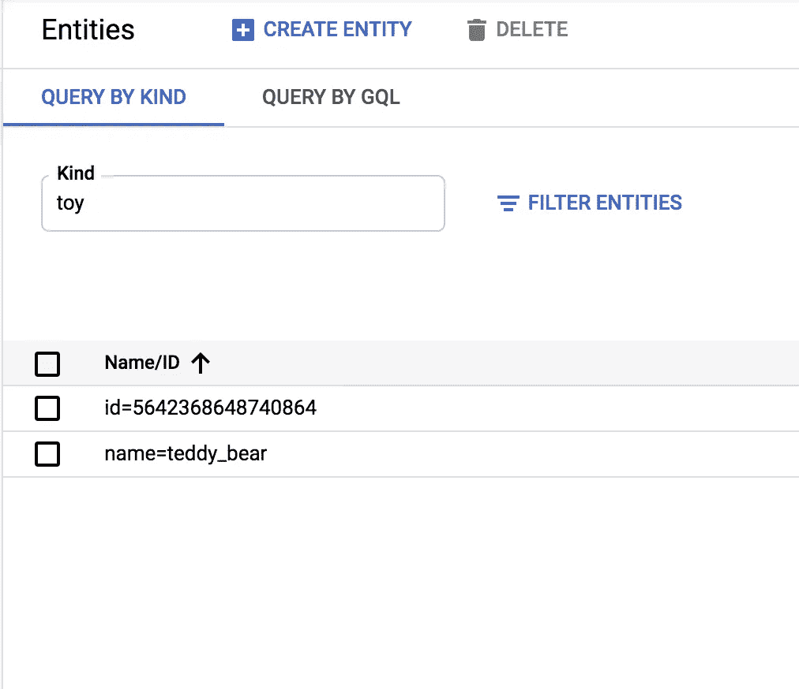
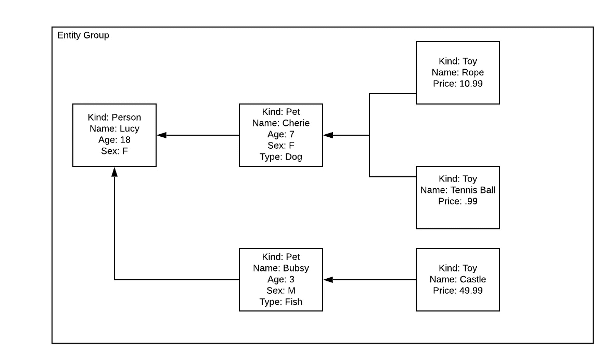

# 数据存储中的实体组、祖先和索引——一个工作示例

> 原文：<https://medium.com/google-cloud/entity-groups-ancestors-and-indexes-in-datastore-a-working-example-3ee40cc185ee?source=collection_archive---------0----------------------->

**作者:** [**萧**](/@theodoresiu7)**[**凯特林**](/@kaitlinardiff)**

# **快速回顾:数据存储如何存储您的数据**

**在我们直接进入数据存储中的实体组之前，首先回顾一下基础知识并建立一个通用词汇表是很重要的。数据存储保存着**实体**，它们是可以包含各种键/值对的对象，称为**属性**。每个实体必须包含一个唯一的标识符，称为**键**。创建实体时，用户可以选择指定自定义密钥或让数据存储创建密钥。如果用户决定指定一个自定义键，它将包含两个字段:一个**种类**，它表示诸如“动物”或“职业状态”之类的类别，以及一个**名称**，它是识别值。如果用户决定在创建键时只指定一种类型，而不指定唯一标识符，Datastore 会在后台自动生成一个 ID。下面是一个 Python3 脚本的例子，演示了这个标识符的概念。**

```
from google.cloud import datastore
client = datastore.Client()#Custom key- specify my kind=item and unique_id = teddy_bear 
custom_key_ent = datastore.Entity(client.key("toy","teddy_bear"))
client.put(custom_key_ent)#Only specify kind=item, let datastore generate unique_id
datastore_gen_key_ent = datastore.Entity(client.key("toy"))
client.put(datastore_gen_key_ent)
```

**在你的 GCP 控制台的数据存储下，你会看到你的两个“玩具”类型的实体。一个包含您的自定义密钥，另一个包含自动生成的密钥。**

****

**指定您的自定义密钥或数据存储将为您生成一个唯一的 id**

# ****祖先和实体组****

**对于高度相关或分层的数据，数据存储允许以父/子关系存储实体。这被称为实体组或祖先/后代关系。**

****

**这是一个实体组的例子，有各种类型的人、宠物和玩具。这种关系中的“祖父母”就是“人”。为了进行配置，必须首先创建 Person 实体。然后，用户可以创建一个宠物，并指定其父项为 person key。为了创建“孙儿”,用户然后创建一个玩具并将它的父玩具设置为宠物钥匙。为了进一步添加可定制的属性，用户可以指定额外的键值对，如年龄、性别和类型。这些键值对被存储为**属性**。在下面的工作示例中，我们在数据存储中对此图进行建模。**

**在为子代创建实体键时，可以通过设置“parent”参数来创建实体组。该命令将父键添加为子实体键的一部分。孩子的键被表示为一个元组(“parent_key”、“child_key”)，使得父母的键是键的前缀，其后是它自己的唯一标识符。例如，遵循上图:**

```
person_key = client.key("Person","Lucy")
pet_key = client.key("Pet","Cherie", parent=person_key)
```

**打印变量`pet_key`将显示:`("Person", "Lucy","Pet", "Cherie")`。**

**Datastore 还支持父级的链接，这可以为具有长祖先血统的后代产生非常大的键。此外，父母可以有多个孩子(代表一对多关系)。但是，没有对实体拥有多个父级(表示多对多关系)的本机支持。一旦配置了这个祖先层次结构，就很容易检索给定父代的所有后代。您可以通过使用“ancestor”参数查询父键来做到这一点。例如，给定上面创建的实体`pet_key`，我可以查询 Cherie 的所有玩具:`my_query = client.query(kind="Toy", ancestor = pet_key)`。**

# ****一个完整的工作示例****

**这是一个完整的 Python3 人/宠物/玩具层次模型的例子，它使用实体组来模拟上图。**

```
from google.cloud import datastore
client = datastore.Client() #Entities with kinds- person, pet, toy
my_entities = [
{"kind": "Person", "Person_id": "Lucy", "sex": "f","age": 18},
{"kind": "Pet", "Pet_id": "Cherie", "Person_id": "Lucy",
"sex": "f", "type": "dog", "age": 7},
{"kind": "Pet", "Pet_id": "Bubsy", "Person_id": "Lucy", 
"sex": "m", "type": "fish", "age": 3},
{"kind": "Toy", "Toy_id": "tennis_ball", "Pet_id": "Cherie", "Person_id": "Lucy", "price": .99},
{"kind": "Toy", "Toy_id": "castle", "Pet_id": "Bubsy", 
"Person_id": "Lucy", "price": 49.99},
{"kind": "Toy", "Toy_id": "rope", "Pet_id": "Cherie", "Person_id": "Lucy", "price": 10.99},
]#Iterate through entities and set immediate parents
for entity in my_entities:
 kind = entity['kind']
 parent_key = None
 if kind == "Pet":
  parent_key = client.key("Person", entity["Person_id"])
 elif kind == "Toy":
  parent_key = client.key("Person", entity["Person_id"],
                          "Pet", entity["Pet_id"]) key = client.key(kind, 
     entity[kind+"_id"],
     parent=parent_key) #Notice I set the parent key!!
 datastore_ent = datastore.Entity(key)
 datastore_ent.update(entity) #Include properties+id
 client.put(datastore_ent)
```

**如果一个人想查询一个特定的宠物，比如说我们想抓一只叫 Cherie 的狗。我们可以运行一个查询:**

```
query1 = client.query(kind="Pet")
query1.add_filter("Pet_id", "=", "Cherie")
```

**使用 Cherie 实体，我们可以很容易地获取父母的 id。**

```
pet = list(query1.fetch())[0] # We know there is only one Cherie
print(“Cherie’s parent: “ + str(pet.key.parent.id_or_name))
```

**此外，我们还可以在查询中使用 ancestor 子句获取 Cherie 的直系子女玩具。**

```
query2 = client.query(kind="Toy", ancestor=pet.key)
for toy in list(query2.fetch()):
     print(toy.key)
     print(toy["Toy_id"])
```

**对于更复杂的查询，数据存储需要适当设置特定的索引。例如，使用额外的过滤器运行相同的查询将需要一个索引，如果没有索引，就会导致失败。**

```
# Adding a filter on the price will cause this to fail!
query2 = client.query(kind="Toy", ancestor=pet.key)
query2.add_filter("price", ">", .5)
for toy in list(query2.fetch()):
        print(toy.key)
        print(toy["Toy_id"])
```

**要解决此问题，请使用包含以下内容的 index.yaml 文件在数据存储中创建索引:**

```
indexes:- kind: Toy
  ancestor: yes
  properties:
  - name: price
```

**使用 gcloud 命令上传 yaml 文件:`gcloud datastore indexes create path/to/index.yaml`您的索引应该显示在您的数据存储控制台中！等待索引过程完成，并重新运行查询，看看它现在工作！现在你有了:实体组、祖先、索引和宠物(！！)在数据存储中。编码快乐！**