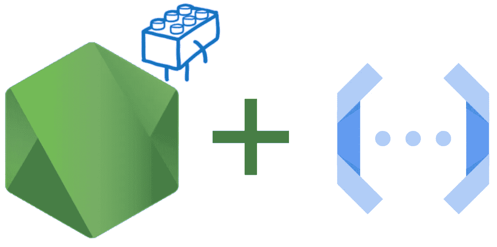

# 云函数中的专家系统模块

> 原文：<https://medium.com/google-cloud/es-modules-in-cloud-functions-f5be1676c8b5?source=collection_archive---------1----------------------->



节点、ES 模块、云功能

**ES 模块**(又名 ECMAScript 模块或 ESM)是 TC39 标准，Node≥14 中未标记的特性，用于加载 JavaScript 模块。

与 CommonJS 相反，ESM 为加载模块提供了一个异步 API，并通过`**import**`和`**export**`语句提供了一个非常普遍采用的**语法改进**。

随着最近的更新，Google Cloud Functions for Node 现在支持开箱即用的 es 模块！

以下是如何使用它们…

## 将类型设置为模块

要在包中启用 ESM，我们必须显式地将字段`"type": “module"`添加到我们的`package. json`文件中(或者使用文件扩展名`.mjs`):

一个简单的`package.json`文件

> **注意:**在云函数中，如果我们没有在`package.json`中指定，我们将自动使用最新的函数框架。在这里，它是当地发展所需要的。

## 使用导出

在 JavaScript 模块中，不使用`modules.export`，我们可以使用`exports`关键字来导出函数、对象或原始值的动态绑定。这里有一个例子:

单线出口

## 使用导入

您可以使用`import`来加载原语、对象和函数，而不是使用`require`关键字。好的方面是您的 IDE 将为您提供导入属性的自动补全(或错误)。

单行导入

## 导出函数

最重要的是，您现在可以导出一个函数，当您的`localhost` URL 被点击时，该函数将被调用，同时传递 [Express](https://expressjs.com/en/api.html) 和`req`对象:

使用 ES 模块的简单云函数

最大的好处是不需要额外的配置。只需运行`npm start`即可启动您的功能/网络服务器:

```
> npm start
> nodejs-ff-esm@ start /functions-framework-nodejs/docs/esm
> functions-framework --target=esmServing function...
Function: esm
Signature type: http
URL: [http://localhost:8080/](http://localhost:8080/)
```

然后向`localhost:8080`提出请求。响应应该是`Hello, ESM!`

这种体验和行为在云中是同义词，但是我们可以将我们的功能部署到 Google 的 22 个可用位置中的任何一个。您可以随意将我们的功能部署到云功能中，无需使用 gcloud 进行任何修改:

```
gcloud functions deploy esm --runtime nodejs14 --trigger-http
```

在命令的输出中，我们将看到一个到*cloudfunctions.net*的唯一 URL，如果调用它，将产生与我们刚才在本地看到的相同的响应。

太好了！我们刚刚在谷歌云上部署了一个简单的 ESM 功能！🎉

感谢阅读！您可以在此处查看 ESM 说明和文档:

*   [https://cloud . Google . com/functions/docs/concepts/nodejs-runtime # using _ es _ modules _ experimental](https://cloud.google.com/functions/docs/concepts/nodejs-runtime#using_es_modules_experimental)
*   [https://github . com/Google cloud platform/functions-framework-nodejs](https://github.com/GoogleCloudPlatform/functions-framework-nodejs/tree/master/docs)