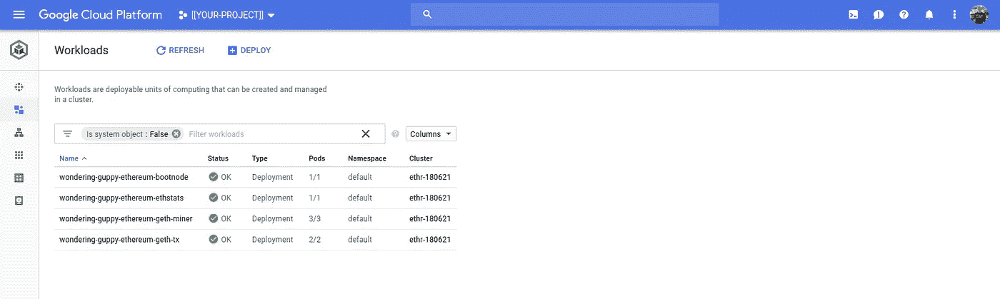
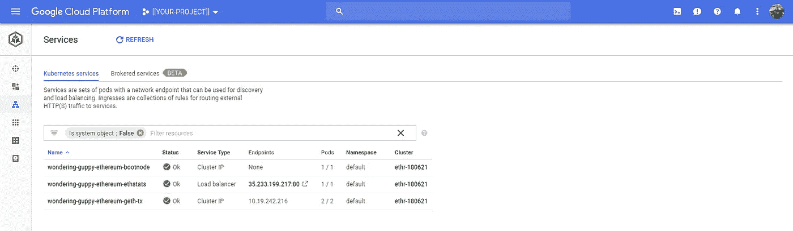
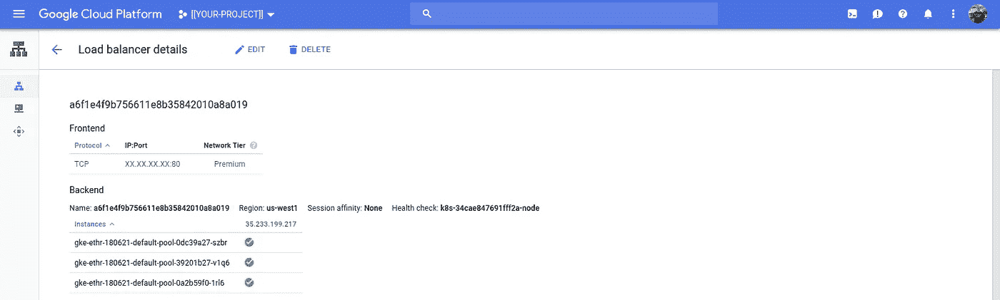
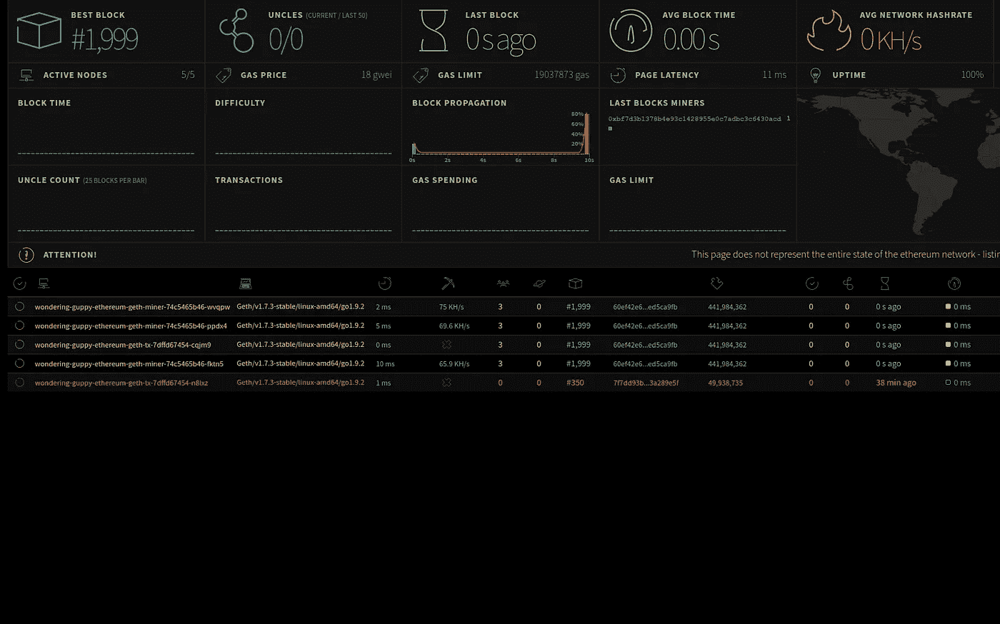
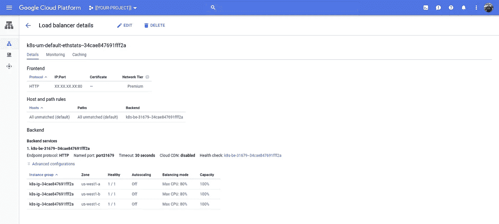

# 以太坊→头盔→库伯内特发动机

> 原文：<https://medium.com/google-cloud/ethereum-helm-kubernetes-engine-25a9552f8e3d?source=collection_archive---------1----------------------->

## 谷歌云平台上的区块链平台

我最近写了一种自行开发的方法，将以太坊的“ [Go 以太坊](https://github.com/ethereum/go-ethereum)”(又名“geth”)双向部署到谷歌云平台:

[https://medium . com/Google-cloud/ether eum-on-Google-cloud-platform-8 F10 c 82493 ca](/google-cloud/ethereum-on-google-cloud-platform-8f10c82493ca)

我昨晚在微软的开发者博客上读到“[使用 Helm 将【以太坊】部署到 Kubernetes](https://www.microsoft.com/developerblog/2018/02/09/using-helm-deploy-blockchain-kubernetes/) ”。

Kubernetes(和 Helm)的一个好处是，如果一个图表适用于 Azure Kubernetes 服务，那么它应该适用于任何 Kubernetes 集群，包括 Kubernetes 引擎。**提示**:确实如此。

因此，如果您想在 Kubernetes 引擎上部署一个私有以太网，只需看看 stable(！)以太坊图:

[https://github . com/kubernetes/charts/tree/master/stable/ether eum](https://github.com/kubernetes/charts/tree/master/stable/ethereum)

## 设置

如果你有一个现有的 Google 云平台项目，安装了 Kubernetes 引擎集群和 Helm，请直接跳到前面。

```
PROJECT=[[YOUR-PROJECT]]
REGION=[[YOUR-REGION]]
BILLING=[[YOUR-BILLING]]
CLUSTER=ethr-$(date '+%y%m%d')
LATEST=1.10.4-gke.2HELM_PATH=[[PATH/TO/HELM]]
PATH=$PATH:${HELM_PATH}/linux-amd64gcloud projects create ${PROJECT}
gcloud billing projects link $PROJECT --account=$BILLING
gcloud services enable container.googleapis.com --project=$PROJECTgcloud beta container clusters create $CLUSTER \
--username="" \
--cluster-version=${LATEST} \
--machine-type=custom-2-8192 \
--image-type=COS \
--num-nodes=1 \
--enable-autorepair \
--enable-autoscaling \
--enable-autoupgrade \
--enable-stackdriver-kubernetes \
--min-nodes=1 \
--max-nodes=2 \
--region=${REGION} \
--project=${PROJECT} \
--preemptible \
--scopes="[https://www.googleapis.com/auth/cloud-platform](https://www.googleapis.com/auth/cloud-platform)"kubectl create serviceaccount tiller \
--namespace=kube-system && \
kubectl create clusterrolebinding tiller \
--clusterrole cluster-admin \
--serviceaccount=kube-system:tiller && \
helm init --service-account=tiller
```

## 以太坊

遵循以太坊图表作者提供的说明:

[https://github . com/kubernetes/charts/tree/master/stable/ether eum](https://github.com/kubernetes/charts/tree/master/stable/ethereum)

你需要一个钱包，说明书会解释如何在需要时创建一个。我唯一的建议是将命令包装在`virtualenv`中:

```
virtualenv -p python3 py3env
source py3env/bin/activate
pip3 install -r requirements.txt
python3 ethereum-wallet-generator.pypython3 ethereum-wallet-generator.py
```

这将生成如下形式的内容:

```
Private key: ee1eab2e...
Public key:  e1a37deb...
Address:     0xC8375d...
```

记下这些值，因为它们代表你的钱包。

## 以太坊图表安装

现在，您已经准备好将图表部署到 Kubernetes 引擎:

```
SECRET=[[YOUR-SECRET]]
helm install \
stable/ethereum \
--set geth.account.address=0xC8375d... \
--set geth.account.privateKey=e1a37deb... \
--set geth.account.secret=${SECRET}
```

> 生成一个秘密。出于测试目的，可能使用[安全密码生成器](https://passwordsgenerator.net/)。

当 Helm 部署完成时，它将为后续步骤提供指导:

```
NOTES:1\. View the EthStats dashboard at:
    export SERVICE_IP=$(kubectl get svc --namespace default wondering-guppy-ethereum-ethstats -o jsonpath='{.status.loadBalancer.ingress[0].ip}')
    echo [http://$SERVICE_IP](http://$SERVICE_IP)NOTE: It may take a few minutes for the LoadBalancer IP to be available.
          You can watch the status of by running 'kubectl get svc -w wondering-guppy-ethereum-ethstats-service'2\. Connect to Geth transaction nodes (through RPC or WS) at the following IP:
    export POD_NAME=$(kubectl get pods --namespace default -l "app=wondering-guppy-ethereum-geth-tx,release=wondering-guppy" -o jsonpath="{.items[0].metadata.name}")
    kubectl port-forward $POD_NAME 8545:8545 8546:8546
```

## 库伯内特发动机

您应该看到部署到集群的几个资源。

应该有 4 个部署:



Kubernetes 发动机控制台

和 3 项服务:



Kubernetes 发动机控制台

并且，您可以确认已经创建了一个网络负载平衡器:



云控制台:网络服务

## 网络负载平衡器

舵图为以太坊部署提供了一个网络负载平衡器。您可以通过浏览`${SERVICE_IP}`来访问 EthStats 仪表板(参考部署图表时提供的“注释”):

```
export SERVICE_IP=$(\
  kubectl get services \
  --namespace=default wondering-guppy-ethereum-ethstats \
  --output=jsonpath='{.status.loadBalancer.ingress[0].ip}') && \
echo ${SERVICE_IP}
```

并且:



EthStats

## HTTP/S 负载平衡器

在 Google 云平台上，可以(最好)为这个基于 HTTP 的服务使用 HTTP/S 负载平衡器。为此，您可以更改现有部署或克隆以太坊图表报告，并进行以下更改。

通过将图表的`values.yaml`的第 18 行中的`type: LoadBalancer`更改为`type: NodePort`来移除网络负载平衡器。您可以将此应用于正在运行的部署或更改模板文件。

然后使用以下命令对此节点端口应用入口:

```
apiVersion: extensions/v1beta1
kind: Ingress
metadata:
  name: ethstats
spec:
  backend:
      serviceName: [[HELM-RELEASE]]-ethereum-ethstats
      servicePort: 80
```

> **NB** 您需要将`[[HELM-RELEASE]]`替换为您的以太坊部署的发布名称。

如果您手动这样做，您可以看到发布名称。我的是“好奇-孔雀鱼”。你的将会不同。

如果通过更改模板来实现这一点，可以使用以下模板:

```
apiVersion: extensions/v1beta1
kind: Ingress
metadata:
  name: {{ template "ethereum.fullname" . }}-ethstats
spec:
  backend:
      serviceName: {{ template "ethereum.fullname" . }}-ethstats
      servicePort: 80
```

这将导致配置 HTTP/S 负载平衡器:



云控制台:网络服务

与前面的命令类似，您可以:

```
INGRESS_IP=${
  kubectl get ingress \
  --output=jsonpath="{.items[0].status.loadBalancer.ingress[0].ip}") && echo ${INGRESS_IP}
```

然后浏览`${INGRESS_IP}`。

## 结论

这个故事的主要目的是向你展示，如果它融合了，它也会融合在谷歌云平台上。我们经常被开发者问 X 是否运行在谷歌云平台上。问题真的是“如何在谷歌云平台上运行 X？”

在这种情况下，我们能够利用 Kubernetes 的*事实上的*容器编排标准和 Helm 的配套“包管理器”。给定一个舵图，舵图应该在 Kubernetes 引擎上工作。

仅此而已！