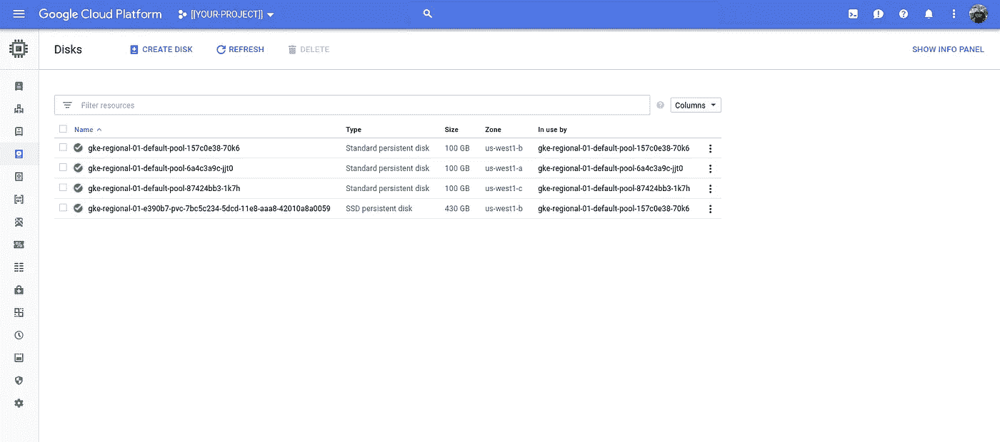

# 谷歌云平台上的以太坊

> 原文：<https://medium.com/google-cloud/ethereum-on-google-cloud-platform-8f10c82493ca?source=collection_archive---------0----------------------->

## 谷歌云平台上的区块链平台

谷歌的超高速网络、强大的虚拟机和固态硬盘加上其最先进的容器技术，使谷歌云平台(GCP)成为区块链平台无与伦比的目的地。

在确保开发者意识到这一点方面，谷歌可以做得更好。

去年年底，我写了一篇文章，描述了如何将以太坊部署到 GCP。从那时到今天，我没有用过以太坊。这篇文章更新了之前的文章，用更简单的方法在 GCP 上运行以太坊，使用:(a)容器优化的操作系统；(b)使用 Kubernetes 发动机。

你需要一个 GCP 项目，并且有免费的选项。你需要安装[云软件开发套件](https://cloud.google.com/sdk/)(又名`gcloud`)。让我们开始吧。

## 容器优化的操作系统

容器优化操作系统允许您将 Docker 映像部署到 Google 计算引擎虚拟机。这是运行`ethereum/client-go`图像的最简单方式:

```
INSTANCE=[[YOUR-INSTANCE]] # cos-ethereum
ZONE=[[YOUR-ZONE]]         # us-west1-c
PROJECT=[[YOUR-PROJECT]]gcloud beta compute instances create-with-container ${INSTANCE} \
--boot-disk-size=500GB \
--boot-disk-type=pd-ssd \
--container-image=ethereum/client-go \
--container-arg="--rpc" \
--container-arg="--rpcaddr=0.0.0.0" \
--container-restart-policy=always \
--container-mount-host-path=\
mount-path=/root,\
host-path=/tmp/client-go,\
mode=rw \
--image-family=cos-stable \
--image-project=cos-cloud \
--zone=${ZONE} \
--project=${PROJECT}
```

> **NB** 为了避免耗尽磁盘，容器使用 500GB(整个默认配额)的 SSD 永久存储。根据您的喜好，减少`boot-disk-size`或将`boot-disk-type`改为 pd 标准。
> 
> **注意**如果您希望使用**测试**网络，请在现有的`— container-arg`标志前添加`— container-arg="— testnet”`。如果您更喜欢使用标记，请在现有的`--container-arg`标记之前添加`— container-arg=" — rinkeby"`。

虚拟机应该在 30 秒内运行，您可以使用以下命令查看其状态:

```
gcloud compute ssh ${INSTANCE} \
--command="sudo journalctl --unit=konlet-startup --follow" \
--project=${PROJECT}
```

> **NB** `konlet-startup`是容器优化 OS 中对应 Docker 镜像部署的 systemd 服务。

成功看起来像:

```
Created a container with name 'cos-ethereum' and ID: fdd6...
Starting a container with ID: fdd6...
Saving welcome script to profile.d
```

您可以确认容器正在运行:

```
gcloud compute ssh ${INSTANCE} \
--command="docker ps --format='[{{.ID}}] {{.Names}}: {{.Status}}'" \
--project=${PROJECT}[a8c710e75ae3] cos-ethereum: Up 8 minutes
```

然后，您可以使用`gcloud`启动`ssh`端口转发到实例:

```
gcloud compute ssh ${INSTANCE} \
--ssh-flag="-L 8545:localhost:8545" \
--project=${PROJECT}
```

从不同的 shell 中，您可以连接到实例上运行的以太坊节点:

```
docker run \
--rm \
--interactive \
--net=host \
--tty \
ethereum/client-go \
  attach [http://localhost:8545](http://localhost:8545)
```

这将产生:

```
Welcome to the Geth JavaScript console!instance: Geth/v1.8.9-unstable-0fe47e98/linux-amd64/go1.10.2
 modules: eth:1.0 net:1.0 rpc:1.0 web3:1.0>
```

在 GCP 上运行以太坊利用了谷歌云日志。您将能够自动查看和查询日志。

https://console.cloud.google.com/logs/viewers


Stackdriver 日志记录“全局:gcplogs-docker-driver”

> **NB** 略带迷惑地(！)，您必须选择“Global”作为资源，然后您应该看到“gcplogs-docker-driver”作为选项。如上所述，这将提供容器的日志。

您通过云控制台看到的一切也可以从 CLI 访问。在这种情况下，您可以运行以下命令来查看容器的日志:

```
FILTER="resource.type=\"global\" "\
"logName=\"projects/${PROJECT}/logs/gcplogs-docker-driver\" "gcloud logging read "${FILTER}" \
--project=$PROJECT \
--format="value(jsonPayload.data)" \
--order=asc
```

您应该记录如下条目:

```
INFO [05-23|00:47:38] Imported new state entries               count=1920 elapsed=8.560ms   processed=2993520 pending=6080  retry=0    duplicate=31 unexpected=283
INFO [05-23|00:47:39] Imported new state entries               count=1920 elapsed=110.058ms processed=2995440 pending=5488  retry=0    duplicate=31 unexpected=283
INFO [05-23|00:47:39] Imported new state entries               count=1306 elapsed=11.663ms  processed=2996746 pending=6196  retry=0    duplicate=31 unexpected=283
INFO [05-23|00:47:39] Imported new block receipts              count=691  elapsed=286.192ms number=1358549 hash=3633f9…19e595 size=1.94mB   ignored=0
...
...
Fatal: Error starting protocol stack: write /root/.ethereum/rinkeby/geth/chaindata/004464.ldb: no space left on device
Fatal: Error starting protocol stack: write /root/.ethereum/rinkeby/geth/chaindata/004464.ldb: no space left on device
```

**NB** 你不想要的是“设备上没有剩余空间”形式的日志条目，因为它们终止了容器。如果你收到这些，你需要增加`boot-disk-size`标志的大小或者抓取更少的数据。

您还可以获得对虚拟机的基本监控，而不是对容器的监控。


Stackriver 监控

您可以`exit`使用 JavaScript 控制台删除以太坊虚拟机:

```
gcloud compute instances delete ${INSTANCE} \
--zone=${ZONE} \
--project=${PROJECT}
```

## 库伯内特发动机

如果您喜欢使用 Kubernetes(引擎)集群，命令也很简单。

假设您通过了集群的身份验证，以下步骤将为以太坊创建一个名称空间，创建一个磁盘(实际上是一个 Kubernetes PersistentVolumeClaim)，部署一个 Go 以太坊(又名“geth”)节点，并将其端口转发到您的本地工作站，以便您可以连接到它:

```
NAMESPACE=ethereum
kubectl create namespace ${NAMESPACE}
kubectl apply --filename=deployment.yaml --namespace=${NAMESPACE}
```

> **NB** 如果您更喜欢使用**测试**网络，请在第 33–34 行之间插入`"--testnet"`(包括引号)。如果您更喜欢使用 Rinkeby network，请插入`"--rinkeby"`。

这将导致:

```
persistentvolumeclaim "ethereum" created
deployment.extensions "ethereum" created
service "ethereum" created
```

您应该能够看到创建的持久卷声明:

[https://console.cloud.google.com/kubernetes/storage](https://console.cloud.google.com/kubernetes/storage?project=dazwilkin-180520-lucky)


以及部署:

[https://console.cloud.google.com/kubernetes/workload](https://console.cloud.google.com/kubernetes/workload?project=dazwilkin-180520-lucky)


在 GCP 上运行以太坊会自动产生一些有用的好处，包括控制台监控:


云控制台:Kubernetes

日志记录:

[https://console.cloud.google.com/logs/viewer](https://console.cloud.google.com/logs/viewer)


堆栈驱动程序日志:GKE 集装箱

一些 Stackdriver 优点(尽管最近宣布的 [Stackdriver Kubernetes 监控](https://cloud.google.com/kubernetes-monitoring/)-在该集群上未启用)甚至更好。如果您还没有为项目配置 Stackdriver，那么您需要首先这样做，并且您可以使用免费层:

[https://console.cloud.google.com/monitoring](https://console.cloud.google.com/monitoring)


Stackdriver 监控:Kubernetes 引擎集群

我们将使用 ssh 端口转发(通过`gcloud`)从我们的工作站访问 Go Ethereum 节点，而不打开防火墙。

```
SERVICE=ethereum
NAMESPACE=ethereumNODE=$(\
  kubectl get nodes \
  --output=jsonpath='{.items[0].metadata.name}')PORT=$(\
  kubectl get services/${SERVICE} \
  --namespace=${NAMESPACE} \
  --output=jsonpath='{.spec.ports[?(@.name=="default")].nodePort}')echo ${PORT}gcloud compute ssh ${NODE} \
--ssh-flag="-L ${PORT}:localhost:${PORT}" \
--project=${PROJECT}
```

> **注意**这些看起来模糊不清的命令抓取了一个 Kubernetes 集群的节点名；确定以太坊服务在哪个节点端口上提供服务；然后使用`gcloud`将该节点的端口转发到本地主机的(相同)端口。如果您愿意，您可以使用— `ssh-flag=“-L 8545:localhost:${PORT}”`,然后在随后的命令中也用`8545`替换`${PORT}`。你的选择！
> 
> **NB** 我的情况`echo ${PORT}`(这次)返回`30873`。

然后，从本地工作站运行`geth` JavaScript 客户机，并连接到 Kubernetes 集群上运行的节点:

```
docker run \
--rm \
--interactive \
--tty  \
--net=host \
ethereum/client-go attach [http://localhost:$](http://localhost:31783){PORT}
```

> **NB** 在我这里，`${PORT}`的值是`30873`。

然后你应该进入以太坊 JavaScript 控制台:

```
Welcome to the Geth JavaScript console!instance: Geth/v1.8.9-unstable-0fe47e98/linux-amd64/go1.10.2
 modules: eth:1.0 net:1.0 rpc:1.0 web3:1.0>
```

完成后，最简单的方法是删除 Kubernetes 名称空间，这将删除部署、服务和 PeristentVolumeClaim 声明:

```
kubectl delete namespace ${NAMESPACE}
```

## 撇开 18-05-25 不谈:钱包

我发现了一个使用传递给 Kubernetes(引擎)的钱包作为秘密的问题。使用 Secrets(和 ConfigMaps)向 Pods 提供数据被认为是 Kubernetes 的一个良好实践。但是，当(卷)装入 pod 时，Secrets 和 ConfigMaps 的实现是将文件内容呈现为符号链接。这似乎是钱包和以太坊的问题:

[https://github.com/ethereum/go-ethereum/issues/16793](https://github.com/ethereum/go-ethereum/issues/16793)

如果您想在部署到 Kubernetes 时使用现有的 wallet 文件，这应该与创建一个秘密一样简单(您可以类似地使用 ConfigMaps，但是秘密为…秘密和其他机密信息提供了不透明性),然后将秘密挂载为一个供以太坊节点访问的卷挂载。然而，如上所述，这对于以太坊是不正确的。因此，您将需要下面的“黑客工作区”中的额外步骤。

首先，创造秘密:

```
kubectl create secret generic keystore \
--from-file=PATH/TO/YOUR/keystore \
--namespace=$NAMESPACE
```

> **NB** 你的路径应该在一个名为`keystore`的目录中结束，这个目录和它的钱包将被编码成秘密。

我的权宜之计是在以太坊节点启动之前，使用 init 容器将钱包从 Secret(名为`/keystore`)复制到 emptyDir(名为`/cache`)卷中，并配置以太坊在`/cache`而不是`/keystore`中寻找钱包(因为这不起作用)。这是因为复制符号链接会复制底层文件。

> **注意**参见下一节“固态硬盘”将`datadir`配置为固态硬盘而非硬盘。
> 
> 第 31–39 行创建一个名为`init-service`的初始化容器。`init-service`使用 Alpine 将`UTC*`格式的文件从`/keystore`复制到`/cache`。这些目录是卷挂载的。体积在第 66–75 行中定义(针对 Pod 而非特定容器)。`keystore`是否包含作为符号链接挂载的钱包文件的密码，如果直接使用，这些文件似乎无法与以太坊一起工作。`cache`是一个 emptyDir 卷，如果以太坊在复制到这里时使用钱包，它就可以工作！
> 
> **NB** 在第 46 行，以太坊被配置为使用`/cache`目录来存放带有`--keystore=/cache`的钱包。

## （同 solid-statedisk）固态（磁）盘

上面使用的 Kubernetes 部署包括一个`PersistentVolumeClaim`规范，第 7 行定义了`standard`的`storageClassName`。这对应于常规[持久磁盘](https://cloud.google.com/persistent-disk/)。

如果您喜欢使用速度更快的固态硬盘，我们必须首先在 Kubernetes 引擎中注册新的存储类:

并且:

```
kubectl apply --filename=ssd.yaml
```

现在，当您查询 Kubernetes 引擎存储类时，应该添加一个名为`ssd`的新类型`pd-ssd`:


然后，我们可以修改部署文件的第 7 行，将`storageClassName: standard`改为`storageClassName: ssd`。

GCP 项目的默认“永久磁盘 SSD (GB)”配额是每个分区 500 GB。如果您没有增加这些配额，您将无法调配 500 GiB(！)磁盘。因此，也请*将部署中第 12 行的值减少*到例如 400Gi (~429GB)，这应该足够了*除非*您的项目中有其他 SSD PD。或者，请求增加配额:

[https://console.cloud.google.com/iam-admin/quotas?PROJECT = $ { PROJECT }&service = compute . Google APIs . com&metric = Persistent % 20 disk % 20 SSD % 20(GB)](https://pantheon.corp.google.com/iam-admin/quotas?project=dazwilkin-180522-ethereum&folder&organizationId=433637338589&service=compute.googleapis.com&metric=Persistent%20Disk%20SSD%20(GB))


配额:永久磁盘 SSD (GB)

要实现此更改，我们必须删除并重新创建部署:

```
kubectl delete --filename=deployment.yaml --namespace=${NAMESPACE}
kubectl apply --filename=deployment.yaml --namespace=${NAMESPACE}
```



计算引擎:磁盘

> **注意**有 4 个计算引擎磁盘:3 个是“标准持久磁盘”,分别用于 Kubernetes 集群中的 3 个节点。第四个磁盘为 430GB (==400GiB)，属于“SSD 持久磁盘”类型。它是在我们应用部署时由 PersistentVolumeClaim 创建的。

## 结论

在这篇文章中，我提供了两种在 Google 云平台上运行单个以太坊节点的简单方法。

随时欢迎反馈。

仅此而已！