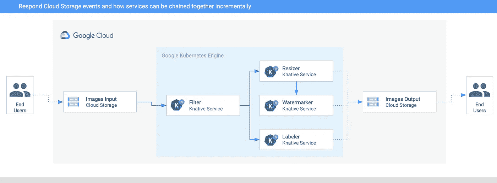

# 具有 Knative 事件的事件驱动图像处理流水线

> 原文：<https://medium.com/google-cloud/event-driven-image-processing-pipeline-with-knative-eventing-2b12254f37bb?source=collection_archive---------1----------------------->

在这篇文章中，我想谈谈我最近使用 [Knative Eventing](https://knative.dev/docs/eventing/) 构建的一个事件驱动的图像处理管道。在这个过程中，我将告诉您 Knative 提供的事件源、自定义事件和其他组件，它们简化了事件驱动架构的开发。

# 要求

让我们首先谈谈我对图像处理管道的基本要求:

1.  用户将文件上传到输入桶，并在输出桶中获得处理过的图像。
2.  上传的图像在通过管道发送之前经过过滤(例如，没有成人或暴力图像)。
3.  管道可以包含任意数量的处理服务，可以根据需要添加或删除这些服务。对于最初的管道，我决定用 3 个服务:resizer、watermarker 和 labeler。resizer 将调整大图像的大小。watermarker 将为调整大小的图像添加水印，贴标机将提取有关图像(标签)的信息并保存。

要求#3 尤其重要。我希望能够在需要时将服务添加到管道中，或者创建多个管道，将不同的服务链接在一起。

# Knative Eventing 善良

Knative Eventing 提供了许多有助于构建(如管道)的组件，即:

1.  [事件源](https://knative.dev/docs/eventing/sources/)允许您读取集群中的外部事件，而 [Knative-GCP 源](https://github.com/google/knative-gcp#knative-gcp-sources)提供了许多事件源，可以随时从各种谷歌云资源中读取事件。
2.  [Broker 和 Trigger](https://knative.dev/docs/eventing/broker/) 提供了一个事件中枢，在这里正确的事件被交付给正确的事件消费者，而生产者或消费者不必知道事件是如何被路由的。
3.  *自定义事件和事件回复*:在 Knative 中，所有事件都是 [CloudEvents](https://cloudevents.io/) 。有一个标准的事件格式和各种 SDK 来读/写它们是很有用的。此外，Knative 支持自定义事件和事件回复。任何服务都可以接收一个事件，进行一些处理，用新数据创建一个定制事件，并回复给`Broker`以供其他服务读取定制事件。这在管道中非常有用，在管道中每个服务做一点工作并向前传递消息。

# 体系结构

这是图像处理流水线的架构。它被部署到谷歌云上的谷歌 Kubernetes 引擎(GKE ):



1.  图像被保存到输入云存储桶。
2.  云存储更新事件由 [CloudStorageSource](https://github.com/google/knative-gcp/blob/master/docs/examples/cloudstoragesource/README.md) 读入 Knative。
3.  过滤服务接收云存储事件。它使用 Vision API 来确定图像是否安全。如果是这样，它创建一个类型为`dev.knative.samples.fileuploaded`的自定义`CloudEvent`并将其向前传递。
4.  Resizer 服务接收`fileuploaded`事件，使用 [ImageSharp](https://github.com/SixLabors/ImageSharp) 库调整图像大小，将调整后的图像保存到输出桶，创建一个`dev.knative.samples.fileresized`类型的自定义`CloudEvent`，并将事件向前传递。
5.  水印服务接收`fileresized`事件，使用 [ImageSharp](https://github.com/SixLabors/ImageSharp) 库为图像添加水印，并将图像保存到输出桶。
6.  贴标机接收`fileuploaded`事件，用 Vision API 提取图像的标签，并将标签保存到输出桶。

# 建造管道

在我的[技能教程](https://github.com/meteatamel/knative-tutorial/)中，我有关于如何构建管道的[指令](https://github.com/meteatamel/knative-tutorial/blob/master/docs/image-processing-pipeline.md)以及[代码和配置](https://github.com/meteatamel/knative-tutorial/tree/master/eventing/processing-pipelines/image)。让我强调一下主要部分。

# 读取云存储事件

要读取 Google 云存储事件，您需要创建一个`CloudStorageSource`并指向您想要从中监听事件的存储桶:

```
apiVersion: events.cloud.google.com/v1alpha1
kind: CloudStorageSource
metadata:
  name: storagesource-images-input
spec:
  bucket: knative-atamel-images-input
  sink:
    ref:
      apiVersion: eventing.knative.dev/v1beta1
      kind: Broker
      name: default
```

一旦事件被读入，它们就被输入到默认名称空间中的`Broker`中。

# 过滤服务

过滤服务将获取所有存储事件，并决定哪些图像可以安全传递。

首先，您需要创建一个`Trigger`来监听`com.google.cloud.storage.object.finalize`事件:

```
apiVersion: eventing.knative.dev/v1beta1
kind: Trigger
metadata:
  name: trigger-filter
spec:
  filter:
    attributes:
      type: com.google.cloud.storage.object.finalize
  subscriber:
    ref:
      apiVersion: serving.knative.dev/v1
      kind: Service
      name: filter
```

然后，创建 Knative 服务来处理这些事件:

```
apiVersion: serving.knative.dev/v1
kind: Service
metadata:
  name: filter
spec:
  template:
    spec:
      containers:
        - image: docker.io/meteatamel/filter:v1
          env:
            - name: BUCKET
              value: "knative-atamel-images-input"
```

代码在[过滤器](https://github.com/meteatamel/knative-tutorial/tree/master/eventing/processing-pipelines/image/filter)中，但是服务基本上使用视觉 API 来检测图像的安全性，如下所示:

一旦过滤器服务确定图片是安全的，它就发出一个类型为`dev.knative.samples.fileuploaded`的自定义 CloudEvent，CloudEvent 的数据字段只是桶和文件名:

# 调整大小服务

代码在这里为 [resizer](https://github.com/meteatamel/knative-tutorial/blob/master/eventing/processing-pipelines/image/resizer) 。

它只响应其触发器中定义的`dev.knative.samples.fileuploaded`事件:

```
apiVersion: eventing.knative.dev/v1beta1
kind: Trigger
metadata:
  name: trigger-resizer
spec:
  filter:
    attributes:
      type: dev.knative.samples.fileuploaded
  subscriber:
    ref:
      apiVersion: serving.knative.dev/v1
      kind: Service
      name: resizer
```

它使用`ImageSharp`读取图像并调整其大小，并发出另一个定制事件`dev.knative.samples.fileresized`供下一个服务水印拾取。

# 水印服务

您可以在 [watermarker](https://github.com/meteatamel/knative-tutorial/tree/master/eventing/processing-pipelines/image/watermarker) 文件夹中查看 Watermarker 服务的详细信息，但简单来说，它从 resizer 接收事件，读取调整大小的图像，并在将图像保存到桶之前为图像添加一个`Google Cloud Platform`水印。

# 贴标机服务

Labeler 接收的事件与 resizer 接收的事件相同。相反，它使用 Vision API 从图像中提取标签，如下所示:

```
private async Task<string> ExtractLabelsAsync(string storageUrl)
{
    var visionClient = ImageAnnotatorClient.Create();
    var labels = await visionClient.DetectLabelsAsync(Image.FromUri(storageUrl), maxResults: 10);var orderedLabels = labels
        .OrderByDescending(x => x.Score)
        .TakeWhile((x, i) => i <= 2 || x.Score > 0.50)
        .Select(x => x.Description)
        .ToList();return string.Join(",", orderedLabels.ToArray());
}
```

然后，它将这些标签保存到输出桶中的一个文本文件中。

# 测试管道

如果一切设置正确，您可以看到触发器处于`READY`状态:

```
kubectl get trigger NAME READY REASON BROKER SUBSCRIBER_URI trigger-filter True default http://filter.default.svc.cluster.local trigger-labeler True default http://labeler.default.svc.cluster.local trigger-resizer True default http://resizer.default.svc.cluster.local trigger-watermarker True default [http://watermarker.default.svc.cluster.local](http://watermarker.default.svc.cluster.local)
```

我把下面这张来自我最喜欢的海滩(里约热内卢的伊帕内马)的照片上传到了水桶里:


几秒钟后，我在输出桶中看到 3 个文件:

```
gsutil ls gs://knative-atamel-images-output gs://knative-atamel-images-output/beach-400x400-watermark.jpeg gs://knative-atamel-images-output/beach-400x400.png gs://knative-atamel-images-output/beach-labels.txt
```

我们可以看到文本文件中的标签`Sky,Body of water,Sea,Nature,Coast,Water,Sunset,Horizon,Cloud,Shore`和下面的调整大小和水印图像:


# 包裹

正如我提到的，[完整示例](https://github.com/meteatamel/knative-tutorial/blob/master/docs/image-processing-pipeline.md)在我的 Knative Tutorial repo 上。我们的映像管道非常灵活，您可以通过触发器随意添加和删除服务。这就是事件驱动架构的美妙之处。尽管读写事件(在本例中是`CloudEvents`)需要更多的工作，但它允许高度的灵活性。

如果你有问题/评论，欢迎在 Twitter 上联系我( [@meteatamel](https://twitter.com/meteatamel) )。

*最初发布于*[*https://atamel . dev*](https://atamel.dev/posts/2020/06-05_event-driven-image-processing-pipeline-knative/)*。*