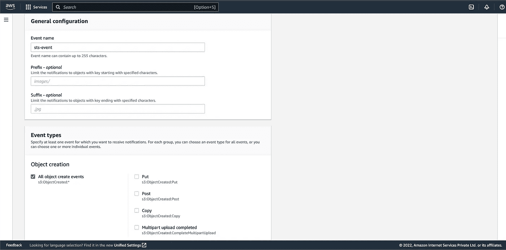

# 使用存储传输服务从亚马逊 S3 到谷歌云存储的事件驱动传输

> 原文：<https://medium.com/google-cloud/event-driven-transfers-from-amazon-s3-to-google-cloud-storage-using-storage-transfer-service-81e7abae3c1a?source=collection_archive---------1----------------------->


oogle 云平台正式发布了由事件驱动传输发起的存储传输服务的公开预览。这将帮助我们将对象从亚马逊 S3 转移到谷歌云存储(GCS)桶，或者将一个 GCS 桶转移到其他 GCS 桶，以响应在源中创建新对象时发生的事件。

**当前场景**

最初，Storage Transfer Service 只有按特定计划运行对象的选项。虽然这有助于重复传输数据的最小时间表为 1 小时，但对于需要在亚马逊 S3 和 GCS 之间持续同步数据的客户来说，这可能不够快。拥有多云生态系统的客户需要在创建或修改对象后立即转移到 GCS，但这并不存在。

**事件驱动传输是如何工作的？**

存储传输服务可以侦听 AWS 或 Google Cloud 中的事件通知，以自动传输在源位置添加或更新的数据。

**事件驱动传输的优势**

因为事件驱动的传输会侦听源存储桶的更改，所以更新会近乎实时地复制到目标存储桶。存储转移服务不需要对源执行列表操作，节省了时间和金钱。

使用案例包括:

*   **事件驱动分析**:将数据从 AWS 复制到云存储，以执行分析和处理。
*   **云存储复制**:在云存储桶之间实现自动、异步的对象复制。
*   **灾难恢复/高可用性设置**:以分钟为单位将对象从源复制到备份目标。
*   **实时迁移**:事件驱动的迁移可以支持低停机时间迁移，停机时间大约为几分钟，作为一次性批量迁移的后续步骤。

**在亚马逊 S3 和 GCS 之间设置事件驱动转账的步骤:**

**先决条件包括:**

1.  一个亚马逊 S3 桶作为来源
2.  谷歌云存储桶作为目的地

**步骤:**

1.  在 AWS 部分，转到简单队列服务并单击**创建队列。**


SQS 的 AWS 页面

2.输入队列的**名称**，向下滚动至**访问策略**部分，点击**高级**。您应该会看到一个类似下面的 **JSON** 对象。注意**本金。来自 JSON 的 AWS** 和**资源**。


创建 SQS 队列时访问策略部分

3.更换**主体。AWS** 和**资源**与**负责人。下面 JSON 代码中的 AWS** 和 **RESOURCE_ARN** 。另外，将**S3 _ 木桶 _ARN** 替换为您的源 S3 木桶的亚马逊资源名称或 ARN(您可以在 S3 木桶的**属性**部分找到 S3 木桶的 ARN)。将访问策略部分中的 JSON 替换为下面的 JSON，并单击**创建队列**。

```
{
  "Version": "2012-10-17",
  "Id": "example-ID",
  "Statement": [
    {
      "Sid": "example-statement-ID",
      "Effect": "Allow",
      "Principal": {
        "Service": "s3.amazonaws.com"
      },
      "Action": "SQS:SendMessage",
      "Resource": "RESOURCE_ARN",
      "Condition": {
        "StringEquals": {
          "aws:SourceAccount": "PRINCIPAL.AWS"
        },
        "ArnLike": {
          "aws:SourceArn": "S3_BUCKET_ARN"
        }
      }
    }
  ]
}
```

每当在源 S3 存储桶中创建或修改对象时，该队列都会做出响应。

4.一旦创建了 SQS 队列，请注意该队列的 ARN，其格式如下所示:

```
arn:aws:sqs:us-east-1:1234567890:event-queue"
```

5.下一步是在亚马逊 S3 上启用通知，转到源 S3 桶并转到**属性**。向下滚动到**事件通知**并点击**创建事件通知**。


在来源 S3 时段中创建事件通知

4.为此事件指定一个名称。在**事件类型**部分，选择**所有对象创建事件**。选择 **SQS 队列**作为**目的地**，并选择您为此次转移创建的队列。点击**保存更改**。



5.要创建一个 AWS 访问密钥 ID 和秘密访问密钥或一个有足够权限运行该作业的联合身份 ARN，您可以遵循这里的步骤[和](https://cloud.google.com/storage-transfer/docs/source-amazon-s3)。您还可以使用下面的 JSON 设置运行作业所需的自定义权限。您可以用源 S3 桶和 SQS 队列 ARN 替换 **AWS_BUCKET_NAME** 和 **AWS_QUEUE_ARN** 。

```
{
    "Version": "2012-10-17",
    "Statement": [
        {
            "Effect": "Allow",
            "Action": [
                "sqs:DeleteMessage",
                "sqs:ChangeMessageVisibility",
                "sqs:ReceiveMessage",
                "s3:GetObject",
                "s3:ListBucket",
                "s3:GetBucketLocation"
            ],
            "Resource": [
                "arn:aws:s3:::AWS_BUCKET_NAME",
                "arn:aws:s3:::AWS_BUCKET_NAME/*",
                "AWS_QUEUE_ARN"
            ]
        }
    ]
}
```

创建后，请注意以下信息:

*   对于用户，记下访问密钥 ID 和秘密密钥。
*   对于联合身份角色，请注意 Amazon 资源名称(ARN)，其格式为`arn:aws:iam::AWS_ACCOUNT:role/ROLE_NAME`。

6.在 GCP 控制台中，创建一个以**亚马逊 S3** 为**源**和**谷歌云存储**为**目的**的传输作业，点击**进入下一步。**


7.在**源**中，键入桶路径或带有路径的桶名称(如果有)源 S3 桶以及访问密钥 ID 和秘密访问密钥或联合身份角色，然后单击**下一步**。


8.在**目的地中，**选择目的地 **GCS 桶**并点击**下一步**。


9.在**中选择如何以及何时运行作业**，将传输类型切换到**事件驱动**，并进入 **SQS 队列 ARN。**您还可以安排传输何时开始监听 SQS 队列，以及何时停止监听。或者，单击**下一步**修改 Storage Transfer Service 提供的任何附加设置，或者单击 **Create** 创建作业。


10.存储传送服务现在将侦听 SQS 对象。无论何时，在亚马逊 S3 存储桶中创建/修改任何对象，都会立即与目标 GCS 存储桶同步，并将新创建/修改的 S3 对象传输到 GCS。


重要说明 **:** 目前该服务处于公开预览阶段，仅支持 S3 到 GCS 和 GCS 到 GCS 的转账

感谢阅读！😊

**参考文献:**

你可以在官方文档中读到关于事件驱动的转移

[](https://cloud.google.com/storage-transfer/docs/event-driven-transfers) [## 事件驱动的传输|云存储传输服务文档| Google Cloud

### 预览 Google Cloud 服务条款中的预发布产品条款涵盖了此功能。正式发布前的功能…

cloud.google.com](https://cloud.google.com/storage-transfer/docs/event-driven-transfers) 

存储转移服务发行说明

[](https://cloud.google.com/storage-transfer/docs/release-notes#September_07_2022) [## 存储转移服务发行说明|云存储转移服务文档| Google…

### 针对源自文件系统的传输的多部分上传现已普遍提供(GA ),并且默认启用…

cloud.google.com](https://cloud.google.com/storage-transfer/docs/release-notes#September_07_2022)