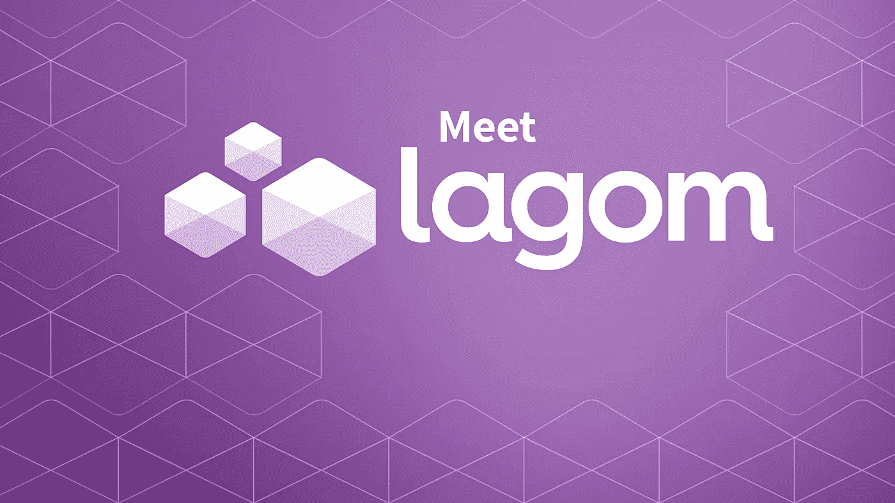

# GCP Lagom 的活动采购

> 原文：<https://medium.com/google-cloud/event-sourcing-with-lagom-on-gcp-95f94a282fbe?source=collection_archive---------1----------------------->

[Lagom](https://www.lightbend.com/lagom-framework) 是 light bend(Scala，Akka，Play more 的创造者)做的(非常)自以为是的微服务框架。Lagom 建立在 Akka 和 Play 的基础上，通过一个令人惊叹的引擎为其增压，以提供出色的性能。对于那些还不知道 Akka 或 Play 的人，我强烈建议去搜索它，并进一步了解它。我认为非常有用和可靠的两个框架。

Lagom 帮助您构建反应式系统，而不仅仅是微服务，提供开箱即用的弹性和复原力。构建反应式系统可能很难，但 Lagom 将复杂性抽象化了。Akka 和 Play 完成了繁重的工作，因此您可以专注于更简单的事件驱动编程模型，同时受益于底层的消息驱动系统。

## 活动采购

我们过去对应用程序状态建模的范式转变。通常当一些东西改变状态时，我们更新它并把它保存回数据库。在事件源中，不是存储状态，而是必须存储操纵应用程序状态的事件(显然……)。使用这个事件日志，我们可以在以后需要时重建我们的状态。在服务之间共享事件、保持一切不变以及随时改变数据模型也变得更加容易。

[如果你想进一步阅读](https://martinfowler.com/eaaDev/EventSourcing.html)，马丁·福勒有一个很好的解释。

## CQRS(命令查询责任分离)

核心概念是解耦写模型和读模型。通常我们有一个用于所有事情的模型，但是在 CQRS 我们使用两个不同的模型，一个用于插入或更新数据，另一个用于查询。对于某些情况，它可能非常有价值，而对于其他情况，它可能是总开销。以我的经验来看，当你的系统进化时，你最终会做某种 CQRS。

[马丁·福勒又一次给出了惊人的解释](https://martinfowler.com/bliki/CQRS.html)。

Lagom 推广了这两个概念，并使建立一个活动采购和 CQRS 系统变得非常简单。每个服务的核心都有对命令做出反应的实体。每个命令持续一个或多个事件，并且每个事件导致实体的状态改变。我们通常使用 HTTP 调用或某种消息队列来与这些实体进行交互并向其发送命令。要查看 Lagom 实体的运行情况:

 [## lagom/在线拍卖-scala

### 在 GitHub 上创建一个帐户，为在线拍卖-scala 开发做出贡献。

github.com](https://github.com/lagom/online-auction-scala/blob/master/item-impl/src/main/scala/com/example/auction/item/impl/ItemEntity.scala) 

但是这和 GCP 有什么关系呢？直到不久前，它与 GCP 没有任何关系，但最近实现了两个重要的里程碑。

第一个是发布了 [Lightbend Orchestration](https://developer.lightbend.com/docs/lightbend-orchestration-kubernetes/latest/index.html) ，它简化并自动化了基于 Lightbend 的系统的部署，Lagom 幸运地是其中之一。作为 GCP 的客户，你可能喜欢 Kubernetes，幸运的是，Kubernetes 是 Lightbend Orchestration 的一等公民。它包括基于 Kubernetes 的 DNS 机制的开箱即用的服务发现，Akka 集群的自动引导，它甚至生成将您的服务部署到 Kubernetes 所需的所有 YAMLs。到目前为止，我们必须手动做所有的事情，让我们说这不是在公园散步。

第二个里程碑是支持 Google Pub/Sub 作为 Lagom 服务的消息代理，而不是 Kafka(发现由我而不是 Lagom 团队编写的模块提供的支持)。Lagom 有一个惊人的消息代理 API 的抽象，所以你基本上可以通过改变你的服务继承的类从 Kafka 迁移到 Pub/Sub，或者反过来。使用消息代理的通信分离了服务，使它们相互透明，并提高了系统的弹性。

我使用 Lagom 已经半年多了，一直在处理非常复杂的问题，我对这个选择非常满意。这使得一切都更容易开发和测试。这个社区仍然很小，但是非常活跃和有帮助。

我鼓励你给 Lagom 一个机会，让我知道事情的进展，我会在这里帮助你:)