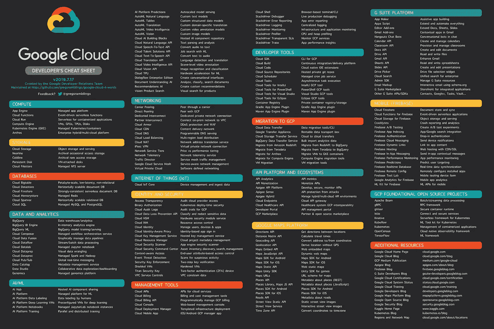

# 用不超过 4 个字描述的每一个谷歌云产品

> 原文：<https://medium.com/google-cloud/every-google-cloud-product-described-in-4-words-or-less-4d3f37f4567b?source=collection_archive---------0----------------------->

28 款新产品 Github 链接显示哪些是新产品

从[https://github.com/gregsramblings/google-cloud-4-words](https://github.com/gregsramblings/google-cloud-4-words)下载 pdf、文本和高分辨率 png 文件

‪Includes 谷歌云、Firebase、Apigee、谷歌地图平台和 g suite apis

还发推文到[https://Twitter . com/gregsramblings/status/1151881674361204738](https://twitter.com/gregsramblings/status/1151881674361204738)

查看我的博客中的其他资源—【https://gregsramblings.com 

