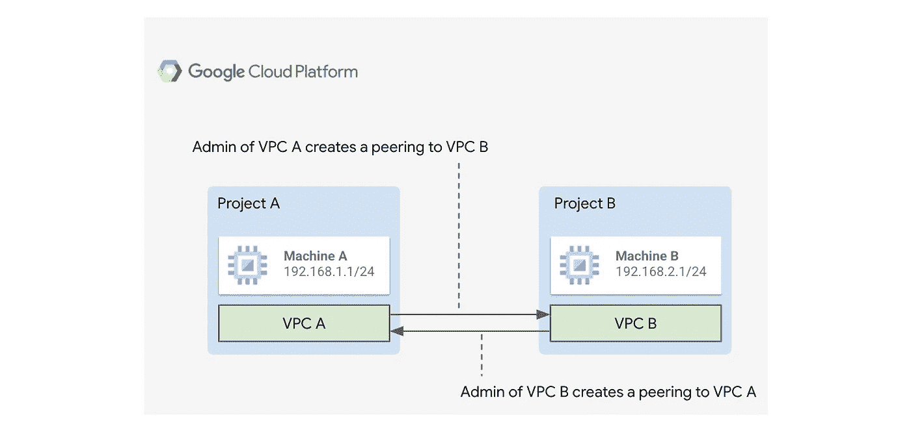
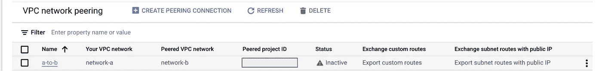
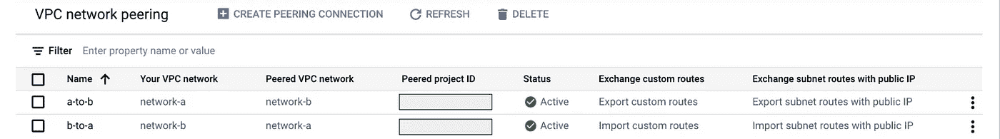
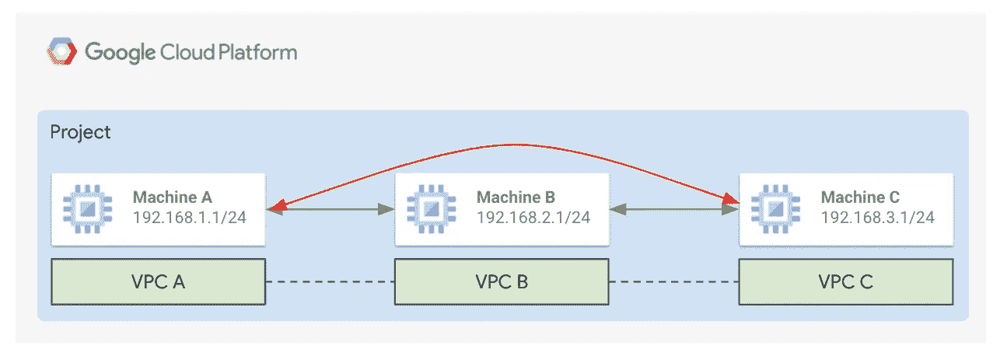
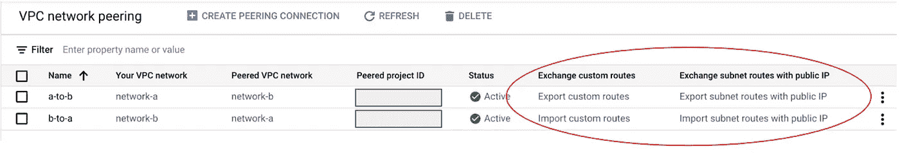
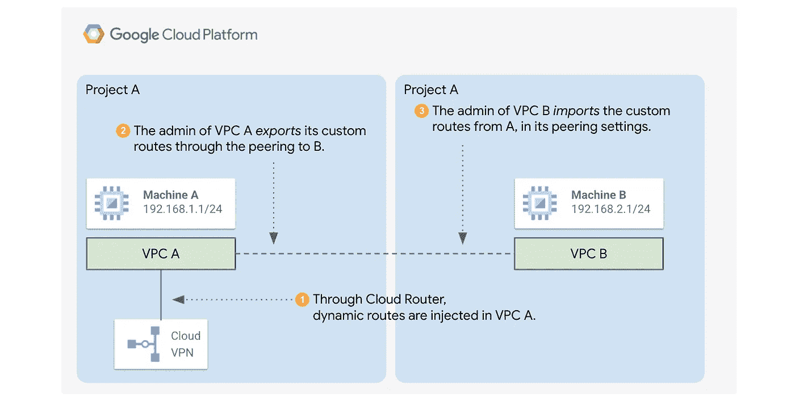
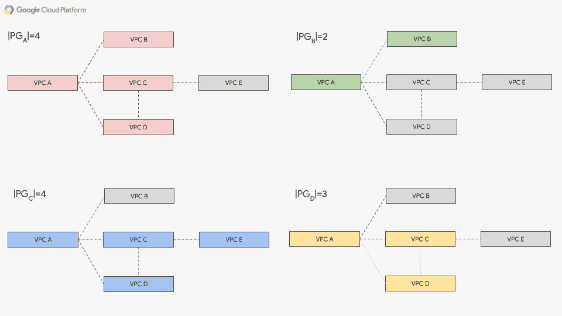

# 你一直想知道的关于 VPC 对等的一切*(但不敢问)

> 原文：<https://medium.com/google-cloud/everything-you-always-wanted-to-know-about-vpc-peering-but-were-afraid-to-ask-2b26267ba7d9?source=collection_archive---------0----------------------->

# TL:DR

这篇文章概述了 [Google Cloud VPC 网络 peering](https://cloud.google.com/vpc/docs/vpc-peering)，它们的剖析、主要误解和一些观察点，以便用户可以学习如何在设计基础设施时明智地使用它们。

# 语境

[虚拟私有云(VPC)对等](https://cloud.google.com/vpc/docs/vpc-peering)允许连接多个 [VPC 网络](https://cloud.google.com/vpc/docs/vpc)高速、低延迟且无额外成本。

鉴于它们的强大功能和易于管理，用户通常决定采用它们作为连接 GCP 网络的标准机制。

在与许多客户打交道的过程中，我总是注意到许多关于 VPC 皮灵的概念经常被误解，并可能成为混淆的根源。不幸的是，这转化为糟糕的设计决策，当项目已经开始时，需要经常修正这些决策。

本文的目标是澄清这些误解，希望能帮助用户更明智、更有意识地设计他们的网络。

让我们一起来探索 VPC 皮林的一些特点。

# 管理域

当用户在图中看到用单线表示的 VPC peering 时，他们经常会感到困惑，忽略了他们的管理跨不同的管理域的事实。

为了建立 VPC 对等网络，每个 VPC 管理员需要明确授权他们的网络连接到另一个。无论管理员是相同的还是不同的，在 VPC 对等出现之前，需要在 GCP 进行两种不同的配置。

在本例中，VPCs 托管了两个不同的项目，由两个不同的管理员拥有。在形成对等之前，它们都需要创建到另一个 VPC 的对等。

在 GCP，如果管理员只授权从一个网络到另一个网络的对等，就会出现这种情况:

对等仍然是不活动的，因为只有一个管理域授权了对等。

虽然这是健康对等的表现，但是一旦两个网络都授权了通信。

对等都是“活动的”，因为两个管理员都授权了 VPC 对等。

# Peerings 是不可传递的

让我们再举一个例子:假设我们有三个 VPCs、B 和 C。

虽然 VPCs 直接对等中的主机可以通信，但对于连接到 A 和 c 的主机来说，情况并非如此。

三个 VPC 是对等的。机器 A 可以与 B 通信，B 可以与 C 通信。无论如何，如果 A 和 C 之间没有额外的 VPC 对等点，A 就不能与 C 通信

我们经常看到这样的用例:

*   *轴辐式拓扑*:不可能让不同的辐条通过集线器通信，除非在辐条之间创建 VPC 对等点(或者集线器中的网络设备协调辐条之间的通信)
*   *Google 托管服务:*许多 Google 托管服务利用 peerings 将 Google 托管 VPC(托管服务运行的地方)连接到用户的 VPC。需要例子？GKE 私有集群、云 SQL、NetApp CVS 卷是众多卷中最受欢迎的。如果用户 VPC 也与其他 VPC 对等，需要从哪些主机访问托管服务呢？

“好吧，有什么问题吗？再多加几个 peerings 吧！”…不尽然！

以下是一些重要的注意事项:

*   用户不能配置谷歌管理的虚拟专用计算机，所以你*不能*创建——例如——额外的 peerings 到其他虚拟专用计算机。
*   最重要的是，**VPC 喷丸数量有限**！我们将在接下来的段落中详细讨论这一点。

重要的是要明白，随着限制而来的还有选择，这可以帮助我们避免或绕开可能的问题。这些是我经常提议的:

*   尽量减少 VPC 的数量(VPC 贵族也是如此！).
*   评估 VPC 之间使用[托管 HA VPNs 的对等替换。](https://cloud.google.com/network-connectivity/docs/vpn/how-to/creating-ha-vpn2)
*   添加网络设备或[代理](/google-cloud/accessing-gke-private-clusters-through-iap-14fedad694f8)，以便中断并重新启动连接，这样我们就可以一次跳过多个 peerings。
*   考虑将[私有服务连接(PSC)](https://cloud.google.com/vpc/docs/private-service-connect) 用于内部负载平衡器(ilb)，以便[为您的服务](https://cloud.google.com/vpc/docs/configure-private-service-connect-producer)发布私有端点，这些端点可以[从其他 VPC](https://cloud.google.com/vpc/docs/configure-private-service-connect-services)使用，而不需要任何额外的 VPC 网络对等。

这里真的没有好与坏的答案。运用你的良好判断力来构建符合你需求的解决方案。

# 不是所有的东西都要经过剥皮

值得注意的是，并不是所有的信息都包含在 peerings 中。其中，最相关的是:

*   [*GCE 内部 DNS 名称*](https://cloud.google.com/compute/docs/internal-dns) ，不能被对等 VPC 引用。
*   [*防火墙标签和服务帐户*](https://cloud.google.com/vpc/docs/firewalls) ，不能从另一个对等 VPC 中创建的防火墙规则中引用。
*   [云 DNS](https://cloud.google.com/dns/?utm_source=google&utm_medium=cpc&utm_campaign=emea-it-all-en-dr-skws-all-all-trial-e-gcp-1010042&utm_content=text-ad-none-any-DEV_c-CRE_167391992105-ADGP_Hybrid%20%7C%20SKWS%20-%20EXA%20%7C%20Txt%20~%20Networking%20~%20Cloud%20DNS%23v1-KWID_43700067133808111-kwd-19757490240-userloc_1008736&utm_term=KW_cloud%20dns-NET_g-PLAC_&gclid=CjwKCAjwiY6MBhBqEiwARFSCPr_iy5lW0KD-fYAFQeJyv6DRKE120_2kJOfK-GEd8j8JLaxP2gypvxoC3FIQAvD_BwE&gclsrc=aw.ds) 区域和记录:云 DNS 中定义的记录解析不是通过 peerings，而是通过 Google API 调用。要允许跨 VPC 云 DNS 主机名解析，请使用 [DNS 对等](https://cloud.google.com/dns/docs/overview#dns-peering)来代替。
*   下一跳是默认 Internet 网关的路由。
*   使用网络标签自定义静态路由。
*   防火墙规则从不通过对等交换。
*   一个 VPC 网络中的入口防火墙无法通过来自另一个 VPC 网络的源标记或源服务帐户来识别源
*   [私有服务连接(PSC)端点](https://cloud.google.com/vpc/docs/private-service-connect)，不能被其他对等 VPC 使用(…这有意义吗？)

# 导入和导出路线

对等 VPC 总是自动交换它们的私有 IP 地址子网路由。

此外，您可以配置对等 VPC 来交换其他路由:

*   交换与包含[私用公共 IP](https://cloud.google.com/vpc/docs/vpc-peering#importing-exporting-routes)的子网相关的路由。
*   交换自定义路由，例如自定义静态路由，或通过 BGP 从云 VPN 或云互连获知的自定义动态路由。

在这两种情况下，对等配置都提供了专用选项，允许从另一个 VPC 导出和/或导入路由。

以下是取自 GCP 控制台的一个示例:

对于这两个网络，peerings 已被设置为导入和导出，它们的自定义路由和子网都包括 PUPI 地址。

根据用户的需求，配置可能会有所不同。至少，一个 VPC 对等体需要允许路由的导出，而另一个对等体需要授权它们的导入。

让我们看一个与动态路由相关的图形示例:

通过对等设置，动态(自定义)路由从 VPC A 导出到 VPC B，并从 VPC B 导入到 VPC A

VPC A 的管理员希望与 VPC B 共享从云 VPN(通过云路由器)获取的自定义(动态)路由。为此，VPA A 的管理员导出自定义路由，编辑其对等关系(从 A 到 B)。为了完成这个过程，VPC B 的管理员导入自定义路由(从 B 到 A)。

# 对等组限制和可扩展性

这是最常见的误解，但是在介绍了基本的 VPC 对等概念之后，不得不提出来。

让我们开始熟悉一个新术语:一个 **P *工程组* (PG)是一组通过*直接* VPC 对等连接的 VPC 网络。**

值得注意的是

*   这个概念(以及相关的元素基数)对于每个 VPC 是特定的*:换句话说，每个 VPC 为每个对等组限制计算自己的使用量。*
*   我们谈论的是*直接*剥皮。鉴于 peerings 是不可传递的，我们考虑的是与 VPC 直接相连的网络。

让我们看一个例子:

同一组互连 VPC 的不同对等组及其基数。

该图显示了通过 VPC 皮林连接的不同 VPC。对于每个 VPC，我们看到一个特定的对等组，用不同的颜色表示，以及一个关联的基数。

上图中有 *5 个 VPC*，所以 *5 个对等组*。

那么，为什么对等组对我们如此重要？

因为 [**一个对等组内不同 GCP 元素的数量是有限的**](https://cloud.google.com/vpc/docs/quota#vpc-peering) **。**

这包括:

*   VPC·皮灵斯(在写这篇文章的时候，已经 25 岁了)
*   GCE 实例
*   子网和别名范围
*   ILBs 转发规则
*   静态和动态路由

用于计算这些限制的算法在[官方谷歌云文档](https://cloud.google.com/vpc/docs/quota#vpc-peering-effective-limit)中公开。

虽然这些数字中有许多看起来很高，但如果网络设计不当，VPC peering 使用不当，它们很快就会受到攻击。

[这些是软限制，可以通过向谷歌销售和云支持](https://cloud.google.com/vpc/docs/quota#vpc-peering)请求**例外**增加。重要的是要记住，增长是*而不是* *保证*的，而且通常情况下，一个数字的增长可能会导致其他数字的下降，因为这些对象在底层的 Google SDN 基础设施中是如何映射在一起的。

# 结束语

VPC peering 是非常有用和强大的，但用户应该明智地使用它们，以避免奇怪的惊喜。设计基础设施时:

*   尝试**最小化 VPC 喷丸次数**
*   **预见你未来的需求**。您需要连接到托管服务吗？你需要允许你的辐条之间直接沟通吗？削皮不一定是你的正确解决方案。使用 [PSC](https://cloud.google.com/vpc/docs/private-service-connect) 、[代理](/google-cloud/accessing-gke-private-clusters-through-iap-14fedad694f8)或[托管 VPN](https://cloud.google.com/network-connectivity/docs/vpn/how-to/creating-ha-vpn2)进行评估。
*   **关注您的需求和机制，使您的网络规模更大；限制更少。**限额是一个不断变化的目标，如果有充分的理由，可以根据要求例外提高限额。你不应该设计你的网络，把你的决定(主要)建立在限制之上。从您的需求出发，努力使您的网络设计更具可扩展性。如果你做得很好，你几乎肯定不会触及谷歌的网络限制。
*   **控制人数**。在设计过程中，请记住考虑每个对等组的多个维度:这包括 VPC 对等组(也包括 Google 管理的对等组)、虚拟机数量、转发规则等等！
*   **不要把本文中的数字当成给定的**。请定期查看官方文档，并联系销售人员和 Google Cloud 支持人员，以了解更多有关最新更新的信息。数字随着基础设施不断发展。

虽然这些信息包含在官方文档中，但我花了相当多的时间将不同的信息整合在一起，并获得足够的经验来撰写本文。希望这篇文章是有用的，这样你就不会犯我们经常看到的同样的错误！

*感谢*[*Simone Ruffilli*](https://medium.com/u/2288812ff80e?source=post_page-----2b26267ba7d9--------------------------------)*和*[*Gerritd*](https://medium.com/u/c71319e9f3c4?source=post_page-----2b26267ba7d9--------------------------------)*的支持和真知灼见。*