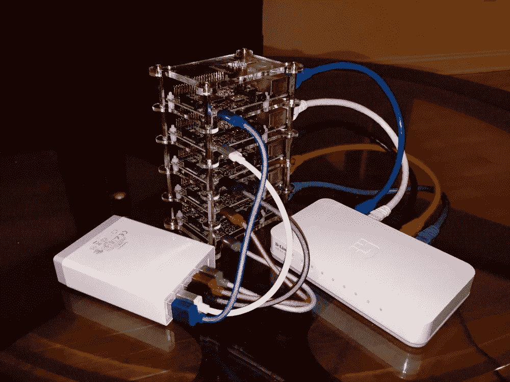
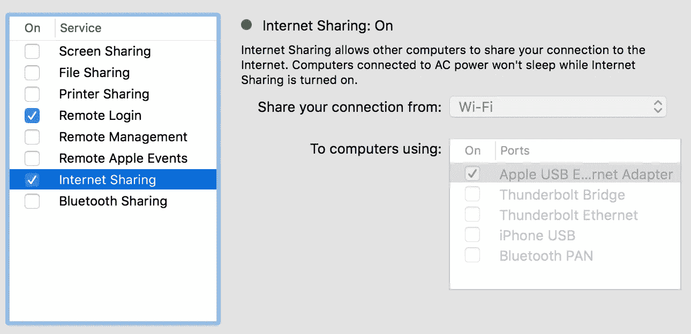
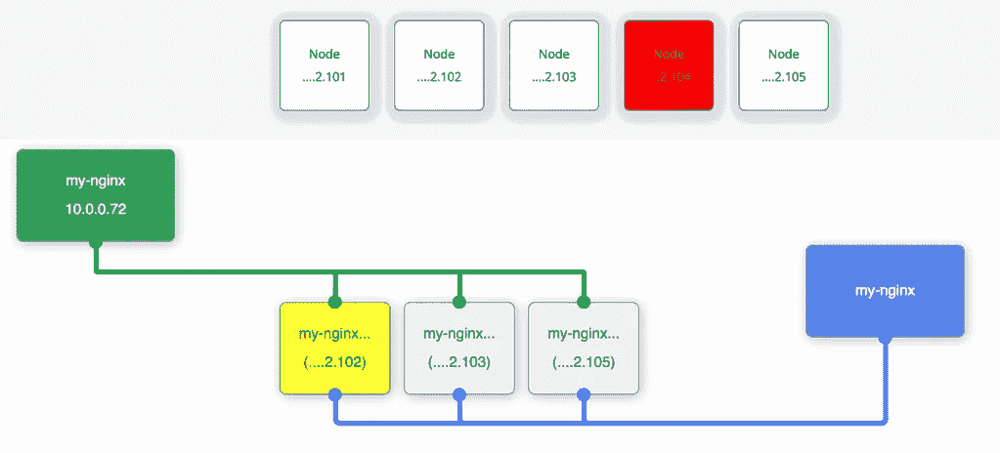

# 关于 Kubernetes Raspberry Pi 集群您需要知道的一切

> 原文：<https://medium.com/google-cloud/everything-you-need-to-know-about-the-kubernetes-raspberry-pi-cluster-2a2413bfa0fa?source=collection_archive---------0----------------------->

*最近更新时间:2017 年 1 月 12 日*

你可能[听说过或见过 Kubernetes 树莓派集群](/google-cloud/kubernetes-raspberry-pi-cluster-the-story-ace773cf8573#.uuj0tg1jj)。在这篇文章中，我分享了我自己建造并现场演示时学到的一切。


Kubernetes 树莓 Pi cluster 由来自 Quintor 的 [Arjen Wassink](https://twitter.com/ArjenWassink) 制作

## 五金器具

你可以在 [Arjen Wassink](https://twitter.com/ArjenWassink) 的 [Kubernetes Raspberry Pi 集群购物清单](http://blog.kubernetes.io/2015/11/creating-a-Raspberry-Pi-cluster-running-Kubernetes-the-shopping-list-Part-1.html)中找到你需要的所有零件。

我强烈推荐 Arjen 的购物清单中列出的 ModMyPi stack case，因为尺寸与网络开关和 USB 电源集线器完美契合。我点的是 [GeauxRobot 树莓 Pi 2 B 4 层狗骨堆](http://www.amazon.com/gp/product/B00MYFAAPO)因为有一天发货。然而，维度太小，我的集群看起来不太好:(



我的 Kubernetes 覆盆子酱——看起来远不如 Quintor 的好

如果你有 3D 打印机，你也可以打印一个定制的堆栈案例！ [Pance Cavkovski](https://twitter.com/hsilomedus) [在 Twitter](https://twitter.com/hsilomedus/status/693828254986272769) 和 Thingiverse 上分享了他的 3D 设计:

[](http://www.thingiverse.com/thing:1307094) [## RaspberryPi Kubernetes stack by hsilomedus

### 层板和带有 kubernetes 标志的顶部，用于创建 RaspberryPi 2 堆栈。你需要一套漂亮的 2.5 毫米的…

www.thingiverse.com](http://www.thingiverse.com/thing:1307094) 

最后，我还建议使用 2 英尺的电缆，而不是 1 英尺的电缆，以便于访问。

## 软件

Arjen 发布了 [Kubernetes Raspberry Pi 安装说明](http://blog.kubernetes.io/2015/12/creating-raspberry-pi-cluster-running.html)——它很容易安装，并且在一个单独的包中。

最近开始用 [kubernetes-on-arm](http://github.com/luxas/kubernetes-on-arm) 项目。它带有预构建的 Kubernetes 图像，但也允许您构建最新的 Kubernetes 版本。

还有很多其他的详细资源，比如[使用 ArchLinux 和 Kubernetes 的详细说明](http://www.jinkit.com/k8s-on-rpi/)、[如何为树莓 Pi 从零开始编译 Kubernetes](https://kurtstam.github.io/2015/12/04/How-to-Compile-Kubernetes-for-Raspberry-Pi-ARM.html)，以及[用树莓 Pi 与 Kubernetes 进行集群计算](https://opensource.com/life/16/2/build-a-kubernetes-cloud-with-raspberry-pi)。

## 建立工作关系网

有许多策略可以将您的集群连接到互联网。我选择了最简单的设置，通过我的 MacBook 笔记本电脑路由所有流量。

在 OS X，您可以启用互联网共享；选择**系统偏好** > **共享**并选择**互联网共享**选项。您应该使用 Apple USB 以太网适配器来共享从 Wi-Fi 到电脑的连接。



然而，我需要为每个 Raspberry Pi 分配一个静态 IP 地址(尤其是运行 Kubernetes master 的那个)。我花了几个小时试图解决这个问题。为了节省你的时间，这是使用 OS X 的技巧！

1.  获取每个 Raspberry Pi 的以太网网卡 MAC 地址
2.  在 OS X，创建一个名为/etc/bootptab 的文件
3.  对于每个 MAC 地址，添加以下内容

```
# Bootptab file
# Section 1 — ignored
%%
# Section 2 — used
# Hardware types: 1=Ethernet, 6=Wireless
# See [http://www.ietf.org/rfc/rfc1700.txt](http://www.ietf.org/rfc/rfc1700.txt)
# hostname hwtype hwaddr ipaddr bootfile
rpi1 1 b8:27:eb:5b:0d:0f 192.168.2.101 boot
rpi2 1 b8:27:eb:a1:5f:5a 192.168.2.102 boot
.
.
.
rpiN 1 xx:xx:xx:xx:xx:xx 192.168.2.10x boot
```

如果您的 Raspberry Pi 在过去已经收到了 DHCP 分配的 IP 地址，您将需要强制释放并刷新新的 IP 地址。在 Raspberry Pi 中，运行:

```
$ sudo dhclient -r
```

## 出于演示目的，缩短故障检测周期

在 Kubernetes 中，[控制器管理器](http://kubernetes.io/v1.1/docs/admin/kube-controller-manager.html)组件将定期检查节点健康状况，然后在超时后驱逐不健康节点上的 pod。有几个命令行参数您应该知道:

```
**--node-monitor-grace-period=40s**: Amount of time which we allow running Node to be unresponsive before marking it unhealty. Must be N times more than kubelet's nodeStatusUpdateFrequency, where N means number of retries allowed for kubelet to post node status.
**--node-monitor-period=5s**: The period for syncing NodeStatus in NodeController.
**--pod-eviction-timeout=5m0s**: The grace period for deleting pods on failed nodes.
```

为了在现场演示中演示 Kubernetes 如何处理节点故障，我不想等 40 秒后再将节点标记为不健康，也不想等 5 分钟后才看到 pod 被重新调度。因此，在 Raspberry Pi 上安装 Kubernetes 之后，我需要更新控制器管理器启动命令行参数。

如果您使用的是 kubernetes-on-arm，那么您可以在主节点上更新**/etc/kubernetes/static-pods/master/master . JSON**。找到**控制器-管理器**的容器配置，更新**命令**属性:

```
{
  “name”: “controller-manager”,
  “image”: “kubernetesonarm/hyperkube”,
  “command”: [ “/hyperkube”, “controller-manager”,
    “--master=127.0.0.1:8080”,
    “--v=2”,
 **“--node-monitor-grace-period=10s”,
    “--pod-eviction-timeout=5s”,**
    “--service-account-private-key-file=...",
    “--root-ca-file=...” ],
  “volumeMounts”:[...]
}
```

## 基础图像

大多数现有的容器映像都是为 x86 体系结构构建的。您需要在 Raspberry Pi 上运行 ARM 二进制文件/映像。幸运的是， [Hypriot](http://blog.hypriot.com/) 创建了[几个兼容 Raspberry Pi 的 Docker 基础映像](https://hub.docker.com/u/hypriot/)，你可以用它们来运行用 Java、Go、Node、Ruby 等语言编写的应用程序。他们也有 MySQL 和 Redis 图片。通过搜索包含“ [rpi-](https://hub.docker.com/search/?isAutomated=0&isOfficial=0&page=1&pullCount=0&q=rpi-&starCount=0) ”的图像名称，您可以找到许多其他兼容 Raspberry Pi 的图像。

## 形象化

我相信在复杂过程的现场演示中，可视化是非常重要的。为了帮助可视化 Kubernete 的故障检测和 pod 重新调度，我使用了最初由 Brendan Burns 开发的 Kubernete 可视化工具的版本[。](https://github.com/saturnism/gcp-live-k8s-visualizer)



visualizer 代码及其使用方法在我的 GitHub 上:

[](https://github.com/saturnism/gcp-live-k8s-visualizer) [## Saturn ism/GCP-live-k8s-可视化工具

### GCP-Live-k8s-visualizer——GCP 实时容器引擎演示中使用的 Kubernetes 可视化工具的源代码

github.com](https://github.com/saturnism/gcp-live-k8s-visualizer) 

最后但并非最不重要的一点是，从所有节点预拉所有图像以进行响应演示。

## 巨大的资源

有很多人在使用树莓 Pi Kubernetes 集群。许多人分享了他们正在从事的工作，包括:

*   [使用可翻译剧本](https://github.com/rhuss/ansible-kubernetes-pi3)
*   [奔跑的麋鹿群](http://larmog.github.io/2016/03/13/elk-cluster-on-kubernetes-on-arm---part-1/)
*   [运行 GlusterFS](http://larmog.github.io/2016/02/22/glusterfs-on-kubernetes-arm/)
*   [这份遗漏的故障排除指南](http://a.frtzlr.com/kubernetes-on-raspberry-pi-3-the-missing-troubleshooting-guide/)(你不想错过的调谐参数！2016 年 8 月 25 日添加)
*   [kube cloud](http://kubecloud.io/what-is-kubecloud/)(2016 年 8 月 25 日添加的“一个小规模、有形的云计算环境…用于教学和研究目的”)
*   [Sloop](https://github.com/kodbasen/sloop/) (貌似最简单的安装 Kubernetes 1.3+的方法，我还没机会尝试。添加于 2016 年 8 月 26 日)
*   [使用 Kubeadmn 和 Weave](http://larmog.github.io/2016/10/28/installing-kubernetes-on-arm-with-kubeadm/) (这是我迄今为止见过的最简单的方法之一。2017 年 1 月 12 日补充)
*   [Hypriot 官方使用 kubeadmn 和法兰绒的方式](http://blog.hypriot.com/post/setup-kubernetes-raspberry-pi-cluster/)(可能是最全面的指南，2017 年 1 月 12 日补充)

## 下一步是什么？

扩展无状态工作负载很容易。但是，如何使用持久数据来调度工作负载呢？在这个博客系列的下一部分，我将向您展示我如何与 LVM 和 NFS 共享一个 250GB 的 SSD 作为 Kubernetes 持久卷。

最后但同样重要的是，您也可以在云中运行 Kubernetes！运行 Kubernetes 集群最简单的方法之一是使用[谷歌容器引擎](https://cloud.google.com/container-engine/)。试试看！