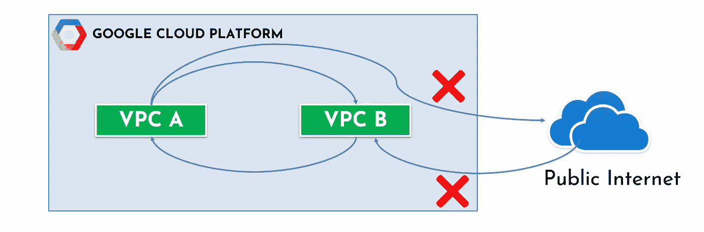
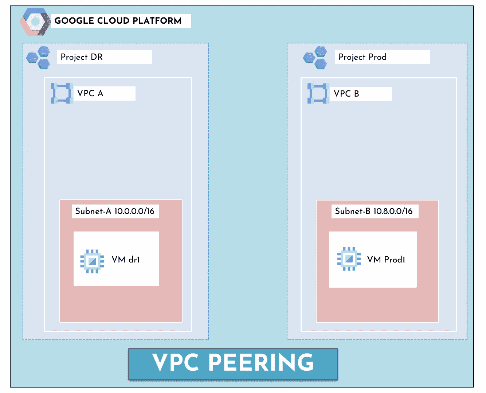
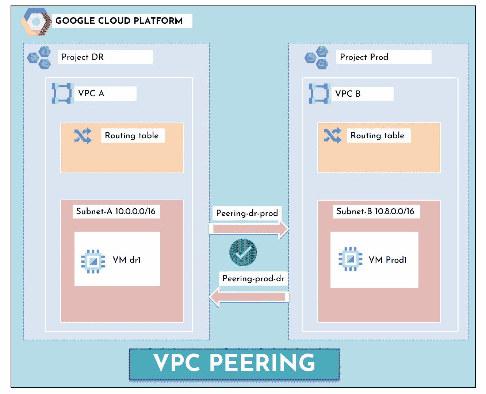
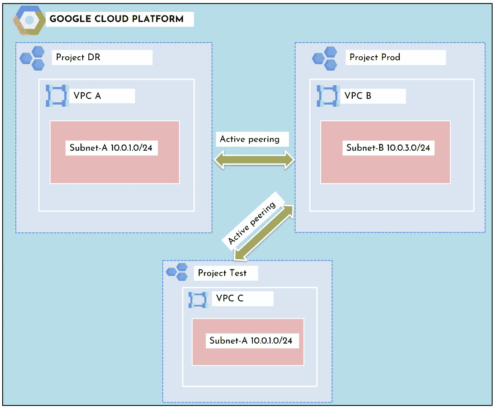

# 你应该知道的关于 VPC 在 GCP 窥视的一切！

> 原文：<https://medium.com/google-cloud/everything-you-should-know-about-vpc-peering-in-gcp-9d7ae5dff81d?source=collection_archive---------0----------------------->

如果你与任何云提供商合作过，你可能会经常听说 *VPC 对等*这个术语，你一定想知道，VPC 对等到底是什么！**🤷‍♂️**

谷歌云 VPC 网络对等允许两个 VPC 网络之间的内部 IP 地址连接。这些 VPC 网络可能来自同一项目或组织，也可能来自不同的项目或组织。

什么是 VPC 对等

> 流量留在谷歌主干网内，不通过互联网传输。

**与使用外部 IP 地址或 VPN 连接网络相比，VPC 网络对等技术有几个优势:**

*   使用内部 IP 地址的连接比使用外部 IP 地址的连接延迟更低，因为对等连接之间没有跳或设备。
*   服务不需要向公共互联网公开，也不需要处理相关的风险。
*   通过使用内部 IPs，您可以节省外出通信成本。因此，它比外部 IP 连接更便宜。

**🤷‍♂️如何在两个 VPC 之间创建 VPC 对等:**

假设一个组织需要在 project-DR 中的网络 a 和 project-prod 中的网络 b 之间建立 VPC 网络对等。为了成功建立 VPC 网络对等，网络 a 和网络 b 的管理员必须分别配置对等关联。

**先决条件设置:**

*   VPC A 有一个 CIDR 范围为 **10.0.0.0/16** 的子网
*   VPC B 也有一个 CIDR 范围为 **10.8.0.0/16** 的子网
*   每个子网都有一个 Google Compute 实例，您可能希望通过它们的私有 IP 地址来连接它。

VPC 对等的先决条件

**按照以下步骤创建对等连接:**

1.  从 VPC A，您创建一个连接，并输入您想与之对等的项目和网络，即项目生产中的 VPC-B。

2.您单击(启用)导入和导出自定义路由并创建对等连接。此连接将从灾难恢复→生产创建。

> 此时，对等状态保持不活动，因为在项目 b 的网络 b 中没有匹配的配置。

3)project-prod 中的网络管理员或具有适当 IAM 权限的用户必须从 prod →dr 配置匹配的配置，以便对等在两端都处于活动状态。

4.您按照 VPC 网络 B 中的相同步骤创建从生产→灾难恢复的连接

5.一旦对等进入活动状态，子网路由和自定义路由就会交换，两个网络中的虚拟机就可以通过各自的私有 IP 相互通信。

GCP 的 VPC 对等网络设置

**传递性对等不是 GCP 中的❌supported，我们来看看到底什么是传递性对等。**

我们有三个 VPC 网络，VPC A，VPC B 和 VPC C

如果 VPC A 与 VPC B 对等，VPC B 与 VPC C 对等，这并不意味着 VPC A 自动与 VPC C 对等。这称为可传递对等，但不受支持。

VPC 的传递对等

需要记住的几个要点🎯对于 GCP 的 VPC 对等:

*   不允许子网 CIDR 范围重叠。
*   不支持可传递对等。
*   一个 VPC 网络最多只能有 25 个连接。
*   要删除 VPC 网络，您必须首先删除网络中的所有对等配置。
*   要在 GCP 创建/删除 VPC 对等，您至少应该拥有 roles/editor 或 roles/compute.networkAdmin IAM 角色。
*   VPC 网络对等与计算引擎、GKE 和应用引擎灵活环境一起工作。

**观看下面的视频了解更多关于 VPC 窥视的细节**

喜欢这个视频吗？随意鼓掌跟我来！

此外，您可以订阅我的 YouTube 频道，了解令人惊叹的 DevOps 和云内容！

参考资料:

 [## VPC 网络对等|谷歌云

### 谷歌云 VPC 网络对等允许跨两个虚拟专用云(VPC)的内部 IP 地址连接…

cloud.google.com](https://cloud.google.com/vpc/docs/vpc-peering)