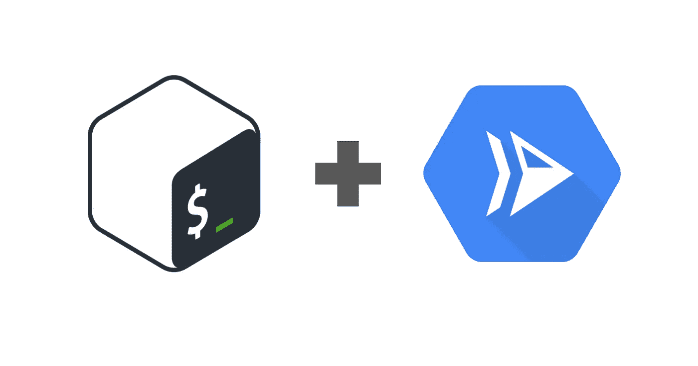

# 在 Google Cloud 中使用 webhook 执行 bash 脚本

> 原文：<https://medium.com/google-cloud/executing-bash-scripts-with-a-webhook-in-google-cloud-75ea4b173c9?source=collection_archive---------0----------------------->



我最近在 GCP 遇到了一个关于自动化的有趣问题:*我怎样才能触发一个 webhook 的 bash 脚本？*这似乎是一个常见的自动化挑战，但解决方案并不十分明显。

当您有一个更复杂的带有某些二进制依赖的 bash 脚本时，这变得特别棘手。这个问题的一个很好的例子是运行一个脚本来扫描你的谷歌云组织的公共可用功能，这是一个挑战，[托马斯·卢布](http://www.medium.com/@truble)在他的[媒体文章](/@truble/scan-your-google-cloud-projects-for-open-cloud-functions-531a57304ade)中解决了这个问题。这是一篇有趣的文章，如果你还没有看过的话，就来看看吧！

***注*** *:这个 bash 脚本出自 Thomas Ruble 的* [*中文章*](/@truble/scan-your-google-cloud-projects-for-open-cloud-functions-531a57304ade) *关于扫描公有云函数*。

现在，如果我想采用 Thomas 的脚本化解决方案，并使用 webhook 触发它的执行，会怎么样呢？本质上，端到端解决方案能够发送一个 HTTP 请求，在有效负载中包含必要的脚本参数，执行脚本，并在 json 响应中返回结果。这将为更多自动化、服务到服务集成和管道创建打开大门。

现在我们更好地理解了我们要解决的挑战，让我们开始吧！

## 我们可以在云函数中运行 bash 脚本吗？

乍一看，[**Google Cloud Functions**](https://cloud.google.com/functions)似乎非常适合这个用例。如果你不熟悉的话，Google Cloud Functions 是一个轻量级的、**无服务器**平台，用于**事件驱动的**功能，具有完全管理的运行时环境，你的代码在其中执行。我们可以设置一个云函数来响应 HTTP 触发器来运行我们的代码。目前，云功能支持以下运行时:

*   节点. js
*   计算机编程语言
*   去

看起来我们可以把我们的脚本交给一个云函数，我们会做得很好，但是正如你所看到的, **bash** 不是一个可用的运行时环境。下一个合乎逻辑的步骤似乎是在云函数中打开一个子进程，以便执行我们的 bash 命令。尽管这种方法可行，但缺点是运行时环境中可用的[系统包受到设计的限制，因此我们无法使用定制的二进制文件执行任何 bash 命令。](https://cloud.google.com/functions/docs/reference/python-system-packages)

## 云构建呢？

[**谷歌云构建**](https://cloud.google.com/cloud-build) 是在谷歌基础设施上执行的持续构建、测试和部署服务。使用云构建，您可以定义*定制构建步骤*来执行您的构建，每个步骤都发生在 docker 容器中。通过编写您自己的构建步骤，您可以将您的依赖项打包到一个容器中，并运行您的 shell 脚本。云构建文档中有一个[用例](https://cloud.google.com/cloud-build/docs/create-custom-build-steps#example_executing_a_shell_script_from_your_source)的好例子。

但是网钩呢？尽管可以通过调用云构建 API 来调用云构建管道，但这并不适合我们的用例。云构建对于运行一次性脚本来说是笨拙的，因为它的语义与源代码和工件生产联系在一起。此外，使用 API 调用将*参数*传递给我们的 bash 脚本并不好。在任何情况下，云构建都不是我们问题的最佳答案。这就是云运行的用武之地！

## 云运行

谷歌的 [**云运行**](https://cloud.google.com/run) 服务是谷歌云的**无服务器**产品中的另一个，也是最适合我们挑战的解决方案。Cloud Run 是一个完全托管计算平台，它运行支持 HTTP 的无状态容器。只需为您的容器提供云运行，云运行将在端口 8080 上侦听请求或事件。阅读[云运行文档](https://cloud.google.com/run/docs)中的云运行概念和教程。

# 云运行中的 Bash 脚本

## 创建 web 服务器来侦听 HTTP 请求

我们的第一步是设置一个简单的 web 服务器来监听我们在端口 8080 上接收到的 HTTP 请求。由于我们的应用程序将被容器化，我们可以用我们最喜欢的语言编写我们的服务器。在这个例子中，我选择使用 [Flask](https://flask.palletsprojects.com/en/1.1.x/) 创建一个轻量级 Python 服务器。使用 Flask，我们可以为应用程序创建一个路由来处理 HTTP POST 方法。

接下来，我们可以在刚刚创建的方法中添加逻辑来解析和清理 bash 脚本所需的任何参数的请求体。我们可以使用 os.environ 将这些参数设置为容器环境变量，然后 bash 脚本可以使用这些变量。

***注意****:Flask 服务器必须监听* [*容器契约*](https://cloud.google.com/run/docs/reference/container-contract) *指定的端口环境变量。*

## 应用程序的容器化和部署

现在我们已经编写了执行 bash 脚本的 web 服务器，下一步是将应用程序容器化。请记住，Cloud Run 管理无状态容器，所以我们需要创建一个 docker 文件，其中包含如何构建容器的说明。在这里，我们可以将所需的二进制文件包含在容器映像中，以便 bash 脚本可以使用它。因为 Cloud Run 接受容器映像作为部署单元，所以我们可以向映像添加任何可执行文件或系统库，并在我们的应用程序中使用它。换句话说，我们可以打包 bash 脚本的所有依赖项，并将其发送到 Cloud Run——在这种情况下，我们将在环境中包含 Google Cloud SDK。

既然我们已经容器化了我们的应用程序，我们可以构建我们的容器，将其推送到 GCR，并将其部署到 Cloud Run。我们还将配置服务以防止未经身份验证的访问，这样我们就可以使用 [IAM 策略](https://cloud.google.com/run/docs/securing/managing-access)来控制谁有权调用服务。这两个 gcloud 命令将为我们完成这些步骤:

```
gcloud builds submit --tag gcr.io/**$PROJECT_ID**/**$IMAGE**
gcloud run deploy --image gcr.io/**$PROJECT_ID**/**$IMAGE** --platform managed --no-allow-unauthenticated --region us-central1 **${SERVICE_NAME}**
```

差不多结束了！我们现在已经成功地设置了一个 webhook 来执行我们的函数扫描器。