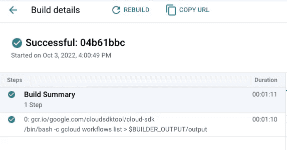
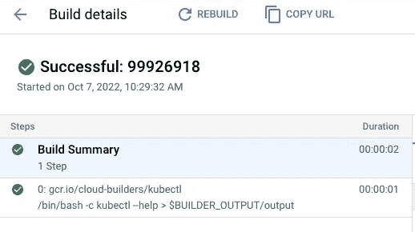

# 从工作流执行命令(gcloud、kubectl)

> 原文：<https://medium.com/google-cloud/executing-commands-gcloud-kubectl-from-workflows-ad6b85eaf39c?source=collection_archive---------2----------------------->

在之前的[帖子](https://cloud.google.com/blog/topics/developers-practitioners/introducing-new-connectors-workflows)中，我展示了如何使用工作流和计算引擎连接器管理虚拟机的生命周期。当您试图管理的资源有一个连接器时，这种方法非常有效。当没有连接器时，您可以尝试使用来自工作流的资源的 API，如果有的话。或者，你也可以使用我最喜欢的命令行工具来管理资源:`gcloud`。或者，如果您正在管理一个 Kubernetes 集群，也许您想调用`kubectl`来代替。

此时，你可能会问:**如何从工作流中执行一个命令行工具，比如** `**gcloud**` **或者** `**kubectl**` **？**

你的直觉是对的。从工作流中没有直接调用`gcloud`或`kubectl`的方法。然而，Cloud Build 提供了一些包含了`gcloud`和`kubectl`的容器映像。您可以从云构建步骤中运行这些容器中的`gcloud`和`kubectl`命令。您还可以使用云构建连接器从工作流步骤创建云构建步骤。

你明白我的意思了吗？我们来看看细节。

# 为 gcloud 创建工作流程

让我们首先创建一个工作流来运行`gcloud`命令，例如`gcloud workflows list`。

下面是一个带有`execute_command`步骤的[工作流-gcloud.yaml](https://github.com/GoogleCloudPlatform/workflows-demos/blob/master/workflows-executes-commands/workflow-gcloud.yaml) 文件:

```
main:
  steps:
  - execute_command:
      call: gcloud
      args:
          args: "workflows list"
      result: result
  - return_result:
      return: ${result}
```

`execute_command`步骤调用一个名为`gcloud`的子工作流，使用您想要运行的命令`workflows list`作为参数。子工作流定义如下:

```
gcloud:
  params: [args]
  steps:
  - create_build:
      call: googleapis.cloudbuild.v1.projects.builds.create
      args:
        projectId: ${sys.get_env("GOOGLE_CLOUD_PROJECT_ID")}
        parent: ${"projects/" + sys.get_env("GOOGLE_CLOUD_PROJECT_ID") + "/locations/global"}
        body:
          serviceAccount: ${sys.get_env("GOOGLE_CLOUD_SERVICE_ACCOUNT_NAME")}
          options:
            logging: CLOUD_LOGGING_ONLY
          steps:
          - name: gcr.io/google.com/cloudsdktool/cloud-sdk
            entrypoint: /bin/bash
            args: ${["-c", "gcloud " + args + " > $$BUILDER_OUTPUT/output"]}
      result: result_builds_create
  - return_gcloud_result:
      return: ${text.split(text.decode(base64.decode(result_builds_create.metadata.build.results.buildStepOutputs[0])), "\n")}
```

子工作流使用云构建连接器通过一个步骤创建一个构建。在该步骤中，您使用`gcr.io/google.com/cloudsdktool/cloud-sdk`图像运行带有所提供参数的`gcloud`命令。您还可以捕获输出，这是一个 base64 编码的多行字符串。在最后一步中，您将访问输出，对其进行解码，并通过新行进行分割以返回一个行数组。

我们基本上是在云构建的帮助下调用`gcloud`命令，捕获输出并将输出作为多行数组返回！

# 为 kubectl 创建工作流

让我们看看如何用`kubectl`命令做同样的事情。

这里有一个[工作流-kubectl.yaml](https://github.com/GoogleCloudPlatform/workflows-demos/blob/master/workflows-executes-commands/workflow-kubectl.yaml) 文件，它通过调用`execute_command`子工作流来执行`kubectl --help`命令:

```
main:
  steps:
  - execute_command:
      call: kubectl
      args:
          args: "--help"
      result: result
  - return_result:
      return: ${result}
```

`kubectl`子工作流定义如下:

```
kubectl:
  params: [args]
  steps:
  - create_build:
      call: googleapis.cloudbuild.v1.projects.builds.create
      args:
        projectId: ${sys.get_env("GOOGLE_CLOUD_PROJECT_ID")}
        parent: ${"projects/" + sys.get_env("GOOGLE_CLOUD_PROJECT_ID") + "/locations/global"}
        body:
          serviceAccount: ${sys.get_env("GOOGLE_CLOUD_SERVICE_ACCOUNT_NAME")}
          options:
            logging: CLOUD_LOGGING_ONLY
          steps:
          - name: gcr.io/cloud-builders/kubectl
            entrypoint: /bin/bash
            args: ${["-c", "kubectl " + args + " > $$BUILDER_OUTPUT/output"]}
      result: result_builds_create
  - return_build_result:
      return: ${text.split(text.decode(base64.decode(result_builds_create.metadata.build.results.buildStepOutputs[0])), "\n")}
```

注意，子工作流与前一个非常相似，除了它依赖于`gcr.io/cloud-builders/kubectl`图像来运行`kubectl`命令。

不可否认，这是一个非常简单的例子，因为`kubectl --help`并不与真正的集群接口。您需要弄清楚如何用一个真实的集群来认证`kubectl`，但这不是这篇博文的重点。

# 部署工作流

确保您有一个 Google Cloud 项目，并且在`gcloud`中设置了项目 id:

```
PROJECT_ID=your-project-id
gcloud config set project $PROJECT_ID
```

运行 [setup.sh](https://github.com/GoogleCloudPlatform/workflows-demos/blob/master/workflows-executes-commands/setup.sh) 来启用所需的服务，分配必要的角色，并部署两个工作流。

# 运行 gcloud 的工作流

从 Google Cloud 控制台或 gcloud 运行工作流:

```
gcloud workflows run workflow-gcloud
```

您应该会看到一个新的构建成功地在云构建中运行 gcloud:



当工作流成功时，您还应该看到 gcloud 命令的输出:

```
result: '["NAME                                                                                        STATE   REVISION_ID  UPDATE_TIME",
"projects/atamel-workflows-gcloud/locations/us-central1/workflows/workflow-gcloud            ACTIVE  000001-7fa   2022-10-07T09:26:27.470230358Z",
"projects/atamel-workflows-gcloud/locations/us-central1/workflows/workflow-kubectl           ACTIVE  000001-215   2022-10-07T09:26:32.511757767Z",
""]'
```

# 运行 kubectl 的工作流

从谷歌云控制台或`gcloud`运行工作流:

```
gcloud workflows run workflow-kubectl
```

您应该会看到一个新的构建成功地在云构建中运行了 kubectl:



当工作流成功时，您还应该看到 kubectl 命令的输出:

```
result: '["kubectl controls the Kubernetes cluster manager.",""," Find more information at: https://kubernetes.io/docs/reference/kubectl/overview/","","Basic Commands (Beginner):"," create Create a resource from a file or from stdin"," expose Take a replication controller, service, deployment or pod and expose it as a new Kubernetes service"," run Run a particular image on the cluster"," set Set specific features on objects","","Basic Commands (Intermediate):"," explain Get documentation for a resource"," get Display one or many resources"," edit Edit a resource on the server"," delete Delete resources by file names, stdin, resources and names, or by resources and label selector","","Deploy Commands:"," rollout Manage the rollout of a resource"," scale Set a new size for a deployment, replica set, or replication controller"," autoscale Auto-scale a deployment, replica set, stateful set, or replication controller","","Cluster Management Commands:"," certificate Modify certificate resources."," cluster-info Display cluster information"," top Display resource (CPU/memory) usage"," cordon Mark node as unschedulable"," uncordon Mark node as schedulable"," drain Drain node in preparation for maintenance"," taint Update the taints on one or more nodes","","Troubleshooting and Debugging Commands:"," describe Show details of a specific resource or group of resources"," logs Print the logs for a container in a pod"," attach Attach to a running container"," exec Execute a command in a container"," port-forward Forward one or more local ports to a pod"," proxy Run a proxy to the Kubernetes API server"," cp Copy files and directories to and from containers"," auth Inspect authorization"," debug Create debugging sessions for troubleshooting workloads and nodes","","Advanced Commands:"," diff Diff the live version against a would-be applied version"," apply Apply a configuration to a resource by file name or stdin"," patch Update fields of a resource"," replace Replace a resource by file name or stdin"," wait Experimental: Wait for a specific condition on one or many resources"," kustomize Build a kustomization target from a directory or URL.","","Settings Commands:"," label Update the labels on a resource"," annotate Update the annotations on a resource"," completion Output shell completion code for the specified shell (bash or zsh)","","Other Commands:"," api-resources Print the supported API resources on the server"," api-versions Print the supported API versions on the server, in the form of \"group/version\""," config Modify kubeconfig files"," plugin Provides utilities for interacting with plugins"," version Print the client and server version information","","Usage:"," kubectl [flags] [options]","","Use \"kubectl \u003ccommand\u003e --help\" for more information about a given command.","Use \"kubectl options\" for a list of global command-line options (applies to all commands).",""]'
```

这是如何从工作流程中运行`gcloud`和`kubectl`命令的示例。然而，这里有一个更大的模式。任何可以在容器中运行的工具都有可能通过云构建步骤从工作流中调用。**这是一个巨大的商机，带来了很多机会！**

感谢我们的工作流程产品经理 [Kris Braun](https://twitter.com/KrisABraun) ，感谢他的创意和样品的初始原型。如有问题或反馈，请随时在 Twitter 上联系我 [@meteatamel](https://twitter.com/meteatamel) 。

*最初发布于*[*https://atamel . dev*](https://atamel.dev/posts/2022/10-17_executing_commands_from_workflows/)*。*