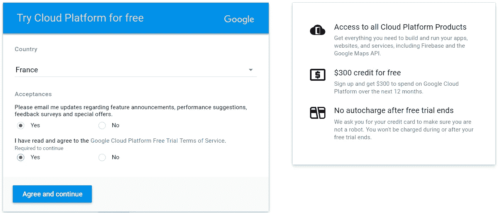

# 尝试谷歌云平台

> 原文：<https://medium.com/google-cloud/experimenting-with-google-cloud-platform-441da66154ba?source=collection_archive---------1----------------------->

谷歌提供了一个 300 美元的信用点来免费使用 GCP 的 。是时候实验了。

注册试用需要什么:

1.  一个谷歌账户
2.  一张信用卡。可以理解的安全措施。非常感谢在审判期间或之后不自动收费的承诺。

一旦建立，

一切都可以通过 GCP 控制台进行管理

主页提供了可配置的仪表板

管理是基于项目的

账单账户列出了 300 美元的信用额度(欧洲为€283)，有效期为 12 个月

所有 GCP 产品都可以测试(在“计算”、“存储”、“大数据”、“工具”和“堆栈驱动”部分下分类)

## 结论

*   整个过程只需要几分钟。
*   免费试用既方便又舒适，可以在 12 个月内试用不同的产品。
*   所有 GCP 产品都可以测试，并且有许多工具可用。

## 接下来…

[与 GCP 一起在几分钟内部署无服务器环境](/@PicardParis/deploying-a-serverless-env-in-minutes-with-gcp-22008c42dfa4)