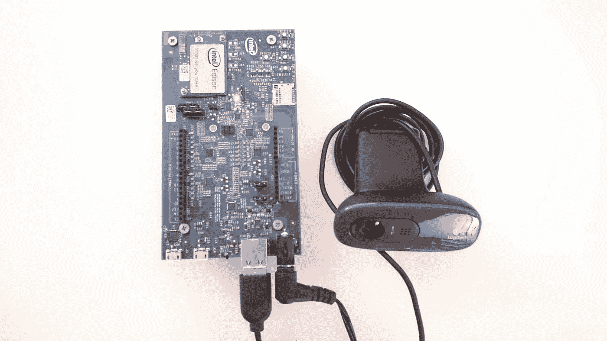

# 试用谷歌的云视觉 API +英特尔 Edison

> 原文：<https://medium.com/google-cloud/experimenting-with-googles-cloud-vision-api-intel-edison-8f28501937b0?source=collection_archive---------0----------------------->

我第一次了解谷歌的云视觉 API 是在今年的谷歌 I/O 上。尽管它自 2015 年以来一直处于测试阶段，但我从未听说过它，也没有机会尝试它，直到今天。我偶然看到这个博客 [**帖子**](https://www.raspberrypi.org/blog/raspberry-pi-cloud-vision-google-io/) ，并被 YouTube 上的演示所吸引:

像往常一样，我有一个英特尔爱迪生躺在周围，所以我决定给它一个尝试。

# 开始之前:

确保你的 Edison 已经更新到最新的固件并且有 Wi-Fi 设置，使用设置/配置工具找到[T5 这里](https://software.intel.com/en-us/iot/hardware/edison/downloads)这样做。

您还需要一个启用了 Vision API 的 Google Cloud 帐户。在继续操作之前，请遵循此处 中的这些说明 [**。**](https://cloud.google.com/vision/docs/quickstart#before_you_begin)

# 你需要的东西:

1.  英特尔 Edison w/ Arduino 分线板(您也可以使用迷你分线板，但您可能需要 USB 适配器来连接网络摄像头
2.  罗技 C270 网络摄像头(Linux UVC 驱动程序支持的任何其他 USB 网络摄像头也可以)
3.  电源

这就是它们之间的联系:



注意微小开关的位置；它更靠近大 USB 端口

# 我们走吧！

1.  为了让 USB 摄像头工作，请确保安装并启用了 UVC 驱动程序；你可以在这里的 找到如何操作的说明 [**。**](https://github.com/drejkim/edi-cam#installing-the-uvc-driver)
2.  安装 **ffmpeg** 。Git 克隆 [edi-cam](https://github.com/drejkim/edi-cam) 存储库并运行 shell 脚本来安装 ffmpeg:

```
root@edison:~# cd /edi-cam/bin
root@edison:~# ./install_ffmpeg.sh
```

3.安装 **gcloud** 。这是 Google Cloud NodeJS 模块，可以让你轻松使用 Google Cloud APIs。

```
root@edison:~# npm install gcloud
```

4.复制安装期间创建的服务帐户密钥 JSON(scp/sftp)。如果丢失了，您可以在这里 创建一个新的 [**。**](https://console.developers.google.com/projectselector/apis/credentials)

5.运行代码！将这个片段复制并粘贴到 VIM 中，或者将文件传输到:

```
root@edison:~# node capture.js
```

# 结果

这是我的网络摄像头捕捉到的图像:


这是一个凯蒂猫机器人！

这是返回的 JSON:

```
root@edison:~# node capture.js[ { desc: ‘cartoon’, mid: ‘/m/0215n’, score: 85.945672 },{ desc: ‘machine’, mid: ‘/m/0dkw5’, score: 74.98506900000001 },{ desc: ‘robot’, mid: ‘/m/06fgw’, score: 69.911 },{ desc: ‘gadget’, mid: ‘/m/02mf1n’, score: 67.246151 } ]
```

…我觉得那很酷:)

谷歌云视觉 API 实际上还有很多其他强大的功能，包括**分析情绪面部属性，文本提取&检测，以及检测你图像中的任何【人脸，地标，标签，标志，属性】**。

视觉功能完美地补充了机器人应用程序(例如，如果你不笑，无人机会盯着你，喷漆机器人会纠正涂鸦语法，等等。).我迫不及待地想看看人们会用这个做出什么样的酷东西！