# 探索和可视化 200 多年的全球温度

> 原文：<https://medium.com/google-cloud/explore-visualize-200-years-of-global-temperature-using-apache-spark-bigquery-and-google-data-699ed8b3c67?source=collection_archive---------2----------------------->

## GCP/Data proc/big query/Data Studio/Apache Spark/亚马逊 S3/气候学/气候变化

## 使用 NOAA 的历史天气数据、Apache Spark、BiqQuery 和 Data Studio 可视化可观察到的全球温度变化


由 [Unsplash](https://unsplash.com?utm_source=medium&utm_medium=referral) 上的[卡斯滕·沃思](https://unsplash.com/@karsten_wuerth?utm_source=medium&utm_medium=referral)拍摄的照片

我们每天都读到并经历着气候变化的影响。我们已经看到了这样的数字:目前**的全球平均气温比 19 世纪末**高了 0.85 摄氏度，并且**自 1850 年有记录以来，过去三十年中的每一年都比之前任何十年都要热**[*](http://The current global average temperature is 0.85ºC higher than it was in the late 19th century. Each of the past three decades has been warmer than any preceding decade since records began in 1850.)。

我很好奇气候学家是如何确定这些数字的。这一领域正在进行大量的研究。我偶然发现了一个来自 NOAA 的重要气象数据集，它被广泛用于研究。

在这篇博客中，我将解释我是如何从 NOAA 的历史天气数据中执行一些简单的分析和可视化重要模式的。

从这个数据集中可以获得很多真知灼见。请继续阅读，了解如何使用免费的云资源和开源技术进行自己的天气分析。

# 先决条件:

我们将需要 AWS 凭证来读取公共 S3 桶，以及一个 GCP 帐户来分析谷歌云上的数据集。

1.  **创建 AWS IAM 用户凭证以读取亚马逊 S3 的 NOAA 数据**

如果您没有 AWS 帐户，请注册 [AWS 自由层](https://aws.amazon.com/free/)，然后按照说明[创建 IAM 用户](https://docs.aws.amazon.com/IAM/latest/UserGuide/id_users_create.html)

授予您的用户 [AmazonS3ReadOnlyAccess](https://console.aws.amazon.com/iam/home?region=us-east-2#/policies/arn%3Aaws%3Aiam%3A%3Aaws%3Apolicy%2FAmazonS3ReadOnlyAccess)

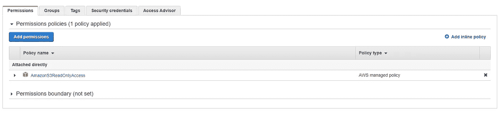

为您的用户创建访问密钥。(记下您的**访问密钥 ID** 和**秘密访问密钥。我们将向我们的 spark 工作提供这些凭据。)**

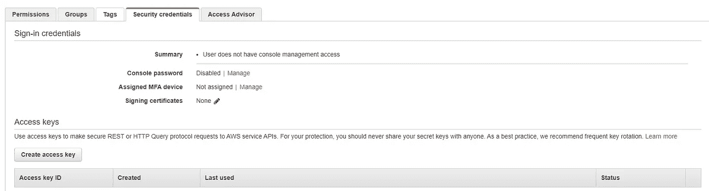

**2。如果您没有 GCP 帐户，请创建一个帐户**

[GCP 免费等级——免费延长试用和永远免费|谷歌云](https://cloud.google.com/free)

一旦你注册并登录到 GCP 控制台。通过点击下面截图中突出显示的图标来激活云壳。Cloud Shell 提供了对虚拟机实例的命令行访问，这是我们将要设置用例的地方。(或者，您也可以在笔记本电脑终端上完成此操作)

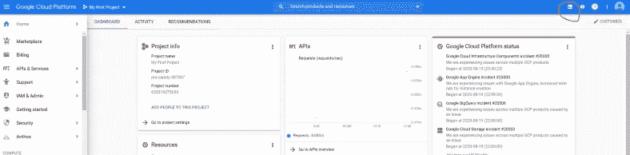

GCP 控制台


谷歌云外壳

对于源代码，这里是 GitHub 项目。

[](https://github.com/ksree/ghcn-daily-analysis) [## ksree/ghcn-每日分析

### 全球历史气候网络分析

github.com](https://github.com/ksree/ghcn-daily-analysis) 

现在我们已经有了 AWS 和 GCP 证书，让我们开始吧。

# 建立您的 GCP 数据湖

要设置我们的 GCP 环境，我们需要执行以下操作:

*   创建项目
*   启用计费(仍在免费层)
*   启用 Dataproc 和 BigQuery 服务
*   创建一个谷歌云存储桶
*   创建大查询数据集
*   创建一个 Dataproc 集群

要执行上述任务:

在 [GitHub](https://github.com/ksree/ghcn-daily-analysis) 上查看我的项目 ghcn-daily-analysis，并执行数据湖创建脚本，如下所示。

在您的 google cloud shell 上，运行以下命令。

在您的 google cloud shell 上执行这些命令。

下面是输出的样子

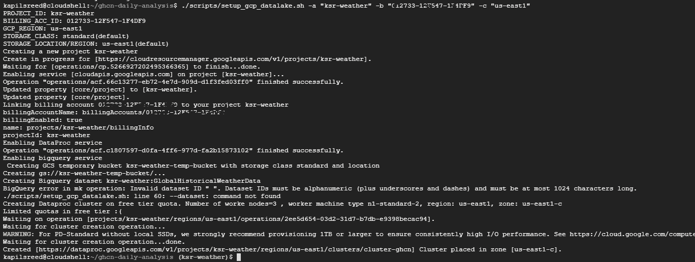

setup_gcp_datalake.sh 的输出

到目前为止一切顺利。接下来，让我们将数据放入 BigQuery。

# 从亚马逊 S3 下载 NOAA 全球历史气候网络日报(GHCN-D)到 BigQuery

要将 [NOAA](https://ncics.org/) GHCN-D 数据从[公共亚马逊 S3](https://registry.opendata.aws/noaa-ghcn/) 复制到您的 Google Bigquery 实例，请遵循以下两个步骤。

1.  **运行下面的脚本**，构建并打包 spark 应用程序

通过在您的云 shell 上运行这个脚本来构建和打包 spark 应用程序。

您将看到如下输出:

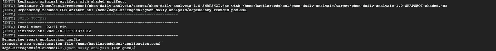

build_spark_app.sh 执行输出

验证生成的应用程序配置文件:

```
cat $HOME/application.conf
```

检查您的 AWS 密钥和密码。起始年和结束年是我们将从 AWS 开放数据中提取的数据集范围。

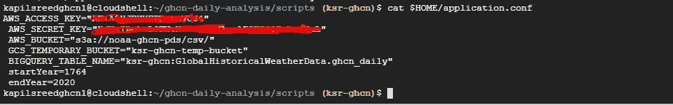

Spark 应用程序配置文件

**2。提交 Dataproc 作业以将数据加载到 BigQuery 中**

运行以下脚本提交 Dataproc 作业:

您可以检查 [Dataproc 控制台](https://console.cloud.google.com/dataproc)来查看工作状态。在自由层基础架构上，这项工作需要几个小时才能完成。

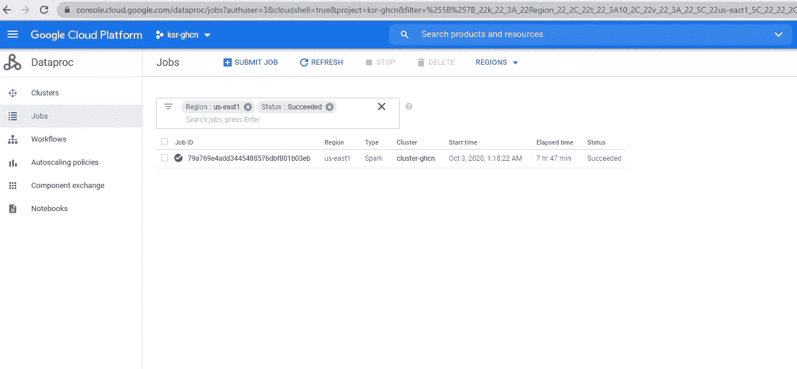

现在我们的 BigQuery 数据集中有了 NOAA 全球历史气候网络。让我们继续做一些分析。

**BigQuery (GHCN-D)** **数据集洞察:**

转到 BigQuery 控制台，查看新创建的表 globalshistoricalweatherdata . ghcn _ daily

details 选项卡显示了数据集的大小: **125 GB** ，有**17.5 亿行。**

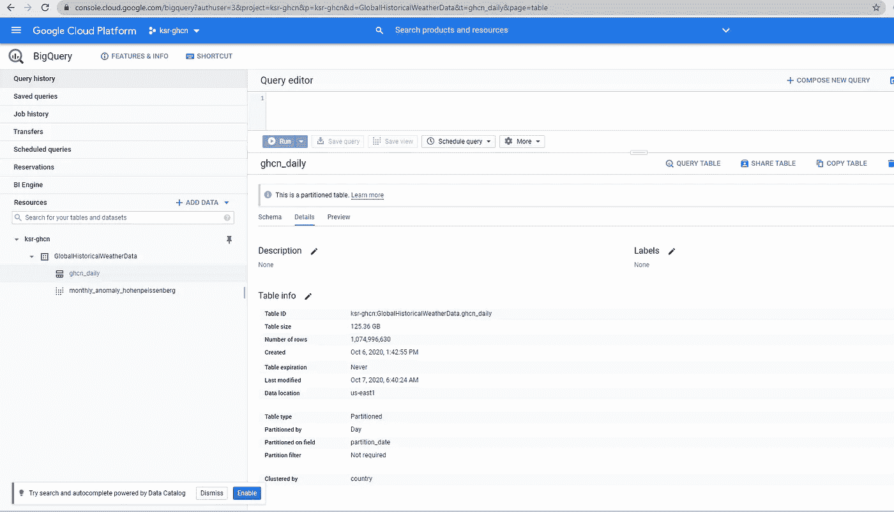

请注意，该表在 *partition_date* 列上是按年份划分的**。它被设置为年初。**

此外，为了提高查询性能，我让**对列 *country* 上的表数据进行了聚类**，因为这是最常用的过滤器。Bigquery 使用集群列来存放相关数据。列的顺序很重要，它决定了数据的排序顺序。

让我们在 BigQuery 数据集上运行一些查询

**观察总数:**

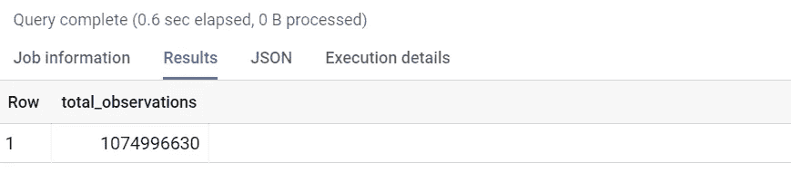

**美国各州 2020 年迄今最热的一天:**

**美国各州 2020 年至今最暖日查询结果**

**旧金山站 1980 年以来最热日:**

自 1980 年以来旧金山最热的一天

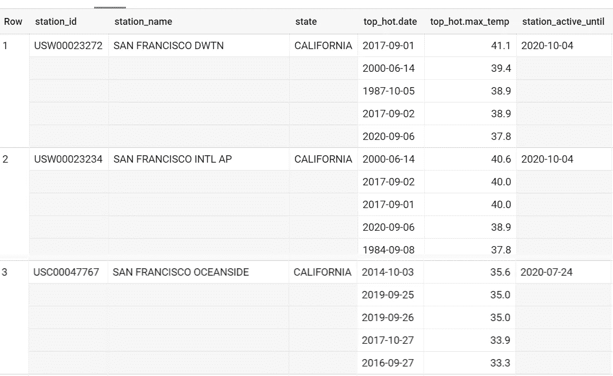

查询输出，旧金山最热的一天。前 3 名活跃电台。

接下来，让我们做一些可视化来更好地理解天气模式的趋势。

## 使用 Google Data Studio 可视化全球历史天气数据

Data Studio 让您轻松连接到各种数据源，并通过高度可配置的图表和表格可视化您的数据。

使用 Data Studio BigQuery 连接器连接到您的 ghcn-d 天气数据集。

这里是全球气象站和观测总数的可视化。

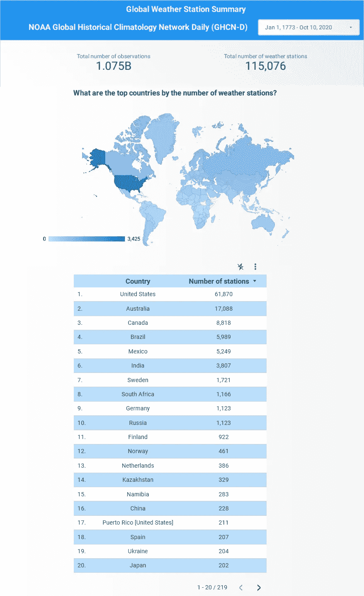

全球气象站和观测的谷歌数据工作室仪表板

**2019 年多伦多市最低最高气温**

要绘制 2019 年多伦多市最高和最低温度的时间序列图，请将数据范围维度设置为 ghcn_d.date 列，并包括指标 min_temp 和 max_temp。

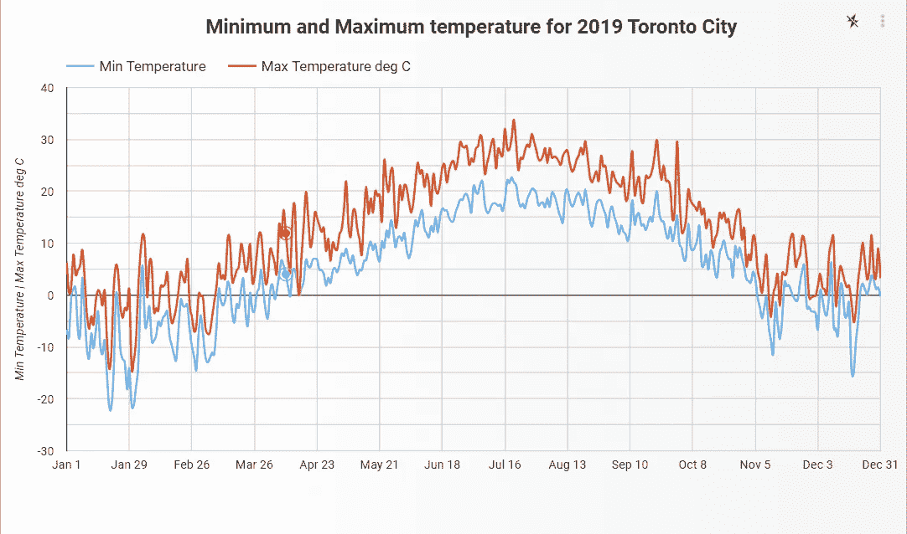

最低和最高温度摄氏度，多伦多 2019

# **霍恩佩恩贝格气象观测站的温度异常**

异常是指在一年的某个特定时间，某个特定地点的条件偏离了平均条件。正异常意味着温度比正常温度高；负异常表示温度比正常温度低。

> 这里我们计算了德国霍恩佩森伯格[的温度异常。奥古斯丁的僧侣们在这个地方进行了第一次气象观测，并且自 1781 年以来一直持续进行。](https://en.wikipedia.org/wiki/Hohenpei%C3%9Fenberg_Meteorological_Observatory)
> 
> 该测量系列是有史以来最长的，并且从未受到城市热岛效应的影响。

以下是计算年平均温度异常的查询。

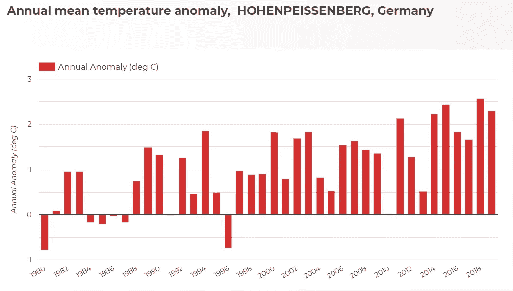

# **在**霍恩佩恩贝格气象观测站观察气温上升

让我们画出德国 Hohenpeissenberg 从 1781 年到 2000 年的月平均温度和从 2000 年到 2020 年的月平均温度。

以下是计算月平均值的查询。创建一个视图，并在 Google Data Studio 中导入这个视图。

> **下面两条线之间的空隙，显示了 200 多年来气温的升高。**

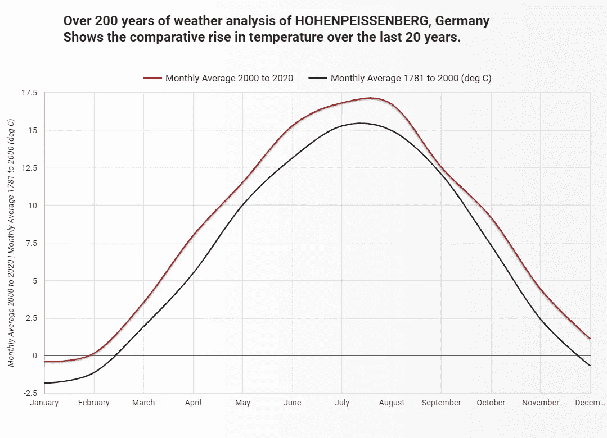

# **重述**

我们是这样做的:

1.  通过使用 Apache Spark，我们连接到 NOAA 的全球历史气候网络——S3 自动气象站托管的每日数据集，应用简单的转换，并用地理信息增强数据集。最后，我们**将这个数据集加载到 BigQuery** 中
2.  **使用 **BigQuery** 获得对历史天气数据的洞察**
3.  **使用 **Data Studio** 可视化**天气的历史趋势

这个博客的目标是展示如何使用云和开源工具来探索这个大型天气数据集并从中获得洞察力。

正如我所说的，在这个数据集上可以进行更多的探索。创造和分享你自己的见解。