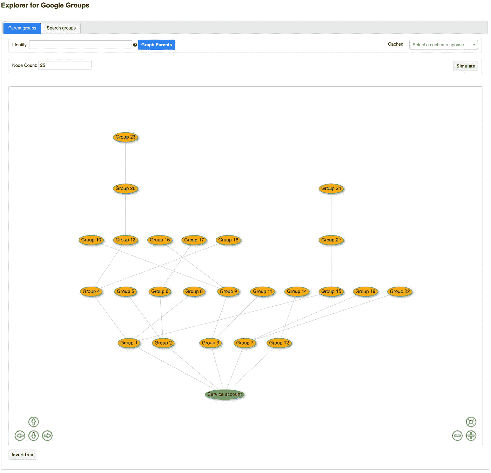

# Google 群组浏览器

> 原文：<https://medium.com/google-cloud/explorer-for-google-groups-4de258b1344f?source=collection_archive---------1----------------------->

## 边和节点数天

有没有碰到过谷歌[管理员管理的群组](https://support.google.com/a/answer/33343)母公司[限制](https://support.google.com/a/answer/6099642?hl=en#membershiplimits)？对于 B2B 多租户应用程序授权来说，它们可能是一个问题，特别是如果您以差异化的方式提供 Google 云存储对象。

使用[这个工具](https://github.com/demoforwork/public/tree/master/Groupcount)来主动检查你是否正在接近这些极限，并了解热点。

*   它为离线分析提供了可视化工具和 CSV
*   批处理模式使您能够在低加载时间运行它，并在以后分析缓存的结果

您可以搜索要映射其祖先的身份(用户、服务帐户或组)，或者搜索要显示其摘要统计信息的组前缀。

您还可以在可视化工具中突出显示组的父组，以识别潜在的组优化。

# 考虑

效用不包括组所有权，组所有权计入配额；除了扫描整个组树之外，没有其他方法可以做到这一点。

每条边通过多个组将子节点连接到单个父节点(即菱形图案)算；对于某些孩子，实际组限制的计算方式可能会有所不同。

# 缩放比例

除了前面提到的批处理模式之外，该实用程序还采取了许多措施来解决性能和可伸缩性问题；它…

*   缓存以前的查询结果。
*   支持多个服务帐户，因为 [Admin SDK Directory API](https://developers.google.com/admin-sdk/directory/v1/limits) 组配额指标的某些方面是基于身份的；两个服务帐户似乎足以支持读取近 5k 个组。
*   利用与 [WaitGroups](https://gobyexample.com/waitgroups) 的 Go 并发性。
*   实现[基于通道的节流](https://github.com/golang/go/wiki/RateLimiting)。

注意，对于像这个实用程序这样的恒定负载应用程序，[指数补偿](https://developers.google.com/admin-sdk/directory/v1/limits#backoff)实际上增加了负载；它只对尖峰负载用例有用。

# 网络服务器

Go webserver 实现了特定于端点的方法来提供静态文件、动态生成的 JSON 和交互式查询响应。

# 形象化

图形可视化基于 [vis.js 网络图](https://visjs.github.io/vis-network/examples/)，包括一个用于模拟的样本数据生成器。

为 5k 节点调优可视化需要一点反复试验。例如，[基于物理的图](https://visjs.github.io/vis-network/docs/network/physics.html)改善了大型图的节点间距，但对于数千个节点来说太慢了；然而，一些物理选项仍然有一个有用的效果，尽管它不同于启用物理时的效果。

# 题外话:限速器

为了测试 Explorer 实用程序的伸缩性，我需要一个具有足够嵌套的大型组层次结构，这又意味着另一个实用程序。创建组层次比阅读它的性能差得多。

Explorer 实用程序使用[基于通道的节流](https://github.com/golang/go/wiki/RateLimiting)，但是显然这种方法[在开销](https://rodaine.com/2017/05/x-files-time-rate-golang/)上花费了不成比例的时间，一旦你每秒处理几十个查询，那么最好使用[速率限制器包](https://pkg.go.dev/golang.org/x/time/rate?tab=doc)。

根据[限速器文档](https://pkg.go.dev/golang.org/x/time/rate#Limiter)，大多数呼叫者应该使用等待；然而，我找到的所有代码示例都使用了 Allow 和 Reserve。Daz Wilkin 提供了这个很棒的片段，演示了上下文和突发参数的正确使用。

# 下一步是什么

将该实用程序升级到:

*   [云身份 API](https://cloud.google.com/identity/docs/reference/rest)；它提供了比 Admin SDK API 配额高得多的默认读取配额。
*   [速率限制器包](https://pkg.go.dev/golang.org/x/time/rate?tab=doc)原因在文中讨论。

调查这个[综合组、IAM 策略和项目可视化实用程序](https://github.com/salrashid123/gsuites_gcp_graphdb)是否更好地满足您的需求。

*   它包括层次结构中的云 IAM 策略和项目。
*   它将数据加载到 JanusGraph 数据库中，您可以使用多种工具对其进行可视化。

审查您是否可以通过降低[凭证访问边界](https://cloud.google.com/iam/docs/downscoping-short-lived-credentials)的范围来替换部分或全部管理 Google 云存储访问的小组。

*   这些在存储桶和对象级别都受支持。
*   您可以创建一个可以访问您拥有的每个云存储桶的服务帐户，然后应用一个凭据访问边界，只允许访问包含您客户数据的桶。
*   您可以创建一个 IAM 条件，为名称以特定前缀开头的对象提供权限。