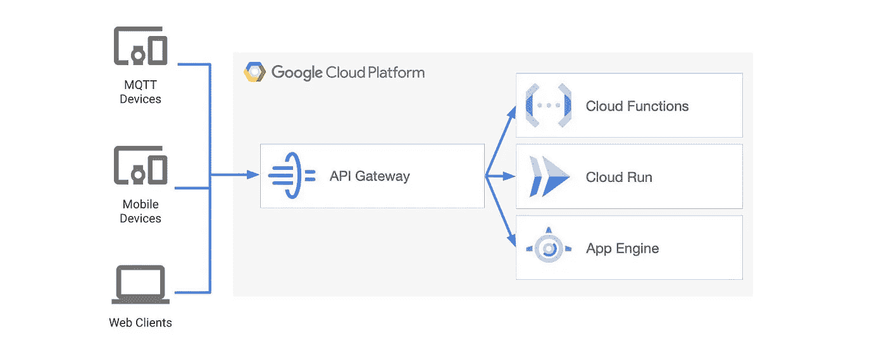
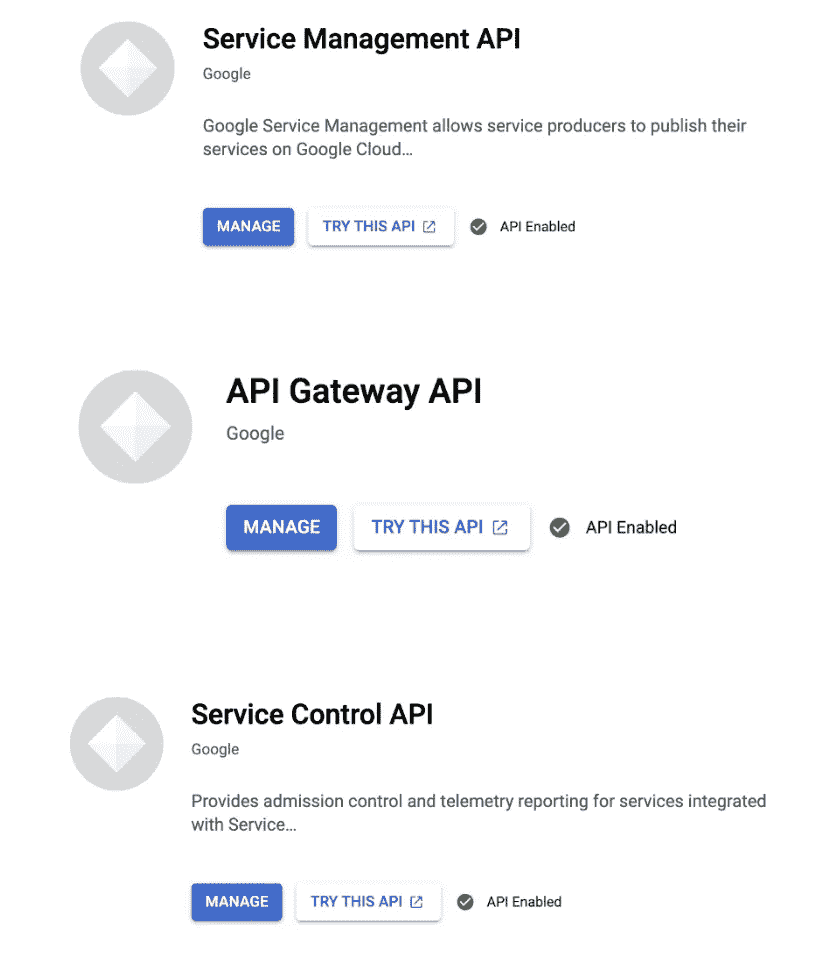

# 利用谷歌云功能探索谷歌云 API 网关

> 原文：<https://medium.com/google-cloud/exploring-google-cloud-api-gateway-with-google-cloud-functions-ff56c1c96cc9?source=collection_archive---------0----------------------->

## 创建一个安全的 API 网关，可以处理参数和表单数据(文件上传),并将它们转发给适当的云功能

我们都爱 API。你需要或想从互联网上得到的任何东西，要么有一个 API，要么你可以创建一个。这就是我们所做的。在我们的组织中，我们为几乎所有可以卸载到服务器的任务构建了 API。但是，我们有太多的 API。因此，我们需要一些服务来执行我们的 API 的两个关键任务:

1.  为所有相关的 API 创建一个公共网关，以保持 API 触发器结构化、通用且易于管理。
2.  让公开开放的 API 更加安全。

因为我们所有的 API 都托管在 GCP，所以我们选择 Google API Gateway 是很自然的。现在让我们看看 Google Cloud API Gateway 是如何解决我们的问题的。

# 先决条件

我假设您已经准备好了以下资源。如果没有，下面的链接将帮助您入门:

1.  已激活计费的 GCP 帐户。如果您还没有，您可以使用$300 的[免费层创建一个新的。](https://cloud.google.com/free)
2.  [一个 GCP 项目](https://cloud.google.com/resource-manager/docs/creating-managing-projects)
3.  [谷歌云功能](https://codelabs.developers.google.com/codelabs/cloud-starting-cloudfunctions#0)(我正在使用谷歌云功能，但你也可以使用应用引擎和云运行)。

API 网关可以使用 OpenAPI spec 2.0 进行配置。在我们开始编写实际的 API 配置文件之前，我们需要启用以下服务，以便我们可以部署网关。

我们还可以通过 GCloud 控制台使用以下命令来启用这些服务:

API 网关由两个组件组成:

1.  **API 配置:**上传 API 定义时创建的 API 配置。我们将创建 API 定义作为 OpenAPI 规范。每次我们上传一个 API 定义，API Gateway 都会创建一个新的 API 配置。也就是说，我们可以创建一个 API 配置，但不能在以后修改它。如果我们稍后在 OpenAPI 规范中编辑 API 定义，然后上传编辑后的 API 定义，我们将创建一个新的 API 配置。
2.  **网关:**一个基于 Envoy 的、高性能的、可伸缩的代理，托管已部署的 API 配置。当我们将 API 配置部署到网关时，它会创建面向外部的 URL，我们的 API 客户端使用该 URL 来访问 API。
    网关部署到特定的 GCP 地区(地区是我们可以部署资源的特定地理区域)。
    网关还必须拥有一个 API 配置。我们不能创建空网关，即所有网关都需要一个 API 配置，但是每个网关只能支持一个 API 配置。然而，在创建网关之后，我们可以更新网关，用一个 API 配置替换另一个 API 配置。

# 创建网关和 API 配置:

既然我们已经完成了理论，让我们进入最激动人心的部分:为 API 网关编写实际的 OpenAPI 规范文件。这只是为了创建 API 配置。如果你想知道如何设置保存这个配置文件的网关，[只需遵循这里给出的步骤](https://cloud.google.com/api-gateway/docs/quickstart-console#creating_a_gateway)。

因此，让我们首先创建一个基本的 spec 文件，它只根据路径转发请求:

既然我们已经完成了。下面是我纠结的部分。现在我有了一个云函数，我需要传递 1 个路径参数、查询参数和 1 个表单数据(一个图像)。所以让我们先处理参数的传递。在下面的要点中，我创建了一个通过我们的参数的新路径:

现在是通过表单数据上传图像文件的最后一部分。这是令人惊讶的最简单的部分，因为 API 网关会自动完成这项工作。任何附加的数据都会自动转发。

# 保护 API:

这是另一个对我们非常重要的方面。我们的大多数 API 都是公开的。当然，我们可以将它们设为私有，并使用谷歌的 JWT 令牌进行认证，但 JWT 令牌是短暂的，我们不希望每隔几个小时就为大量使用我们 API 的设备和应用程序生成一个新令牌。

输入 API 密钥，这些密钥是手动生成的，可以在网关上使用单个密钥来验证网关中链接的所有 API。还有其他方法来验证( [JWT](https://cloud.google.com/api-gateway/docs/authenticating-users-jwt) 、 [Firebase](https://cloud.google.com/api-gateway/docs/authenticating-users-firebase) 、 [Auth0](https://cloud.google.com/api-gateway/docs/authenticating-users-auth0) 、 [Okta](https://cloud.google.com/api-gateway/docs/authenticating-users-okta) 、 [Google Id 令牌](https://cloud.google.com/api-gateway/docs/authenticating-users-googleid))，但这就是我们要做的。
现在，如果您想知道如何生成 API 密钥，[只需遵循这里给出的文档即可。](https://cloud.google.com/docs/authentication/api-keys)

一旦我们生成了 API 密钥，我们就可以使用它们作为查询参数或头参数来进行身份验证。

> 在我们的应用程序中使用 API key，对于查询参数使用 key=API_KEY 参数，对于头参数使用 x-api-key=API_KEY 参数。

这将需要我们更改 API 配置文件。

这是最终的 API 配置。此外，请记住在我们的云函数中阻止未经验证的调用，否则保护 API 将毫无意义。

现在，如果我们点击我们的 API，得到一个类似“PERMISSION_DENIED: API 没有为项目启用”的错误。，我们需要做的是:

1.  转到 API 和服务。
2.  单击屏幕顶部的启用 API 和服务
3.  搜索我们网关的名称。
4.  启用 API

我们已经完成了网关的设置。

当我开始从事 API 网关的工作时，我发现这是一个有趣的、潜在的非常强大的服务。尽管如此，还是缺少详细的文档，因此才有了这篇文章。我希望你们能享受这项服务。

**感谢阅读！如果你觉得这篇文章有用，请分享。请鼓掌👏来表示点爱:)**

**让我们在**[**LinkedIn**](https://www.linkedin.com/in/sudipta-dey-667548179/)**和**[**GitHub**](https://github.com/doomSDey)**上成为朋友。**

