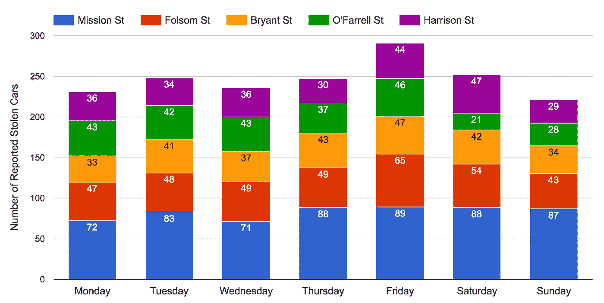

# 用 BigQuery 探索旧金山的公共数据

> 原文：<https://medium.com/google-cloud/exploring-san-franciscos-public-data-ccf21cb2bfc3?source=collection_archive---------1----------------------->


旧金山。雾都。海湾边的城市。不管你怎么称呼它，这 4700 万英里是超过 80 万人的家园，我们可以使用 BigQuery 中新的旧金山公共数据集得出令人愤慨的结论。

由于旧金山市和县的 [SF OpenData](https://data.sfgov.org/) 项目和[湾区自行车共享](http://www.bayareabikeshare.com/)，[Google biqquery 的公共数据集](https://cloud.google.com/bigquery/public-data/)现在包括了旧金山的公共数据，包括:

*   自 2008 年以来，200 多万次 [311 次服务请求](https://cloud.google.com/bigquery/public-data/sfo-311)(每天更新)
*   自 2003 年以来超过 200 万起[旧金山警察局事件](https://cloud.google.com/bigquery/public-data/sfpd-reports)(每日更新)
*   自 2000 年以来超过 400 万次 [SF 消防部门服务呼叫](https://cloud.google.com/bigquery/public-data/sffd-service-calls)(每日更新)
*   超过 10 万棵[行道树的位置和种类](https://cloud.google.com/bigquery/public-data/sfo-311)(每季度更新)
*   [湾区自行车共享](https://cloud.google.com/bigquery/public-data/bay-bike-share)站和自 2013 年以来近 100 万次湾区自行车共享出行(每日更新)

> **SF Protip #1:在布莱恩特停车时，不要将贵重物品留在车内。尤其是在星期五。午饭前肯定不行。**

2016 年，被盗汽车和锁车盗窃占 SFPD 所有犯罪事件的 21%以上。

```
SELECT
  ROUND(100*countif(strpos(descript, "STOLEN AUTOMOBILE") > 0)
    / count(*)) as stolen_pct,
  ROUND(100*countif(strpos(descript, "THEFT FROM LOCKED AUTO") > 0)
    / count(*)) as theft_pct
FROM
  `bigquery-public-data-staging.san_francisco.sfpd_incidents`
WHERE
  category != "NON-CRIMINAL" AND category != "SECONDARY CODES"
  AND category != "WARRANTS" AND EXTRACT(YEAR from timestamp) = 2016
```

周五午餐时间和下班后，锁着的汽车被盗的报告达到高峰，可能是因为人们来到他们的汽车前发现它们被洗劫一空。在布莱恩特停车无疑是最大化你的东西被偷的机会的最佳方式。


如果你想把自己成为锁着的汽车盗窃案受害者的几率降到最低，这张热图显示了大多数汽车盗窃案的报案地点——避免在那里停车。


> 如果你在科比身上失去了什么，试着在瓦伦西亚和埃迪身上寻找。

近 20%的失物都是在布莱恩特街上报告的。在巴伦西亚和埃迪，找到东西的可能性最大，那里发现的东西是丢失的两倍多。


如果你把车停在教会街上，当你回到车旁时，很可能会发现车完全不见了。尤其是在星期五。



> 日落大道是旧金山树叶最多的街道。

你可以通过参观日落大道来领略蒙特雷的风采，日落大道是旧金山树叶最多的街道，树木比其他任何街道都多，包括近 1400 棵蒙特雷松树和蒙特雷柏树。如果你正在寻找一个阴凉的地方，下面的热图显示了整个城市的树木分布密度。


旧金山的树木密度比纽约大，每平方英里有 2637 棵树，而纽约只有 2242 棵。

像纽约一样，旧金山最常见的树是伦敦悬铃木，它代表了所有科幻树的 7%,相比之下，纽约的比例为 13%。旧金山的树木更加多样化，你会发现 492 种不同的种类，相比之下，纽约只有 183 种。

旧金山可以夸耀纽约七大树种中的每一种至少有一个例子，而纽约没有旧金山的，除了伦敦的飞机。

> **旧金山第四名:旧金山居民比纽约人抱怨得多。**

按人均计算，旧金山使用 311 市政投诉热线的频率高于纽约市。在旧金山，最常见的投诉是要求清理人行道、捡垃圾和清除涂鸦。


## **科幻小说#5:涂鸦变多了，但至少变得更有礼貌了。**


投诉增长最大的是已经代表最大数量的类别，其中大件物品取件请求和非法无家可归者营地增长最快。

注意，非攻击性涂鸦呈上升趋势，攻击性涂鸦是下降最快的投诉类别。因此，要么是旧金山人正在写一些不那么冒犯人的涂鸦，要么是居民已经对当前冒犯他人的企图免疫了。

> SF Protip #6:陡峭的山坡让骑自行车更慢。

湾区自行车共享网络的骑手平均每次骑行 14 分钟，几乎与纽约花旗自行车骑手的平均 15 分钟相同。不过，旧金山是一个较小的城市，骑车人每次出行平均只有 1.4 公里，而纽约人则有 1.8 公里。


或者换句话说，旧金山的自行车运动员比纽约的同行慢 0.3 米/秒。我责怪陡峭的山。

> SF Protip #7:大麻合法化将减少海特-阿什伯里 7%的逮捕率。

大麻占旧金山所有涉毒被捕人数的 26%。2016 年，它被冰毒取代，成为逮捕中最有可能涉及的毒品。


总的来说，自 2003 年以来，毒品犯罪下降了 62%,所有毒品的被捕人数都减少了——除了甲基苯丙胺，上升了 14%。


下面的地图显示了自 2003 年以来至少有 5 起与毒品有关的逮捕的所有地区。红色大头针代表大麻，蓝色代表快克可卡因，粉色代表甲基安非他明，绿色代表海洛因，黄色代表可卡因。

较大的大头针表示在同一地点有 200 多起与毒品有关的逮捕。


田德隆区是旧金山毒品逮捕的中心，尤其是对快克可卡因的逮捕——逮捕集中在特定的地点；然而，甲基苯丙胺的逮捕更有可能沿着道路进行。

在海特-阿什伯里附近，大麻被捕人数激增，占所有被捕人数的 7%。

> 让你的房子着火的最好地方是唐人街。最有可能的地方是里脊。如果你幸运的话，他们会派出 3 号引擎。

从拨打 911 电话到消防队员到达着火建筑的平均反应时间是 6 分 8 秒，而到达唐人街的消防队在全市范围内的最佳反应时间是 4 分 30 秒。


> SFFD 最快的消防车是第四营的 Engine 3，平均反应时间仅超过 3 分钟。

## **这是你使用这个新的三藩市数据集可以探索和发现的一个例子。**

[每周来这里参加我们的](http://tilwbq.com)，因为*今天我学习了 BigQuery* ，当我们更详细地挖掘这些表格时，使用 NOAA 天气表来探索天气对犯罪和 311 电话的影响，并比较我们对旧金山和其他城市的了解，从纽约开始。

如果您是 BigQuery 的新手，请遵循这些[入门说明](/til-with-bigquery/how-to-run-a-terabyte-of-bigquery-queries-each-month-without-a-credit-card-948773df8c0c#.9jex791fc)，并且记住每个人每个月都可以免费获得 1TB 的空间来运行查询。完成后，记得使用 [#TILwBQ](http://www.twitter.com/hashtag/tilwbq) 与我们分享结果。