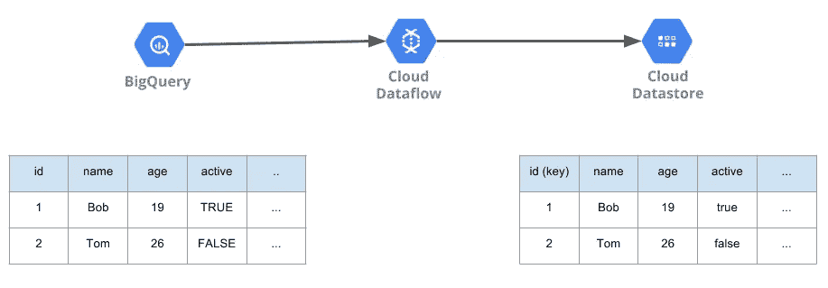
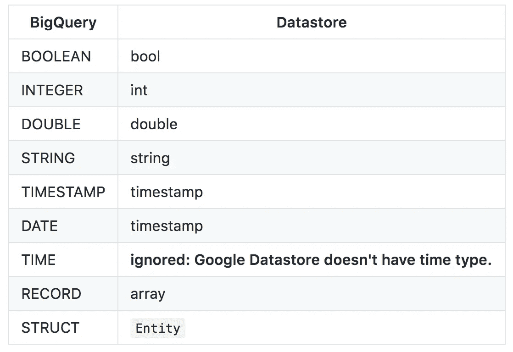

# 使用 Apache Beam/Google 数据流将 BigQuery 导出到 Google 数据存储

> 原文：<https://medium.com/google-cloud/export-bigquery-to-google-datastore-with-apache-beam-google-dataflow-7fff1566f345?source=collection_archive---------0----------------------->

如果可以将 BigQuery 表导出到 Google Datastore，而不考虑它的模式，会怎么样？我知道每次都要做一些把大数据数据仓库转移到分布式 KVS 的功能，比如把数据从 Apache Hive 转移到 Apache Cassandra 或者从 BigQuery 转移到 Google Datastore，总是很烦人的。如果我们有这样的功能，我们就能够更随意地传输数据。

我在 Google Dataflow 上用 Apache Beam 做了一个从 BigQuery 到 Google Dataflow 的导出器，没有考虑表模式。它自动解析 BigQuery 表的表模式，然后将它们调整到 Google Datastore 数据类型。



# GitHub 知识库

这是我创建的将 BigQuery 表导出到 Google Datastore 的存储库。

 [## Yu-iskw/大查询到数据存储

### bigquery-to-Datastore——使用 Apache Beam/Google 数据流将整个 big query 表导出到 Google Datastore

github.com](https://github.com/yu-iskw/bigquery-to-datastore) 

# 用于数据分析的大查询

从一个过去维护 Apache Hadoop 和 Apache Hive 的人来说，BigQuery 的便利性是惊人的。有些事情压倒性地超过了雇用数据工程师和基础设施工程师，不仅在处理速度方面，而且在稳定性和成本方面。最近我觉得很多公司都开始把 BigQuery 放在分析平台的中心。

通过使用 SQL 实现大规模数据操作，我们向许多人以及熟悉“大数据”的工程师打开了分析 Web 规模数据的大门。

# 数据存储的 BigQuery

通过降低 BigQuery 流插入的价格，它也非常适合作为“存储”结构化数据的地方。例如，您可以将日志从服务器发送到 Google Pu / Sub，使用 Google Dataflow / Apache Beam 的流应用程序提取数据，并流式传输到 BigQuery。换句话说，BigQuery 可以作为日志收集的地方。通过将它存储在 BigQuery 中，可以通过执行查询立即进行分析，这是很有吸引力的。

# 数据产品的 BigQuery

传统上，为了创建数据产品，需要使用 Apache Hadoop MapReduce 和 Apache Spark 等大规模数据的框架来创建应用程序。但毕竟它在获取、处理和存储数据方面没有改变。提高难度的原因是我们处理的数据量很大。我为如何处理大量数据以及如何存储大量数据而烦恼。这种开发的困难在于不断地落后于制作数据产品的想法，拖延发布的时间。

同样在团队开发方面，很难采用一个能做出专用大规模数据产品的工程师。维护一个适当维护大规模数据产品的系统并不容易，人力成本也随之增加。

如前所述，BigQuery 的优势在于可以在 SQL 中操作大型数据。
如果您可以将 BigQuery 汇总结果存储在一个新表中，并轻松地将该表导出到分布式 KVS(如 Google Datastore)中，会怎么样？BigQuery 不仅使大规模数据分析民主化，还大大降低了数据产品的准入门槛。光用 SQL 就可以做很多事情，BigQuery 也支持 UDF，所以我会把它扩展到 SQL 甚至更广。

# 如何使用

这是一个将 BigQuery 表`test_dataset.test_table`导出到 Google Datastore 种类`TestKind`的例子，它的父类是`KEY('Parent1', 'p1', 'Parent2', 'p2')`，名称空间是`test_namespace`。我们还可以指定一个 BigQuery 列作为 Google Datastore 键。其中，关键字列为`uuid`。

```
./bigquery-to-datastore.sh \
  --project=${GCP_PROJECT_ID} \
  --runner=DataflowRunner \
  --inputBigQueryDataset=test_dataset \
  --inputBigQueryTable=test_table \
  --outputDatastoreNamespace=test_namespace \
  --outputDatastoreKind=TestKind \
  --parentPaths=Parent1:p1,Parent2:p2 \
  --keyColumn=uuid \
  --tempLocation=gs://test_yu/test-log/ \
  --gcpTempLocation=gs://test_yu/test-log/
```

如果你想知道更多细节，请查看 github 上的文档。

# BigQuery 和 Google Datastore 之间的类型转换

下表描述了 BigQuery 和 Google Datastore 之间的类型转换。不幸的是，由于数据存储没有任何时间数据类型，`bigquery-to-datastore`忽略数据类型为`TIME`的 BigQuery 列。



# 结论

我将 BigQuery 描述为不仅是一个数据分析平台，还是数据产品的起点。基本上，我是依靠 Google 云平台做这个配置的，因为我不想从根本上维护数据库的平台。当然，您可以采用在 SQL 中处理大数据的方法，创建一个新表，并将其存储在分布式 KVS(如 HBase 和 Cassandra)中。本文主要关注拥有 bigquery-to-datastore 这样的工具的意义。