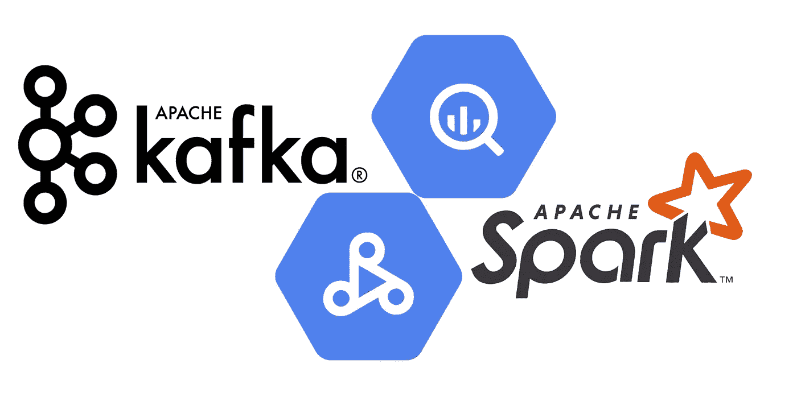
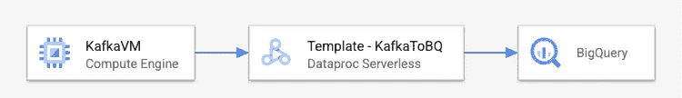

# 使用 Dataproc Serverless 将数据从 Apache Kafka 导出到 BigQuery

> 原文：<https://medium.com/google-cloud/export-data-from-apache-kafka-to-bigquery-using-dataproc-serverless-4a666535117c?source=collection_archive---------1----------------------->



**data proc Spark 无服务器版**无需配置和管理集群即可运行批量工作负载。它可以动态地调整工作负载资源，比如执行器的数量，以便高效地运行您的工作负载。作为数据开发人员，这使我们能够专注于业务逻辑，而不是花时间管理基础设施。

相比之下，计算引擎上的 **Dataproc 在 GCP 上提供托管 Hadoop 和 Spark 服务。它非常适合希望调配和管理基础架构，然后在 Spark 上执行工作负载的用户。**

**Dataproc 无服务器模板:**现成可用的、开源的、可定制的模板，基于 Dataproc 无服务器 for Spark。这些模板帮助数据工程师进一步简化在 Dataproc Serverless 上的开发过程，根据他们的需求消费和定制现有的模板。

在本文中，我们将探讨如何使用 Dataproc Serverless for Spark 从 Kafka 主题向 BigQuery 执行数据的批处理或流加载。

## 先决条件

*   安装并验证了 Google Cloud SDK
*   云壳或预装 Java 8、Maven 3 和 Git 的机器

## Kafka 到 BigQuery 模板

该模板将从 Apache Kafka 主题中读取数据，并将其写入 BigQuery 表。它主要支持结构化流，但也适用于批处理工作负载。它使用 Spark BigQuery 连接器和 Spark Kafka 结构化流连接器。



该模板允许通过执行命令配置以下参数:

*   *kafka . bq . bootstrap . servers*:以逗号分隔的带有 Kafka 代理端口号的 IP 地址列表。例如:102.1.1.20:9092
*   *kafka.bq.topic* :逗号分隔的 kafka 主题列表。示例:topicA、topicB
*   *Kafka . bq . dataset*:big query 的输出数据集，表驻留在其中或者需要被创建
*   *Kafka . bq . table*:big query 的输出表名
*   *Kafka . bq . temp . GCS . bucket*:预先存在的 GCS bucket 名称，暂存临时文件。示例:模板-演示-kafkatobq
*   *Kafka . bq . check point . location*:GCS 桶位置，维护检查点文件。该位置保存关于偏移量的信息，并用于从最后处理的偏移量开始恢复流式传输。示例:GS://templates-demo-kafkatobq/check point
*   *Kafka . bq . starting . offset*:指定开始读取的偏移量。此属性控制模板的行为，无论是批量加载还是流加载数据。可接受的值:“最早”、“最新”或 JSON 字符串
*   *Kafka . bq . await . termination . time out*:在流终止前等待指定的时间(毫秒)
*   *Kafka . bq . fail . on . data loss*:数据丢失时作业失败。可接受的值:真、假
*   *Kafka . bq . stream . Output . mode*:写入数据的输出模式。可接受的值:“追加”、“完成”、“更新”

## 运行模板

1.  请确保您已经启用了带有专用 Google 访问的子网。如果您使用的是 GCP 创建的“默认”VPC，您仍然需要启用如下的私人访问。


```
gcloud compute networks subnets update default --region=us-central1 --enable-private-ip-google-access
```

2.为 jar 文件创建一个 GCS 存储桶和暂存位置。

3.在预装了各种工具的云壳中克隆 git repo。或者使用任何预装 JDK 8+，Maven 和 Git 的机器。

```
git clone [https://github.com/GoogleCloudPlatform/dataproc-templates.git](https://github.com/GoogleCloudPlatform/dataproc-templates.git)cd dataproc-templates/java
```

4.认证 gcloud CLI

```
gcloud auth login
```

5.执行 KafkaToBQ 模板

*样本执行命令:*

```
export GCP_PROJECT=my-gcp-project
export REGION=us-west1
export SUBNET=test-subnet
export GCS_STAGING_LOCATION=gs://templates-demo-kafkatobq
bin/start.sh \
-- \
--template KAFKATOBQ \
--templateProperty project.id=$GCP_PROJECT \
--templateProperty kafka.bq.checkpoint.location=gs://templates-demo-kafkatobq/checkpoint \
--templateProperty kafka.bq.bootstrap.servers=102.1.1.20:9092 \
--templateProperty kafka.bq.topic=msg-events \
--templateProperty kafka.bq.starting.offset=earliest \
--templateProperty kafka.bq.dataset=kafkatobq \
--templateProperty kafka.bq.table=kafkaevents \
--templateProperty kafka.bq.temp.gcs.bucket=templates-demo-kafkatobq \
--templateProperty kafka.bq.await.termination.timeout=1200000
```

6.监控 Spark 批处理作业

提交作业后，您将能够在 Dataproc 批处理 UI 中查看作业。从那里，我们可以查看作业的指标和日志。

## 重要属性

## kafka.bq.starting.offset 的用法

*   对于批量加载，使用 earliest，这意味着查询的起点被设置为最早的偏移量。

```
kafka.bq.starting.offset=earliest
```

*   对于流式加载，使用 latest，这意味着只从最新的偏移量开始查询:

```
kafka.bq.starting.offset=latest
```

*   要从 TopicPartition 中仅读取特定的偏移量，请使用以下格式的 json 字符串:

```
kafka.bq.starting.offset=""" {"click-events":{"0":15,"1":-1},"msg-events":{"0":-2}} """
```

在 json 中，-2 作为偏移量可以用来引用最早的，-1 引用最新的。

注意:选项 *kafka.bq.starting.offset* 仅在应用程序第一次运行时相关。之后，使用存储在*Kafka . bq . check point . location*的检查点文件。

注意:如果没有从执行命令中显式提供，此属性的默认值是 earliest。

要了解更多此属性，请参考[结构化流+ Kafka 集成指南(Kafka broker 版本 0.10.0 或更高版本)](https://spark.apache.org/docs/2.2.0/structured-streaming-kafka-integration.html#:~:text=meaning-,startingOffsets,-%22earliest%22%2C%20%22latest%22%20(streaming)

## kafka.bq.stream.output.mode 的用法

*   当只有流式数据集中的新行需要写入接收器时，使用追加输出模式。

```
kafka.bq.stream.output.mode=append
```

*   每当有一些更新时，如果流数据集中的所有行都需要写入接收器，则使用完整输出模式。

```
kafka.bq.stream.output.mode=complete
```

*   当每次有一些更新时，只需要将流数据集中已更新的行写入接收器时，使用更新输出模式。

```
kafka.bq.stream.output.mode=update
```

欲了解更多详情，请参考[输出模式 Spark JavaDoc](https://spark.apache.org/docs/2.2.1/api/java/org/apache/spark/sql/streaming/OutputMode.html)

注意:如果没有从执行命令中显式提供，此属性的默认值为 append。

## Kafka . bq . await . termination . time out 的用法

该属性用于在查询处于活动状态时防止进程退出。否则，它将返回查询是否在 timeoutMs 毫秒内终止。

```
kafka.bq.await.termination.timeout=1800000
```

注意:如果没有在执行命令中明确提供，该属性的默认值为 420000。

## 其他高级作业配置

*   HISTORY_SERVER_CLUSER:作为 Spark 历史服务器的现有 Dataproc 集群。该属性可用于指定专用服务器，您可以在其中查看正在运行和已完成的 Spark 作业的状态。示例:

```
export HISTORY_SERVER_CLUSER=projects/<project_id>/regions/<region>/clusters/<cluster_name>
```

*   SPARK_PROPERTIES:如果您需要指定 Dataproc 无服务器支持的 SPARK 属性，比如调整驱动程序、内核、执行器等的数量。使用它来获得对火花配置的更多控制。示例:

```
export SPARK_PROPERTIES=spark.executor.instances=50,spark.dynamicAllocation.maxExecutors=200
```

## 参考

*   [Dataproc 无服务器文档](https://cloud.google.com/dataproc-serverless/docs/overview)
*   [Dataproc 模板 GitHub 库](https://github.com/GoogleCloudPlatform/dataproc-templates)
*   [结构化流媒体+卡夫卡集成指南](https://spark.apache.org/docs/2.2.0/structured-streaming-kafka-integration.html#structured-streaming-kafka-integration-guide-kafka-broker-versio)
*   [Medium — Cloud Spanner 使用 Dataproc Serverless 导出查询结果](/google-cloud/cloud-spanner-export-query-results-using-dataproc-serverless-6f2f65b583a4)
*   [Medium — Dataproc 无服务器 PySpark 模板，用于将压缩文本文件接收到 BigQuery](/google-cloud/dataproc-serverless-pyspark-template-for-ingesting-compressed-text-files-to-bigquery-c6eab8fb6bc9)