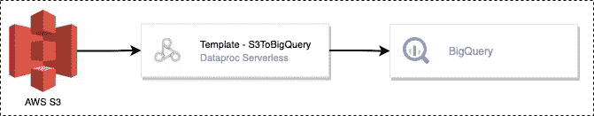

# 使用 Dataproc 无服务器将数据从 AWS S3 导出到 BigQuery

> 原文：<https://medium.com/google-cloud/export-data-from-aws-s3-to-bigquery-using-dataproc-serverless-6dc7a9952fc4?source=collection_archive---------4----------------------->


**data proc Spark 无服务器版**无需配置和管理集群即可运行批量工作负载。它可以动态地调整工作负载资源，比如执行器的数量，以便高效地运行您的工作负载。作为数据开发人员，这使我们能够专注于业务逻辑，而不是花时间管理基础设施。

相比之下，计算引擎上的 **Dataproc 在 GCP 上提供托管 Hadoop 和 Spark 服务。它非常适合希望调配和管理基础架构，然后在 Spark 上执行工作负载的用户。**

**Dataproc 无服务器模板:**现成可用的、开源的、基于 data proc Spark 无服务器的可定制模板。这些模板帮助数据工程师进一步简化在 Dataproc Serverless 上的开发过程，根据他们的需求消费和定制现有的模板。

在这篇文章中，我们将探讨如何使用 Dataproc Serverless for Spark 从 AWS S3 桶向 BigQuery 批量加载数据。

# 先决条件

*   安装并验证了 Google Cloud SDK
*   云壳或预装 Java 8、Maven 3 和 Git 的机器

# S3 到大查询模板

该模板将从亚马逊 S3 桶读取数据，并将其写入 BigQuery 表。它使用 Spark BigQuery 连接器和 Spark S3 连接器。



该模板允许通过执行命令配置以下参数:

*S3 . bq . Access . key*:S3 桶的访问键。
*s3.bq.secret* 。密钥:访问 S3 存储桶所需的密钥。
*S3 . bq . input . format*:S3 桶中的文件格式。示例:avro，parquet，csv，JSON>
*S3 . bq . input . location*:S3 输入位置。s3 输入位置必须以*s3a://*
*S3 . bq . Output . dataset . name*:表驻留或需要创建的 BigQuery 的输出数据集
*S3 . bq . Output . table . name*:big query 的输出表名
*S3 . bq . LD . temp . bucket . name*:预先存在的 S3 桶名，临时文件存放在这里。示例:*模板-s3tobq*

# 主要优势

1.  使用 **Dataproc 无服务器**运行 Spark 批处理工作负载，无需管理 Spark 框架。
2.  S3ToBigquery 模板是开源的，配置驱动的，随时可用。执行代码只需要 AWS S3 证书。
3.  支持的文件格式有 Avro、Parquet、CSV 和 JSON。

# 基本用法

1.  如果你要使用“默认的”由 GCP 生成的 VPC 网络，请确保你已经启用了私有谷歌访问子网。您仍然需要启用如下的私人访问。


```
gcloud compute networks subnets update default --region=us-central1 --enable-private-ip-google-access
```

2.Dataproc Servereless 需要 Cloud NAT 来访问 GCP 以外的地方。要实现这一点，请遵循以下步骤。在步骤(4)中，选择您想要运行 Dataproc 无服务器作业的 VPC。

3.从 AWS S3 存储桶获取访问 S3 存储桶文件夹所需的访问密钥和秘密密钥。

4.在预装了[各种工具](https://cloud.google.com/shell/docs/how-cloud-shell-works)的云壳中克隆 git repo。或者使用任何预装 JDK 8+，Maven 和 Git 的机器。

```
git clone https://github.com/GoogleCloudPlatform/dataproc-templates.gitcd dataproc-templates/java
```

5.获取身份验证凭据(以提交作业)。

```
gcloud auth application-default login
```

6.执行 AWS S3 到 BigQuery Dataproc 无服务器模板:

```
GCP_PROJECT=<gcp-project-id> \
REGION=<region>  \
SUBNET=<subnet>   \
GCS_STAGING_BUCKET=<gcs-staging-bucket-folder> \
HISTORY_SERVER_CLUSTER=<history-server> \
bin/start.sh \
-- --template S3TOBIGQUERY \
--templateProperty s3.bq.access.key=<s3-accesss-key> \
--templateProperty s3.bq.secret.key=<s3-secret-key> \
--templateProperty s3.bq.input.format=<avro,parquet,csv,json> \
--templateProperty s3.bq.input.location=<s3-input-location> \
--templateProperty s3.bq.output.dataset.name=<bq-dataset-name> \
--templateProperty s3.bq.output.table.name=<bq-output-table> \ 
--templateProperty s3.bq.ld.temp.bucket.name=<temp-bucket>
```

7.可以选择更新 template.properties 文件中的以下属性。请注意，在执行命令中作为参数提供的模板属性将优先于在 template.properties 文件中指定的属性。

```
s3.bq.access.key=<s3-accesss-key>
s3.bq.secret.key=<s3-secret-key>
s3.bq.input.format=<avro,parquet,csv,json>
s3.bq.input.location=<s3-input-location>
s3.bq.output.dataset.name=<bq-dataset-name>
s3.bq.output.table.name=<bq-output-table>
s3.bq.ld.temp.bucket.name=<temp-bucket>
```

# 参考

*   [Dataproc 无服务器文档](https://cloud.google.com/dataproc-serverless/docs/overview)
*   [Dataproc 模板 GitHub 库](https://github.com/GoogleCloudPlatform/dataproc-templates)