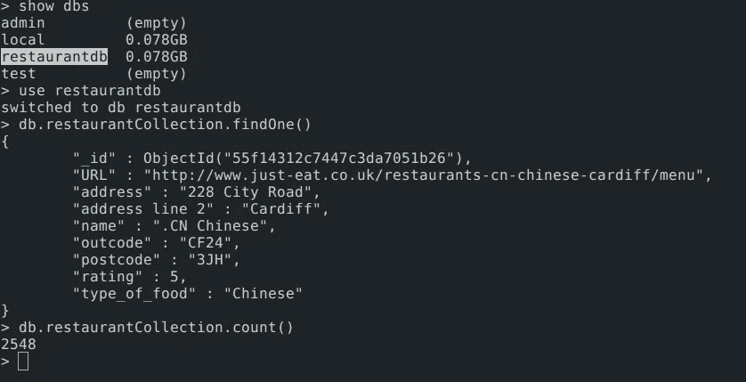

# 使用 MongoDB 导出和加载作业— BigQuery 第一部分

> 原文：<https://medium.com/google-cloud/export-load-job-with-mongodb-bigquery-part-i-64a00eb5266b?source=collection_archive---------0----------------------->


这是 3 个博客系列，面向那些想了解 BigQuery 基础知识(简称为 **BQ** )以及在 BigQuery 系统中获取数据所需的相关工作的读者。

**系列其他帖子:**

*   【Redis 流媒体— BigQuery Part-II |作者 Sunny Gupta | Google Cloud—Community | Medium
*   [补丁和更新表— BigQuery Part-III |作者 Sunny Gupta | Google Cloud—Community | Medium](/google-cloud/patch-and-update-table-bigquery-part-iii-7f2547021926)

# [谷歌大查询](https://cloud.google.com/bigquery/what-is-bigquery)

**什么？** — BigQuery 是谷歌完全托管的、Pb 级的低成本分析数据仓库。

**为什么？** — BigQuery 是 NoOps——不需要管理基础设施，也不需要数据库管理员——因此您可以专注于分析数据以找到有意义的见解，使用熟悉的 SQL，并利用我们的现收现付模式。

**如何？** —注册[谷歌云平台——GCP](https://bigquery.cloud.google.com/)使用你的谷歌账户，开始加载你的数据，利用这个 NoOps 系统的强大功能。

# BigQuery 中的术语

**数据集**

数据集包含在特定的项目中。数据集使您能够组织和控制对表的访问。一个表必须属于一个数据集，因此在将数据加载到 BigQuery 之前，您需要至少创建一个数据集。

**表格**

BigQuery 表包含按行组织的单个记录，以及分配给每列的数据类型(也称为字段)。

**模式**

每个 Every 表都由描述字段名称、类型和其他信息的模式定义。您可以在初始表创建请求期间指定表的模式，也可以创建一个没有模式的表，并在首先填充该表的查询或加载作业中声明该模式。如果以后需要更改模式，可以更新模式。

# 将数据加载到 BigQuery

在本文中，我们将使用 mongoDB 服务器导出我们的数据，并导入到 BQ 中。还有其他几种方法可以将数据导入 BQ。

## 1.从 MongoDB 导出数据


在这个例子中，我在 mongoDB 服务器中有一个名为`restaurantdb`的数据库，集合名为`restaurantCollection`。我们将使用 mongodb 服务器工具提供的`mongoexport`二进制文件进行导出。



```
$ mongoexport -d restaurantdb -c restaurantCollection -o restaurant.json
```

导出完成后，我们可以看到`restaurant.json`文件的内容

```
$ head -n 1 restaurant.json{ "_id" : { "$oid" : "55f14312c7447c3da7051b26" }, \
    "URL" : "http://www.just-eat.co.uk/restaurants-cn-chinese-cardiff/menu", \
    "address" : "228 City Road", "name" : ".CN Chinese", \
    "outcode" : "CF24", "postcode" : "3JH", "type_of_food" : "Chinese" }//pretty json
{
    "name": ".CN Chinese",
    "URL": "http://www.just-eat.co.uk/restaurants-cn-chinese-cardiff/menu",
    "outcode": "CF24",
    "postcode": "3JH",
    "address": "228 City Road",
    "_id": {
        "$oid": "55f14312c7447c3da7051b26"
    },
    "type_of_food": "Chinese"
}
```

## 2.为表准备模式

现在我们已经准备好了 json 格式的数据，可以导入到 BQ 表中。我们需要模式来设计，以便导入这些记录。模式是数据类型为的每个字段的框架，模式中未描述的字段将不会被导入。我们已经给了所有字段为可空的，也就是说，如果字段没有出现在任何记录中，BQ 将定义空值。

```
$ cat restaurantSchema.json
[
    {
        "name": "name",
        "type": "STRING",
        "mode": "NULLABLE"
    },
    {
        "name": "URL",
        "type": "STRING",
        "mode": "NULLABLE"
    },
    {
        "name": "address",
        "type": "STRING",
        "mode": "NULLABLE"
    },
    {
        "name": "outcode",
        "type": "STRING",
        "mode": "NULLABLE"
    },
    {
        "name": "postcode",
        "type": "STRING",
        "mode": "NULLABLE"
    },
    {
        "name": "type_of_food",
        "type": "STRING",
        "mode": "NULLABLE"
    }
]
```

模式参考:[https://cloud.google.com/bigquery/docs/schemas](https://cloud.google.com/bigquery/docs/schemas)

## 3.Google Cloud SDK 安装

**安装:**[https://cloud.google.com/sdk/](https://cloud.google.com/sdk/)

安装完成后，运行以下命令来验证帐户设置。

```
$ gcloud auth list$ gcloud config list
```

## 4.创建 BigQuery 数据集

在谷歌控制台中找到你的 BigQuery。[https://bigquery.cloud.google.com](https://bigquery.cloud.google.com/)

按照以下说明创建数据集。

> **第一步:**


> **第二步:**


> 通过`bq`命令行界面创建数据集

```
$ bq mk -d --data_location=US   BQ_Dataset// Verify your dataset creation
$ bq ls datasetId
 ----------------
  BQ_Dataset
```

**阅读:**[https://cloud . Google . com/big query/docs/datasets # create-dataset](https://cloud.google.com/bigquery/docs/datasets#create-dataset)

## 5.将数据加载到 BigQuery

现在，我的目录包括两个文件，即数据和模式。

```
$ tree
.
├── restaurant.json
└── restaurantSchema.json0 directories, 2 files
```

运行命令将数据加载到 BQ 中。提交加载作业后，将需要几秒到几分钟的时间，具体取决于导入 BQ 表的数据量。

```
Ex: bq load --project_id=<PROJECT-ID> --source_format=NEWLINE_DELIMITED_JSON \
    mydataset.mytable ./myfile.json ./myschema.json$ bq load --project_id=mimetic-slate-179915   \
    --source_format=NEWLINE_DELIMITED_JSON --max_bad_records 10 \
    BQ_Dataset.Restaurant ./restaurant.json  /restaurantSchema.json
```

`--max_bad_records 10`是在导入作业时允许 10 个不良记录的附加标志，超过该值将导致导入失败。

**通过云存储导入**


> 另一种通过`Cloud Storage`导入数据的方法，这种方法比上面的方法快得多。

**读作:**https://cloud.google.com/storage/docs/creating-buckets

```
//to create Cloud storage bucket for this example.
$ gsutil mb  gs://bq-storage//to verify bucket creation
$ gsutil ls
gs://bq-storage/
```

现在，我们将把数据`restaurant.json`上传到存储桶`gs://bq-storage/`中

```
//Run command to upload
$ gsutil cp restaurant.json gs://bq-storage/restaurant.json
```

现在，我们可以使用对象的存储路径来导入 BQ 表。

```
$ bq load --project_id=mimetic-slate-179915  \
    --source_format=NEWLINE_DELIMITED_JSON --max_bad_records 10  \
    BQ_Dataset.Restaurant \
    gs://bq-storage/restaurant.json ./restaurantSchema.json
```

完成`bq load`后，运行以下命令来验证表格创建。

```
$ bq show BQ_Dataset.Restaurant
```

> **输出将类似于此:**


也可以点击刷新后在 bigQuery UI 中验证。访问表格，点击*预览*。您将开始在表中看到记录。


**更进 bq CLI:**【https://cloud.google.com/bigquery/bq-command-line-tool】T4

**更进 gsutil CLI:**[https://cloud.google.com/storage/docs/quickstart-gsutil](https://cloud.google.com/storage/docs/quickstart-gsutil)

# BQ 表中的 SQL 查询

我们将运行一个简单的查询来显示输出。

```
SELECT
  name,
  address
FROM
  [mimetic-slate-179915:BQ_Dataset.Restaurant]
WHERE
  type_of_food = 'Thai'
GROUP BY
  name, address
```


# 结论

*   BigQuery 是一种查询服务，允许您在几秒钟内对多个 TB 的数据运行类似 SQL 的查询。这项技术是谷歌的核心技术之一，就像 MapReduce 和 Bigtable 一样，自 2006 年以来一直被谷歌内部用于各种分析任务。
*   虽然 MapReduce 适用于长时间运行的批处理过程，如数据挖掘，但 BigQuery 是要求尽快得到结果的即席 OLAP/商务智能查询的最佳选择。
*   通配符也可以应用到 Bigquery 表中，以便将计算扩展到多个表。
*   BigQuery 是云计算支持的大规模并行查询数据库，与传统的数据仓库解决方案和设备相比，它提供了极高的全扫描查询性能和成本效益

> **接下来:**尝试 BigQuery 中更多可用的[功能，并投入到更多计算密集型工作中。](https://cloud.google.com/bigquery/docs/how-to)

以上就是这个**系列第一部**的全部内容。希望你从这一页对导入作业、存储和 BigQuery 的基本轮廓有基本的了解。我在我的工作场所看到了 BigQuery 处理 100-120 TB 数据的强大功能，并在一两分钟内获得结果，这真是令人难以置信。如果能通过下面的评论和媒体上的掌声得到反馈，我将不胜感激。

在本系列的下一篇博客中，我们将更多地了解 Bigquery 中的 [***流特性，以实时推送 BQ 表中的数据，使其可用于对变化的数据集进行即时查询。***](/google-cloud/streaming-with-redis-bigquery-part-ii-763cdec9a9ec)

**Github 参考:**[**https://github.com/sunnykrGupta/Bigquery-series**](https://github.com/sunnykrGupta/Bigquery-series)

D **aemon 博客:**[https://sunnykrgupta . github . io/export-load-job-with-MongoDB-big query-part-I . html](https://sunnykrgupta.github.io/export-load-job-with-mongodb-bigquery-part-i.html)

[](https://sunnykrgupta.github.io/export-load-job-with-mongodb-bigquery-part-i.html) [## 守护程序博客-使用 MongoDB - BigQuery 第一部分导出和加载作业

### 桑尼·库马尔的文章和文章

sunnykrgupta.github.io](https://sunnykrgupta.github.io/export-load-job-with-mongodb-bigquery-part-i.html)