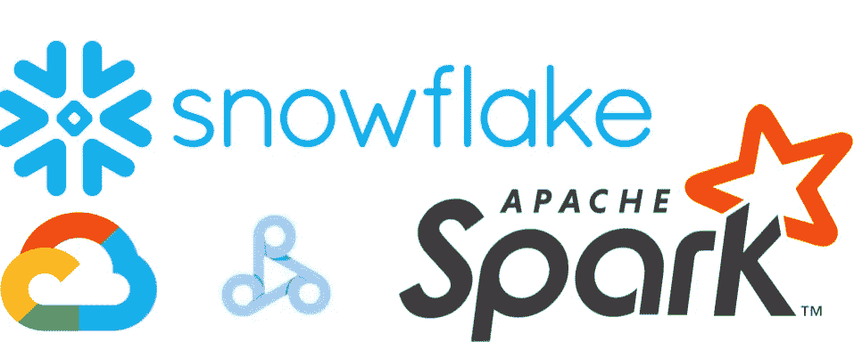
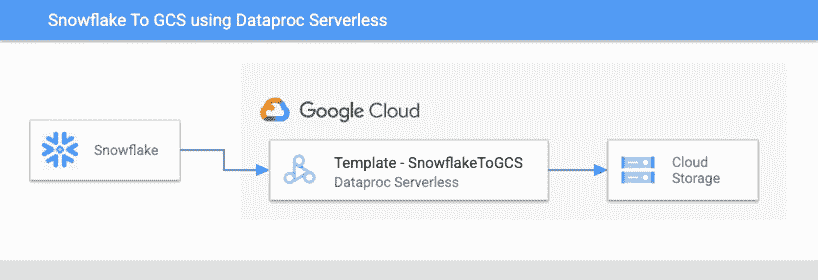

# 使用 Dataproc 无服务器将雪花查询结果导出到 GCS

> 原文：<https://medium.com/google-cloud/export-snowflake-query-results-to-gcs-using-dataproc-serverless-3d68f5a01ca9?source=collection_archive---------2----------------------->



**Dataproc 无服务器**运行批处理工作负载，无需配置和管理集群。它只是在幕后管理所有的基础架构配置和管理。

**主要优势:**

1.  它可以动态地调整工作负载资源，比如执行器的数量，以便高效地运行您的工作负载。
2.  完全托管的无服务器解决方案。
3.  短暂的，一旦作业结束，资源就会被释放。

**Dataproc 无服务器模板:**现成可用的、开源的、基于 data proc Spark 无服务器的可定制模板。这些模板帮助数据工程师进一步简化在 Dataproc Serverless 上的开发过程，根据他们的需求消费和定制现有的模板。

在这篇文章中，我们将探索如何使用 Dataproc Serverless 将数据从雪花表导出到 GCS。

# 雪花到 GCS 模板

该模板从雪花表或查询结果中读取数据，并将其写入 Google 云存储位置。它将[雪花连接器用于 Spark](https://docs.snowflake.com/en/user-guide/spark-connector.html#snowflake-connector-for-spark) ，使 Spark 能够从雪花中读取数据。



该模板允许通过执行命令配置以下参数:

1.  *雪花. gcs.sfurl* :雪花账号网址。
    格式:<账户标识> .snowflakecomputing.com
2.  *雪花. gcs.sfuser* :雪花用户名
3.  *雪花. gcs.sfpassword* :雪花用户密码
4.  *雪花. gcs.sfdatabase* :雪花数据库名称
5.  *雪花. gcs.sfschema* :雪花模式名
6.  *snow flake . GCS . SF warehouse*:雪花仓库
    注:
    ♀这是一个可选属性
    ♀如果没有通过执行命令明确指定，则考虑雪花配置的默认仓库。
7.  *snow flake . GCS . autopushdown*:雪花查询下推特性
    注意:
    ♀这是一个可选属性
    ♀如果没有通过执行命令明确指定，默认值为 on。
8.  *雪花. gcs .表*:雪花输入表
9.  *雪花. gcs.query* :雪花选择查询
    注意:模板属性*雪花. gcs.table* 和*雪花. gcs.query* 必须提供其中一个。
10.  *snow flake . GCS . output . location*:GCS 输出位置
    格式:GS://<bucket-name>/<dir>
11.  *snow flake . GCS . output . format*:GCS 输出文件格式。
    可接受的值:csv、avro、orc、json 或 parquet

# 运行模板

1.  请确保您已经启用了带有专用 Google 访问的子网。如果您使用的是 GCP 创建的“默认”VPC，您仍然需要启用如下的私人访问。


```
gcloud compute networks subnets update default --region=us-central1 --enable-private-ip-google-access
```

2.为 jar 文件创建一个 GCS 存储桶和暂存位置。

3.在预装了各种工具的云壳中克隆 git repo。或者使用任何预装 JDK 8+，Maven 和 Git 的机器。

```
git clone https://github.com/GoogleCloudPlatform/dataproc-templates.git
cd dataproc-templates/java
```

4.认证 gcloud CLI

```
gcloud auth login
```

5.执行 SnowflakeToGCS 模板

*样本执行命令:*

```
export GCP_PROJECT=<gcp-project-id>
export REGION=<gcp-project-region>
export GCS_STAGING_LOCATION=<gcs-bucket-staging-folder-path>
export SUBNET=<gcp-project-dataproc-clusters-subnet>

bin/start.sh \
-- \
--template SNOWFLAKETOGCS \
--templateProperty snowflake.gcs.sfurl <snowflake-account-url> \
--templateProperty snowflake.gcs.sfuser <snowflake-user> \
--templateProperty snowflake.gcs.sfpassword <snowflake-user-password> \
--templateProperty snowflake.gcs.sfdatabase <snowflake-database> \
--templateProperty snowflake.gcs.sfschema <snowflake-schema> \
--templateProperty snowflake.gcs.sfwarehouse <snowflake-warehouse> \
--templateProperty snowflake.gcs.query <snowflake-select-query> \
--templateProperty snowflake.gcs.output.location <gcs-output-location> \
--templateProperty snowflake.gcs.output.format <csv|avro|orc|json|parquet> \
--templateProperty snowflake.gcs.output.mode <Overwrite|ErrorIfExists|Append|Ignore> \
--templateProperty snowflake.gcs.output.partitionColumn <gcs-output-partitionby-columnname> \
--templateProperty snowflake.gcs.autopushdown <on|off>6\. Monitor the Spark batch jo
```

6.在 [Dataproc Batches UI](https://console.cloud.google.com/dataproc/batches) 中提交作业后，您可以监视日志并查看度量。

# 其他高级作业配置

**HISTORY_SERVER_CLUSER** :一个现有的 Dataproc 集群，作为 Spark 历史服务器。该属性可用于指定专用服务器，您可以在其中查看正在运行和已完成的 Spark 作业的状态。示例:

```
export HISTORY_SERVER_CLUSER=projects/<project_id>/regions/<region>/clusters/<cluster_name>
```

**SPARK_PROPERTIES** :如果您需要指定 Dataproc 无服务器支持的 SPARK 属性，比如调整驱动程序、内核、执行器等的数量。使用它来获得对火花配置的更多控制。示例:

```
export SPARK_PROPERTIES=spark.executor.instances=50,spark.dynamicAllocation.maxExecutors=200
```

# 参考

*   [Dataproc 无服务器文档](https://cloud.google.com/dataproc-serverless/docs/overview)
*   [Dataproc 模板 GitHub 库](https://github.com/GoogleCloudPlatform/dataproc-templates)
*   [火花雪花连接器](http://docs.snowflake.com/en/user-guide/spark-connector.html#snowflake-connector-for-spark)
*   [Medium — Cloud Spanner 使用 Dataproc Serverless 导出查询结果](/google-cloud/cloud-spanner-export-query-results-using-dataproc-serverless-6f2f65b583a4)

如有任何疑问或建议，请联系:dataproc-templates-support-external@googlegroups.com