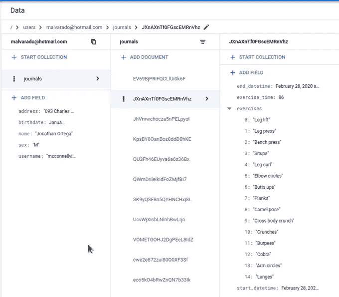
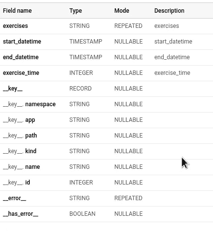
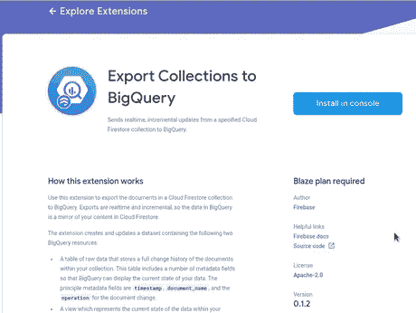
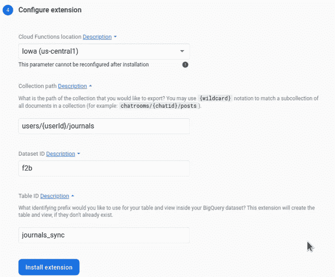
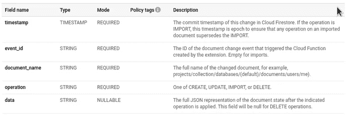
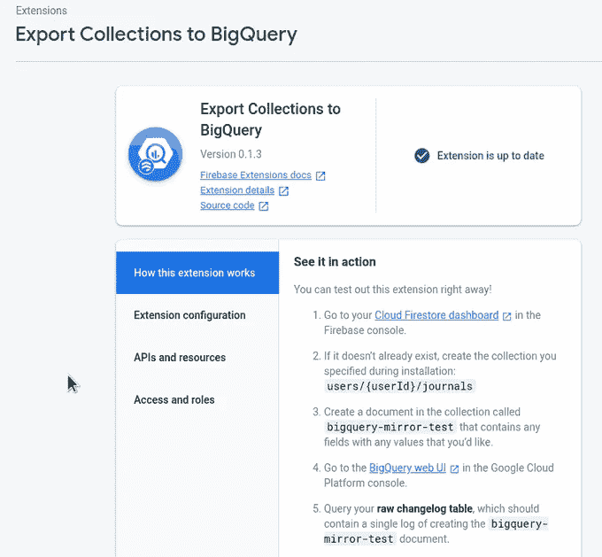

# 将数据从 Firebase (Firestore)导出到 BigQuery

> 原文：<https://medium.com/google-cloud/exporting-data-from-firebase-firestore-to-bigquery-e5a067849645?source=collection_archive---------2----------------------->

Firebase 是一个流行的 web 和移动应用程序开发平台。在 Firebase 平台上开发应用程序时，主要的数据库选项是 NoSQL 数据库云 Firestore，它也是谷歌云平台的一部分。由于 Firestore 是一个 NoSQL 数据库，与 SQL 数据库相比，在关系的建模和设计方面有不同的考虑。NoSQL 数据库的薄弱环节是有限的分析能力。这里 BigQuery 开始发挥作用，因为它是一个专门为 OLAP 分析设计的无服务器数据仓库。问题是如何从 Firestore 获取数据到 BigQuery？

在本文中，我想描述两种方法。一种是导入整批 Firestore 导出，第二种方法是 Firestore 和 BigQuery 之间的在线同步。当然，根据 Firestore 建模，可以通过使用计数器或 Firestore 中的简单查询提取大量分析数据，但没有什么比 SQL 更直接了:)

# 数据

所有代码样本和脚本都在这个库[https://github.com/zdenulo/firestore2bigquery](https://github.com/zdenulo/firestore2bigquery)中。作为数据源，我将使用虚构的 YAFTA 应用程序(另一个健身跟踪应用程序)，它包含了**用户**(用户名、电子邮件、性别等基本信息)的集合，并且这个集合包含了**日志**的子集合，其中记录了每次锻炼。每个日志条目都包含锻炼的开始/结束时间以及所做锻炼种类的列表。我创建了一个脚本来生成随机数据，并将其插入 Firestore，可以在这里找到。我上传了几百个用户，每个人都有几十篇日志。



# 完全出口

Firestore 支持集合到云存储的导出/导入操作，BigQuery 支持这些导出的导入。我们只需要把这些放在一起。

## 1)创建/选择存储桶

在你要做 Firestore 导出的地方，在我的例子中，一个桶将被称为 **f2b-exports**

```
gsutil mb -p $GCP_PROJECT gs://f2b-exports
```

## 2)导出 Firestore 系列

```
gcloud firestore export gs://f2b-exports/export-01 --collection-ids=users,journals
```

我在一个桶中设置了路径‘export-01 ’,否则，它将是 datetime 时间戳。它打印以下输出:

```
Waiting for [projects/zdenky-15ba5/databases/(default)/operations/ASAyNjkxMzMwOTMyChp0bHVhZmVkBxJsYXJ0bmVjc3Utc2Jvai1uaW1kYRQKLRI] to finish...done.           
metadata:
  '@type': type.googleapis.com/google.firestore.admin.v1.ExportDocumentsMetadata
  collectionIds:
  - users
  - journals
  operationState: PROCESSING
  outputUriPrefix: gs://f2b-exports/export-01
  startTime: '2020-03-20T10:49:24.973411Z'
name: projects/zdenky-15ba5/databases/(default)/operations/ASAyNjkxMzMwOTMyChp0bHVhZmVkBxJsYXJ0bmVjc3Utc2Jvai1uaW1kYRQKLRI
```

在打印本文档时，作业已经完成，尽管它显示处于处理状态。对于更大的集合，最好使用 async 标志来异步完成。要获得有关操作的信息，可以使用以下命令:

```
gcloud firestore operations describe ASAyNjkxMzMwOTMyChp0bHVhZmVkBxJsYXJ0bmVjc3Utc2Jvai1uaW1kYRQKLRI
done: true
metadata:
  '@type': type.googleapis.com/google.firestore.admin.v1.ExportDocumentsMetadata
  collectionIds:
  - users
  - journals
  endTime: '2020-03-20T10:49:41.312303Z'
  operationState: SUCCESSFUL
  outputUriPrefix: gs://f2b-exports/export-01
  progressBytes:
    completedWork: '8222613'
  progressDocuments:
    completedWork: '14702'
    estimatedWork: '12928'
  startTime: '2020-03-20T10:49:24.973411Z'
name: projects/zdenky-15ba5/databases/(default)/operations/ASAyNjkxMzMwOTMyChp0bHVhZmVkBxJsYXJ0bmVjc3Utc2Jvai1uaW1kYRQKLRI
response:
  '@type': type.googleapis.com/google.firestore.admin.v1.ExportDocumentsResponse
  outputUriPrefix: gs://f2b-exports/export-01
```

## 3)将数据导入 BigQuery

我们需要将每个集合逐个导入到单独的 BigQuery 表中。我将导入到数据集' **f2b** '中，表将与集合同名。

```
bq load --source_format=DATASTORE_BACKUP f2b.users gs://f2b-exports/export-01/all_namespaces/kind_users/all_namespaces_kind_users.export_metadata
Waiting on bqjob_r4f696fee02205f3e_00000170f79ef5c8_1 ... (1s) Current status: DONEbq load --source_format=DATASTORE_BACKUP f2b.journals gs://f2b-exports/export-01/all_namespaces/kind_journals/all_namespaces_kind_journals.export_metadata
Waiting on bqjob_r1fffa3bf31a8debd_00000170f7a0ed20_1 ... (10s) Current status: DONE
```

在 Github 库中，有一个 Python 代码可以用来部署云功能，或者稍加调整，它可以用作脚本来完成这 3 个步骤。

## BigQuery 模式和查询

在导入数据时，Bigquery 将 Firestore 数据类型转换为其“原生类型”,并添加了几个分组到 **__key__** 记录中的字段，其中最有用的是 **__key__。名称**，包含文件的密钥和 **__key__。路径**包含文档的完整路径。这在连接表(集合)时是必要的。下图是“journals”表的模式。



现在我们可以做任何想到的 SQL 查询。我想，在这种数据的背景下，我们希望将用户和期刊结合起来，并在此基础上进行分析。这里变得有点棘手。列**__ 键 _ _。子集合中的 name** path(在本例中为表 journals)包含如下字符串值:

"用户"，" virginiamoran@gmail.com "，"期刊"，" ZPs9vH2mzR58MFpTQzqc "，即结构:

<parent collection="" name="">、<parent document="" key="">、<subcollection name="">、<subcollection document="" key="">。</subcollection></subcollection></parent></parent>

为了将这个表与' **users** '表连接起来，我们需要提取“父文档关键字”并连接到那个值上。例如，下面是一个计算每个用户锻炼时间总数的基本查询。

```
WITH journals_data AS (
SELECT TRIM(REPLACE(SPLIT(__key__.path, ',')[OFFSET(1)], '"', '')) AS user_key, exercise_time FROM f2b.journals
)

SELECT users.__key__.name AS email, users.name AS name, SUM(journals.exercise_time) AS total_time FROM journals_data AS journals

JOIN f2b.users AS users ON users.__key__.name=journals.user_key
GROUP BY email, name
ORDER BY total_time DESC
```

为了提取密钥，我们需要拆分字符串、替换双引号并进行修剪。除此之外，根据我的经验，其他一切通常都像其他 BigQuery 表一样工作。

## 使用这种方法时，需要记住几件事:

-它总是从 Firestore 完全导出，您不能通过查询或类似方式进行限制。这将计入 Firestore 账单，因为每个 Firestore 操作都是有账单的。

-您需要像示例中那样明确定义要导出的集合/子集合。如果不指定集合，Firestore 会进行完全导出，而这在 BigQuery 中是无法导入的

-对于 BigQuery 导入，可以指定要导入的具体字段/列

-通过在 BigQuery 中创建外部表，无需导出即可查询 Firestore 导出

-当您不需要经常查询数据并且每次都可以进行完全导出时，这种方法很好(取决于 Firestore 数据量和您的预算)

[Firestore 导出/导入](https://firebase.google.com/docs/firestore/manage-data/export-import#export_data)和 [BigQuery 导入](https://cloud.google.com/bigquery/docs/loading-data-cloud-firestore)的官方文档。

# Firestore 和 BigQuery 之间的同步。

这种方法依赖于在 Firestore 集合发生变化时触发云功能，并将这些变化传输到 BigQuery 表中。这样，BigQuery 中的数据与 Firestore 中的数据相同。Firebase 使用“Export Collections to big query”Firebase 扩展提供了一种自动设置的方法。

正如我提到的，除了将数据插入 BigQuery 之外，它还会自动创建一个插入数据的表，并基于该表创建一个视图，以便只获取文档的最新数据。为了设置 Firebase 扩展，您需要登录 Firebase(如果您没有使用它，请在那里导入 GCP 项目)。在这个 URL 上[https://firebase . Google . com/products/extensions/firestore-big query-export](https://firebase.google.com/products/extensions/firestore-bigquery-export)是关于这个扩展的描述和文档。所以你只需要点击“在控制台中安装”按钮，通过 Firebase UI 或使用 Firebase CLI 进行设置。



设置总共有 4 个步骤。作为第一步，它设置一个云功能，检查计费设置，创建一个具有 BigQuery 数据编辑器角色的服务帐户(如果需要),在最后一步，您为 Firebase 集合设置一个集合路径，以及 BigQuery 数据集和数据将被导出到的表名。



在此之后，需要几分钟来部署云功能。BigQuery 中的表是在第一次执行云函数时创建的，并插入到 BigQuery 中。BigQuery 中有以“ **_raw_changelog** ”结尾的表，在我这里是“**journals _ sync _ raw _ changelog**”。这是存储所有更改的地方。每一次更新、删除、插入。基本上在这张表中，你有你的收藏的全部变化历史。模式相当简单并且总是相同的:



在“数据”列中有 JSON 表示的整个文档，字段“文档名”包含文档关键字的完整路径。

为了总是获得最新的数据(并排除已删除的数据)，还会自动创建一个基于" **raw_changelog** "表的视图，其名称以" **_raw_latest** "结尾，在上面的例子中，它是"**journals _ sync _ raw _ latest**"。

通过安装该扩展，您可以将 Firestore 集合中的更改流设置为 BigQuery。但是如果你从 Firestore 中已经有数据的集合开始呢？为此，您还需要执行一个脚本来上传对 BigQuery 的初始更改。

## 上传现有文档

你可以通过访问 URL[https://console.firebase.google.com/u/0/project/<项目 id>/扩展](https://console.firebase.google.com/u/0/project/zdenky-15ba5/extensions)或者点击 Firebase 菜单中的扩展按钮来查看已安装的扩展细节。



当你点击“这个扩展如何工作”时，你会看到这个扩展如何工作的详细概述。在描述的底部，有一个指向 Github repository 的 URL，那里有一个关于如何导入现有文档的描述。我应该强调，目前(2020 年 4 月)脚本不支持子集合的直接导入。在问题中，提到了解决方法，但它涉及到修改源代码，所以我不会在这里描述它。

## 使用脚本导入现有文档

要导入集合，步骤如下:

如果您没有通过 Cloud SDK 的身份验证，您需要执行:

```
gcloud auth application-default login
```

然后当执行下一个命令时(这需要安装 npm/NodeJS)，它下载必要的包并开始交互设置。在这里，您需要输入您的项目 id、集合路径(与设置扩展时相同)、BigQuery 数据集和表前缀(不带 _raw_changes)。我就是这么做的。以...开头的行。是您需要输入值的地方。

```
npx @firebaseextensions/fs-bq-import-collection
? What is your Firebase project ID? zdenky-15ba5
? What is the path of the the Cloud Firestore Collection you would like to import from? (This may, or may not, be the same Collection for which you plan to mir
ror changes.) users
? What is the ID of the BigQuery dataset that you would like to use? (A dataset will be created if it doesn't already exist) f2b
? What is the identifying prefix of the BigQuery table that you would like to import to? (A table will be created if one doesn't already exist) users
? How many documents should the import stream into BigQuery at once? 300
Importing data from Cloud Firestore Collection: users, to BigQuery Dataset: f2b, Table: users_raw_changelog
BigQuery dataset already exists: f2b
BigQuery table with name users_raw_changelog already exists in dataset f2b!
View with id users_raw_latest already exists in dataset f2b.
Inserting 300 row(s) of data into BigQuery
Inserted 300 row(s) of data into BigQuery
Inserting 211 row(s) of data into BigQuery
Inserted 211 row(s) of data into BigQuery
---------------------------------------------------------
Finished importing 511 Firestore rows to BigQuery
---------------------------------------------------------
```

按照预期将数据导入到表中。时间戳是 Unix 纪元时间 0，即 1970–01–01 00:00:00，这确保了如果在此期间有一些更改(并通过云功能上传)，它不会被初始导入覆盖。表中的操作被标记为“导入”。

正如在文档中所提到的，这样做的运算量是 O(集合大小)，所以如果您有一个相当大的集合，如本文第一部分所述，如果您有一个想要导入的子集合，那么完全导出到 BigQuery 会更可靠、更快。

## 在 BigQuery 中从批量导出导入现有文档

在这种情况下，需要一个额外的步骤，那就是将列从批量导出转换为 JSON 数据。在下一个例子中，我将演示它在**‘journals’**子集合中的情况。提醒一下，journals 子集合有四个字段:start_datetime(时间戳)、end_datetime(时间戳)、exercise_time(整数)和 exercises(字符串列表)。为了将 Firestore batch export 中的数据插入到'**journals _ sync _ raw _ changelog**'表中，在该表中插入了所有更改，我编写了以下查询:

```
INSERT f2b.journals_sync_raw_changelog
SELECT TIMESTAMP('1970-01-01 00:00:00') as timestamp,
"" AS event_id, 
CONCAT("projects/zdenky-15b5/databases/(default)/documents/users/", TRIM(REPLACE(SPLIT(__key__.path, ',')[OFFSET(1)], '"', '')), "/journals/", __key__.name) AS document_name, 
"IMPORT" AS operation, 
TO_JSON_STRING(
  STRUCT( STRUCT(UNIX_SECONDS(start_datetime) AS _seconds, 0 AS _nanoseconds) as start_datetime, 
  STRUCT(UNIX_SECONDS(end_datetime) AS _seconds, 0 AS _nanoseconds) AS end_datetime, 
  exercise_time AS exercise_time, 
  exercises AS exercises)
) AS data
FROM f2b.journals
```

这里最复杂的部分是正确构建子集合文档的关键路径，并正确格式化时间戳以符合 Firestore 导出的格式。通过该查询，changelog 表被填充，并且所有数据被导出。

要使用包含最新数据的视图中的数据，需要从 JSON 字符串中解析出**数据**列。不幸的是，目前 BigQuery 中的 JSON 转换很麻烦，所以需要显式完成，数组反序列化需要通过用户定义的函数来完成。因此，要从' **journals** '表中提取 JSON 数据，查询如下所示:

```
CREATE TEMP FUNCTION json_extract_arrayx(s STRING, key STRING) RETURNS ARRAY<STRING> LANGUAGE js AS """
    try {
        var xs = JSON.parse(s)[key];
        return xs == null ? null : xs.filter((x,i) => x != null).map((x,i) => x.toString());
    } catch (e) {
        throw e + ', on input string s: ' + s;
    }
""";

SELECT 
TIMESTAMP_SECONDS(CAST (JSON_EXTRACT(JSON_EXTRACT(data, '$.start_datetime'), "$._seconds") AS INT64)) AS start_datetime,
TIMESTAMP_SECONDS(CAST (JSON_EXTRACT(JSON_EXTRACT(data, '$.end_datetime'), "$._seconds") AS INT64)) AS end_datetime, 
json_extract_arrayx(data, 'exercises') AS exercises,
JSON_EXTRACT(data, '$.exercise_time') AS exercise_time
FROM `f2b.journals_sync_raw_changelog`
```

另一种方法是在视图查询中使用时，使用 UDF 反序列化所有 JSON 数据。

## 结论

批量导出适用于一次性或更大的集合导出，因为主要部分是通过导出批量完成的。在 Github repo 中，有一个如何以编程方式开始批量导出的示例。这可以在云调度器和云功能中使用，以进行定期导出。

使用云功能在线同步看起来是一个显而易见的选择，因为它基本上将 Firestore 的收集状态镜像到 BigQuery，并且您在 BigQuery 中有完整的数据更新历史。根据数据量和使用情况，云功能和 Firestore 运营可能会产生额外费用。