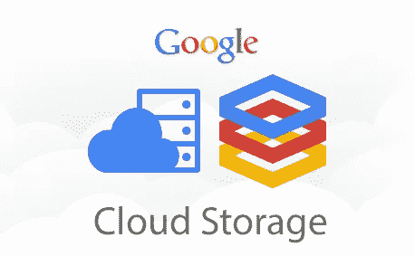
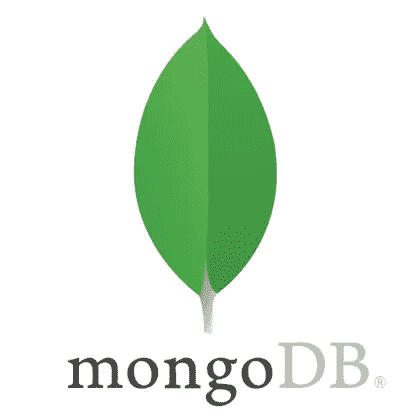

# 使用 Dataproc 无服务器将数据从 MongoDB 导出到 GCS 存储桶

> 原文：<https://medium.com/google-cloud/exporting-data-from-mongodb-to-gcs-buckets-using-dataproc-serverless-64830fb15b51?source=collection_archive---------0----------------------->


每当涉及到内存中的数据处理时，Apache Spark 通常是首选。但是，Spark 提出了 GCP 的 Dataproc 集群的维护成本。这种维护 Spark 集群的开销在使用 Spark 执行新任务时造成了障碍。Google Cloud Community 提出了 Dataproc 无服务器设计，允许我们在 Dataproc 集群上运行 Spark 作业，而不用担心维护 Dataproc / Spark 集群的开销。

Dataproc 无服务器设计可用于运行各种 Spark 作业。一个主要的用例涉及到通过 Google 云存储(GCS)桶导入和导出数据。



MongoDB 是一个非常著名的面向 NoSQL 文档的数据库。从 MongoDB 向一些云存储导出和导入数据是一个非常常见的用例，反之亦然。本文基本上涵盖了一个这样的用例，其中需要使用 Dataproc 无服务器设计方法将数据从 MongoDB 导出到 GCS Buckets。



如今，许多公司使用 MongoDB Atlas(不同云提供商上的 MongoDB 托管服务)，而不是自己管理 MongoDB 集群。因此，本文还将介绍如何使用 Dataproc 无服务器设计连接到 MongoDB Atlas。

# 主要优势

1.  这些模板是开源的，任何人都可以将其用于工作负载迁移。
2.  这些模板本质上是可定制的。这意味着，GitHub 库可以非常容易地被克隆，并可以根据我们的要求通过相应的代码更改提前使用。
3.  Dataproc 无服务器设计将开发人员从管理 Dataproc 集群的麻烦中解放出来。
4.  支持的文件格式有 JSON、Avro、Parquet 和 CSV。
5.  这些模板是配置驱动的，只需更改连接参数，就可以非常容易地用于类似的用例。

# 使用

1.为 jar 文件创建一个 GCS 存储桶和暂存位置。

2.在预装了[各种工具](https://cloud.google.com/shell/docs/how-cloud-shell-works)的云壳中克隆 git repo。或者使用任何预装 JDK 8+，Maven 和 Git 的机器。

```
git clone [https://github.com/GoogleCloudPlatform/dataproc-templates.git](https://github.com/GoogleCloudPlatform/dataproc-templates.git)
cd dataproc-templates/python
```

3.获取身份验证凭据(以提交作业)。

```
gcloud auth application-default login
```

4.执行 MongoToGCS 模板。
例如:当需要连接 MongoDB 时:-

```
export GCP_PROJECT=my-gcp-project
export REGION=us-central1
export GCS_STAGING_LOCATION=gs://staging-bucket
export JARS="gs://jar_location/mongo-java-driver-3.9.1.jar,gs://jar_location/mongo-spark-connector_2.12-2.4.0.jar" ./bin/start.sh \
-- --template=MONGOTOGCS \
--mongo.gcs.output.format="avro" \
--mongo.gcs.output.location="gs://GCS_Bucket_Name/mongogcsoutput" \
--mongo.gcs.output.mode="overwrite" \
--mongo.gcs.input.uri="mongodb://1.2.3.45:27017" \
--mongo.gcs.input.database="demo" \
--mongo.gcs.input.collection="analysis"
```

例如:当需要与 MongoDB Atlas 连接时

```
export GCP_PROJECT=my-gcp-project
export REGION=us-central1
export GCS_STAGING_LOCATION=gs://staging-bucket
export JARS="gs://jar_location/mongo-java-driver-3.9.1.jar,gs://jar_location/mongo-spark-connector_2.12-2.4.0.jar" ./bin/start.sh \
-- --template=MONGOTOGCS \
--mongo.gcs.output.format="avro" \
--mongo.gcs.output.location="gs://GCS_Bucket_Name/mongogcsoutput" \
--mongo.gcs.output.mode="overwrite" \
--mongo.gcs.input.uri="mongodb+srv://<username>:<password>[@hhasija.wnopa.mongodb.net](mailto:root@hhasija.wnopa.mongodb.net)" \
--mongo.gcs.input.database="demo" \
--mongo.gcs.input.collection="analysis"
```

**注意**:如果尚未启用，它会要求您启用 Dataproc Api。

# 计划批处理作业

GCP 原生提供云调度器+云功能，可用于提交 spark 批处理作业。或者自我管理的软件，如 linux cron tab，Jenkins 等。也可以使用。

# 设置附加火花属性

如果您需要[指定 Dataproc 无服务器支持的 spark 属性](https://cloud.google.com/dataproc-serverless/docs/concepts/properties),比如调整驱动程序、内核、执行器等的数量。

您可以编辑 start.sh 文件中的 [OPT_PROPERTIES](https://github.com/GoogleCloudPlatform/dataproc-templates/blob/main/java/bin/start.sh#L50) 值。

**参考资料**
https://medium . com/Google-cloud/importing-data-from-GCS-to-databases-via-JDBC-using-data proc-server less-7ed 75 eab 93 ba
https://github.com/GoogleCloudPlatform/dataproc-templates

https://medium . com/Google-cloud/importing-data-from-GCS-to-MongoDB-using-data proc-server less-fed 58904633 a