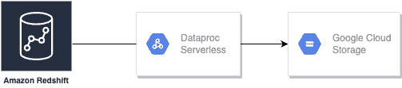

# 将数据从 Redshift 导出到 GCS —使用 GCP Dataproc Serverless 和 PySpark

> 原文：<https://medium.com/google-cloud/exporting-data-from-redshift-to-gcs-using-gcp-dataproc-serverless-and-pyspark-9ab78de11405?source=collection_archive---------2----------------------->


[Dataproc 无服务器](https://cloud.google.com/dataproc-serverless/docs)允许您运行 Spark batch 工作负载，而不需要您提供和管理自己的集群。该服务将在托管计算基础架构上运行工作负载，根据需要自动扩展资源。指定工作负载参数，然后将工作负载提交给 Dataproc 无服务器服务。

[Dataproc 模板](https://github.com/GoogleCloudPlatform/dataproc-templates)使用 Java 和 Python 为在 Dataproc 无服务器上运行的常见用例提供解决方案，让我们能够定制工作负载并轻松运行。

当前多云世界中的一个这样的用例是将数据从 Redshift 导出到 Google 云存储(GCS)。在这篇博客中，我们将讨论如何使用 Dataproc Serverless 处理从 redshift 到 GCS 的数据导出。



# 主要优势

*   使用 Dataproc Serverless 运行 Spark batch 工作负载，而无需提供和管理您自己的集群。
*   [红移到 GCS](https://github.com/GoogleCloudPlatform/dataproc-templates/tree/main/python/dataproc_templates/redshift#redshift-to-gcs) 模板是开源的，完全可定制，随时可用于所需的工作。
*   您可以将 Redshift 中的数据以拼花、AVRO、CSV 和 JSON 格式导入 GCS。

# **先决条件**

为了运行这些模板，我们需要:

*   Google Cloud SDK 已安装并通过验证
*   Python 3.7 以上版本已安装
*   GCP 自动气象站红移和 Dataproc 无服务器之间的连接。
*   用于访问临时 S3 位置和红移 IAM 角色的 AWS 密钥和访问密钥。
*   这里所说的[所需的罐子](https://github.com/GoogleCloudPlatform/dataproc-templates/tree/main/python/dataproc_templates/redshift#required-jar-files)。

# 使用

1.  创建一个 GCS 存储桶，用作 Dataproc 的暂存位置。这个桶将用于存储运行我们的无服务器集群所需的依赖关系。

```
export STAGING_BUCKET=”dataproc-staging-bucket”
gsutil mb gs://$STAGING_BUCKET
```

2.克隆 Dataproc 模板库并导航到 Python。模板的目录

```
git clone [https://github.com/GoogleCloudPlatform/dataproc-templates.git](https://github.com/GoogleCloudPlatform/dataproc-templates.git)
cd dataproc-templates/python
```

3.配置 Dataproc 无服务器作业

为了将作业提交给 Dataproc Serverless，我们将使用提供的 bin/start.sh 脚本。该脚本要求我们使用环境变量来配置 Dataproc 无服务器集群。

强制性配置包括:

*   `GCP_PROJECT`:无服务器运行 Dataproc 的 GCP 项目。
*   `REGION`:运行 Dataproc 无服务器的区域。
*   `GCS_STAGING_LOCATION`:一个 GCS 位置，Dataproc 将在此存储登台资产。应该在我们之前创建的桶内。
*   `SUBNET`:运行 Dataproc 无服务器的子网。

```
# Project ID to run the Dataproc Serverless Job
export GCP_PROJECT=<project_id># GCP region where the job should be submitted
export REGION=<region># The staging location for Dataproc
export GCS_STAGING_LOCATION=gs://$STAGING_BUCKET/staging
export SUBNET=<subnet> 
```

在我们的例子中，红移到 GCS 需要先决条件中提到的[J](https://cloud.google.com/dataproc-serverless/docs/guides/bigquery-connector-spark-example)ar 在类路径中可用。您可以将 JAR 文件存储在 bucket 上，我们将使用`JARS`环境变量添加它。

为了以 AVRO 文件格式导出红移数据，我们还需要已经包含在`bin/start.sh`中的 spark-avro.jar

```
# Path to the Spark Redshift JAR file
export JARS=<comma-seperated-gcs-bucket-location-containing-jar-file>
```

4.执行红移到 GCS Dataproc 模板

配置作业后，我们就可以触发它了。我们将运行`bin/start.sh`脚本，指定我们想要运行的模板和执行的参数值。

```
./bin/start.sh \
-- --template=REDSHIFTTOGCS \
--redshifttogcs.input.url="jdbc:redshift://[Redshift Endpoint]:[PORT]/<dbname>?user=<username>&password=<password>" \
--redshifttogcs.s3.tempdir="s3a://bucket-name/temp" \
--redshifttogcs.input.table="table-name" \
--redshifttogcs.iam.rolearn="arn:aws:iam::xxxxxx:role/Redshift-S3-Role" \
--redshifttogcs.s3.accesskey="xxxxxxxx" \
--redshifttogcs.s3.secretkey="xxxxxxxx" \
--redshifttogcs.output.location="gs://bucket" \
--redshifttogcs.output.mode=<optional-write-mode> \
--redshifttogcs.output.format=<output-write-format> \
--redshifttogcs.output.partitioncolumn=<optional-output-partition-column-name>
```

**注意**:提交作业会要求您启用 Dataproc API，如果还没有启用的话。

5.监控 Spark 批处理作业

提交作业后，我们将能够在 [Dataproc Batches UI](https://console.cloud.google.com/dataproc/batches) 中看到。从那里，我们可以查看作业的指标和日志。

# 参考

*   [Dataproc 无服务](https://cloud.google.com/dataproc-serverless/docs/overview)
*   [Dataproc 模板库](https://github.com/GoogleCloudPlatform/dataproc-templates)