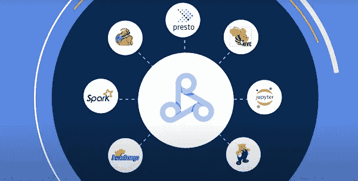
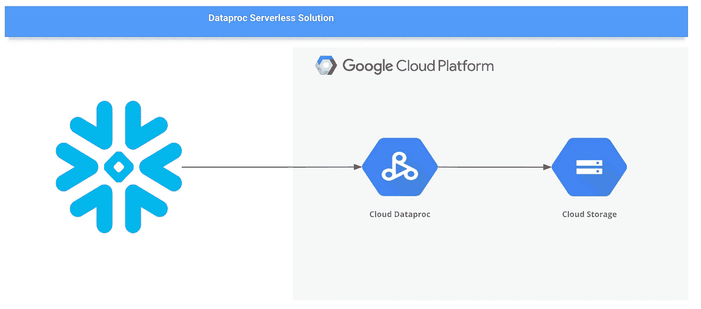

# 在 Dataproc 无服务器上使用 PySpark 将数据从雪花导出到 GCS

> 原文：<https://medium.com/google-cloud/exporting-data-from-snowflake-to-gcs-using-pyspark-on-dataproc-serverless-363d3bed551b?source=collection_archive---------7----------------------->



# 介绍

雪花是基于云的数据仓库解决方案，作为 SaaS 产品提供。它利用 AWS、Google Cloud 或 Azure 提供的基础设施来满足其存储和计算需求。

将数据从 Snowflake 导出到 GCS 的典型程序包括使用`**COPY INTO**` 命令将数据直接移入 GCS 或通过创建外部阶段。尽管这是将数据导入 GCS 的最简单方法，但如果您需要按计划导出数据，或者需要导出的数据太大，这不是一种有利/推荐的方法。当您需要定期导出大量数据时，Dataproc Serverless 将会派上用场。

这篇博文解释了如何使用 Dataproc Serverless 将数据从雪花导出到 GCS。

以下是一些需要将数据从雪花导出到 GCS 的用例:

1.  您希望将您的 DWH 迁移到 BigQuery，并希望 GCS 充当一个临时层。
2.  您希望按照规定的计划将 cold 数据归档到 GCS。
3.  你想把你的数据用于机器学习活动(BQML，Vertex AI 等。等等。)

# Dataproc 无服务器有什么帮助？

嗯，Dataproc Serverless 为您提供了 Hadoop 和 Spark 的功能，并且少了一个顾虑，即管理 Dataproc 集群配置和调优的开销。无论您的数据大小如何，Dataproc Serverless 都会在托管计算基础设施上运行您的工作负载，根据需要自动缩放/缩减资源。
与传统的 Dataproc 集群相比，它也更便宜，在传统的 data proc 集群中，为了节省成本，您需要担心在集群空闲时停止集群，并在需要时重启集群。在 Dataproc Serverless 的情况下，只对处理工作负载的时间收费。

# 输入 Dataproc 无服务器模板..

[Dataproc 模板](https://github.com/GoogleCloudPlatform/dataproc-templates)用 JAVA 和 Python 为 Spark 工作负载的大多数常见用例提供现成的代码。这些可以根据最终用户的具体需求进一步定制。这些模板在根据 repo 中提供的指令运行时，将部署 Dataproc 无服务器作业来执行您的数据工作负载的处理。

**在本帖**中，我们将讨论如何使用 PySpark **雪花到 GCS 模板**。



# 先决条件

为了运行这些模板，我们需要:

*   具有对象读取/创建权限的雪花帐户
*   具有时段创建权限并启用了 Dataproc API 的 GCP 帐户。
*   Google Cloud SDK 已安装并通过验证。
*   Python 3.7+已安装。
*   这里提到的[所需的罐子](https://github.com/GoogleCloudPlatform/dataproc-templates/tree/main/python/dataproc_templates/snowflake#jars-required)
*   启用了专用 Google 访问的 VPC 子网。默认子网是合适的，只要启用了私有 Google 访问。您可以在此查看所有 Dataproc 无服务器网络需求[。](https://cloud.google.com/dataproc-serverless/docs/concepts/network)

```
# Example updating default network to enable Private Google Access
gcloud compute networks subnets update default — region=us-central1 \
— enable-private-ip-google-access
```

# 使用

1.  创建一个 GCS 存储桶，用作 Dataproc 的暂存位置。这个桶将用于存储运行我们的无服务器集群所需的依赖关系。

```
export STAGING_BUCKET=”dataproc-staging-bucket”
gsutil mb gs://$STAGING_BUCKET
```

2.克隆 Dataproc 模板库并导航到 Python。模板的目录

```
git clone https://github.com/GoogleCloudPlatform/dataproc-templates.git
cd dataproc-templates/python
```

3.配置 Dataproc 无服务器作业

为了将作业提交给 Dataproc Serverless，我们将使用提供的 bin/start.sh 脚本。该脚本要求我们使用环境变量来配置 Dataproc 无服务器集群。

强制配置包括:

*   `GCP_PROJECT`:无服务器运行 Dataproc 的 GCP 项目。
*   `REGION`:运行 Dataproc 无服务器的区域。
*   `GCS_STAGING_LOCATION`:一个 GCS 位置，Dataproc 将在此存储登台资产。应该在我们之前创建的桶内。
*   `SUBNET`:运行 Dataproc 无服务器的子网。

```
# Project ID to run the Dataproc Serverless Job
export GCP_PROJECT=<project_id># GCP region where the job should be submitted
export REGION=<region># The staging location for Dataproc
export GCS_STAGING_LOCATION=gs://$STAGING_BUCKET/staging
export SUBNET=<subnet>
```

在我们的例子中，到 GCS 的雪花需要先决条件中提到的 ARs 在类路径中可用。您可以将 JAR 文件存储在一个桶中，我们将使用`JARS`环境变量来添加它。

```
# Path to the Snowflake connector JAR file
export JARS=<comma-seperated-gcs-bucket-location-containing-jar-file>
```

4.运行 Dataproc 模板 shell 脚本，它将读取上述变量，创建一个 Python 包，并将作业提交给 Dataproc Serverless。

```
bin/start.sh \
-- --template=SNOWFLAKETOGCS \
--snowflake.to.gcs.sf.url=<snowflake-account-url> \
--snowflake.to.gcs.sf.user=<snowflake-user> \
--snowflake.to.gcs.sf.password=<snowflake-user-password> \
--snowflake.to.gcs.sf.database=<snowflake-database> \
--snowflake.to.gcs.sf.schema=<snowflake-schema> \
--snowflake.to.gcs.sf.warehouse=<snowflake-warehouse> \
--snowflake.to.gcs.sf.query=<snowflake-select-query> \
--snowflake.to.gcs.output.location="gs://bucket" \
--snowflake.to.gcs.output.format=<csv|avro|orc|json|parquet> \
--snowflake.to.gcs.output.mode=<Overwrite|ErrorIfExists|Append|Ignore> \
--snowflake.to.gcs.partition.column=<gcs-output-partitionby-columnname> \
--snowflake.gcs.sf.autopushdown=<on|off>
```

**注**:

*   确保“python”可执行文件在您的路径中
*   提交作业将要求您启用 Dataproc API，如果还没有启用的话。
*   强制参数:雪花. to.gcs.sf.url，雪花. to.gcs.sf.user，雪花. to.gcs.sf.password，雪花. to.gcs.sf.database，雪花. to.gcs.output.location

5.您可能已经注意到，在提交模板时需要填写一些参数。这些参数在[模板文档](https://github.com/GoogleCloudPlatform/dataproc-templates/tree/main/python/dataproc_templates/snowflake#1-snowflake-to-gcs)中描述。

6.监控 Spark 批处理作业

提交工作后，我们将能够在[data roc 批处理界面](https://console.cloud.google.com/dataproc/batches)中看到。在那里，我们可以查看作业的度量和日志。

# 预定处决

您也可以选择设置作业的计划执行，而不是通过 start.sh 脚本提交作业。当您希望在白天收到新数据时定期从雪花移动到 GCS 时，此设置非常有用。您可以使用云计划程序来计划 Dataproc 模板的执行。云计划程序是一项 GCP 服务，提供 cron 作业计划程序的功能。

由于雪花是一个 OLAP 数据库，CDC 的变化将主要包括批量更新。雪花表有一个维护上次更新时间戳的附加时间戳列。您需要修改查询参数`snowflake.to.gcs.sf.query`的值，以包括时间戳过滤器，这样您的计划作业就可以读取最新的数据来进行增量加载。

# 关键词

`**Autopushdown**`

*   Spark-雪花连接器提供的一种功能，通过允许将大型复杂的 Spark 逻辑计划转换并推送到雪花，而不是在 Spark 中进行处理，从而引入了高级优化功能以提高性能。这意味着，雪花将通过利用其性能效率来完成大部分繁重的工作。

# 参考

*   [data roc serv less](https://cloud.google.com/dataproc-serverless/docs/overview)
*   [data roc 模板库](https://github.com/GoogleCloudPlatform/dataproc-templates)