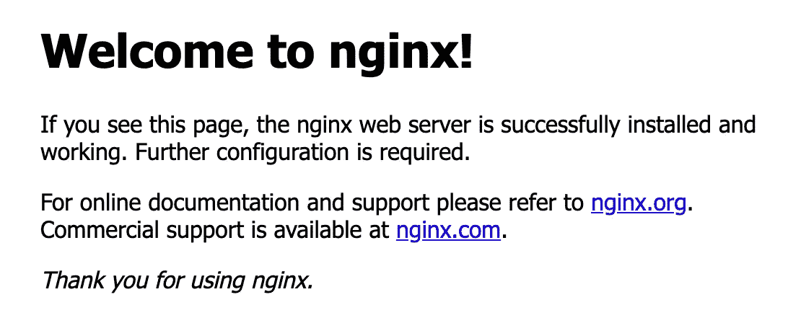

# 利用内置入口公开 GKE 应用程序

> 原文：<https://medium.com/google-cloud/exposing-gke-applications-leveraging-the-built-in-ingress-e87b78e23e90?source=collection_archive---------0----------------------->

今天，我决定用 [GKE](https://cloud.google.com/kubernetes-engine) 玩一玩，看看如何通过默认的 [GKE 入口](https://cloud.google.com/kubernetes-engine/docs/concepts/ingress)公开一个简单的演示应用程序。

对我来说，在生产环境中公开应用程序意味着(至少…):

*   仅在 HTTPS 上公开我的应用程序
*   自动将任何 HTTP 连接重定向到 HTTPS
*   使用静态 IP，而不是短暂的 IP
*   让谷歌自动为我管理证书

虽然我习惯于浏览[谷歌云文档](https://cloud.google.com/kubernetes-engine/docs/how-to/load-balance-ingress)，但我意识到我仍然需要相当长的时间来把所有的片段放在一起，所以我决定写这个简短的教程。

# 我出发的地方

我所拥有的只是一个最小的设置，我通常保持活跃来尝试一些东西或者运行演示。没什么复杂的:

*   GKE 集群(我使用私有集群，但是公共集群也可以)
*   公共域名。为了这个练习，我们称它为*mydomain.com*。
*   管理客户端(我的笔记本电脑！)，配置为使用已经设置的 kubectl 和 gcloud 访问集群控制平面。

# 开始部署吧！

这将是一个*“快速和肮脏的”*演练。我将强调几件事，因为我们将浏览部署，并将一些相关链接放在文章的末尾，这样您就可以深入了解大多数步骤。

对于这个练习，我们将尝试在*https://www.mydomain.com 展示一个简单的 web 应用程序。*

首先，让我们部署一个示例 *nginx* 应用程序

```
# app.yamlapiVersion: v1
kind: Pod
metadata:
  creationTimestamp: null
  labels:
    app: ingress-test
  name: ingress-test
spec:
  containers:
  - name: ingress-test
    image: nginx:latest
    imagePullPolicy: Always
  dnsPolicy: ClusterFirst
  restartPolicy: Always
status: {}---apiVersion: v1
kind: Service
metadata:
  creationTimestamp: null
  labels:
    app: ingress-test
  name: ingress-test-svc
  annotations:
    cloud.google.com/neg: '{"ingress": true}'
spec:
  ports:
  - name: ingress-test-port
    port: 80
    protocol: TCP
    targetPort: 80
  selector:
    app: ingress-test
  type: ClusterIP
status:
  loadBalancer: {}
```

注意服务 *ingress-test-svc* 的注释*cloud.google.com/neg:“{ " ingress ":true }”*。这有两个好处:

*   作为服务创建的结果而分配的全局负载平衡器(GLB)将直接在 pod 之间对流量进行负载平衡，而不是在 GKE 节点之间，从而利用所谓的[容器本地负载平衡](https://cloud.google.com/kubernetes-engine/docs/concepts/container-native-load-balancing)，因此[网络端点组(NEGs)](https://cloud.google.com/load-balancing/docs/negs) 。这将避免 Kubernetes 集群内部的第二级负载平衡/流量路由，有利于更可靠和更快速的路由。
*   [您将能够在入口](https://cloud.google.com/kubernetes-engine/docs/how-to/container-native-load-balancing#using)中引用集群 IP 服务，而不必创建节点端口或负载平衡器服务。

让我们部署应用程序:

```
kubectl apply -f app.yaml
```

我们来分配一个静态 IP。对于演示，我们将使用 *gcloud* 快速完成，但是 [Terraform](https://registry.terraform.io/providers/hashicorp/google/latest/docs/resources/compute_address) 或 [GUI](https://cloud.google.com/compute/docs/ip-addresses/reserve-static-external-ip-address) 也可以使用。从云壳里，我们跑吧

```
gcloud compute addresses create ingress-test-ip --global
```

IP 地址立即可见

```
gcloud compute addresses describe ingress-test-ip --global
**address: X.X.X.X**
addressType: EXTERNAL
creationTimestamp: '2021-12-23T01:32:03.047-08:00'
description: ''
id: 'xxxxxxxxxxxxxxx'
ipVersion: IPV4
kind: compute#address
name: ingress-test
networkTier: PREMIUM
selfLink: [https://www.googleapis.com/compute/v1/projects/xxxxxxxx/global/addresses/ingress-test-ip](https://www.googleapis.com/compute/v1/projects/psc-241325431543/global/addresses/ingress-test)
status: IN_USE
```

接下来，我们需要创建一个 A DNS 记录(在我的例子中，[我是在云 DNS](https://cloud.google.com/dns/docs/records) 中创建的，因为我的域是在那里管理的)，这样我们的 www.mydomain.com[](http://www.mydomain.com)*就指向了 GLB IP 地址。*

*现在让我们创建将由负载平衡器公开的证书。虽然这可以通过 Terraform 或 GUI 创建，但有一种直接从 GKE 请求的便捷方法:*

```
*# cert.yamlapiVersion: networking.gke.io/v1
kind: ManagedCertificate
metadata:
  name: ingress-test-cert
spec:
  domains:
    - www*.mydomain.com**
```

*用您拥有的域替换该域，并应用:*

```
*kubectl apply -f cert.yaml*
```

*将会请求一个新的证书，但是在验证之前它不会被激活，所以直到负载平衡器被创建并且一个 DNS 条目将指向它(在我们的例子中最后一个已经是真的)。我们将能够从 GUI 或直接通过 kubectl 定期检查证书的状态。*

```
*kubectl get managedcertificates
NAME                AGE     STATUS
ingress-test-cert   2m      Pending*
```

*现在让我们创建入口对象:*

```
*# ingress.yamlapiVersion: networking.gke.io/v1beta1
kind: FrontendConfig
metadata:
 name: ingress-test-fe-config
spec:
 redirectToHttps:
   enabled: true
   responseCodeName: PERMANENT_REDIRECT---apiVersion: networking.k8s.io/v1
kind: Ingress
metadata:
  name: test-ingress
  annotations:
    kubernetes.io/ingress.class: "gce"
    kubernetes.io/ingress.global-static-ip-name: "ingress-test-ip"
    networking.gke.io/managed-certificates: "ingress-test-cert"
    networking.gke.io/v1beta1.FrontendConfig: "ingress-test-fe-config"
spec:
  defaultBackend:
    service:
      name: ingress-test-svc
      port:
        number: 80*
```

*在这个文件中，我们创建了两个对象:*

*   *将任何 HTTP 连接重定向到 HTTPS 的前端配置(这将自动转换为 GLB 配置)。感谢伯恩哈德·魏斯胡恩！*
*   *入口对象，也引用配置。*

*说到注解:*

*   **ingress.class* 被设置为 *gce* 。我喜欢明确地指定这一点，尽管这是没有手动指定时的默认值。*
*   *我们告诉入口使用我们之前创建的静态 IP，使用它的 GCP 资源名。*
*   *我们引用刚刚在 GCP 通过 Kubernetes 请求的托管证书对象。*
*   *我们引用 FrontendConfig 对象，它刚刚在上面的同一个文件中创建。*

*让我们申请:*

```
*kubectl apply -f ingress.yaml*
```

*创建负载平衡器需要一些时间。在资源调配期间，我们应该看到类似这样的内容*

```
*kubectl get ingress
NAME           CLASS    HOSTS   ADDRESS   PORTS   AGE
test-ingress   <none>   *                 80      4s*
```

*但是几分钟后，当负载平衡器准备就绪时，我们应该看到 GLB IP 出现在输出中(至少，这通常是一个好迹象！)*

```
*NAME           CLASS    HOSTS   ADDRESS         PORTS   AGE
test-ingress   <none>   *       x.x.x.x.        80      158m*
```

*证书供应可能需要更长的时间( [Google 说](https://cloud.google.com/kubernetes-engine/docs/how-to/managed-certs#setting_up_a_google-managed_certificate)可能需要 60 分钟证书才能生效)。对我来说，不超过 5 分钟。这是你应该看到的:*

```
*kubectl get managedcertificates
NAME                AGE     STATUS
ingress-test-cert   15m      Active*
```

*剩下的事情就是打开浏览器，连接到 https://www.mydomain.com 的*，这将显示默认的 nginx 页面。**

****

**注意，当我们试图连接到 http://www.mydomain.com 的[](http://www.mydomain.com)*时，我们总是会被重定向到它的 *https* 版本。***

# **有用的链接**

**以下是我在练习中使用的一些有用的链接。它们包含更多的变体(即自管理证书)，应该明确用于巩固本文中探讨的概念。**

*   **[在具有入口的 HTTPS 负载平衡中使用多个 SSL 证书](https://cloud.google.com/kubernetes-engine/docs/how-to/ingress-multi-ssl#google-managed-certs_1)**
*   **[使用谷歌托管证书](https://cloud.google.com/load-balancing/docs/ssl-certificates/google-managed-certs)**
*   **[为外部负载平衡配置入口](https://cloud.google.com/kubernetes-engine/docs/how-to/load-balance-ingress)**
*   **[通过入口实现容器本地负载平衡](https://cloud.google.com/kubernetes-engine/docs/how-to/container-native-load-balancing)**

**希望这篇简短的教程对你有用，能帮你节省时间，或者至少能激起你的好奇心。**

**更多文章即将发布。敬请期待！**

***感谢* [*西蒙·鲁菲利*](https://medium.com/u/2288812ff80e?source=post_page-----e87b78e23e90--------------------------------) *的点评！***