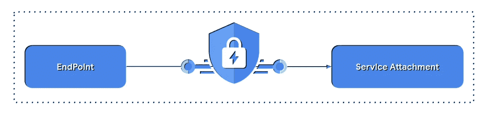
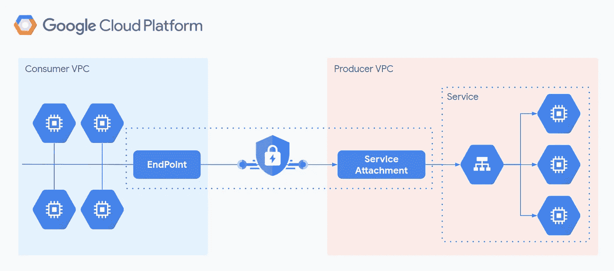
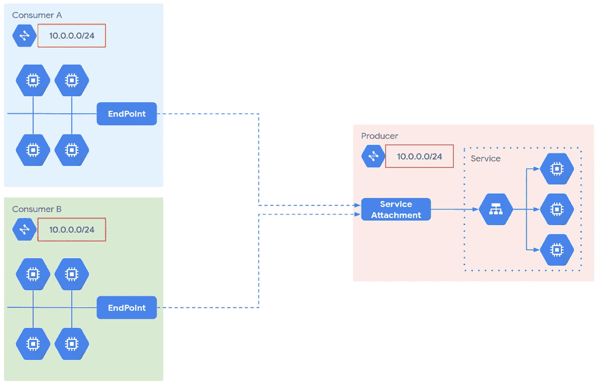
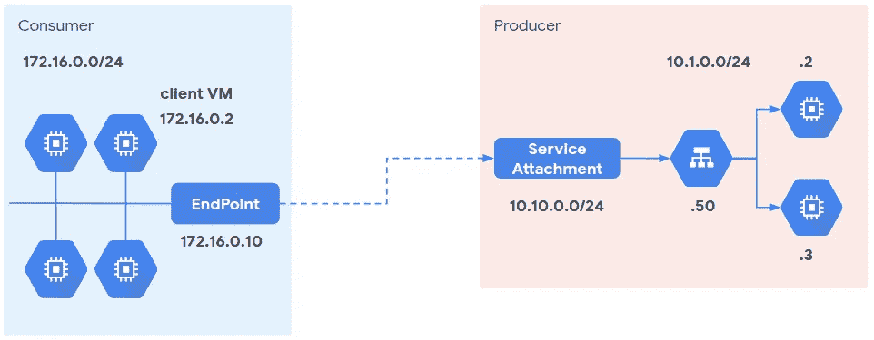
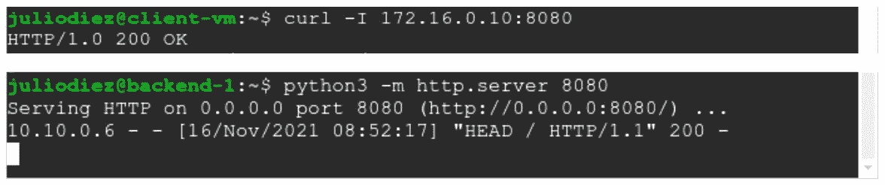
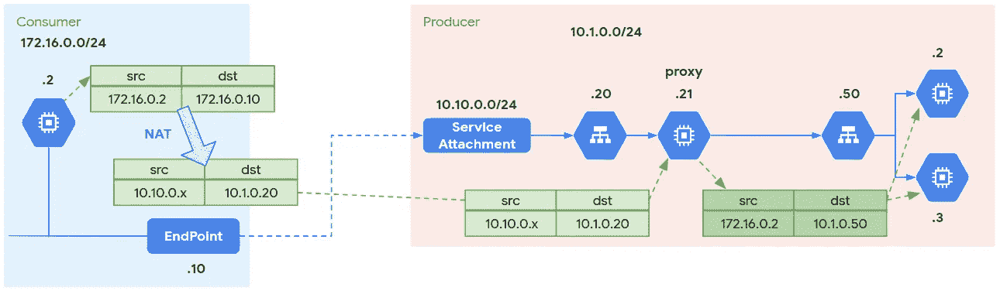
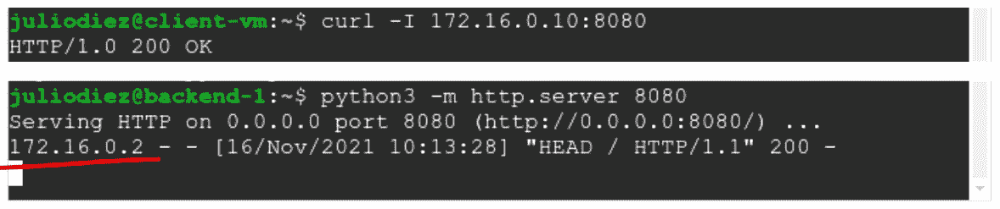

# 公开 PSC 背后的客户端

> 原文：<https://medium.com/google-cloud/exposing-the-client-behind-psc-2471a851ae23?source=collection_archive---------0----------------------->



[私有服务连接](https://cloud.google.com/vpc/docs/private-service-connect?hl=en) (PSC)为 VPC**中的服务启用生产者-消费者模型，它们之间没有网络连接**。GCP 使之成为可能，但它意味着将客户端隐藏在请求后面。对于需要发出请求的客户机的源 IP 的服务来说，这是一个问题。在本文中，我将解释一种向服务公开客户端的方法。

# 以云的方式连接

在 GCP，你可以使用 [VPC 网络对等](https://cloud.google.com/vpc/docs/vpc-peering)或 VPN 在服务生产者的 VPC 和服务消费者的 VPC 之间实现私有连接。这两种方法存在于不同的用例中，有各自的优点和一些限制。值得注意的是，需要不重叠的 IP 范围。

PSC 克服了其中的许多限制，允许*私有*跨属于不同项目或组织的多个 VPC 网络消费服务。当然，你不能要求多个组织在给他们的项目分配 IP 范围时进行协调。PSC 不要求。

我不会分析 PSC 相对于其他解决方案的所有优势和局限性，但我会简要描述它是如何工作的，以便为接下来的讨论奠定基础。考虑到 PSC 有几种风格，这里我将讨论“ [PSC 发布和消费服务](https://cloud.google.com/vpc/docs/private-service-connect?hl=en#benefits-services)”。

# PSC 架构

PSC 最简单的形式非常简单。生产者 VPC 提供服务，消费者 VPC 将消费该服务。生产者创建一个*服务附件*来公开服务，消费者创建一个*端点*来定位这个附件。



基本 PSC 架构。

该服务需要是负载平衡的服务，对于 GCP，这可以是 L4 或 L7 内部负载平衡器(ILB)。服务附件指向该负载均衡器的 [*转发规则*](https://cloud.google.com/load-balancing/docs/forwarding-rule-concepts) 。端点本身是一个转发规则，其目标是服务附件 URI，而不是后端服务或代理。

请注意，这些 VPC 之间没有第 3 层网络连接，每个 VPC 都有自己独立的网络域。你只需要处理 API 来建立关系，GCP 的软件定义网络平台 Andromeda 会处理剩下的事情。现在，这些 VPC 可以使用相同的 IP 范围，重叠不再是问题。事实上，PSC 允许部署多租户模型，在该模型中，您的服务由多个消费者使用，而不管他们的子网范围。



具有重叠地址的多租户模型。

# 事情可能会发生的地方

我提到 PSC 公开了 L4 或 L7 ILB 背后的服务。L7 ILB 是一个 HTTP 代理，因此后端会将代理 IP 视为请求中的源 IP。如果他们需要发出请求的客户端的原始源 IP，则报头“X-Forwarded-For”包含该信息。

L4 ILB 不是一个代理虽然。服务附件需要定义一个 NAT 范围，PSC 使用该范围将请求的源 IP 转换为生产者 VPC 的一部分。后端会将该 NAT 范围内的 IP 视为来源，这意味着通常非 HTTP 应用程序不会看到原始的客户端 IP。

不过有一个变通办法。[代理](http://www.haproxy.org/download/1.8/doc/proxy-protocol.txt)协议被设计用来将信息从客户端连接转发到下一个主机。这是通过在每个连接开始时在 L4 添加报头来实现的。PSC 与代理协议兼容，因此您可以在创建服务附件时启用它。当然，接收该信息的后端应用程序应该与该协议兼容，否则连接将失败。

这就是事情变得复杂的地方。许多应用程序与代理协议不兼容，如果您有这样的应用程序，并且需要保留原始的客户端 IP，PSC 和 NAT 通常会成为一个问题。这个用例是本文的重点。

# 测试部署

我将部署一个测试场景来向您展示这一切是如何进行的。尽管我提到过地址重叠不是问题，但为了便于理解，我将使用不同的子网范围。



初始测试场景。

我不会在这里键入所有的安装说明，只是那些与 PSC 和测试它更相关的说明。我认为你能够填补这些空白。

## *服务

该服务由作为实例组一部分的两个虚拟机和指向它的名为“ilb-myservice”的内部 TCP/UDP 负载平衡器组成。出于测试目的，我在每台服务器上运行了一个简单的 HTTP 服务器。正如我所说的，本文的重点是 L3/L4 应用程序，但是对于测试来说，使用一些日志和工具 curl 运行一个简单的 web 服务器是非常方便的:

```
$ python3 -m http.server 8080
```

## *服务附件

首先，您需要一个用于服务附件的 NAT 子网。此子网仅用于 PSC，不能用于虚拟机等其他资源:

```
$ gcloud compute networks subnets create producer-subnet-psc --network vpc-producer --region europe-west1 --range 10.10.0.0/24 --purpose PRIVATE_SERVICE_CONNECT
```

服务附件指向“ilb-myservice-forwarding-rule”，使用之前的 NAT 子网“producer-subnet-PSC”(10 . 10 . 0 . 0/24):

```
$ gcloud compute service-attachments create myservice-attachment --region europe-west1 --producer-forwarding-rule ilb-myservice-forwarding-rule --connection-preference=ACCEPT_AUTOMATIC --nat-subnets producer-subnet-psc
```

## *端点

为消费者 VPC 中的端点保留内部 IP 地址:

```
$ gcloud compute addresses create ip-psc-endpoint --region europe-west1 --subnet consumer-subnet-1 --addresses 172.16.0.10
```

创建转发规则以将端点连接到生成器的服务附件:

```
$ gcloud compute forwarding-rules create fr-psc-endpoint --region europe-west1 --network vpc-consumer --address ip-psc-endpoint --target-service-attachment projects/[PRODUCER_PROJECT_ID]/regions/europe-west1/serviceAttachments/myservice-attachment
```

## *测试连接

如果我们通过端点从消费虚拟机向服务发出请求，我们可以检查它是否工作，尽管 VPC 没有连接！



从消费者到生产者 VPC 的连接测试。

请注意该请求是如何被视为来自 IP 10.10.0.6，来自 NAT 范围的。该请求也发送到端点 IP 172 . 16 . 0 . 10，但是它通过 ILB VIP 10 . 1 . 0 . 50 到达后端。你可以用' tcpdump '或者 [VPC 流量日志](https://cloud.google.com/vpc/docs/flow-logs)如果你不信任我:)

# 公开客户端

PSC 是在云中连接消费者和服务的一种很好的方式，因此对于那些需要知道客户端 IP 的应用程序来说，也值得利用它。我们需要使用代理协议来恢复这些信息，但是由于我们正在考虑不兼容的应用程序，我们需要一个代理服务来理解代理协议并为它们处理它，还需要一些管道。

我将部署一个运行 [HAProxy](https://www.haproxy.com/) 的代理虚拟机。我选择这个软件是因为它是一个伟大的 TCP/HTTP 代理和负载均衡器，一个 HAProxy 开发者设计了代理协议，所以它得到了很好的支持。您可以使用免费版或付费版来获得更多的企业功能和支持。

其思想是代理将通过服务附件中启用的代理协议接收连接及其信息。然后，我将使用这些信息来翻译请求并连接到服务。



通过代理服务公开客户端。注意，现在有两个 TCP 连接。

## *配置代理虚拟机

代理虚拟机将转发来源不同于其内部 IP 的数据包，因此它需要在虚拟机级别启用 IP 转发:

```
$ gcloud compute instances create ... --can-ip-forward
```

此外，它还需要接受对这些来源的回应。为此我们将配置 *AnyIP* 功能:

```
proxy$ sudo ip route add local 172.16.0.0/24 dev lo
```

我们正在为消费者 IP 范围添加一个本地路由，这样我们的虚拟机将接受 IP 上未明确配置的流量。要删除与消费者 VPC 的相关性，您可以使用 172.16.0.0/12 这样的范围。

## *安装和配置 HAProxy

在此按照[中的说明安装 HAProxy。它带有一个默认配置，通常位于“/etc/haproxy/haproxy.cfg”中。HAProxy 有很多](https://haproxy.debian.net/)[特性和选项](http://cbonte.github.io/haproxy-dconv/2.4/configuration.html)我就不一一介绍了，只有你需要修改的最少部分才能让我们的设置工作:

```
global
  # Comment out these two lines to be root and spoof client IP
  #user haproxy
  #group haproxydefaults
  # Use TCP load balancing
  #mode http
  #option httplog
  mode tcp
  option tcplogfrontend myfrontend
  # Accept PSC connections on this port. Enable PROXY protocol, PSC will send client connection information on it
  bind :8080 accept-proxy
  # Dispatch the accepted connections to this backend
  default_backend myservicebackend myservice
  # Set source address for outgoing connections, using source IP (and port) from client connection
  source 0.0.0.0 usesrc client
  # The backend is the ILB
  server fw_rule 10.1.0.50
```

保存文件并重新启动服务:

```
proxy$ sudo systemctl restart haproxy
```

## *更多管道

使代理虚拟机成为实例组的一部分，并放置一个指向它的内部 TCP/UDP 负载平衡器，称为“ilb-proxy”。它将由 PSC 使用。您还需要在生产者 VPC 中创建一个到该 ILB 的路由，以将流量发送回来:

```
$ gcloud compute routes create route-via-proxy --network=vpc-producer --destination-range=172.16.0.0/24 --next-hop-ilb=ilb-proxy-forwarding-rule
```

同样，这里您可以使用 172.16.0.0/12 这样的范围，这样您就不需要为每个消费者指定新的路由。

## *配置 PSC

删除以前的服务附件，创建一个指向“ilb-proxy-forwarding-rule”的新服务附件，这次启用代理协议:

```
$ gcloud compute service-attachments create myservice-attachment --region europe-west1 --producer-forwarding-rule ilb-proxy-forwarding-rule --connection-preference=ACCEPT_AUTOMATIC --nat-subnets producer-subnet-psc --enable-proxy-protocol
```

由于附件已更改，您需要删除端点并重新创建它:

```
$ gcloud compute forwarding-rules create fr-psc-endpoint --region europe-west1 --network vpc-consumer --address ip-psc-endpoint --target-service-attachment projects/[PRODUCER_PROJECT_ID]/regions/europe-west1/serviceAttachments/myservice-attachment
```

## *试金石

让我们从消费者虚拟机发出一个请求。如果一切正常，后端应该将客户机 IP 视为请求源。



使用代理协议的连接测试。

\o/

# 让它可用

现在我们已经有了从客户端转发请求的 HAProxy，下一个合乎逻辑的步骤是通过部署多个代理来提高系统的可用性。我会让读者这样做，但有一些警告要考虑。

我说过 PSC 允许部署多租户模型，其中重叠的 IP 范围不是问题。然而，当我们使用代理协议来公开客户端 IP 时，情况就不同了。想想看，后端想要通过 IP 来识别客户端，如果多个客户端使用同一个 IP，这怎么可能呢？

部署几个代理提出了一个相关的问题。如果两个代理可以伪造对相同 IP 范围的请求，来自后端的响应可能会命中错误的代理。

对此的一个解决方案是部署主动/被动配置。我们可以在 ILB 上配置第二个代理作为故障切换后端。当主后端不正常时，GCP 会执行故障切换，新连接会定向到备份虚拟机。如果主虚拟机恢复并通过运行状况检查，GCP 会执行回切。这样，您在任何时候都只有一个活动代理。

我提到了健康检查。直到现在，我也没说怎么给 HAProxy 配置，因为它不是必不可少的。但是您需要它来使故障转移正常工作。“/etc/haproxy/haproxy.cfg”的以下代码片段显示了在端口 8081 上配置对运行状况检查的响应的示例:

```
frontend health-checks
  mode http
  bind :8081
  http-request return
```

HAProxy 将绑定到端口 8081，您需要在那里进行 ILB 健康检查，并将立即向 GCP 探测器返回 200 OK。

部署故障转移后端后，您可以通过简单地停止和启动主后端上的 HAProxy 服务并观察流量采用的不同路由来测试它的工作情况(‘tcpdump’是您的朋友；):

```
proxy$ sudo systemctl stop haproxy
proxy$ sudo systemctl start haproxy
```

# 最终注释

你应该考虑到 PSC 有一些限制。其中一些在将来可能会被删除(也许在你读这篇文章的时候它们还不是一个限制)。例如:

*   PSC 只支持 TCP 服务的代理协议，不支持 UDP。
*   PSC 端点必须与服务附件位于同一区域。
*   不支持使用互连附件(VLANs)从内部访问 PSC 端点。

请参考[公开文档](https://cloud.google.com/vpc/docs/private-service-connect?hl=en)获取最新信息。

总之，港口国监督仍有改进的余地，但它是在 GCP 建立生产者-消费者模式的一个很好的方式。我希望你看完这篇文章后会开始更多地使用它。