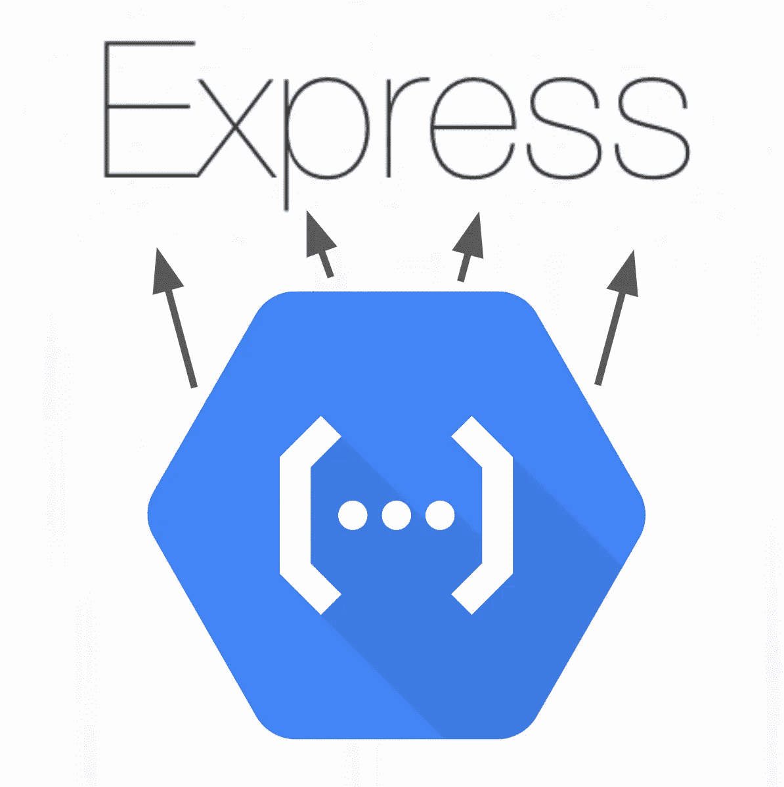

# 使用谷歌云功能的快速路由

> 原文：<https://medium.com/google-cloud/express-routing-with-google-cloud-functions-36fb55885c68?source=collection_archive---------0----------------------->

在这一切之下，用 Node 编写的 Google Cloud 函数通过[函数框架](https://github.com/GoogleCloudPlatform/functions-framework-nodejs)使用了极简的 web 框架 [*Express*](https://github.com/expressjs/express) 。

通过几行节点，我们可以使用 Express 的额外功能，比如通过 Express routing 将 URL 路由到多个端点。这意味着使用路由请求到像`/users`、`/users/{id}`这样的 URL。在本文中，我们将学习如何做到这一点！

谷歌云功能在 Express 应用中调用不同的端点

*路由*指的是应用程序的端点(URIs)如何响应客户端请求。

每个路由可以有一个或多个处理函数，当路由匹配时，这些函数按顺序执行。

# 为什么这很重要？

使用路由有助于构建**逻辑**、 **RESTful** web 应用。与使用`if` / `else`条件语句或`switch`语句处理服务路由逻辑不同，我们可以利用 Express 先进而简单的路由特性！

我认为最好用一个比较的例子来说明:

# 没有快速路由的功能— ❌

对于一个“Hello World”应用程序，拥有一个大的函数处理程序是可以接受的。然而，在您的应用程序发展之后，您可能会发现自己正在这样做…

一个谷歌云函数处理器

将您的 URL 处理程序放在单独的文件中:

API 函数路线

如你所见，我们正在用我们的`req.url.split('/')[1]`创造一个潜在的混乱局面。事实上，这种实现仅限于处理一级路径路由。我们可能有互相重叠的路由案例。我们能避免使用`switch`语句吗？

这就是快速路由的用武之地…

# 具有快速路由的功能— ✅️

*Express routing* 内置了`express`模块，便于与功能框架集成。

要开始，首先明确安装`express`:

`npm i express`

> 事实上，您的函数已经在函数框架中使用 express 了(不管您是否知道)，所以您没有增加额外的依赖性。

然后，将你的方法分成单独的`express`应用程序。这叫做*应用级中间件*。

这里，我们将展示与上面相同的代码，但是使用基本的快速路由而不是一个`switch`语句:

通过快速路由的 API 路由

这里我们显式地创建了一个`express`对象，并使用`[app.use](http://expressjs.com/en/4x/api.html#app.use)`将路由功能定义为中间件。我们可以很容易地指定 URL 路径参数，如`:id`，这些参数将在`req.params.id`下的处理程序中可用。既然您已经定义了`express`对象，那么您还可以考虑使用其他中间件，比如[解析 cookie](https://github.com/expressjs/cookie-parser)，提供静态内容等。

这就是如何在函数框架中使用快速路由的方法！

感谢阅读。

## 有关于使用节点函数框架的问题吗？

通过在 [GitHub](https://github.com/GoogleCloudPlatform/functions-framework-nodejs/) 上创建新一期来给我们反馈！我们正在构建更多关于如何使用函数框架的文档，比如使用 Docker 和使用云事件。

## **了解有关函数框架的更多信息！**

查看其他相关资源:

*   📹[观看关于快递路线的视频](https://www.youtube.com/watch?v=nld4P0AOt10)
*   💻[在 GitHub 上浏览函数框架的源代码](https://github.com/GoogleCloudPlatform/functions-framework-nodejs)
*   📄[在 Mozilla 的文档中阅读更多关于快速路由的信息](https://developer.mozilla.org/en-US/docs/Learn/Server-side/Express_Nodejs/routes)