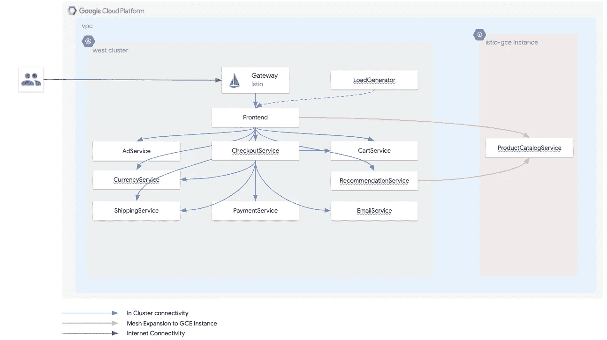
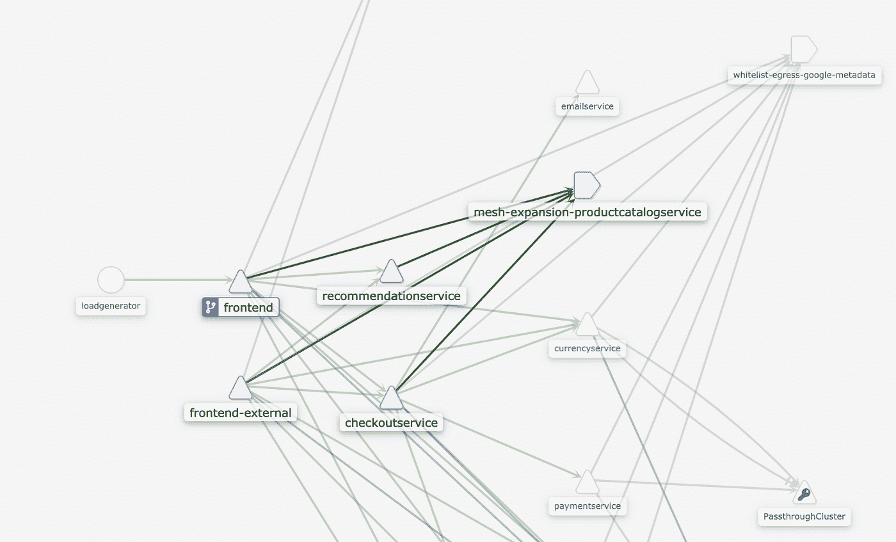
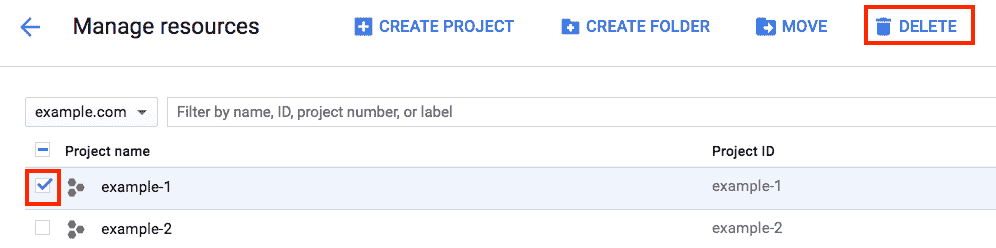

# 跨 GKE 集群和计算引擎实例扩展您的 Istio 服务网格

> 原文：<https://medium.com/google-cloud/extending-your-istio-service-mesh-across-gke-clusters-and-compute-engine-instances-4e8a69224f2b?source=collection_archive---------0----------------------->

本教程展示了如何通过在整个应用程序上使用[单个 Istio 服务网格](https://istio.io/latest/docs/ops/deployment/deployment-models/#single-mesh)来部署跨 Kubernetes 集群和计算引擎实例的多层微服务应用程序。本教程面向对 Kubernetes 概念有基本了解的 Kubernetes 操作员。不需要 Istio 知识。

> 我想对梅根·奥基夫( [@askmeegs](http://twitter.com/askmeegs) )表示感谢，感谢她为 Istio 所做的出色工作，我无耻地剽窃了其中的一些内容。你可以在 https://github.com/GoogleCloudPlatform/istio-samples[找到许多由梅根维护的 Istio 相关样品](https://github.com/GoogleCloudPlatform/istio-samples)

Istio 允许您将运行在 Kubernetes 集群内部的服务网格扩展到运行在 Kubernetes 集群外部的虚拟机(VM)实例上的服务。

**注意** : Istio 是一个开源工具，不是谷歌的官方产品。

[Istio](https://istio.io/) 是一个[服务网格](https://istio.io/docs/concepts/what-is-istio/)的开源实现，它可以让您发现、动态路由和更安全地连接到运行在 Kubernetes 集群上的服务。Istio 还提供了一个策略驱动的框架，用于路由、负载平衡、节流、遥测、断路、身份验证和授权网格中的服务调用，只需对您的应用程序代码做很少甚至不做任何更改。

当您在 Kubernetes 集群中安装 Istio 时，Istio 控制平面使用 Kubernetes [服务注册表](https://kubernetes.io/docs/concepts/services-networking/dns-pod-service/)来自动发现和创建在本地集群中运行的互连服务(或微服务)的服务网格。Istio 使用在每个 Pod 内运行的 [Envoy](https://www.envoyproxy.io/) sidecar 代理来管理 Pod 到 Pod 的流量路由和安全性，并为集群内运行的所有服务和工作负载提供可观察性。您还可以将 Envoy 部署到虚拟机，将服务网扩展到 Kubernetes 集群之外。

在一个 Kubernetes 集群中运行的服务可能需要与集群外的虚拟机中运行的服务进行对话。例如，在 Kubernetes 集群中运行的微服务可能需要访问在虚拟机中运行的遗留整体服务或在虚拟机中运行的数据库集群。Istio 允许您[创建一个超越单个 Kubernetes 集群的服务网格](https://istio.io/docs/setup/kubernetes/additional-setup/mesh-expansion/),以包含在 Kubernetes 之外的虚拟机中运行的外部服务。

Istio 为网格扩展部署提供了两个主要的配置选项:

*   **单一网络。**Kubernetes 集群和虚拟机都在同一个网络上。Kubernetes 集群中的 pod 和虚拟机可以使用它们的 IP 地址直接相互访问。
*   **多重网络。**Kubernetes 集群和虚拟机位于不同的网络上，无法通过直接 IP 连接相互访问。在这个场景中，Pods 和 VM 使用一个[网关](https://istio.io/docs/reference/config/networking/v1alpha3/gateway/) (Istio 管理的 Envoy edge 代理)来相互访问。

在本教程中，您将在 GKE 集群上部署 Istio，并将服务网格扩展到在单个虚拟私有云(VPC)网络中的计算引擎实例上运行的服务。Istio 控制平面群集通过 IP 地址直接连接到虚拟机。在本教程中，您将使用一个名为 [Online Boutique](https://github.com/GoogleCloudPlatform/microservices-demo) 的 10 层示例微服务应用程序，它分布在一个 GKE 集群和一个计算引擎实例中。您在 Google Cloud 项目中构建了以下架构。



教程架构

除了 productcatalogservice 之外，所有在线精品服务都在 GKE 集群中运行。服务 productcatalogservice 在计算引擎虚拟机实例上运行。使用 Istio mesh 扩展，您可以将 productcatalogservice 添加到服务网格中，服务网格包含其余的在线精品服务。

# 目标

*   创建一个名为 west 的 GKE 集群。
*   在 west 集群上安装 Istio 并启用网格扩展。
*   在与 west 集群相同的 VPC 中创建一个名为 istio-gce 的计算引擎实例。
*   在 istio-gce 实例上安装在线精品服务 productcatalogservice。
*   将 productcatalogservice 注册到西部集群中的 Istio 服务网格。
*   在西集群上安装剩余的线上精品 app 微服务。
*   观察扩展的服务网格。

# 费用

本教程使用 Google Cloud 的以下付费组件:

*   [GKE](https://cloud.google.com/kubernetes-engine/pricing)
*   [计算引擎](https://cloud.google.com/compute/all-pricing)
*   [谷歌云联网](https://cloud.google.com/vpc/network-pricing)
*   [云负载均衡](https://cloud.google.com/compute/all-pricing#lb)

使用[定价计算器](https://cloud.google.com/products/calculator)根据您的预计使用量生成成本估算。

# 开始之前

1.  选择或创建 Google 云项目。

[转到管理资源页面](https://console.cloud.google.com/cloud-resource-manager)

2.为您的项目启用计费。

[启用计费](https://support.google.com/cloud/answer/6293499#enable-billing)

3.启用 Kubernetes 引擎和源代码库 API。

[启用 API](https://console.cloud.google.com/flows/enableapi?apiid=container,sourcerepo.googleapis.com)

完成本教程后，您可以通过删除您创建的资源来避免继续计费。详见[清理](https://docs.google.com/document/d/1vaelwoytZYoZ5WvyzwdksRTysig0bncoThU9I-T0In0/edit#heading=h.mlrdlgcohh7k)。

# 准备您的环境

您可以从 Cloud Shell 运行本教程中的所有终端命令。

1.  打开云壳:

[打开云壳](https://console.cloud.google.com/?cloudshell=true)

2.通过克隆 Git 存储库下载本教程所需的文件:

```
cd $HOME
git clone [https://github.com/GoogleCloudPlatform/istio-multicluster-gke.git](https://github.com/GoogleCloudPlatform/istio-multicluster-gke.git)
```

3.将存储库文件夹设为您的 WORKDIR，您可以在其中执行与本教程相关的所有任务:

```
cd $HOME/istio-multicluster-gke
WORKDIR=$(pwd)
```

完成教程后，您可以删除该文件夹。

4.安装[kube txt 和 kubens](https://github.com/ahmetb/kubectx) :

```
git clone [https://github.com/ahmetb/kubectx](https://github.com/ahmetb/kubectx) $WORKDIR/kubectx
export PATH=$PATH:$WORKDIR/kubectx
```

这些工具允许您快速切换上下文和名称空间，这使得使用多个 Kubernetes 集群更加容易。

# 创建 GKE 集群

在本节中，您将在默认 VPC 中创建一个启用了 [IP 别名](https://cloud.google.com/kubernetes-engine/docs/how-to/alias-ips)的 GKE 集群。通过[别名 IP 地址](https://cloud.google.com/vpc/docs/alias-ip)，GKE 集群可以从谷歌云已知的 CIDR 块中分配 IP 地址。这种设置导致 Pod IPs 在 VPC 内可路由，为 Pod 提供了到同一 VPC 中的计算引擎实例的直接 IP 连接。

1.  在 Cloud Shell 中，在美国西部 2 地区创建一个名为 west 的 GKE 集群:

```
gcloud container clusters create west \
--zone us-west2-a --username "admin" \
--machine-type "n1-standard-2" \
--cluster-version 1.14 \
--image-type "COS" --disk-size "100" \
--num-nodes "5" --network "default" \
--enable-cloud-logging --enable-cloud-monitoring \
--enable-ip-alias
```

2.连接到西 GKE 集群，在 [kubeconfig](https://kubernetes.io/docs/tasks/access-application-cluster/configure-access-multiple-clusters/) 文件中生成一个条目:

```
export PROJECT_ID=$(gcloud info --format='value(config.project)')
gcloud container clusters get-credentials west --zone us-west2-a --project ${PROJECT_ID}
```

您可以使用 kubeconfig 文件通过为每个集群创建一个用户和上下文来创建对 GKE 集群的身份验证。

3.为了方便起见，使用 kubectx 来重命名上下文名称:

```
kubectx west=gke_${PROJECT_ID}_us-west2-a_west
```

4.为您自己(您的 Google 用户)提供集群的集群管理员角色:

```
kubectl create clusterrolebinding user-admin-binding --clusterrole=cluster-admin --user=$(gcloud config get-value account) --context west
```

该角色允许您在这些集群上执行管理任务。

# 安装 Istio

在本节中，您将安装和配置 Istio，并在 west 集群上启用网状扩展。

# 下载并安装 Istio

1.  在云壳中，下载 Istio:

```
cd ${WORKDIR}
export ISTIO_VERSION=1.6.5
curl -L [https://istio.io/downloadIstio](https://istio.io/downloadIstio) | ISTIO_VERSION=${ISTIO_VERSION} sh -
```

2.在西部集群中创建 istio-system 命名空间:

```
kubectl --context west create namespace istio-system
```

3.使用 Istio 版本提供的示例证书，创建一个 Kubernetes 秘密:

```
kubectl --context west create secret generic cacerts -n istio-system \
--from-file=${WORKDIR}/istio-${ISTIO_VERSION}/samples/certs/ca-cert.pem \
--from-file=${WORKDIR}/istio-${ISTIO_VERSION}/samples/certs/ca-key.pem \
--from-file=${WORKDIR}/istio-${ISTIO_VERSION}/samples/certs/root-cert.pem \
--from-file=${WORKDIR}/istio-${ISTIO_VERSION}/samples/certs/cert-chain.pem
```

Istio 控制平面使用这个秘密来签署工作负载证书。

4.安装 Istio:

```
${WORKDIR}/istio-${ISTIO_VERSION}/bin/istioctl install \
--set profile=demo \
--set values.global.meshExpansion.enabled=true 
```

在本教程中，您将使用演示概要文件部署 Istio。只要启用了 meshExpansion 参数，就可以使用任何概要文件甚至自定义概要文件来部署 Istio。

**注意** : Istio 需要 2-3 分钟安装。

5.确保所有 Istio 部署正在运行:

```
kubectl --context west get pods -n istio-system
```

输出类似于以下内容:

```
**OUTPUT (DO NOT COPY)**
NAME READY STATUS RESTARTS AGEgrafana-858f9bcbcd-jnjbf 1/1 Running 0 70s
istio-egressgateway-5548786875–4zwcv 1/1 Running 0 72s
istio-ingressgateway-dfcdf4d97–28rmn 1/1 Running 0 72s
istio-tracing-7cf5f46848-jbhsk 1/1 Running 0 70s
istiod-6ff4d846d7-pmtrx 1/1 Running 0 85s
...
```

# 正在为 Istio 准备计算引擎实例

1.  定义计算引擎实例加入的命名空间:

```
export SERVICE_NAMESPACE="default"
```

2.将 istio-Ingres gateway 外部负载平衡器 IP 地址存储在文件中:

```
export ISTIOD_IP=$(kubectl --context west get -n istio-system service istio-ingressgateway -o jsonpath='{.status.loadBalancer.ingress[0].ip}')
echo $ISTIOD_IP > istiod.txt
```

启用网状扩展时，Istio 通过 Istio-Ingres gateway 公开 istiod(Istio 控制平面)服务。计算引擎实例使用此 IP 地址来访问 istiod。

3.从西部集群获取集群 IP 地址范围:

```
ISTIO_SERVICE_CIDR=$(gcloud container clusters describe west --zone us-west2-a --project ${PROJECT_ID} --format "value(servicesIpv4Cidr)")
```

4.生成在计算引擎实例中部署的 cluster.env 配置文件。该文件包含 Kubernetes ClusterIP 地址范围，以便使用 Envoy 进行拦截和重定向。

```
echo -e "ISTIO_SERVICE_CIDR=$ISTIO_SERVICE_CIDR\n" > cluster.env
echo "ISTIO_INBOUND_PORTS=3550" >> cluster.env
```

计算引擎实例上运行的服务使用 ISTIO_INBOUND_PORTS。在本教程中，您将 productcatalogservice 部署到计算引擎实例。服务 productcatalogservice 在端口 3550 上运行。

5.生成计算引擎使用的证书:

```
go get istio.io/istio/security/tools/generate_cert
go run istio.io/istio/security/tools/generate_cert \
-client -host spiffee://cluster.local/vm/vmname --out-priv key.pem --out-cert cert-chain.pem  --mode self-signed
kubectl --context west -n istio-system get cm istio-ca-root-cert -o jsonpath='{.data.root-cert\.pem}' > root-cert.pem
```

要使用网格扩展，您必须为计算引擎实例提供由与网格其余部分相同的根 CA 签名的证书。

# 安装并配置计算引擎实例

在本节中，您将安装一个计算引擎实例，其中运行一个在线精品应用微服务。

1.  在 Cloud Shell 中，创建名为 istio-gce 的计算引擎实例。使用值为 istio-gce 的标签。该标记用于下一步创建防火墙规则。

```
GCE_INSTANCE_NAME="istio-gce"
gcloud compute --project=$PROJECT_ID instances create $GCE_INSTANCE_NAME --zone=us-west2-a \
--machine-type=n1-standard-2 --subnet=default --network-tier=PREMIUM --maintenance-policy=MIGRATE \
--image-family=ubuntu-1604-lts --image-project=ubuntu-os-cloud --boot-disk-size=10GB \
--boot-disk-type=pd-standard --boot-disk-device-name=$GCE_INSTANCE_NAME --tags="istio-gce"
```

2.获得 GKE Pod IP CIDR 系列:

```
export GKE_POD_CIDR=$(gcloud container clusters describe west --zone us-west2-a --format=json | jq -r '.clusterIpv4Cidr')
```

3.创建一个防火墙规则，允许 GKE Pod IP CIDR 范围与 TCP 端口 3550 上的 istio-gce 实例通信(使用在上一步中分配的 istio-gce 标记):

```
gcloud compute firewall-rules create k8s-to-istio-gce \
--description="Allow k8s pods CIDR to istio-gce instance" \
--source-ranges=$GKE_POD_CIDR \
--target-tags="istio-gce" \
--action=ALLOW \
--rules=tcp:3550
```

服务 productcatalogservice 在 istio-gce 实例中运行。该服务侦听 TCP 端口 3550。

4.生成 SSH 密钥，以便您可以使用 SSH 连接到计算引擎实例，并将 SSH 私钥添加到 SSH 身份验证代理:

```
USER=$(gcloud config get-value account)
ssh-keygen -t rsa -N '' -b 4096 -C "$USER" \
-f $HOME/.ssh/google_compute_engine
eval "$(ssh-agent -s)"
ssh-add ~/.ssh/google_compute_engine
```

5.创建 gce-script.sh 文件，该文件将特使代理和 productcatalogservice 部署到 istio-gce 实例。

```
export GWIP=$ISTIOD_IP
envsubst < ./istio-mesh-expansion-gce/gce-script-tmpl.sh > ./istio-mesh-expansion-gce/gce-script.sh
```

6.使用安全复制协议(SCP)，将证书、istiod.txt 文件和 gce-script.sh shell 脚本复制到计算引擎实例:

```
gcloud compute scp --project=${PROJECT_ID} --zone=us-west2-a {key.pem,cert-chain.pem,cluster.env,root-cert.pem,istiod.txt,./istio-mesh-expansion-gce/gce-script.sh} ${GCE_INSTANCE_NAME}:~
```

7.在计算引擎实例中运行 gce-script.sh 脚本:

```
gcloud compute --project ${PROJECT_ID} ssh --zone us-west2-a ${GCE_INSTANCE_NAME} --command="chmod +x gce-script.sh; ./gce-script.sh"
```

8.gce-script.sh 脚本将 istio-gce 实例准备为 istio 服务网格的一部分。该脚本执行以下操作:

*   使用 Istiod IP 地址配置 etc/hosts 文件，以连接回 west 集群中的 Istio 控制面板。
*   在计算引擎实例上配置特使代理。
*   为 mTLS 通信配置证书。

安装 Docker，然后在 istio-gce 实例上部署服务 productcatalogservice Docker 映像。

# 部署在线精品店

[线上精品](https://github.com/GoogleCloudPlatform/microservices-demo#service-architecture)由 10 个用不同编程语言编写的微服务组成。在本教程的前面，您在 istio-gce 实例中安装了 productcatalogservice。在本节中，您将在默认命名空间中的 west 集群中安装其余九个微服务。

1.  标记自动 Istio [sidecar 代理注入](https://istio.io/docs/setup/kubernetes/additional-setup/sidecar-injection/#automatic-sidecar-injection)的默认名称空间。

```
kubectl --context west label namespace default istio-injection=enabled
```

这一步确保在默认名称空间中创建的所有 pod 都部署了 Envoy sidecar 容器。

2.在西群安装线上精品 app 微服务:

```
kubectl --context west -n default apply -f [https://raw.githubusercontent.com/GoogleCloudPlatform/microservices-demo/master/release/kubernetes-manifests.yaml](https://raw.githubusercontent.com/GoogleCloudPlatform/microservices-demo/master/release/kubernetes-manifests.yaml)
kubectl --context west -n default apply -f [https://raw.githubusercontent.com/GoogleCloudPlatform/microservices-demo/master/release/istio-manifests.yaml](https://raw.githubusercontent.com/GoogleCloudPlatform/microservices-demo/master/release/istio-manifests.yaml)
```

3.从西部群集删除 productcatalogservice 服务和部署:

```
kubectl --context west -n default delete svc productcatalogservice
kubectl --context west -n default delete deployment productcatalogservice
```

4.稍等片刻，然后确保所有工作负载都已启动并运行:

```
kubectl --context west get pods
```

输出类似于以下内容:

```
**OUTPUT (DO NOT COPY)**
NAME READY STATUS RESTARTS AGE
adservice-86674bf94d-vlkwn 2/2 Running 0 109s
cartservice-9cf968485-srbsq 2/2 Running 2 110s
checkoutservice-74df4f44c8-d7s9b 2/2 Running 0 111s
currencyservice-6444b89474-dwl75 2/2 Running 0 109s
...
```

此输出显示 productcatalogservice Pod 没有在 west 集群中运行。

# 将计算引擎实例添加到服务网格

1.  获取计算引擎实例的 IP 地址:

```
export GCE_IP=$(gcloud --format="value(networkInterfaces[0].networkIP)" compute instances describe ${GCE_INSTANCE_NAME} --zone us-west2-a)
```

2.将计算引擎实例添加到服务网格:

```
${WORKDIR}/istio-${ISTIO_VERSION}/bin/istioctl experimental add-to-mesh external-service productcatalogservice ${GCE_IP} grpc:3550 -n default
```

3.此命令为指向计算引擎实例的 IP 地址的 productcatalogservice 创建 Kubernetes 服务对象和 ServiceEntry 对象。

4.在计算引擎实例上重新启动 Istio 服务:

```
gcloud compute --project $PROJECT_ID ssh --zone us-west2-a ${GCE_INSTANCE_NAME} --command="sudo systemctl stop istio; sudo systemctl start istio;"
```

# 访问在线精品应用程序

1.  获取西部集群的 Istio 入口网关外部 IP 地址:

```
kubectl --context west get -n istio-system service istio-ingressgateway -o json | jq -r '.status.loadBalancer.ingress[0].ip'
```

输出类似于以下内容:

```
EXTERNAL_IP
```

2.在 web 浏览器中复制 Istio 入口网关 IP 地址。显示在线精品 app 主页。


线上精品 App 前端

要确认该应用程序在 west 集群和 istio-gce 实例中完全可用，请浏览产品，将产品添加到购物车中，然后进行结账。服务 productcatalogservice 运行在专用的计算引擎实例中，而其余的微服务运行在 GKE 集群上。

# 监控服务网格

您可以使用 [Kiali](https://www.kiali.io/) 来监控和可视化服务网格。Kiali 是作为 Istio 安装的一部分安装的服务网格可观察性工具。

1.  在 Cloud Shell 中，公开西部集群上的 Kiali 服务:

```
${WORKDIR}/istio-${ISTIO_VERSION}/bin/istioctl dashboard kiali &
```

输出类似于以下内容:

无法打开浏览器；在浏览器中打开[http://localhost:35755/kiali](http://localhost:35755/kiali)。

2.导航到前面输出中的 HTTP 链接，打开 Kiali web 界面。

3.在 Kiali 登录提示符下，使用用户名 admin 和密码 admin 登录。

4.从菜单中选择**图形**。

5.从**选择名称空间**下拉列表中，选择**默认**。

6.从**图形**下拉列表中选择**服务图形**。

7.(可选)要查看 loadgenerator 为您的应用生成流量，请从**显示**下拉列表中选择**流量动画**。

下图显示了跨 GKE 集群和计算引擎实例的服务的单个 Istio 服务网格。



Kiali 服务拓扑

该图显示了以下内容:

*   在 west 集群中运行的微服务仅通过它们的名称来描述，并由一个三角形符号表示。
*   istio-gce 实例中运行的服务由一个域符号(一个五边形)表示。

Istio 服务网格扩展到包括虚拟机上运行的应用程序。这些服务使用带 mTLS 的 Istio 入口网关在 GKE 集群和计算引擎实例之间进行安全通信。您可以使用本教程中的步骤来添加在计算引擎实例上运行的服务。

# 清理

为了避免本教程中使用的资源对您的 Google 云平台帐户产生费用:

# 删除项目

消除计费的最简单方法是删除您为教程创建的项目。

要删除项目:

1.  在云平台控制台中，转到项目页面。

[转到项目页面](https://console.cloud.google.com/iam-admin/projects)

2.在项目列表中选择想要删除的项目，点击**删除**。



在对话框中，键入项目 ID，然后点击**关闭**删除该项目。

感谢您阅读本教程。如果您对本教程有任何意见或反馈，请随时留言。