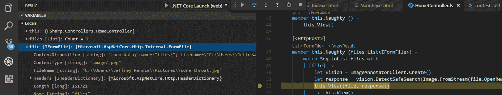
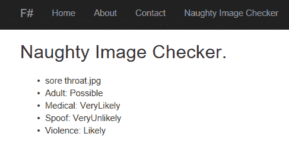

# 谷歌云平台上的 F#

> 原文：<https://medium.com/google-cloud/f-on-google-cloud-platform-373f4aa77fd8?source=collection_archive---------1----------------------->

前谷歌员工和朋友克里斯·史密斯将在下周的 T2 公开论坛上发言。我也会去的。所以，我决定给 [F#](http://fsharp.org/) 一个尝试，看看它如何与谷歌云 API 一起工作，以及如何将其部署到[谷歌应用引擎](https://cloud.google.com/appengine/docs/flexible/dotnet/)。


笑脸的眼睛是 App Engine 和 F # logos。

我对 F#的工具印象深刻。我参观了 fsharp.org，并为我的系统下载了 F#。然后，我跑了

```
PS > dotnet new mvc -lang F#
```

我的目录中有一个新的 F# MVC 项目。Visual Studio 代码中的调试器也可以开箱即用:



我添加了一个新的控制器，它调用 [Google Cloud Vision API](https://cloud.google.com/vision/) 来检查图片是否包含不良内容:

运行代码:



我添加了一个简单的 app.yaml，两个命令行之后，我在 [Google App Engine](https://cloud.google.com/appengine/docs/flexible/dotnet/) 上运行它:

```
PS > dotnet publish
PS > gcloud beta app deploy ` .\bin\Debug\netcoreapp1.1\publish\app.yaml
```

相当酷。F#团队做得很好，让一个 F#新手这么容易就搞定了。

完整的代码和说明可在 [GitHub](https://github.com/GoogleCloudPlatform/dotnet-docs-samples/tree/master/appengine/flexible/F%23) 上获得。