# 谷歌云平台上的 Fabric

> 原文：<https://medium.com/google-cloud/fabric-on-google-cloud-platform-97525323457c?source=collection_archive---------0----------------------->

感谢 IBM 工程师编写了一个[掌舵](https://helm.sh/) [图表](https://github.com/IBM-Blockchain/ibm-container-service)来部署[结构](https://www.hyperledger.org/projects/fabric)作为 IBM 区块链平台的一部分。将它移植到 [Kubernetes 引擎](http://cloud.google.com/kubernetes-engine)相对简单，尽管目前这只是一个工作的结构网络，我现在需要配置工具( [Composer](https://www.hyperledger.org/projects/composer) )。

## 库伯内特发动机

给自己创造一个 Kubernetes。我正在尝试开拓，所以我使用了一个区域集群，并启用了新的 Kubernetes 监控功能。

**更新**:所以，我没那么先锋，[区域集群现在 GA](https://cloudplatform.googleblog.com/2018/06/Regional-clusters-in-Google-Kubernetes-Engine-are-now-generally-available.html') :-)耶！

这一切似乎都工作得很好，类似于:

```
PROJECT=[[YOUR-PROJECT]]
REGION=[[YOUR-REGION]]
CLUSTER=[[YOUR-CLUSTER]]
BILLING=[[YOUR-BILLING]]
LATEST=1.10.2-gke.3WORKDIR=[[YOUR-WORKDIR]]mkdir -p /tmp/${WORKDIR} && cd /tmp/${WORKDIR}gcloud projects create ${PROJECT}gcloud beta billing projects link ${PROJECT} \
--billing-account=${BILLING}gcloud services enable container.googleapis.com \
--project=$PROJECTgcloud beta container clusters create $CLUSTER \
--username="" \
--cluster-version=${LATEST} \
--machine-type=custom-1-4096 \
--image-type=COS \
--num-nodes=1 \
--enable-autorepair \
--enable-autoscaling \
--enable-autoupgrade \
--enable-stackdriver-kubernetes \
--min-nodes=1 \
--max-nodes=2 \
--region=${REGION} \
--project=${PROJECT} \
--preemptible \
--scopes="[https://www.googleapis.com/auth/cloud-platform](https://www.googleapis.com/auth/cloud-platform)"gcloud beta container clusters get-credentials $CLUSTER \
--project=${PROJECT} \
--region=${REGION}kubectl create clusterrolebinding $(whoami)-cluster-admin-binding \
--clusterrole=cluster-admin \
--user=$(gcloud config get-value account)kubectl create clusterrolebinding kube-dashboard-admin \
--clusterrole=cluster-admin \
--serviceaccount=kube-system:kubernetes-dashboard
```

您应该能够:

```
kubectl cluster-info
kubectl get nodes
```

掌舵图需要一个 Kubernetes 持久卷，即`ReadWriteMany`。这在目前的谷歌云平台上并不容易…咳…谷歌…咳…

因此，我们将使用 NFS 来提供多读功能。具有讽刺意味的是，我们将要使用的 NFS 解决方案本身是由谷歌持久磁盘支持的。让我们创建 NFS 服务器，因为舵图依赖于它。

## 网络文件系统

感谢 [mappedinn](https://github.com/mappedinn) ，我用他们的回购`[kubernetes-nfs-volume-on-gke](https://github.com/mappedinn/kubernetes-nfs-volume-on-gke)`得到了这个设置。这使用了谷歌的`[volume-nfs](https://console.cloud.google.com/gcr/images/google-containers/GLOBAL/volume-nfs?gcrImageListsize=50)`图片，效果很好。

创建底层持久磁盘:

```
ZONE=${REGION}-cgcloud compute disks create nfs-disk \
--project=${PROJECT} \
--zone=${ZONE} \
--type=pd-standard \
--size=10GB
```

然后应用下面的部署并为您的 Kubernetes 集群提供服务。部署使用 Google 托管的`volume-nfs`映像创建 NFS 服务，并将服务绑定到持久磁盘:

> **注意**如果您更喜欢使用 SSD 持久磁盘而不是标准(HDD)持久磁盘，请将部署脚本中的第 7 行“`default`”替换为“`ssd`”，并在应用部署之前，将以下文件应用到您的集群，以将 SSD 注册为存储类:

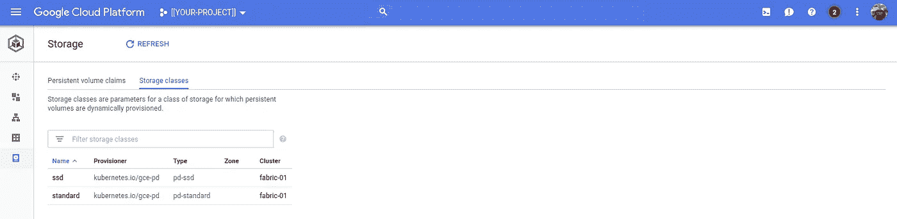

Kubernetes 引擎:存储(“固态硬盘”和“标准”)

您应该:

```
kubectl apply --filename=nfs-deployment.yaml
kubectl apply --filename=nfs-service.yaml
```

这将产生一个 NFS 服务，可通过 Kubernetes 服务的 DNS 名称:`nfs.default.svc.cluster.local`访问。

好的。你不应该为 NFS 创建一个`PersistentVolume`或者`PersistentVolumeClaim`，因为它们将会使用舵图表来创建。下面先睹为快，看看掌舵图部署后的持续量声明。您将在下一步中这样做:

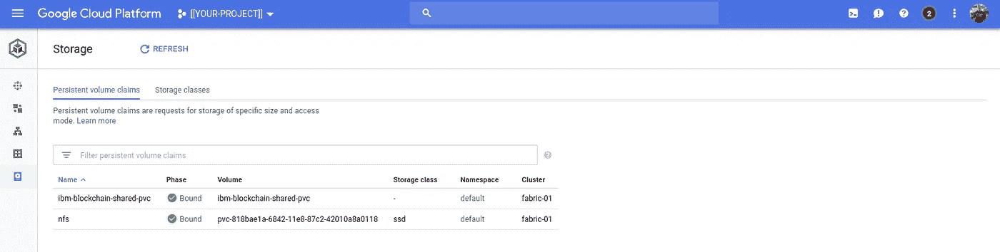

Kubernetes 引擎:存储

## 舵

下载并解压缩最新的 Helm 二进制文件([版本](https://github.com/kubernetes/helm/releases))，将其添加到您的 PATH 中，并将 Helm's Tiller 安装到 Kubernetes 集群中。假设我们在`${WORKDIR}`并且你把头盔拉进了`${WORKDIR}/linux-amd64`:

```
PATH=$PATH:$PWD/linux-amd64
helm version
```

> **NB** Helm 有适用于 OSX 和 Windows 的二进制文件，我将把非 Linux 的具体指令留给你来完成。

如果——很可能——您正在使用一个位于 RBAC 的 Kubernetes(引擎)集群，我建议您按照以下步骤将 Helm's Tiller 安装到集群中:

```
kubectl create serviceaccount tiller \
--namespace=kube-systemkubectl create clusterrolebinding tiller \
--clusterrole cluster-admin \
--serviceaccount=kube-system:tillerhelm init --service-account=tiller
```

这应该会返回:

```
$HELM_HOME has been configured at /usr/local/google/home/dazwilkin/.helm.Tiller (the Helm server-side component) has been installed into your Kubernetes Cluster.Please note: by default, Tiller is deployed with an insecure 'allow unauthenticated users' policy.
For more information on securing your installation see: [https://docs.helm.sh/using_helm/#securing-your-helm-installation](https://docs.helm.sh/using_helm/#securing-your-helm-installation)
Happy Helming!
```

然后，克隆我的 GitHub repo(感谢 IBM 的同事为我们做了 98%的工作):

```
git clone [https://github.com/DazWilkin/ibm-blockchain-network.git](https://github.com/DazWilkin/ibm-blockchain-network.git)
```

但是不要切换到克隆创建的`ibm-blockchain-network`目录；留在母体内(`${WORKDIR}`)。

> **可选**:在展开`helm lint ibm-blockchain-network`之前，在图表上运行舵面是一个好习惯
> 
> **可选**:在将部署应用到集群之前，最好先“试运行”部署。这是 Helm 的一个有用特性，为您提供了一种查看适用于您的集群的 Kubernetes 规范的方式:`helm install --dry-run — debug ibm-blockchain-network`。

当你对结果有信心时:

```
helm install ibm-blockchain-network
```

Helm 会将该图表应用到您的 Kubernetes，并为您提供其工作的列举:

您可以检查 Kubernetes 引擎工作负载的云控制台:

【https://console.cloud.google.com/kubernetes/workload】

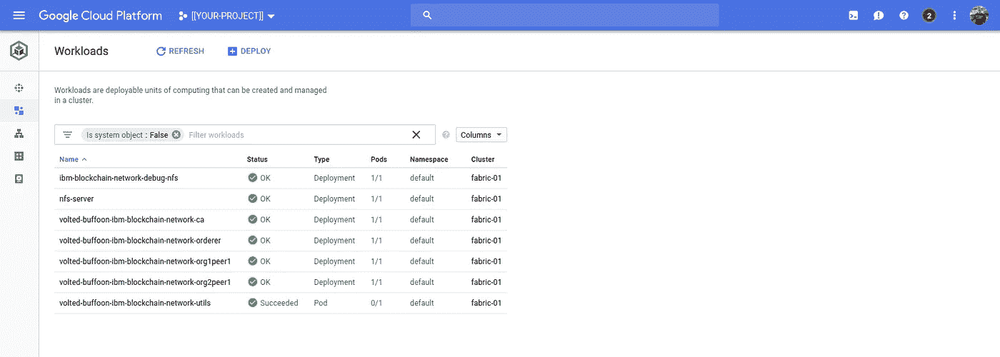

Kubernetes 引擎:工作负载

和服务:

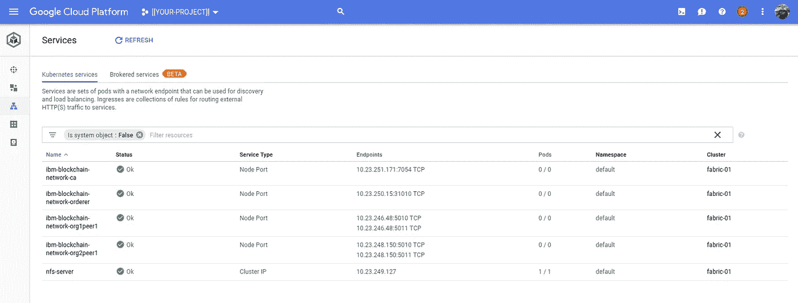

Kubernetes 引擎:服务

部署的各种容器创建了一堆日志。下面是由`ibm-blockchain-network-utils` Pod 创建的`bootstrap`容器:

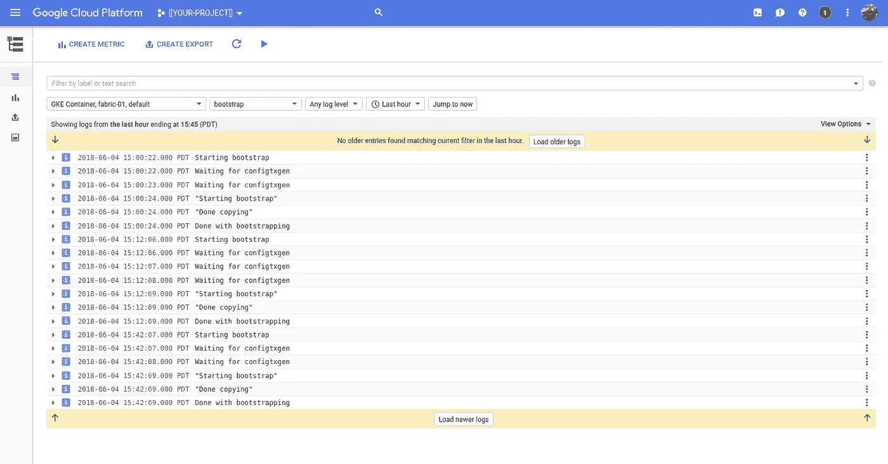

云日志记录

对于`configtxgen`:

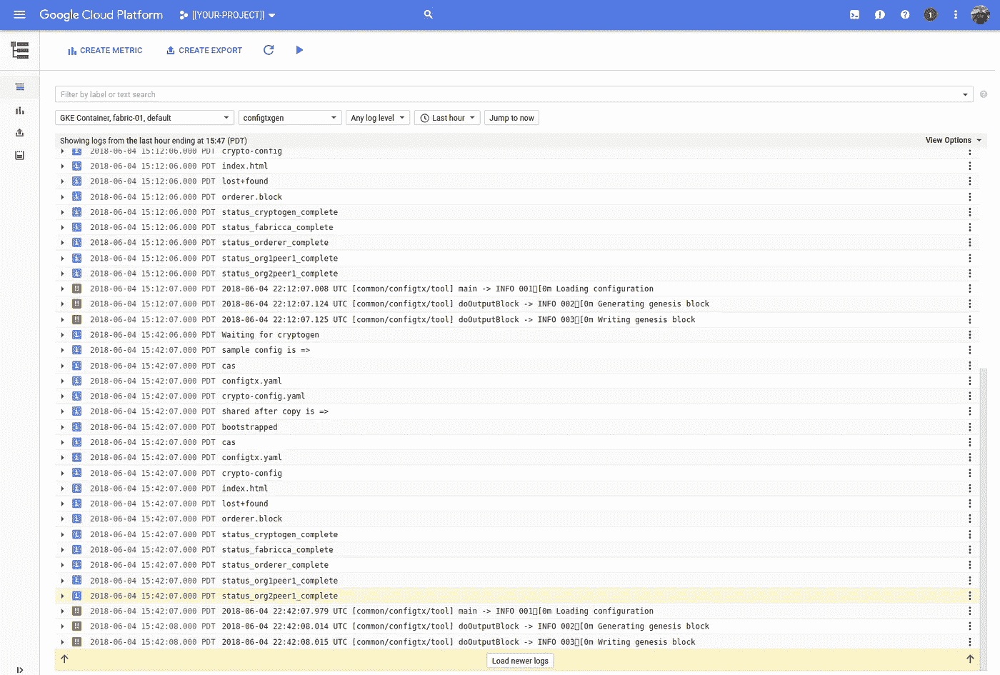

云日志记录

对于`cryptogen`:

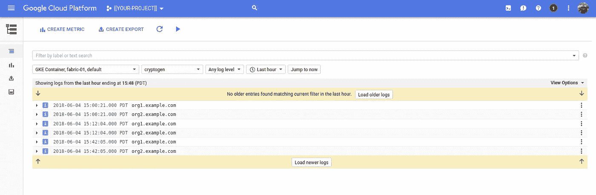

云日志记录

对于`ca`:

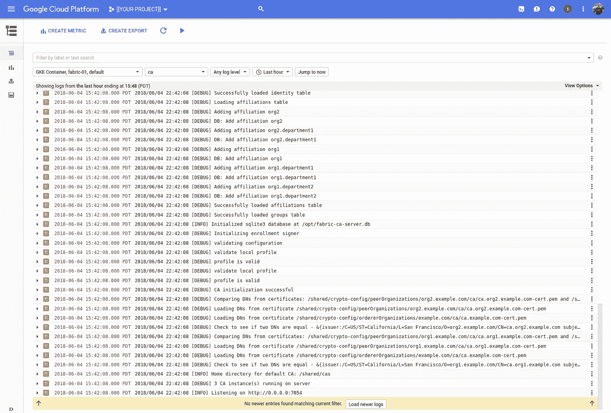

云日志记录

对于`orderer`:

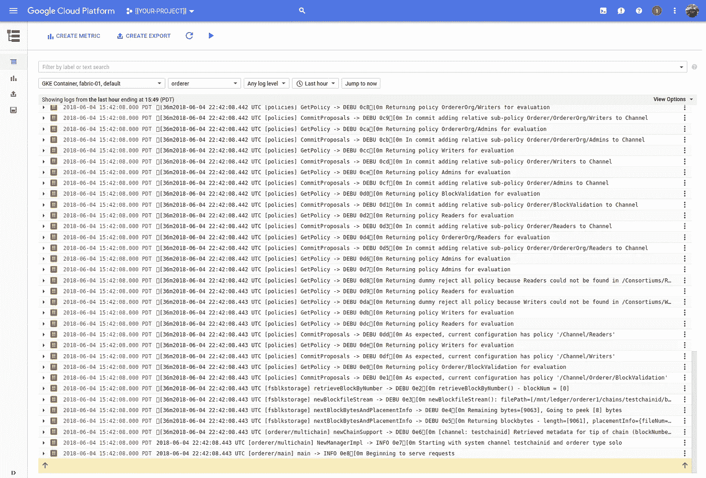

云日志记录

以及类似于`org2peer1`的`org1peer1`:

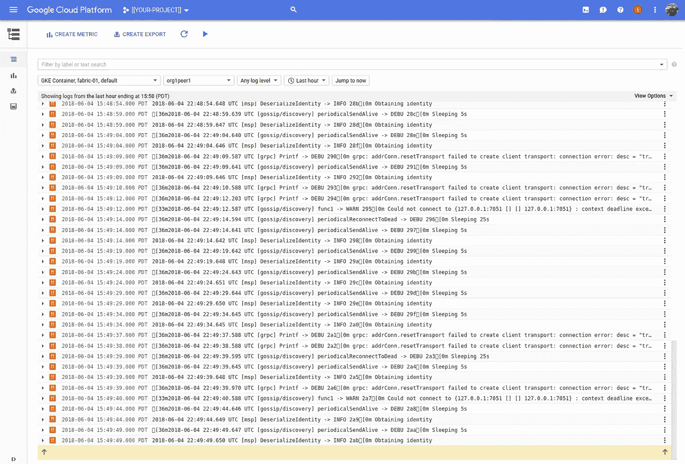

云日志记录

## 舵表|删除

您可以通过以下方式列出和删除已部署的图表:

> **注意:**在这个例子中，目前还没有一种简单的方法来获取动态生成的图表名称(比如`solitary-possum`)。因此，要删除一个图表，您需要执行`list`来识别它的名称。

## 删除 NFS 服务

完成后，不要忘记删除 NFS 部署:

```
kubectl delete --filename=nfs-deployment.yaml
kubectl delete --filename=nfs-service.yaml
```

## 删除 Kubernetes

您可以重击您的集群:

```
gcloud beta container clusters delete ${CLUSTER} \
--region=${REGION} \
--project=${PROJECT}
```

## Stackdriver Kubernetes 监控

既然我们讨论了日志，我已经提到我部署了集群来支持新的 [Stackdriver Kubernetes 监控](https://cloud.google.com/kubernetes-monitoring/)。

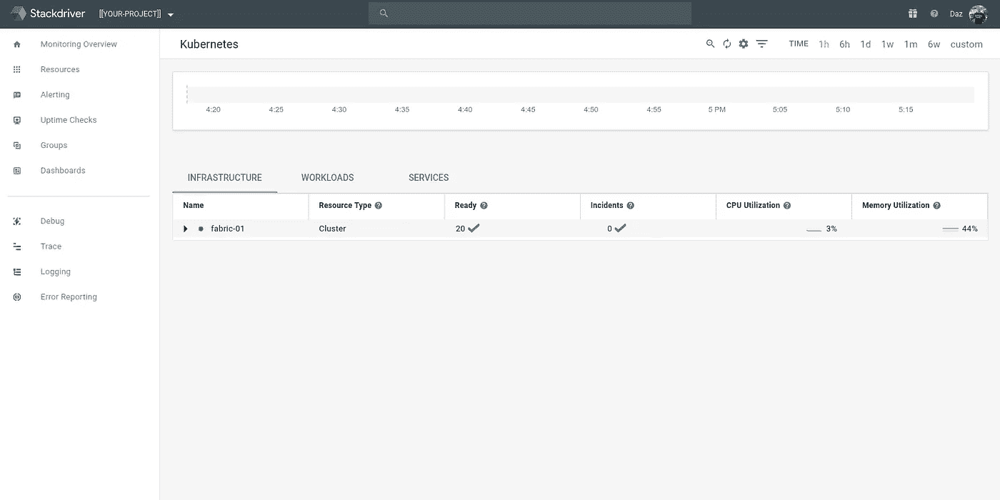

## 容器优化操作系统(COS)

除了需要创建 NFS 服务之外，图表部署到 Kubernetes 引擎所需的唯一其他更改是对 Composer 配置的调整。IBM-区块链-网络-utils 工作负载创建了包括`bootstrap`在内的 3 个 pod。`bootstrap`有一个名为`composer-credentials`的卷，它被挂载到节点(主机)的根目录(`/`)下。

[容器优化操作系统](https://cloud.google.com/container-optimized-os/docs/)是为了安全而构建的，该操作系统包含最少量的额外工具。您可以在这里看到根目录(`/`)被挂载为只读“以保持完整性”。因此，图表被修改为使用`/tmp/composer`而不是`/composer`。您可以在区块链-utils.yaml 的第 20–22 行看到这种变化:

```
- name: composer-credentials
    hostPath:
      path: /tmp/composer
```

而且还在`blockchain-debug-nfs.yaml`里。等等什么？

## 排除故障

我最近提供了一些调试 Kubernetes 部署的例子。在这种情况下，我希望确保 NFS 服务正常工作。如果它工作正常，容器将能够访问它的卷装载。

为了证实这一点，我在舵图中添加了一个模板。这个模板叫做`blockchain-nfs.debug.yaml`。在图表中包含这一点有两个好处。首先，它可以使用 Helm 的变量替换。第二，它将所有东西放在一起，并确保调试部署与图表一起创建|删除。

区块链调试:

NFS 体积由第 34–36 行中定义的`PersistentVolumeClaim`引用。您会注意到，在调试部署到 Kubernetes 引擎时为什么会失败时，我添加了第二个(非 NFS)卷`composer-credentials`(因为 COS 和不允许前面解释的`/`)。

最棒的是，一旦部署完毕，我们就可以获得生成的 Pod(！)命名并执行到它的(Alpine) shell 中，并枚举目录的内容:

```
kubectl exec \
--stdin \
--tty \
$(\
  kubectl get pods \
  --selector=name=ibm-blockchain-network-debug-nfs \
  --output=jsonpath="{.items[0].metadata.name}"\
) \
--container=debug \
-- /bin/ash -c "ls -la /shared && ls -la /home/composer"
```

这将返回:

## 结论

Helm 是一个很好的工具，比我想象的更容易使用。

我也在为万亿美元的掌舵人 T4 图表 T5 工作。

IBM 的 Helm 图表旨在将 Fabric 部署到 IBM 的 Kubernetes 服务，但是，因为 Kubernetes 就是 Kubernetes，正如您所看到的，将该图表转换到 Kubernetes 引擎上也很简单。

我希望从 IBM 人员那里了解更多关于如何将 Hyperledger Compose 集成到这个部署中，然后我会更新这篇文章。