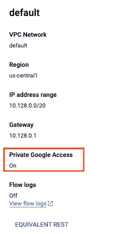

# 快速导出大型数据库表—使用 GCP 无服务器 Dataproc

> 原文：<https://medium.com/google-cloud/fast-export-large-database-tables-using-gcp-serverless-dataproc-spark-bb32b1260268?source=collection_archive---------3----------------------->

从 MySQL(任何 JDBC)导入大表到 Cloud Spanner(或者 GCS，BigQuery)


Spark 导出大型表格

# 介绍

您是否希望快速导出/导入数百 GBs-TB 的大型表？

多线程并行导入导出数据的方法？

倾向于保留导出数据的模式？

使用强大、成熟、开源和强化的机制？

A.使用 GCP 无服务器 Dataproc 的 [**JDBCToGCS**](https://github.com/GoogleCloudPlatform/dataproc-templates/tree/main/java/src/main/java/com/google/cloud/dataproc/templates/jdbc#2-jdbc-to-gcs) 模板可以帮助您以快速、高效和多线程的方式导出表格。

B.使用 [**GCSToSpanner**](https://github.com/GoogleCloudPlatform/dataproc-templates/blob/main/java/src/main/java/com/google/cloud/dataproc/templates/gcs/README.md) 模板将数据从 GCS 导入到云 Spanner。

# **主要优势**

1.  Dataproc Serverless 是完全管理的、无服务器的和自动伸缩的。
2.  这两个模板都是开源的，完全可定制，并可用于简单的工作。
3.  Spark 为 MySQL、Postgresql、DB2、Derby、H2、SQL Server、Oracle、Postgresql 和 Teradata 数据库内置了 jdbc 方言。
4.  一旦作业结束，短暂 gcp 资源就会被释放。
5.  您可以以 **avro、parquet、csv 和 orc** 格式导出数据。
6.  允许表分区，使用它可以并行读取数据块。
7.  GCSToSpanner 模板可以并行读取多个文件(每次每个线程一个文件)，并以极快的速度将大量数据加载到 Cloud Spanner 中。

# 简单用法

这种用法适用于小桌子(<1 GB in size) as it will not be multi-threaded.

1.  Ensure you have enabled the subnet with Private Google Access, if you are going to use “default” VPC Network generated by GCP. Still you will need to enable private access as below. ([参见此处](https://cloud.google.com/dataproc-serverless/docs/concepts/network)了解详情)



```
gcloud compute networks subnets update default --region=us-central1 --enable-private-ip-google-access
```

2.[首选]出于一致性目的，暂停对源数据库的写入。这可以通过创建读取复制副本并暂停其上的复制来实现。或者，您可以克隆活动实例。

3.确保可以从 VPC 网络访问您的源数据库。
**注意**:当与 VPC 网络对等时，可以使用私有 IP 访问云 SQL 实例。

4.为 jar 文件创建一个 GCS 存储桶和暂存位置。
还要下载相应源数据库的 JDBC 驱动程序 jar，并上传到 GCS 桶中。

5.在预装了[各种工具](https://cloud.google.com/shell/docs/how-cloud-shell-works)的云壳中克隆 git repo。或者使用任何预装了 JDK 8+、Maven3+和 Git 的机器。

```
git clone [https://github.com/GoogleCloudPlatform/dataproc-templates.git](https://github.com/GoogleCloudPlatform/dataproc-templates.git)
cd dataproc-templates/java
```

6.获取身份验证凭据(以提交作业)。

```
gcloud auth application-default login
```

7.执行模板，更多细节参见 [JDBCToGCS](https://github.com/GoogleCloudPlatform/dataproc-templates/tree/main/java/src/main/java/com/google/cloud/dataproc/templates/jdbc#2-jdbc-to-gcs) 文档。
替换特定于环境的值(gcp 项目、区域、jdbc url、驱动程序 jar 的路径等)。
例如:

```
export GCP_PROJECT=my-gcp-proj \
export REGION=us-central1  \
export SUBNET=projects/my-gcp-proj/regions/us-central1/subnetworks/default   \
export GCS_STAGING_LOCATION=gs://my-gcp-proj/mysql-export/staging \
export JARS=gs://my-gcp-proj/mysql-export/mysql-connector-java-8.0.17.jar

bin/start.sh \
-- --template JDBCTOGCS \
--templateProperty 'jdbctogcs.jdbc.url=jdbc:mysql://192.168.16.3:3306/MyCloudSQLDB?user=root&password=root' \
--templateProperty jdbctogcs.jdbc.driver.class.name=com.mysql.cj.jdbc.Driver \
--templateProperty jdbctogcs.output.location=gs://my-gcp-proj/mysql-export/export/table1_export \
--templateProperty jdbctogcs.output.format=parquet \
--templateProperty jdbctogcs.write.mode=Overwrite \
--templateProperty 'jdbctogcs.sql=SELECT * FROM MyDB.employee'
```

**注意**:如果尚未启用，它会要求您启用 Dataproc Api。

8.使用 [**GCSToSpanner**](https://github.com/GoogleCloudPlatform/dataproc-templates/blob/main/java/src/main/java/com/google/cloud/dataproc/templates/gcs/README.md#2-gcs-to-spanner) 模板将数据导入云扳手。每个执行者/工作者一次加载一个文件，因此拥有多个文件是并行性的关键。下面的配置使用通配符" table1_export/ **部分*。**拼花地板"其中可以放有一个或多个文件。
例如:

```
export GCP_PROJECT=my-gcp-proj \
export REGION=us-central1  \
export SUBNET=projects/my-gcp-proj/regions/us-central1/subnetworks/default   \
export GCS_STAGING_LOCATION=gs://my-gcp-proj/mysql-export/stagingbin/start.sh \
-- --template GCSTOSPANNER \
--templateProperty project.id=my-gcp-proj \
--templateProperty gcs.spanner.input.format=parquet \
--templateProperty gcs.spanner.input.location=gs://my-gcp-proj/mysql-export/export/table1_export/part*.parquet \
--templateProperty gcs.spanner.output.instance=spanner-inst \
--templateProperty gcs.spanner.output.database=spanner-db \
--templateProperty gcs.spanner.output.table=employee \
--templateProperty gcs.spanner.output.saveMode=Overwrite \
--templateProperty gcs.spanner.output.primaryKey=id
```

# 高级用法(多线程导出/导入)

假设您在 mysql 数据库中有一个 Employee 表模式，如下所示:

```
CREATE TABLE `employee` (
  `id` bigint(20) unsigned NOT NULL,
  `name` varchar(100) NOT NULL,
  `email` varchar(100) NOT NULL,
  `current_salary` int unsigned DEFAULT NULL,
  `account_id` bigint(20) unsigned NOT NULL,
  `department` varchar(100) DEFAULT NULL,
  `created_at` datetime NOT NULL,
  `updated_at` datetime NOT NULL,
  PRIMARY KEY (`id`)
) ENGINE=InnoDB DEFAULT CHARSET=utf8 COLLATE=utf8_bin;
```

假设最大雇员 id 为 1 亿(用于 upperBound 参数)。

按照上一节所述执行步骤 1-4。
通过指定分区属性来更改步骤 5。

执行 spark 作业和分区参数，示例如下:

```
export GCP_PROJECT=my-gcp-proj \
export REGION=us-central1  \
export SUBNET=projects/my-gcp-proj/regions/us-central1/subnetworks/default   \
export GCS_STAGING_LOCATION=gs://my-gcp-proj/mysql-export/staging \
export JARS=gs://my-gcp-proj/mysql-export/mysql-connector-java-8.0.17.jar

bin/start.sh \
-- --template JDBCTOGCS \
--templateProperty 'jdbctogcs.jdbc.url=jdbc:mysql://192.168.16.3:3306/MyCloudSQLDB?user=root&password=root' \
--templateProperty jdbctogcs.jdbc.driver.class.name=com.mysql.cj.jdbc.Driver \
--templateProperty jdbctogcs.output.location=gs://my-gcp-proj/mysql-export/export/table1_export \
--templateProperty jdbctogcs.output.format=parquet \
--templateProperty jdbctogcs.write.mode=OVERWRITE \
--templateProperty 'jdbctogcs.sql=select * FROM employee' \
**--templateProperty jdbctogcs.sql.partitionColumn=id \
--templateProperty jdbctogcs.sql.lowerBound=0 \
--templateProperty jdbctogcs.sql.upperBound=100000000 \
--templateProperty jdbctogcs.sql.numPartitions=400**
```

继续步骤 6，与简单用法相同。

# 逮到你了。

1.  **决定#分区**

Spark SQL 执行查询并将整个结果集加载到内存中。因此，每个分区应该只获取足够小的数据，以便保存在内存中。对于 Dataproc Serverless，默认情况下每个 worker 获得 8 GB 内存。因此，获取 500K 行，每行大小为 1KB，导致 500MB 的内存使用量，这可能是正常的。

拥有更多的分区和更多的执行器可以通过增加并行性来进一步提高速度。
您可以使用以下配置指定执行者:

```
export SPARK_PROPERTIES=spark.executor.instances=50,spark.dynamicAllocation.maxExecutors=200
```

2.**处理“无符号 bigint”数据类型**

在上面的例子中，一些列是无符号的 bigint，比如“id”，“account id”。DBA 通常会创建无符号 bigint 列。然而，默认情况下，[Spark SQL](https://github.com/apache/spark/blob/master/sql/core/src/main/scala/org/apache/spark/sql/execution/datasources/jdbc/JdbcUtils.scala#L180)在读取“无符号 bigint”时会将其转换为“十进制”数据类型。因此，当在 gcs 上编写 parquet 文件时，生成的模式将相应地包含“decimal(20，0)”数据类型。

当将数据作为数字数据类型导入 Spanner 时，这通常是不可取的，因为它会自动进行推断。

如果这些列中的数据低于有符号限制，那么简单的转换就可以解决这个问题。强制转换的一个副作用是，现有的索引将不起作用，并使 sql 查询非常慢。为了减轻 is，我们还应该将当前列添加为，然后在其上进行分区。稍后当数据导入到 Cloud Spanner 时，删除这个额外的列。

例如:

```
export GCP_PROJECT=my-gcp-proj \
export REGION=us-central1  \
export SUBNET=projects/my-gcp-proj/regions/us-central1/subnetworks/default   \
export GCS_STAGING_LOCATION=gs://my-gcp-proj/mysql-export/staging \
export JARS=gs://my-gcp-proj/mysql-export/mysql-connector-java-8.0.17.jar

bin/start.sh \
-- --template JDBCTOGCS \
--templateProperty 'jdbctogcs.jdbc.url=jdbc:mysql://192.168.16.3:3306/MyCloudSQLDB?user=root&password=root' \
--templateProperty jdbctogcs.jdbc.driver.class.name=com.mysql.cj.jdbc.Driver \
--templateProperty jdbctogcs.output.location=gs://my-gcp-proj/mysql-export/export/table1_export \
--templateProperty jdbctogcs.output.format=parquet \
--templateProperty jdbctogcs.write.mode=OVERWRITE \
--templateProperty **'jdbctogcs.sql=select CAST(id as SIGNED) id, name, email, current_salary, CAST(account_id as SIGNED) account_id, department, created_at, updated_at, id as tbl_id FROM employee'** \
--templateProperty jdbctogcs.sql.partitionColumn=tbl_id \
--templateProperty jdbctogcs.sql.lowerBound=0 \
--templateProperty jdbctogcs.sql.upperBound=100000000 \
--templateProperty jdbctogcs.sql.numPartitions=400
```

3.**插入批量大小** 您可以通过如下指定“GCS . spanner . output . batchinsertsize”属性来微调 GCSToSpanner 作业的插入批量大小。请注意，Cloud Spanner 限制每个写请求 20，000 个突变(截至今天)。

例如:

```
export GCP_PROJECT=my-gcp-proj \
export REGION=us-central1  \
export SUBNET=projects/my-gcp-proj/regions/us-central1/subnetworks/default   \
export GCS_STAGING_LOCATION=gs://my-gcp-proj/mysql-export/stagingbin/start.sh \
-- --template GCSTOSPANNER \
--templateProperty project.id=my-gcp-proj \
--templateProperty gcs.spanner.input.format=parquet \
--templateProperty gcs.spanner.input.location=gs://my-gcp-proj/mysql-export/export/table1_export/part*.parquet \
--templateProperty gcs.spanner.output.instance=spanner-inst \
--templateProperty gcs.spanner.output.database=spanner-db \
--templateProperty gcs.spanner.output.table=employee \
--templateProperty gcs.spanner.output.saveMode=Overwrite \
--templateProperty gcs.spanner.output.primaryKey=id \
**--templateProperty gcs.spanner.output.batchInsertSize=2000**
```

4.**无锁读取**
你可以选择指示 mysql (source db)进行未提交读取，让 select 更快。然而，脏读在许多情况下可能是不可接受，所以不是理想的方法。更好的方法是使用静态克隆。

5.**表导入的顺序** 理想情况下，您不应该在目标数据库上创建约束、索引、外键引用。因此，进口订单应该不会引起任何问题。否则，您将需要在导入表数据时手动处理关系。

# 替代目标

1.  **BigQuery** 由于数据库表已经导出到 GCS 中，您可以使用[**gcstobiqquery**](https://github.com/GoogleCloudPlatform/dataproc-templates/blob/main/java/src/main/java/com/google/cloud/dataproc/templates/gcs/README.md)模板将数据摄取到 BigQuery 中。
2.  **另一个数据库**
    Spark JDBC 原生支持以下数据库 MySQL / MariaDB、Postgresql、DB2、Oracle。使用 [**GCSToJDBC**](https://github.com/GoogleCloudPlatform/dataproc-templates/blob/main/java/src/main/java/com/google/cloud/dataproc/templates/gcs/README.md#3-gcs-to-jdbc) 模板( [blogpost](/google-cloud/importing-data-from-gcs-to-databases-via-jdbc-using-dataproc-serverless-7ed75eab93ba) )您可以将数据摄取到其中任何一个模板中。