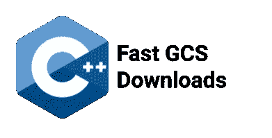

# 使用 C++快速下载 GCS

> 原文：<https://medium.com/google-cloud/fast-gcs-downloads-with-c-e5c749bde05e?source=collection_archive---------1----------------------->

## 卡洛斯·奥赖安(谷歌)



带有文本“快速 GCS 下载”的未更改的 C++徽标。在[isocpp.org](http://isocpp.org/)了解更多关于标准 C++的知识

有时候，你只是想知道:下载能有多快？我们都知道云存储服务可以水平扩展，但有时您只需要尽快将一个大文件下载到虚拟机。在本帖中，我们将讨论一个我们编写的小程序来帮助解决这些问题。它既可以作为较大工作负载的一部分，也有助于故障排除，因为它消除了一些可能的瓶颈。

这个程序的思想很简单:要下载一个大文件，从 GCS 打开 N 个并行流，每个流下载文件的一个“片段”。然后将切片写在文件的右边部分。然而，还有一些额外的考虑:

*   这种方法要求您的文件系统支持稀疏文件，这使得它不适合某些 FUSE 文件系统和某些文件类型。
*   在我们的测试中，解密每个流需要大约 40%的 GCE vCPU，虽然实际的百分比可能因虚拟机型号而异，但应该清楚的是，不能创建无限数量的流。这个程序(可能比较保守)为每个 vCPU 创建 2 个线程。如果您想改变这一点，程序从命令行接受不同数量的线程。
*   因为启动一个流需要几毫秒的时间，所以创建非常小的片是不值得的(想想 100 个片的极端情况，每个 1 字节长)。即使有足够的 vCPUs 来处理额外的工作，也是如此。

即使在相对较小的虚拟机上，该程序也可以实现非常高的吞吐量。例如，我们能够使用一个 *c2-standard-4* 虚拟机以超过 1gb/s 的速度下载一个 32GiB 的文件:

```
Downloading file-32GiB.bin from bucket xxxxxx to file /s/foo.binThis object size is approximately 32GiB. It will be downloaded in 8 slices, each approximately 4GiB in size.
… … …
…
Download completed in 29643ms
Effective bandwidth **1105.42 MiB/s**File size and CRC32C match expected values
```

说了这么多，让我们进入代码并解释它在做什么。你可以在 GitHub 上找到完整的程序。敏锐的读者可能会注意到这个程序使用了 C++17 的特性。我们认为在这个例子中会产生更多可读的代码。如果您使用的是 C++11 或 C++14，不用担心，这个库支持这两个版本。

程序需要做的第一件事是找出我们想要下载多大的对象，这只用两行代码就完成了:

```
auto client = gcs::Client::CreateDefaultClient().value();
auto metadata = client.GetObjectMetadata(bucket, object).value();
```

注意`.value()`的使用，C++客户端库从大多数函数中返回`StatusOr<T>`。这是一种包含结果或错误的结果类型。`.value()`成功时返回包含的值，出错时抛出异常。由于客户端库已经重试了大多数操作，像这样的简单程序可以记录这些错误并退出，没有必要实现重试循环，因为库已经包含了它。C++异常是表达控制流的一种自然方式。更复杂的应用程序可以在调用点检查错误代码，并在出错的情况下继续工作，也许是在某种降级模式下。

一旦我们有了关于目标对象大小的信息，我们就可以简单地计算执行这个下载的片大小和线程数量。我们使用一个小函数来计算每个切片的大小:

```
namespace po = boost::program_options;std::vector<std::int64_t> compute_slices(
    std::int64_t object_size,
    po::variables_map const& vm) {
auto const minimum_slice_size =
    vm[“minimum-slice-size”].as<std::int64_t>();
auto const thread_count = vm[“thread-count”].as<int>();
std::vector<std::int64_t> result;
// … explanation continues below …
```

如果对象足够大，该函数会使每个切片的大小大致相等:

```
… … …
auto const thread_slice = object_size / thread_count;
if (thread_slice >= minimum_slice_size) {
  std::fill_n(
      std::back_inserter(result), thread_count, thread_slice);
```

当然，我们需要处理对象大小不是线程数量的倍数的情况。我们给最后一个片额外的字节:

```
… … …
  result.back() += object_size % thread_count;
  return result;
}
```

最后，如果对象尺寸太小，我们只需创建足够的最小尺寸的切片:

```
… … …
  for (; object_size > 0; object_size -= minimum_slice_size) {
    result.push_back(std::min(minimum_slice_size, object_size));
  }
  return result;
}  // compute_slices()
```

大部分工作是下载每个切片。这是在一个小函数中定义的，所以我们可以在不同的线程中调度工作。该函数接收桶的名称和要下载的对象，以及要从所述对象下载的字节范围。最后，它接收一个文件描述符，接收到的字节将存储在该文件描述符中:

```
std::string task(
    std::int64_t offset, std::int64_t length,
    std::string const& bucket, std::string const& object,
    int fd) {
  // … explanation continues below …
```

我们在每个线程中创建一个单独的客户端，以最大限度地减少争用，然后开始所需范围的下载:

```
… … …
  auto client = gcs::Client::CreateDefaultClient().value();
  auto is = client.ReadObject(
      bucket, object, gcs::ReadRange(offset, offset + length));
```

我们将以相对较大的块读取数据，在本例中为 1mb，这将最小化`pwrite()`的系统调用开销(见下文)。下载是流式的，所以除了通常的函数调用开销之外，读取块大小对下载性能没有太大影响。我们还需要跟踪这些数据需要写入文件的哪个位置:

```
… … …
  std::vector<char> buffer(1024 * 1024L);
  std::int64_t count = 0;
  std::int64_t write_offset = offset;
```

然后我们只读取一个块，如果有错误，我们就停止。注意`.read()`的用法；当您使用这个(C++ iostreams 的标准)函数时，客户端库会最小化复制。这是读取未格式化数据的最有效方式:

```
… … …
  do {
    is.read(buffer.data(), buffer.size());
    if (is.bad()) break;
```

利用缓冲区中的数据，我们更新一些计数器并写入目标文件描述符。注意我们用的是`is.gcount()`；虽然客户端库总是等到缓冲区满了，但切片可能不是缓冲区大小的倍数，最终可能会收到一个“短”缓冲区:

```
… … …
    count += is.gcount();
    check_system_call(“pwrite()”,
        ::pwrite(fd, buffer.data(), is.gcount(), write_offset));
    write_offset += is.gcount();
```

最后，我们继续读取，直到切片被完全下载，然后返回一些信息性消息:

```
… … …
  } while (not is.eof());
  return fmt::format(
      “Download range [{}, {}] got {}/{} bytes”, offset,
      offset + length, count, length);
} // task()
```

这是大部分的工作。我们确实需要调度这些线程:

```
auto slices = compute_slices(metadata.size(), vm);
std::vector<std::future<std::string>> tasks(slices.size());
std::int64_t offset = 0;
std::transform(
    slices.begin(), slices.end(), tasks.begin(),
    [&](auto length) {
      auto f = std::async(
          std::launch::async, task, offset, length, bucket,
          object, fd);
    offset += length;
    return f;
});
```

然后等待他们:

```
for (auto& t : tasks) std::cout << t.get() << “\n”;
```

创建目标文件也只需要几行代码。可惜这是比较低级的代码。我们需要执行并发写入，但是没有一个标准 C++工具(iostreams)或最常用的库(Boost.org)支持它们。所以我们只是求助于一些 POSIX APIs:

```
auto constexpr kOpenFlags = O_CREAT | O_TRUNC | O_WRONLY;
auto constexpr kOpenMode = S_IRUSR | S_IWUSR | S_IRGRP | S_IWGRP;
auto const fd = check_system_call(
    “open()”, ::open(destination.c_str(), kOpenFlags, kOpenMode));
… … …
check_system_call(“close(fd)”, ::close(fd));
```

当然，有一些代码可以处理命令行解析并报告性能结果，但这没什么意思。

# 感谢阅读！

如果你认为这很有趣，今天就在 GitHub 上给我们一颗星吧。你可以找到更多关于谷歌云 [C++客户端库](https://github.com/googleapis/google-cloud-cpp)的例子和文档。