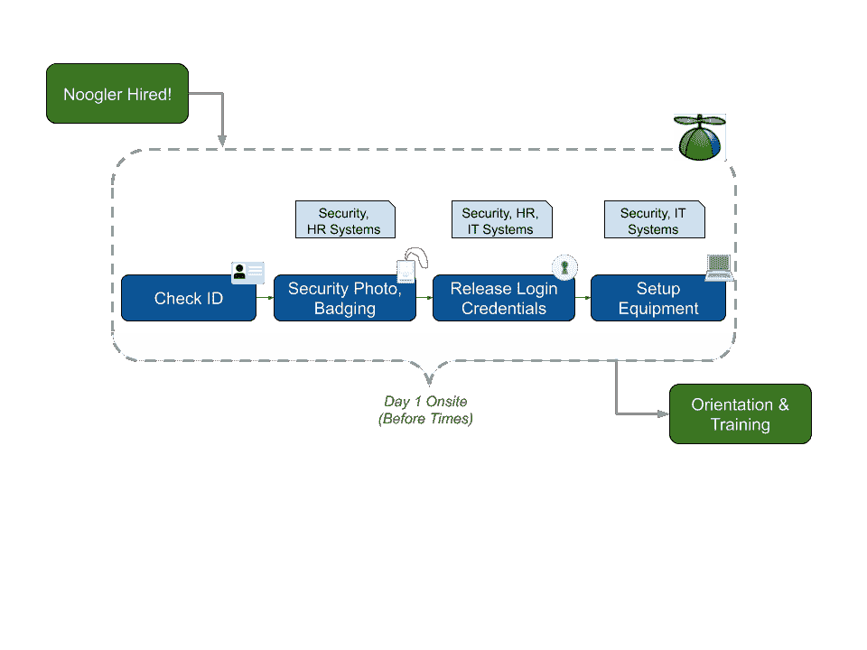
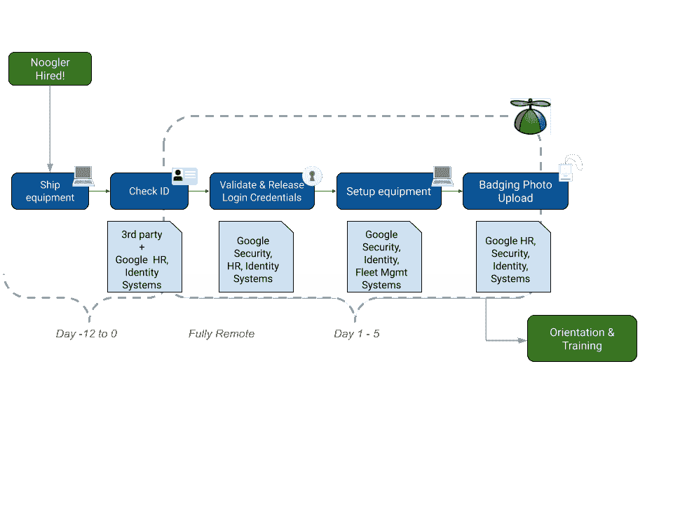

# 在完全远程的世界中更快地入职

> 原文：<https://medium.com/google-cloud/faster-onboarding-in-a-fully-remote-world-f917dbfa25f2?source=collection_archive---------5----------------------->

*(* [*)艾卡·阿加耶娃*](https://www.linkedin.com/in/ayka-agayeva) *)，她领导谷歌的计划将入职转变为完全在家工作的世界，与我坐下来谈论这疯狂的一年以及她的团队的一些工作。她组织了重大变革以建立虚拟入职，并与我一起收集他们在此过程中吸取的经验教训。)*

在全球疫情期间招聘新员工通常不会出现在你的标准人力资源或 IT 手册中。我们的目标是让人们尽可能快地启动和运行，最好在第一周就有成效。

> 我们需要让新员工快速投入工作

但是我们没有足够的弹性来立即处理它。我们不得不抓紧时间，寻找新的工作方式。

首先，我们问自己，如何才能创建完全虚拟的新员工入职培训(过去在我们的主要校园中以大团队的形式进行)，以及我们如何才能让我们的员工在入职后一周内变得高效，无论是提交代码、管理基础架构还是提供客户服务。我们的项目团队与 IT 支持、人力资源、安全和库存管理团队密切合作，为快速上线和访问做好准备。

排队的人[来源](https://unsplash.com/photos/Nzb4LBsctyQ)

由于跨团队的努力、重新设计的流程和一些技术调整，我们能够实现 90%以上新员工的目标。在这篇博客中，我们将讲述我们是如何做到这一点的，以及我们在这个过程中学到了什么。

> 跨职能团队合作和技术变革加快了入职速度

# 强制函数

2020 年初，谷歌全球办公室平均每周有 500 名员工入职。在疫情之前，“第一天”的入职培训是一项重要的面对面活动，参与者是一群群兴奋的新员工，他们需要完成一些任务，如人力资源文书工作、身份验证、IT 设备分发和设置、登录凭据创建，以及与数十名人力资源、IT 和安全团队成员的入职培训。

作为一家公司，我们非常依赖人员和技术基础设施的组合来使这样的活动成为可能。我们每年都用我们称之为[污垢](https://cloud.google.com/blog/products/management-tools/shrinking-the-time-to-mitigate-production-incidents)的练习来测试我们团队和系统的弹性，但是这些测试通常是区域性的，并不是为了模拟世界范围的疫情而设计的。当每个人都突然在家工作时，我们必须迅速改变我们如何雇用新员工，以确保我们在世界任何地方都能安全地工作。

> 良好的灾难恢复实践能够更好地应对新的情况

为了实现这一目标，我们首先关注人，然后关注流程，最后关注技术。

# 谁参与了

> 这项服务会影响到谁，哪些假设对他们来说不再成立？

用户第一的方法在任何工作中都很重要，但在这次独特的危机中尤其重要。全球员工的环境已经发生了变化，这给我们的员工和支持团队带来了新的个人挑战。例如，我们不能再假设我们的新员工在工作时间有空，可以在家使用技术，或者可以出差。

跨职能团队远程协作

> *谁应该成为核心项目团队的一员？*

这个项目要求我们的团队是跨职能的，有嵌入式决策者，并保持清晰的升级渠道。以这种方式构建我们的团队，可以让我们快速做出决策并进行实验，而无需将所有事情都上报。让合适的人在房间里有助于加快一切，从疏通工作到按需升级。我们可以通过授权团队行动来更有效地解决所有这些问题，而不是要求他们去一个危险的单点失败。

> 前线和后端团队都是成功的关键

例如，在每日同步会议期间，可以实时决定什么是关键生产力设备或每周最大入职能力，每个主管都可以代表其组织进行签核，而无需上报。对于重大决策，例如我们是否应该购买或建立特定的技术能力，我们的项目领导有清晰的上报渠道，响应时间在几小时内。

> 执行团队需要快速决策的权力

> *我们需要谁来保持对支持所需基础设施的关注(并防止日常中断)？*

最后，重要的是要确保人员配置计划包括前线和幕后的战略家。在危机中，一线应急响应人员进行实验(例如，使用哪个安全密钥、预约时段的长度)、处理升级、分类并与我们的新员工沟通。我们特意在第一线配备了高级人员，他们可以识别过程中的摩擦，在必要时做出判断，并帮助通知快节奏的迭代。远离中断，战略家和后端支持确保必要服务的可用性，评估实验策略和结果，根据需要调整支持，并向利益相关者报告。

*意外故障:安全钥匙出人意料地藏在装运箱的折叠处并被遗漏。*

例如，支持团队早期发现大量新员工在身份验证和登录步骤上遇到困难。作为一线分析的结果，他们测试并实施了多项更改，例如对安全密钥发货的调整、对某些操作系统的改进以及某些身份和登录任务的超时标志。

我们的新员工流程，pre-COVID

# 运营、培训和协调

在快速行动的同时，面临如此高的风险和如此多的不确定性，我们知道我们将入职转变为成功的远程流程的能力将取决于快速访问信息、最大限度地减少干扰和有效地确定优先级。

首先，我们将我们的远程入职计划嵌入到已经启动的全公司事故响应工作中。这使我们能够访问每日简报电话和通信渠道，将我们与领导层和其他事件响应团队联系起来。这种存在帮助我们利用来自其他工作流的研究和发现，例如远程开发工作的各种平台的兼容性评级。

这样做的另一个好处是可以直接、快速地访问许多领域的专家，因为他们都是在危机模式和响应时间延长的情况下工作的。我们能够针对一次性请求利用这一点(例如，在特定条件下了解和/或更改登录帐户的行为)。

> 将一线响应团队与主题专家联系起来

接下来，我们根据我们的成功标准优先定义和调整所有利益相关者和更广泛的响应团队，特别是在第 1 天、第 3 天和第 5 天结束时，我们将有多少比例的 Nooglers 登录到公司资源。花时间就关键指标达成一致并定期报告，可以避免我们今后的升级和困惑。我们尽量减少干扰，这样团队就可以专注于构建和运行服务。

> 让每个人都有具体的、可衡量的成功目标

最后，我们有一个“停车场”来捕获项目(长期风险、业务连续性考虑、扩展等)。)在危机期间并不是阻碍因素，但仍然很重要。因为我们最终会从危机应对过渡到持续运营，所以不丢失这些数据点非常重要。

# 弥合差距的技术

我们的远程入职流程有三个主要组成部分，需要一个(快速！)技术返工:

1.  远程验证一个人的身份
2.  颁发登录凭据
3.  为新员工配备必要的 IT 设备

我们能够在很大程度上依赖现有的云基础设施，并引入我们不具备专业知识或覆盖面的第三方系统。

远程身份验证是最大的挑战之一，我们很早就决定使用第三方技术，而不是内部构建。我们将工作重点放在接收验证数据的基础设施上，并添加额外的安全控制措施，以将其连接到我们的内部系统。由于这第一步的重要性，我们在安全性和可用性方面与我们的安全工程团队密切合作。

> 认证总是最难的部分

远程发布登录凭证相对简单，因为我们的 IT 支持人员能够在 Google Meet 的现有技术上复制它。为了弥补物理存在的不足，我们实施了额外的安全控制，例如带外 SMS 验证。我们每天从我们的支持代表和每周新员工那里获取反馈，以确定哪些有效，哪些无效。该反馈是我们与安全和帐户工程团队一起进行的迭代的重要输入。

为新员工设置公司硬件有两个组成部分:为员工提供设备，并将其连接到公司资源。在这篇文章中，我们不会把重点放在后勤上；相反，我们将讨论器件的选择和设置。因为谷歌是一家云公司，我们有一些对我们有利的事情，但我们也遇到了一些挑战。

> 在云中工作可以快速转移到新的工作环境

Chromebooks 是首选设备，因为任何人都可以在短短几分钟内完成成像和设置。操作系统中的内置功能也使得设置其他安全控制变得更加容易，比如安全密钥和证书。对于其余的平台，我们提供了预配置映像的机器。虽然这让新员工的体验更好，但这不是一个可扩展的长期解决方案(并且落在了我们危机后的“停车场”)。

Chromebooks！

我们能够在谷歌云平台上部署虚拟桌面，作为我们大多数开发人员和工程师的开发环境。对于其余的，我们建立了一个部署物理工作站的流程，这是昂贵的和不可扩展的(并且也落在我们的后危机“停车场”)。

我们的 [BeyondCorp](http://cloud.google.com/beyondcorp) 环境使远程访问成为无缝体验。我们的新员工可以连接到公司资源并提高工作效率，而不需要额外的软件。这是一个巨大的胜利。

新常态

# 到处都更好

危机提供了一个机会来重新思考您的流程，挑战您的假设，并以更具弹性和可伸缩性的状态交付基础架构和服务。以下是我们转向远程入职的三个关键经验:

*   **云能力至关重要。**评估您目前的基础设施，以及它如何在各种情况下扩展。我们依靠公共云基础设施的规模和可靠性([虚拟桌面](https://queue.acm.org/detail.cfm?id=3264508)就是其中之一)来保证员工顺利入职。
*   **在危机期间，微不足道的瓶颈可能会成为主要的故障点。值得重新考虑你的供应链、平台管理系统、账户操作和支持人员。**
*   **了解贵公司的事件响应程序**。可能的话，嵌入现有的[公司范围的工作](https://cloud.google.com/blog/products/management-tools/shrinking-the-time-to-mitigate-production-incidents)或与之保持一致。这可以打开必要的主题专家的访问。更重要的是，当需要快速做出决策并保持协调时，它还能让你与你的高层领导和企业主联系起来。

> 适应可以带来永久的改善

不要等到下一次危机。现在花点时间评估您的人员、政策、流程、系统、供应链，并找出潜在的故障点或瓶颈。这将帮助你更有准备和信心地迎接下一个惊喜。