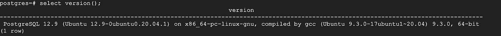

# 快速跟踪 PostgreSQL 到云 SQL(PostgreSQL)的同构数据库迁移

> 原文：<https://medium.com/google-cloud/fastrack-your-homogeneous-database-migration-for-postgresql-to-cloud-sql-postgresql-53a9259daca1?source=collection_archive---------0----------------------->

这篇博客更多的是关于将自我管理的 PostgreSQL 数据库迁移到 Google Cloud 上的云 SQL(PostgreSQL)实例。我们将从零开始，在 GCE 上设置一个自我管理的 PostgreSQL 数据库(对于云虚拟机/内部部署也是如此)，然后迁移到 CloudSQL 副本实例，最终提升到 Cloud SQL 上的 PostgreSQL 生产/主实例。

我们经常为数据库迁移而苦恼，因为这是一项具有挑战性的活动。这有各种各样的原因，下面重点介绍几个。

*   它很复杂，因为没有基于 GUI 的简单易用的工具
*   网络复杂性导致的摩擦
*   设置迁移作业和监控迁移活动的手动方法
*   即使使用手动方法备份和恢复数据库也容易出错
*   依赖于遵循数据库迁移黑盒方法的工具，对用户不透明。
*   与供应商工具相关的成本
*   企业承受不起支持生产应用环境的数据库停机

为了解决我们的数据库管理员和用户的上述挑战，Google Cloud 在 2021 年初推出了[数据库迁移服务(DMS)](https://cloud.google.com/database-migration) ，从而简化了网络工作流，管理初始快照和持续复制，并提供迁移操作的状态。DMS 提供高保真、在线最小停机时间迁移，从而将模式、数据和元数据从源数据库引擎迁移到目标云 SQL。它让您开始将 MySQL/PostgreSQL/SQL Server(预览版)迁移到[云 SQL](https://cloud.google.com/sql)(MySQL/PostgreSQL/SQL Server 的完全托管关系数据库服务)。DMS 目前支持同构数据库迁移。

只有 2 个元素/步骤需要配置易于使用的图形向导，如下所述。

*   **连接配置文件**表示将在迁移作业中使用的特定源的连接信息。
*   **迁移作业**代表源连接概要文件和目标云 SQL 实例对，以及特定于迁移的设置。

**使用 DMS 的主要优势**

*   用户无需支付额外费用。免费的！！！！！
*   完全没有服务器。这对用户意味着什么，即无需调配、管理和监控执行数据库迁移作业所需的资源。
*   它通过高保真迁移提供在线最小停机时间功能。
*   简单易用的图形化步骤/UX 开始数据库迁移。
*   DMS 使用数据库引擎的本机复制方法，因此对用户完全透明。
*   使用补充策略进行迁移，以升级到具有跨版本迁移的数据库引擎的最新版本。

# 遵循下面提到的步骤！！！！！

# **第一步** —在谷歌云计算引擎(VM)上设置 PostgreSQL

选择您选择的虚拟机配置和操作系统。对于这个设置，我使用了 n2-standard-2 ( 2 个 vCPUs 和 8 GB RAM)和 Ubuntu 20.04 LTS 公共映像。

1.  更新软件包

> sudo apt-get 更新

2.(安装 PostgreSQL，包括 PSQL 客户端)

> **sudo apt -y 安装 PostgreSQL PostgreSQL-client PostgreSQL-contrib**

3.连接到 PSQL 以完成设置

> a >执行 ***sudo -s***
> 
> b> **执行****sudo-u postgres psql postgres**
> 
> **c >使用**设置用户 postgres 的密码
> 
> **\密码后缀**

4.登录后，检查版本。作为 Postgres 设置的一部分，我们将使用 Postgres 版本 12，该版本将升级到版本 13。截图供大家参考。

5.创建一个样本表

> *创建客户表(*
> 
> *ID INT 主键不为空，*
> 
> *名称文本不为空，*
> 
> *年龄 INT 不为空，*
> 
> *地址字符(50)*
> 
> *)；*

## *****对于 PostgreSQL 数据库的 DMS，没有主键的表将不会被迁移。**

6.在上表中插入少量记录，即客户

> 插入客户值(1，' Romin '，25，' LONDON ')；
> 
> 插入客户值(2，“杰克”，42，“东京”)；
> 
> 插入客户价值观(3，' Nigel '，40，' Singapore ')；
> 
> 插入客户值(4，“查尔斯”，45，“巴黎”)；

7.要连接到您的 Postgres 数据库，您需要在配置文件中进行更改，并在 Google Cloud 的防火墙中打开一个端口。默认情况下，Postgres 不允许远程连接。要更改此设置，您可以更改名为 [pg_hba.conf](https://www.postgresql.org/docs/12/auth-pg-hba-conf.html) 的文件。这一步主要是“配置 PostgreSQL 远程访问”。

## **警告**:在生产系统或任何具有互联网连接的系统上，使用强身份验证方法，并将流量仅限于您希望连接到每个数据库的那些用户和 IP 地址。

## //编辑 pg_hba.conf

> sudo VI/etc/PostgreSQL/12/main/pg _ HBA . conf

****用您的本地机器 IP 地址替换[您的 IPV4 地址]。注意，******后缀/32 用于单个地址。****

**完成以上步骤后，保存文件并退出编辑器**

**8.编辑 postgresql.conf**

> **sudo VI/etc/PostgreSQL/12/main/PostgreSQL . conf**

****进行以下更改，即将 localhost 替换为* listen_addresses = '*'****

****

****“*”设置使 Postgres 能够监听所有 IP 地址。****

**9.重新启动数据库服务。执行以下命令**

> **sudo 服务 postgresql 重新启动**

# ****步骤 2 —配置源自管理数据库(Postgres)和先决条件。****

1.  ****为 postgresql 安装**[**pg logical**](https://github.com/2ndQuadrant/pglogical)**native capability**进行复制。此功能为 postgres 提供逻辑流复制。使用下面提到的步骤来安装和配置 pglogical。**

> **sudo su -**
> 
> **curl[https://access . 2nd quadrant . com/API/repository/dl/default/release/deb](https://access.2ndquadrant.com/api/repository/dl/default/release/deb)| bash**
> 
> **sudo apt-get 安装 curl ca 证书 gnupg**
> 
> **sudo apt-get 更新**
> 
> **sudo 安装 postgresql-common**

**对于 PostgreSQL 版本 12，请使用下面的命令，对于 9.6/10 等其他版本，请使用适当的命令。**

> **sudo apt-get 安装 PostgreSQL-12-pg logic**

## *****对于其他相关版本，请使用以下版本之一，而不是“sudo apt-get install PostgreSQL-12-pg logical”**

> ****PostgreSQL 9.4:**sudo apt-get 安装 postgresql-9.4-pglogical**
> 
> ****PostgreSQL 9.5:**sudo apt-get 安装 postgresql-9.5-pglogical**
> 
> **PostgreSQL 9.6: sudo apt-get 安装 postgresql-9.6-pglogical**
> 
> **PostgreSQL 10: sudo apt-get 安装 postgresql-10-pglogical**
> 
> **PostgreSQL 11: sudo apt-get 安装 postgresql-11-pglogical**

**2.在**使用 Vi/其他编辑器编辑 postgresql.conf 文件../../etc/PostgreSQL/12/main/PostgreSQL . conf****

> **shared _ preload _ libraries = pg logic**

**3.执行以下命令**

> **sudo 服务 postgresql 重新启动**

**4.**在源中的每个数据库上安装 pglogical 扩展****

**这里有一点指导:对于 PostgreSQL，您需要为实例中的每个数据库配置 pglogical。Pglogical 特性在数据库级工作，而不是在实例级。**

**执行以下命令**

> **sudo -u postgres psql postgres**
> 
> **创建扩展程序逻辑；**
> 
> **将架构 pglogical 上的用法授予 postgres**
> 
> **向 postgres 授予对 SCHEMA public 的使用权；**
> 
> **将 SCHEMA pglogical 中所有表上的 SELECT 权限授予 postgres**
> 
> **将 SCHEMA public 中所有表上的 SELECT 权限授予 postgres**
> 
> **将 SCHEMA public 中所有序列上的 SELECT 授权给 postgres**
> 
> **输入\q 退出 PSQL**

**5.**在源服务器上编辑 postgresql.conf 文件****

**视觉识别系统../../etc/PostgreSQL/12/main/PostgreSQL . conf，并添加/替换以下内容:**

> **shared _ preload _ libraries = ' pglogical '**
> 
> **wal_level = '逻辑'**
> 
> **最大复制插槽数= 10**
> 
> **最大发送次数= 10**
> 
> **最大工作进程数= 10**

**6.保存并关闭文件。重新启动主服务器**

> **sudo 服务 postgresql 重新启动**

# ****步骤 3 —使用图形向导分两步设置 DMS，即连接配置文件和迁移作业。****

1.  **连接配置文件:导航到数据库迁移服务，然后单击连接配置文件。基本上需要捕获迁移作业将使用的源数据库配置。请参考安装在 GCE(VM)上的自我管理的 postgres 数据库配置。下面截图。**

********

**2.迁移作业——创建连接配置文件后，下一步是开始迁移作业。**

**a >描述您的迁移工作。这一步基本上你提供迁移作业名称，源数据库引擎细节，谷歌云地区，然后选择迁移作业类型为连续。对于 Postgres，DMS 只支持写博客时的连续。**连续**负责源数据库的回填或初始快照以及 CDC，以捕获源数据库上的增量更新/写入/更改。下面截图。**

********

**b >定义源—此步骤允许为源数据库选择以前创建的连接配置文件，即在我们的示例中，GCP 虚拟机上的自托管 PostgreSQL。**

****

**c >创建目的地:根据需要选择云 SQL 实例配置。如果您以前使用过云 SQL 创建页面，它是类似的。此步骤将帮助您从云 SQL 复制副本实例开始，一旦复制延迟最小化，该实例将最终提升到生产/主实例。创建实例预计需要几分钟时间。**

********

**d >定义连接方法—然后选择连接方法。自从我的 PostgreSQL 数据库实例托管在 Google 云计算引擎上以来，我一直使用 VPC 对等技术。请随意选择其他选项，如反向 SSH/VPN 等**

********

**在创建了云 SQL 上的数据库实例之后，您应该会看到上面的消息。**

**e >测试和创建迁移作业—当您看到说明已为目标数据库创建实例的警报时，请继续执行迁移作业的最后一步。这一步非常重要，就像在其他工具中一样，您开始迁移，如果出现问题，您可以返回并重新开始。但是 DMS 的验证是提前完成的，为数据库人员节省了重要的生产时间。如果“**测试迁移作业**成功，请继续执行**“创建作业”或“创建并启动作业”**。如果您在测试作业时看到错误，系统将提示您调试问题。下面截图**

********

# ****步骤 4:现在您可以看到迁移作业的进度。一旦启动，它应该将状态从“正在进行完全转储”更改为“正在进行 CDC”。****

****

****使用 PSQL 登录云 SQL 副本** —要登录云 SQL 副本实例，您需要使用 Postgres 的一个客户端工具。我使用过 PSQL 命令行终端工具。它基本上是 PostgreSQL 的基于终端的前端。**

**使用以下命令登录复制副本实例(云 SQL)**

> **psql -U postgres -h x.x.x.x -p 5432**
> 
> **x.x.x.x —云 SQL 复制副本实例的 IP**

**登录复制副本实例上的 postgres 数据库后，运行以下命令检查云 SQL 实例的版本。在虚拟机上的源自管理 postgres 数据库上，我们有 12.9 **，但在目标上，我们现在已经迁移，并通过版本升级补充了我们的迁移。****

> **postgres = > select version()；**

**版本**

**— — — — — — — — — — — — — — — — — — — — — — — — — — — — — — — — — — — — — — — — — — — — —**

****x86 _ 64-PC-Linux-GNU 上的 PostgreSQL 13.4** ，由 Debian clang 版本 12.0.1 编译，64 位**

> ****运行/dt** 列出 postgres 数据库中的关系。在我们的例子中，postgres 数据库中只有一个表，即 customers 表。**

**下面是表格和一些记录的截图。如果您遵循了前面的所有步骤，那么源数据库应该也是如此。**

********

> **下一部分—让我们检查 DMS 的 CDC 功能。**

****在 GCP 虚拟机(GCE)的源数据库上，添加以下记录供 CDC 检查****

> **postgres = # Insert into customers values(5，“拉斐尔”，45，“BLR”)；**
> 
> **postgres = # Insert into customers values(6，' Andre '，25，' Mumbai ')；**
> 
> **postgres = # Insert into customers values(7，“Steve”，40，“Singapore”)；**

****检查云 SQL 副本，您一定会看到总记录数随着新记录的增加而增加。表 customers 的源和目标数据库实例上的记录总数必须匹配。****

# ****第 5 步**我们知道，在源数据库中可能存在需要将 DDL 更改传播到目标云 SQL 实例的场景，pglogical with replicate ddl 命令允许您这样做。**

**以下命令允许新表的源数据库模式级别更改传播到云 SQL 副本上的目标实例。**

**在源数据库上运行以下命令来创建新表。**

> **select pg logical . replicate _ DDL _ command(command:= ' CREATE TABLE public . company(ID INT PRIMARY KEY NOT NULL，NAME TEXT NOT NULL，AGE INT NOT NULL，ADDRESS CHAR(50)，SALARY REAL)；'，replication _ sets:= ARRAY[' default '])；**

**— — —**

> **postgres=# \d 公司**

**//下面的输出**

**表“公共公司”**

**列|类型|排序规则|可空|默认值**

**— — — — -+ — — — — — — — -+ — — — — — -+ — — — — — + — — — — -**

**id | integer | | not null |**

**名称|文本| |不为空|**

**年龄|整数| |非空值|**

**地址|字符(50) | | |**

**工资|真实| | |**

**索引:**

**“company_pkey”主键，btree (id)**

**执行下面提到的命令。它有助于将数据从源数据库传播到目标数据库，这是必须的。该命令用于一个表**

> **select pglogical . replication _ set _ add _ table(' default '，' public.company ')**

******复制集基本上是表的集合，这些表将用于从源数据库到目标数据库的迁移，并提供一种机制来控制数据库中的哪些表将被复制以及这些表上的哪些操作将被复制。****

**让我们在新表中插入一些记录，即源数据库上的公司，即 GCP 虚拟机上的自我管理 Postgres**

> **postgres=# Insert into 公司价值观(1，' Pat '，25，' Newyork '，25000)；**
> 
> **postgres = # Insert into company values(2，'里克'，30，'芝加哥'，30000)；**
> 
> **postgres = # Insert into company values(3，' Romin '，25，' Sunnyvale '，40000)；**
> 
> **postgres = # Insert into company values(4，'安德鲁'，45，'芝加哥'，45000)；**

****现在检查云 SQL 副本，新记录应该显示在新表中，即 Company。****

**现在，让我们通过在 GCP 虚拟机上的源 postgres 数据库上使用以下命令添加新列(即 pincode)作为测试活动来修改该表**

> **select pg logical . replicate _ DDL _ command(' ALTER TABLE public . company add column pincode varchar(30)'，' { default } ')；**
> 
> **postgres = > select * from company**

**—输出如下-**

**身份证|姓名|年龄|地址|工资|密码**

**— — + — — — — + — — -+ — — — — — — — — — — — — — — — — — — — — — — — — — — + — — — — + — — — — -**

**1 |帕特| 25 |纽约| 25000 |**

**2 |里克| 30 |芝加哥| 30000 |**

**3 |罗明| 25 |桑尼维尔| 40000 |**

**丹尼尔| 46 |纽约| 25000 |**

**检查目标云 SQL Postgres 数据库上的结果，结果应该匹配，即公司表应该有一个包含 pincode 的新列**

**通过从源数据库中删除同一个表(即 company)来测试 PostgreSQL 数据库。该数据库现在也应该在云 SQL 复制副本实例上消失。用于删除表格的命令。**

> **select pg logical . replicate _ DDL _ command(' DROP table public . company CASCADE '，ARRAY[' default '])；**

# ****第 6 步**现在，让我们进入迁移作业控制台，在开始升级过程之前检查几项内容，即复制状态和用于迁移的存储大小。**

**下面的屏幕截图显示了迁移到副本云 sql 实例的数据大小**

****

**监控“复制延迟”的屏幕截图如下**

****

**根据屏幕截图，您看到复制延迟最小后，开始“提升”流程，该流程主要是将云 SQL 复制副本提升到具有读写功能的生产实例。下面截图。**

****

**几分钟后，您的复制副本实例将与源分离，并转换为读/写生产实例。状态将从“升级进行中”变为“已完成”。**

**PostgreSQL 的已知限制~[https://cloud . Google . com/database-migration/docs/postgres/known-limits](https://cloud.google.com/database-migration/docs/postgres/known-limitations)**

# **祝贺您完成 PostgreSQL 的 DMS！！！！**