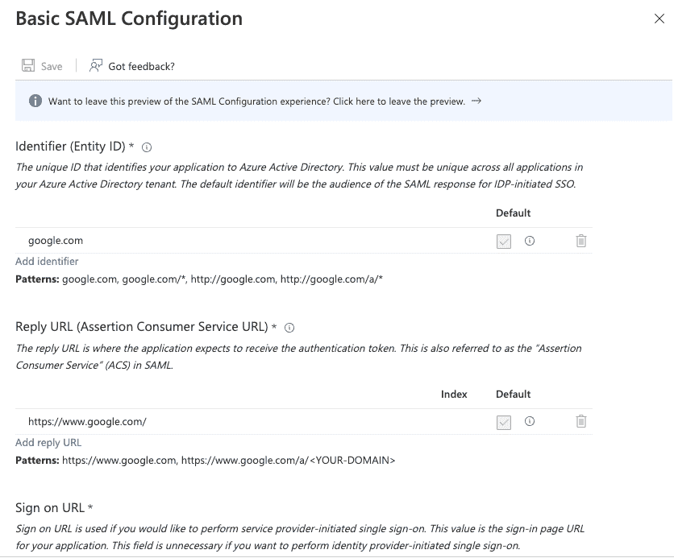
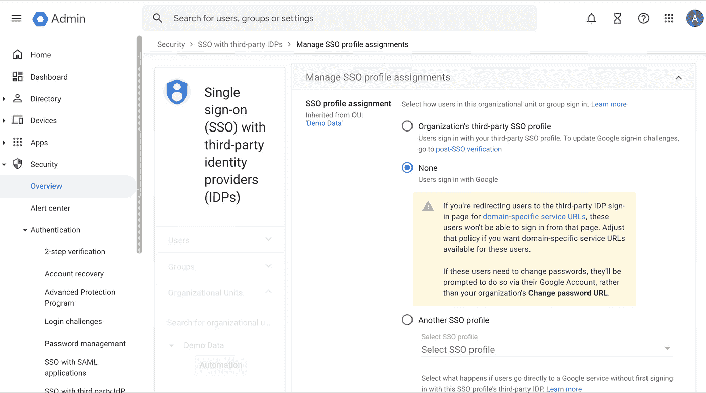

# 将 Microsoft Azure AD 中的用户帐户联合到 Google Cloud 身份(第 2 部分)

> 原文：<https://medium.com/google-cloud/federate-your-user-accounts-in-microsoft-azure-ad-to-google-cloud-identity-b8a06f3727ee?source=collection_archive---------0----------------------->

配置单一登录

在联合用户帐户的[第 1 部分](/google-cloud/federate-your-user-accounts-in-microsoft-azure-ad-to-google-cloud-identity-fe29ef639553)中，我们通过使用微软的 [Google Cloud/G Suite Connector 创建一个新的应用程序，然后使用连接详细信息、用户分配和验证对其进行配置，从而为用户提供从微软 Azure AD 到 Google Cloud Identity 的服务。如果您还没有阅读，我建议您在为调配的用户配置单点登录之前先阅读这些内容。](https://azuremarketplace.microsoft.com/en-us/marketplace/apps/aad.googleapps)

云身份和 Google Workspace 支持用于[单点登录](https://cloud.google.com/architecture/identity/single-sign-on)的安全断言标记语言(SAML) 2.0。当您将 SSO 用于云身份或 Google Workspace 时，您的外部 IdP 是 SAML IdP，Google 是 SAML 服务提供商。这有助于简化在一个位置维护凭据和策略。因此，一旦用户被配置，我们将配置单点登录，使他们能够验证自己并成功登录。

简单回顾一下我们的设置，我们:

*   使用域名 **demodata.info**
*   使用提供用户配置和单点登录配置的连接器— [微软的 Google Cloud / G Suite 连接器](https://azuremarketplace.microsoft.com/en-us/marketplace/apps/aad.googleapps)
*   使用 Google Cloud Identity 中的 azuread-provisioning 用户来连接 azuread
*   已经从 Azure AD 调配了 2 个用户— Chris 和 John

现在，让我们开始为云身份和 Azure AD 之间的已调配用户帐户配置单点登录

1.  使用微软的**Google Cloud/G Suite Connector 创建一个新的企业应用程序，为已配置的用户处理单点登录。**

a.选择新应用程序并搜索微软的**Google Cloud/G Suite Connector。选择连接器，更改名称以区别用于预配的应用程序，然后选择创建**

b.在新应用程序中，选择“管理”下的“属性”,按如下方式更改并保存:

*   为用户启用登录为是
*   “需要分配”为“是”—如果需要为所有用户配置单点登录，请将此项设置为“否”

2.用户分配—如果在属性中将“需要分配”配置为“是”。

a.选择管理器下的用户和组，并添加用户/组

b.在用户下，选择无选定超链接以选择需要配置的用户。选择所需的用户，然后选择分配

c.选择后，用户分配完成，如下所示:

3.下一步是在 Azure AD 中配置 SAML(安全声明标记语言)设置，这将使云身份能够将身份验证委托给 Azure AD

a.在 Google Cloud/G Suite Connector by Microsoft 应用程序中，选择管理下的单点登录，然后选择 SAML 卡

b.在属性和索赔卡中，选择编辑。

在我们的示例中，我们已经使用 UPN 配置了用户，因此我们将对卡进行如下配置:

*   选择编辑
*   删除“附加索赔”部分下的所有索赔

*   如果您已经为使用 UPN 的用户提供了域替换或电子邮件地址，您可以按照[文档](https://cloud.google.com/architecture/identity/federating-gcp-with-azure-ad-configuring-provisioning-and-single-sign-on#upn:-domain-substitution_1)中的说明进行配置
*   配置完设置后，关闭属性和声明部分

c.选择编辑基本 SAML 配置

d.为参数提供以下值并保存更改:

*   标识符(实体 ID):google.com
*   回复网址:【https://www.google.com/ 
*   登录网址:【https://www.google.com/a/】**PRIMARY _ DOMAIN**/service log in？continue = https://console . cloud . Google . com/

提供在为上面指定的 PRIMARY_DOMAIN 进行资源调配时使用的主域名。在我们的例子中，我们将使用 **demodata.info**

[https://www.google.com/a/**demodata . info**/service log in？continue = https://console . cloud . Google . com/](https://www.google.com/a/demodata.info/ServiceLogin?continue=https://console.cloud.google.com/)

e.在 SAML 证书卡中，下载证书(Base64)

f.请注意微软设置 Google Cloud / G Suite 连接器(单点登录)卡中的登录 URL

4.我们现在将在 Google Cloud Identity 或 Google Cloud Workspace 中启用单点登录。

a.以超级管理员用户身份登录 Google Cloud [管理控制台](https://admin.google.com/)，选择显示更多- >安全- >身份验证- >第三方 IdP 单点登录

b.选择添加 SSO 配置文件，在贵组织的第三方 SSO 配置文件的参数中提供以下详细信息，并保存您的更改:

*   启用通过第三方身份提供者设置 SSO
*   登录页面 URL:提供在 Azure 门户中设置 Google Cloud 卡的登录 URL——如第 3.f 节所述
*   注销页面 URL:提供以下 URL—[https://login.microsoftonline.com/common/wsfederation?wa=wsignout1.0](https://login.microsoftonline.com/common/wsfederation?wa=wsignout1.0)
*   在验证证书中，上传第 3.e 节中下载的证书
*   更改密码网址:提供以下网址—[https://account . activedirectory . windows azure . com/change password . aspx](https://account.activedirectory.windowsazure.com/changepassword.aspx)

c.禁用自动化 OU(组织单位)的单一登录

*   在使用第三方 IdP 的 SSO 部分和管理 SSO 配置文件分配中，选择入门。

*   在“组织单位”部分选择自动化 OU，如下所示

*   在 SSO 配置文件分配中选择无，而不是组织的第三方 SSO 配置文件，并选择覆盖以保存更改

5.验证用户能够使用单点登录登录 Google Cloud

a.对于提供和配置单点登录的用户，要求他们登录[谷歌云控制台](https://console.cloud.google.com/)。

b.在我们的示例中，这两个用户是 chrisgreen@demodata.info 和 johndoe@demodata.info。

c.这将把我们带到指定了登录 URL 的 Microsoft 登录页面

d.指定各自的 Azure AD 凭据，它将成功对您进行身份验证:

e.首次登录时，将出现一个欢迎屏幕，显示隐私声明和服务条款。

f.阅读后，选择我理解，用户将能够成功登录[谷歌云控制台](https://console.cloud.google.com/)

这就完成了您在 Microsoft Azure AD 中的用户帐户到 Google Cloud Identity 的联合，包括提供用户([第 1 部分](/google-cloud/federate-your-user-accounts-in-microsoft-azure-ad-to-google-cloud-identity-fe29ef639553))和配置单点登录。

在您的环境中设置它，并且很乐意了解您的实施过程。感谢阅读！！